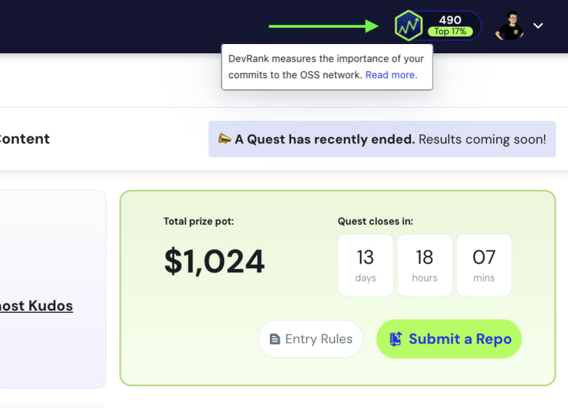
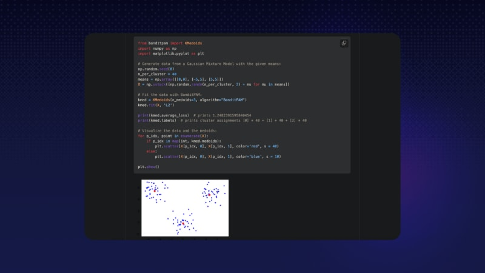
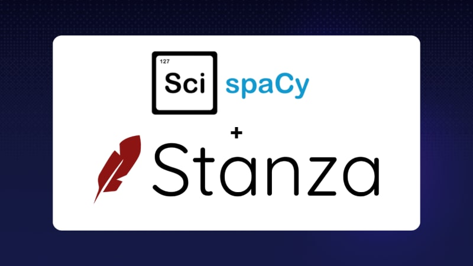

Привет 👋

Сегодня мы рассмотрим 7 репозиториев ML, которые использует 1% лучших разработчиков (и о которых вы, скорее всего, никогда не слышали)!

Что определяет 1% лучших разработчиков?

Ранжирование разработчиков - сложная задача, и у каждой методологии есть свои проблемы.

Например, если ранжировать разработчиков по количеству строк кода, написанных ими на Python, то в верхней части рейтинга, скорее всего, окажутся очень хорошие Python-разработчики.

Однако вы можете получить людей, которые просто скопировали много кода на Python в свои репозитории, и они не так уж хороши. 🙁

В Quine мы разработали методологию, которая, по нашему мнению, является надежной в большинстве случаев, но, опять же, не на 100% идеальной!

Она называется DevRank (подробнее о том, как мы ее рассчитываем, вы можете прочитать здесь).

Понятие Top 1%, которое я использую в этой статье, основано на DevRank. Он не идеален, но это наш предпочтительный метод!

И да, мы продолжаем работать над ним, чтобы сделать его лучше с каждым днем!

Кстати, если вам интересно узнать свой DevRank, будь то в глобальном сообществе или на конкретном языке, вы можете проверить его, зарегистрировавшись на quine и наведя курсор на правую верхнюю иконку, как показано ниже.

Как узнать, какие репозитории использует 1% лучших?

Мы посмотрим на репозитории, которые задействованы 99-м процентилем.

Затем мы сравниваем склонность верхнего 1 % разработчиков и нижнего 50 % разработчиков отмечать репо и автоматически генерируем список.

Другими словами, эти репозитории - скрытые жемчужины, используемые 1 % лучших разработчиков, о которых еще предстоит узнать широкому сообществу разработчиков.

Я обрабатываю ваши грязные CSV

Пакет, разработанный нашими друзьями для решения распространенных проблем, связанных с загрузкой CSV-файлов. Небольшая, но распространенная проблема в начале многих ML-конвейеров, решена хорошо. 🔮

## CleverCSV

умеет определять и загружать различные диалекты CSV, при этом ему не нужно ничего указывать в аргументах. CSV-файлы не предоставляют необходимой информации для выполнения этой задачи, поэтому библиотеке приходится делать некоторые умные выводы.

CleverCSV может работать даже с неаккуратными CSV-файлами, в которых есть ошибки форматирования.

В дополнение к библиотеке Python, CleverCSV также включает интерфейс командной строки для генерации, изучения и стандартизации кода.

https://github.com/alan-turing-institute/CleverCSV

Оптимизация рабочих процессов ML с помощью scikit-learn через CLI

Вы пишете бесконечные шаблоны в sklearn, чтобы получить кросс-валидированные результаты с помощью нескольких алгоритмов? Попробуйте вместо этого интерфейс `skll`, чтобы получить гораздо более чистый опыт кодирования. ⚡️

## Skll

разработан для более эффективного проведения экспериментов по машинному обучению с помощью scikit-learn, уменьшая необходимость в обширном кодировании.

Основная утилита называется `run_experiment`, она запускает серию обучающих программ на наборах данных, указанных в конфигурационном файле.

Она также предлагает Python API для простой интеграции с существующим кодом, включая инструменты для преобразования форматов и операций с файлами характеристик.

https://github.com/EducationalTestingService/skll

Кластеризация по методу k-Medoids за почти линейное время

Вернемся к фундаментальным алгоритмам - BanditPAM - это новый алгоритм k-medoids (считайте, что это надежный "k-means"), который может работать почти в линейное время. 🎉

Работает за время O(nlogn), а не O(n^2), как предыдущие алгоритмы.

Центры кластеров являются точками данных, а значит, соответствуют значимым наблюдениям. Центр кластера k-средних может соответствовать недостоверным данным, что невозможно в случае k-средних.

Можно использовать произвольную метрику расстояния (например, расстояние L1 или расстояние Хэмминга), но эффективные алгоритмы k-means обычно ограничиваются расстоянием L2.

Реализованный на основе этой статьи BanditPAM идеально подходит для специалистов по исследованию данных, которые ищут мощное, масштабируемое решение для групповой работы, особенно для тех, кто имеет дело с большими или сложными данными.

https://github.com/motiwari/BanditPAM

Программа для подбора записей и обнаружения дубликатов, которая нужна всем

Вам приходилось сталкиваться с проблемой сопоставления пользователей в разных наборах данных, которые неправильно написали свое имя или имеют немного разные атрибуты? Воспользуйтесь этой замечательной библиотекой, вдохновленной свободно расширяемой связью биомедицинских записей (FEBRL), перестроенной под современный инструментарий Python. 🛠️

Предоставляет нативную реализацию мощной библиотеки FEBRL на языке Python, использующую numpy и pandas. Включает в себя как контролируемые, так и неконтролируемые подходы. Включает инструменты для генерации пар совпадений, позволяющие использовать контролируемые подходы ML. RecordLinkage идеально подходит для специалистов по исследованию данных, которые ищут гибкое решение на базе Python для выполнения задач связывания записей и дедупликации данных.

https://github.com/J535D165/recordlinkage

Ориентирован исключительно на извлечение содержимого веб-страниц

Извлечение содержимого из веб-страниц. Dragnet фокусируется на содержимом и user комментарии на странице и игнорирует остальные. Это удобно для наших друзей-скреперов. 🕷️

## Dragnet

предназначен для извлечения ключевых слов и фраз из веб-страниц путем удаления нежелательного контента, такого как реклама или навигационное оборудование.

Предоставляет простые функции Python (`extract_content` и `extract_content_and_comments`) с возможностью включения или исключения комментариев для извлечения содержимого из HTML-строк.

Для более продвинутого использования имеется класс экстрактора в стиле `sklearn`, позволяющий настраивать и обучать экстракторы.

https://github.com/dragnet-org/dragnet

Последние исследовательские модели StanfordNLP прямо в spaCy

Интересуетесь стандартными задачами НЛП, такими как тегирование частей речи, разбор зависимостей и распознавание именованных сущностей? 🤔

## SpaCy-Stanza

оборачивает библиотеку Stanza (ранее StanfordNLP) для использования в конвейерах spaCy.

В пакет включены возможности распознавания именованных сущностей для некоторых языков, что расширяет его возможности в задачах обработки естественного языка.

Он поддерживает 68 языков, что делает его универсальным для различных лингвистических приложений.

Пакет позволяет настраивать конвейер с помощью дополнительных компонентов spaCy.

https://github.com/explosion/spacy-stanza

"Швейцарский армейский нож для задач выборки графов"

Приходилось ли вам работать с таким большим набором данных, что вам нужно взять из него выборку? Для простых данных случайная выборка сохраняет распределение в меньшей выборке. Однако в сложных сетях выборка "снежный ком" - когда вы выбираете начальных пользователей и включаете их связи - лучше отражает структуру сети. Это помогает избежать предвзятости при анализе. 🔦

Итак, есть ли у вас данные с графовой структурой и нужно ли вам работать с их выборками (по алгоритмическим или вычислительным причинам)? 👩‍💻

## Littleballoffur

предлагает ряд методов выборки из графов и сетей, включая выборку по узлам, ребрам и исследованиям.

Разработанный с унифицированным общедоступным интерфейсом приложения, он позволяет пользователям легко применять сложные алгоритмы выборки без глубоких технических знаний.

https://github.com/benedekrozemberczki/littleballoffur

Надеюсь, эти открытия будут полезны для вас и помогут создать более надежный набор инструментов ML! ⚒️

Если вы заинтересованы в использовании этих инструментов для создания значимых проектов с открытым исходным кодом, вам следует сначала узнать, каков ваш текущий DevRank на Quine, и посмотреть, как он будет развиваться в ближайшие месяцы!

И наконец, пожалуйста, поддержите эти проекты, поставив на них звезду. ⭐️

PS: Мы не связаны с ними. Мы просто считаем, что великие проекты заслуживают великого признания.

Увидимся на следующей неделе,

Ваш приятель 💚

Bap

Если вы хотите присоединиться к самопровозглашенному "самому крутому" серверу с открытым исходным кодом 😝, вам стоит присоединиться к нашему discord-серверу. Мы здесь, чтобы помочь вам в вашем путешествии в open source. 🫶

