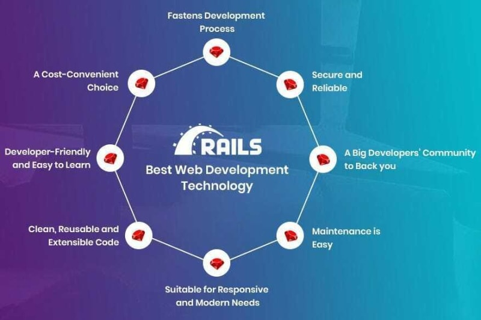
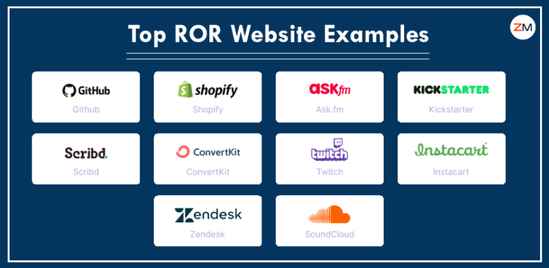

Здравствуйте! Сегодня мы построим простой интернет-магазин на Ruby on Rails.

## Необходимые условия

Язык программирования Ruby: Знакомство с языком программирования Ruby необходимо, поскольку Ruby on Rails построен на нем. Вы можете изучить Ruby с помощью различных онлайн-учебников, книг и курсов.

Среда разработки: Создайте на своем компьютере подходящую среду разработки. Обычно это включает установку Ruby, Rails и текстового редактора или IDE, например Visual Studio Code или RubyMine.

## Что такое Ruby on Rails

Ruby on Rails, популярный фреймворк для веб-приложений, упрощает процесс создания надежных и масштабируемых веб-приложений, предоставляя структурированную основу и избавляя от необходимости начинать с нуля. Он использует архитектуру Model-View-Controller (MVC)**, разделяя проблемы на три отдельных уровня: **Модель, представление и контроллер.

Слой Model управляет хранением, получением и манипулированием данными, обеспечивая их точность и согласованность. Слой View генерирует HTML-контент для веб-страниц, а Controller выступает в роли посредника, обрабатывая взаимодействие с пользователем, получая данные из Model и подготавливая их для представления в View.

Ruby on Rails построен на основе языка программирования Ruby, известного своей универсальностью и простотой использования. С помощью Ruby вы будете манипулировать данными, обрабатывать пользовательский ввод и создавать динамические веб-страницы.

## Преимущества Ruby on Rails



### Кто-нибудь еще использует Ruby и Rails?

Ответ на этот вопрос - да! Некоторые крупные организации используют Ruby и/или Ruby on Rails, включая наш собственный Dev.to. Dev Community работает на Rails ❤




## Как установить Ruby on Rails

### Установка Ruby:

Ruby - это фундамент, на котором строится Ruby on Rails. Загрузите и установите последнюю версию Ruby с официального сайта RubyInstaller. В результате вы получите язык программирования Ruby и связанные с ним инструменты.

### Установка Rails

После установки Ruby перейдите к установке фреймворка Rails. Для установки Rails вы можете использовать менеджер пакетов RubyGems. В терминале введите:

`gem install rails`.

Эта команда загрузит и установит фреймворк Rails, предоставив вам необходимые инструменты для создания веб-приложений с помощью Ruby on Rails.

### Проверьте установку:

Чтобы убедиться, что Ruby и Rails установлены правильно, проверьте их версии с помощью следующих команд в терминале:

`ruby -v rails -v`.

Эти команды должны отобразить установленные версии Ruby и Rails, соответственно.

## Запуск вашего первого проекта Ruby on Rails

### Создайте каталог проекта:

Вам нужно создать каталог для размещения вашего проекта Rails. Перейдите в нужное место на терминале и создайте новый каталог с помощью команды `mkdir`:

`mkdir my-rails-app`

Вы можете сделать это с помощью графического интерфейса, чтобы создать каталог.

### Создайте Rails-приложение:

В директории проекта в терминале создайте новое Rails-приложение с помощью команды `rails new`:

`rails new my-rails-app`.

Эта команда создаст базовую структуру вашего Rails-приложения, включая необходимые файлы, папки и параметры конфигурации.

### Запуск Rails-сервера:\*\*\*

Чтобы запустить ваше Rails-приложение, запустите Rails-сервер с помощью следующей команды:

`bin/rails server`

Если вы используете Windows, вам нужно передать скрипты из папки bin непосредственно интерпретатору Ruby, например, `ruby bin\rails server.`.

Эта команда запустит сервер Rails и откроет ваше приложение в веб-браузере.  
Чтобы увидеть ваше приложение в действии, откройте окно браузера и перейдите по адресу http://localhost:3000.
Вы должны увидеть страницу приветствия Rails, указывающую на то, что ваше приложение успешно запущено.

## Понимание архитектуры MVC в Rails

Архитектура MVC служит основой приложений Ruby on Rails. Она разделяет задачи приложения на три отдельных уровня:

Модель: Слой модели представляет данные приложения. Он отвечает за управление взаимодействием данных с базой данных, включая операции создания, чтения, обновления и удаления (CRUD).

Представление: Слой представления управляет представлением данных пользователю. Он генерирует HTML-контент - составные части веб-страниц, которые отображаются в веб-браузере.

Контроллер: Контроллер выступает в качестве посредника между моделью и представлением. Он обрабатывает взаимодействие с пользователем, получает данные из модели и подготавливает их для представления в представлении.

## Создание простого приложения для интернет-магазина на Rails

Чтобы продемонстрировать применение архитектуры MVC, давайте создадим простое приложение для интернет-магазина, используя Ruby on Rails:

## Создание моделей и миграции

Начните с определения моделей для данных приложения.  
Имена моделей имеют единственное число, поскольку инстанцированная модель представляет собой одну запись данных. Чтобы запомнить это соглашение, подумайте о том, как вы будете вызывать конструктор модели: мы хотим написать Product.new(…), а не Products.new(…).

В данном случае мы создадим модель `Product` для представления товаров в интернет-магазине:

`rails generate model Product name:string description:text price:decimal`.

Эта команда генерирует класс `Product` в каталоге `app/models`. Атрибуты, указанные в команде, определяют характеристики товара: название, описание и цену.

## Миграции

Миграции используются для изменения структуры базы данных приложения. В Rails-приложениях миграции пишутся на Ruby, чтобы они не зависели от базы данных.  
Миграции отвечают за создание и изменение схемы базы данных для размещения моделей данных. Создайте миграцию для модели `Product`:

`rails db:migrate`.

Эта команда создает файл миграции, определяющий структуру таблиц для хранения информации о продукте в базе данных.

## Использование модели для взаимодействия с базой данных

Чтобы немного поиграть с нашей моделью, мы воспользуемся функцией Rails под названием консоль. Консоль - это интерактивная среда кодирования, как и irb, но она также автоматически загружает Rails и код нашего приложения.

Давайте запустим консоль с помощью этой команды на нашей консоли:

`bin/rails console`

Вы должны увидеть подсказку irb, например:

`Загрузка среды разработки (Rails 7.1.0) irb(main):001:0>`.

В этом окне мы можем инициализировать новый объект Product:

`irb> product = Product.new(name: "Hot towel", description: "Специально нагретое полотенце для вашей кожи", цена: 99.99)`.

Важно отметить, что мы только инициализировали этот объект. Этот объект вообще не сохраняется в базе данных. В данный момент он доступен только в консоли. Чтобы сохранить объект в базе данных, мы должны вызвать `save`:

```ruby
irb> product.save (0.1ms) begin transaction
Article Create (0.4ms) INSERT INTO "products" ("name", "description", "price", "created_at", "updated_at") VALUES (?, ?, ?, ?) [["name", "Горячее полотенце"], ["description", "Специально нагретое полотенце для вашей кожи"], ["price", "99.99"], ["created_at", "2023-11-18 23:47:30.734416"], ["updated_at", "2023-11-18 23:47:30.734416"]]
(0.9ms) commit transaction => true
```

Выше показан запрос к базе данных INSERT INTO “products” …. Это означает, что продукт был вставлен в нашу таблицу.

## Создание контроллеров

Контроллеры обрабатывают взаимодействие с пользователем и управляют потоком данных между моделью и представлением. Создайте контроллер для управления товарами:

`rails generate controller Products`.

Эта команда создает контроллер `Products` в директории `app/controllers`. Контроллер будет содержать действия для вывода списка, показа, создания, обновления и удаления продуктов.

## Проектирование представлений

Представления отвечают за генерацию HTML-контента, который пользователь видит в веб-браузере. Создайте представление для вывода списка товаров:

```ruby
<h1>Продукты</h1>
<% @products.each do |product| %>
  <div class="product">
    <h2><%= product.name %></h2>
    <%= product.description %>
    Цена: <%= product.price %>
    <a href="/products/<%= product.id %>">Показать</a>
    <a href="/products/<%= product.id %>/edit">Редактировать</a>
    <a href="/products/<%= product.id %>/delete">Удалить</a>
  </div>
<% end %>
```

Это представление просматривает коллекцию `@products`, отображая название, описание, цену и ссылки на действия по просмотру, редактированию и удалению товара.

Аналогичным образом вы можете по своему усмотрению создавать представления для отображения сведений о продукте, создания новых продуктов, редактирования существующих продуктов и удаления продуктов. Каждое представление должно отображать соответствующую информацию и предоставлять соответствующие формы для взаимодействия с пользователем.

## Создание маршрутов

Маршруты определяют связь между URL-адресами и действиями контроллера. Настройте маршруты в файле `config/routes.rb`:

`Rails.application.routes.draw do resources :products end`.

Эта конфигурация определяет маршруты для всех стандартных CRUD действий (index, show, new, edit, create, update и destroy) для контроллера `Products`.

## Запуск приложения

Запустите сервер Rails для работы приложения.

`rails s`

Эта команда запускает сервер Rails и открывает приложение в веб-браузере. Теперь вы можете перемещаться по приложению, просматривать товары, добавлять новые товары и управлять информацией о товарах.

## Заключение

Это было краткое и не оченьo Подробный обзор создания вашего первого приложения на Ruby on Rails: простого интернет-магазина.  
Вам предстоит еще многому научиться и столько всего создать на основе этого простого приложения. Я рекомендую вам ознакомиться с документацией Rails для получения более подробного руководства по созданию вашего первого веб-приложения на Ruby on Rails.

Если у вас есть вопросы, задавайте их в разделе комментариев.  
Подключайтесь ко мне на Linkedin.  
Давайте общаться в X (бывший twitter).
