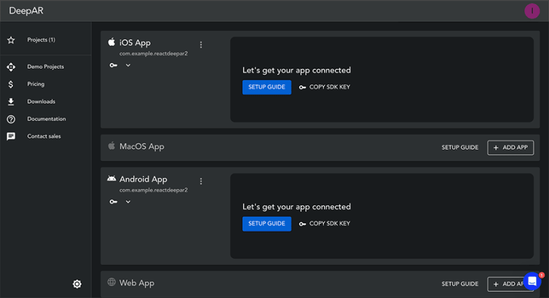
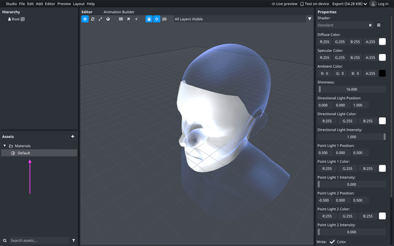
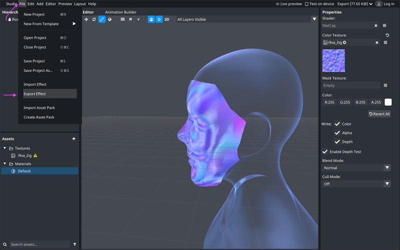

Автор Айви Walobwa✏️

Дополненная реальность (AR) - это технология, объединяющая сгенерированные компьютером изображения с реальным миром. Создание AR-приложений с помощью React Native стало популярным благодаря его кроссплатформенным возможностям, широкой поддержке сообщества и множеству библиотек, позволяющих разработчикам создавать захватывающие AR-опыты.

В этой статье мы рассмотрим, как создать пользовательскую AR-маску для лица с помощью DeepAR и использовать ее в приложении React Native. Полный код этой статьи можно посмотреть на GitHub.

## Необходимые условия

Это руководство предполагает базовое понимание React Native и необходимых инструментов разработки. Знание DeepAR не является обязательным.

Мы создадим простое приложение React Native, которое загружает AR-маску для лица из DeepAR.

## Варианты AR-фреймворков для React Native

Существует несколько AR-фреймворков, которые вы можете выбрать для добавления AR-фильтров и эффектов в ваше React Native-приложение. Некоторые варианты включают:

### DeepAR

Предоставляет инструменты и SDK для создания AR-фильтров и эффектов и добавления их на любую платформу, сопровождается хорошо написанной документацией DeepAR имеет свою цену, а бесплатный уровень ограничен только определенным количеством пользователей Проекты DeepAR могут быть добавлены в ваше приложение React Native с помощью пакета `react-native-deepar`.

### ViroReact

Платформа сообщества с открытым исходным кодом, позволяющая бесплатно создавать AR/VR-приложения ViroReact поддерживает ARKit и ARCore Она хорошо документирована, проста в освоении и может использоваться на любой платформе

### Banuba

Предлагает SDK для добавления AR-фильтров и эффектов в ваше приложение Face AR SDK поддерживается на различных платформах и хорошо документирован, но для получения SDK-токена вам нужно заказать бесплатную пробную версию Цены на AR SDK не раскрываются на их сайте

Это лишь некоторые из доступных вариантов. В этой статье мы будем использовать платформу DeepAR для создания, редактирования и добавления AR-маски для лица в наше приложение React Native.

## Что такое DeepAR?

DeepAR - это фреймворк для создания приложений дополненной реальности. DeepAR предлагает различные продукты, которые позволяют разработчикам создавать захватывающий опыт с помощью AR, такие как:

DeepAR SDK: Позволяет интегрировать AR в любое приложение DeepAR Studio: Позволяет создавать AR-фильтры и эффекты Asset Store: Позволяет попробовать готовые фильтры и эффекты

Среди ключевых функций DeepAR - фильтры для лица, эффекты, маски, фильтры для AR-красоты и макияжа, распознавание эмоций в реальном времени и многое другое. Хотя DeepAR и не бесплатен, он позволяет создавать бесплатные приложения, которыми могут пользоваться до 10 человек.

## Начало работы с DeepAR

Для начала вам нужно создать аккаунт DeepAR, а затем создать новый бесплатный проект: 

## Создание пользовательской AR-маски для лица

Мы будем использовать DeepAR Studio для создания и рендеринга пользовательской маски лица в нашем приложении React Native. Вы можете использовать ее для создания или тестирования пользовательских AR-фильтров.

Сначала установите DeepAR Studio прямо с портала разработчиков DeepAR. После завершения установки создайте новый проект:  Мы добавим пользовательскую текстуру к сетке лица. Текстура - это изображение или рисунок, который вы хотите поместить поверх модели/сетки.

Сначала импортируйте пользовательскую текстуру, нажав кнопку Add в разделе ../../assets. Импортируйте ресурсы. Это добавит ресурсы в раздел ”Текстуры”:  Поскольку мы собираемся хранить фильтр в онлайн-хранилище и получать его через интернет, мы будем использовать Supabase для хранения актива. Вы можете использовать любую платформу для хранения актива, если Supabase вам не подходит; возможно, вы даже захотите использовать актив локально в своем приложении React Native.

Если вы используете Supabase, создайте общедоступное хранилище, а затем добавьте экспортированный файл. Затем вы можете использовать полученный URL-адрес для получения актива в своем приложении.

Таким образом, вы готовы использовать маску лица в своем приложении React Native.

## Использование маски лица AR в React Native

Сначала создайте приложение React Native, используя команду ниже:

`npx react-native@latest init reactdeepar`.

Далее добавьте следующие зависимости в файл `package.json`, а затем запустите Yarn для их установки:

`react-native-deepar`: ”^0.11.0”, “rn-fetch-blob”: ”^0.12.0”`

Пакет `react-native-deepar` предлагает обертку React Native для DeepAR, и мы будем использовать пакет `rn-fetch-blob` для получения нашей пользовательской маски лица через интернет.

Обновите свой файл `App.tsx` с помощью приведенного ниже фрагмента кода. Замените `<YOUR-SUPABASE-FILE-URL>` на URL файла, хранящегося на Supabase, а `<YOUR-API-KEY>` на лицензионный ключ DeepAR для конкретного приложения:

```js
import { useEffect, useRef, useState } from 'react';
import { Dimensions, Linking, SafeAreaView, StyleSheet, Text, TouchableOpacity, View } from 'react-native';
import DeepARView, { IDeepARHandle, Camera, CameraPermissionRequestResult, ErrorTypes, CameraPositions } from 'react-native-deepar';
import RNFetchBlob from 'rn-fetch-blob';

const App = () => {
  const deepARRef = useRef<IDeepARHandle>(null);
  const [permissionsGranted, setPermissionsGranted] = useState(false);

  // Request camera permission and handle the result
  const getPermissions = async () => {
    const cameraPermission = await Camera.requestCameraPermission();
    const isCameraAllowed = cameraPermission === CameraPermissionRequestResult.AUTHORIZED;

    if (isCameraAllowed) {
      setPermissionsGranted(true);
    } else {
      Linking.openSettings();
    }
  };

  useEffect(() => {
    getPermissions();
  }, []);

  // Load effect from a file
  const loadEffect = () => {
    RNFetchBlob.config({ fileCache: true })
      .fetch('GET', '<YOUR-SUPABASE-FILE-URL>')
      .then(res => {
        deepARRef?.current?.switchEffectWithPath({ path: res.path(), slot: 'mask' });
      })
      .catch(error => {
        console.log('Error fetching file:', error);
      });
  };

  const renderPhotoButton = () => {
    return (
      <View style={styles.button}>
        <TouchableOpacity onPress={loadEffect} style={styles.effectButton}>
          <Text style={styles.effectText}>Load Effect</Text>
        </TouchableOpacity>
      </View>
    );
  };

  const renderDeepARView = () => {
    if (!permissionsGranted) {
      return null;
    }

    return (
      <View>
        <DeepARView
          ref={deepARRef}
          apiKey="<YOUR-API-KEY>"
          videoWarmup={false}
          position={CameraPositions.FRONT}
          style={styles.deepARView}
          onError={(text: string, type: ErrorTypes) => {
            console.log('onError =>', text, 'type =>', type);
          }}
        />
        {renderPhotoButton()}
      </View>
    );
  };

  return (
    <SafeAreaView>
      <View style={styles.container}>
        {renderDeepARView()}
      </View>
    </SafeAreaView>
  );
};

export default App;
```

Этот код выполняет следующие действия:

Добавляет необходимые импорты в наш проект Создает ссылку на ваш компонент DeepAR и добавляет состояние разрешения приложения Добавляет логику в запрос и устанавливает необходимые разрешения камеры Извлекает маску лица DeepAR из хранилища Supabase, а затем кэширует результат в доступной папке с помощью метода `switchEffectWithPath` из DeepAR. Этот метод ожидает путь, где будет храниться актив, и слот, который является уникальным именем для вашей маски лица Рендеринг `DeepARView` с вашим ключом API. Вы можете отобразить маску лица, нажав на кнопку в пользовательском интерфейсе

## Использование маски лица

Чтобы запустить проект на Android или iOS, следуйте шагам в GitHub-репозитории этой статьи. Когда вы запустите приложение и загрузите эффект, ваша AR-маска лица отобразится.

## Заключение

В этом руководстве мы обсудили различные варианты AR в вашем приложении React Native. Мы изучили DeepAR и некоторые из его продуктов и возможностей. Затем мы создали пользовательскую маску для лица DeepAR с помощью DeepAR studio и использовали ее в нашем приложении React Native. Полный код, использованный в этой статье, доступен на GitHub.

Маска лица, созданная в этой статье, является простой и стандартной, но DeepAR гибко настраивается и позволяет создавать более сложные маски. Надеюсь, эта статья была вам полезна, удачного кодинга!
