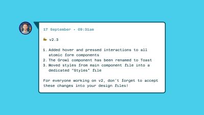
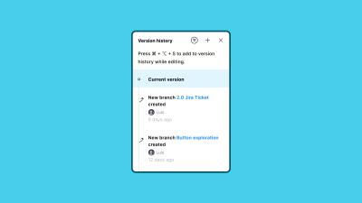

В этой серии статей, состоящей из двух частей, Луис делится своим опытом работы с системами проектирования и рассказывает о том, как преодолеть возможные подводные камни, начиная с того, как заставить дизайнеров в вашей команде принять сложную и хорошо продуманную систему, которую вы создали, и заканчивая тем, каковы наилучшие соглашения об именовании, как обращаться с авторазметкой компонентов, индексацией/поиском и многим другим. Часть 2 посвящена ключевым моментам из схемы Луиса и практическим советам по управлению системой проектирования, которая должна быть одновременно надежной и простой в освоении.

Добро пожаловать в мое долгое чтение о создании лучших компонентов - компонентов, которые с большей вероятностью будут найдены, поняты, изменены и обновлены таким образом, чтобы способствовать принятию, а не отказу от них.

В предыдущей части серии мы подробно рассмотрели процесс создания гибких и повторяемых компонентов, соответствующий фреймворку FRAILS. Во второй части мы с головой окунемся в процесс создания адаптируемых, индексируемых, логичных и конкретных компонентов. Впереди у нас еще много слов.

## Перенимаемые

Согласно исследованию систем проектирования, проведенному компанией Sparkbox в 2022 году, три самые большие проблемы, с которыми сталкиваются команды, были недавно:

Преодоление технического/творческого долга, Паритет между дизайном и кодом, Принятие.

Можно с уверенностью предположить, что пункты 1. и 2. в основном связаны с ограничениями инструментов, силовыми схемами работы или плохой организационной коммуникацией. На рынке не существует готового к использованию на предприятии инструмента проектирования, который в настоящее время обеспечивает достаточно надежный экспорт кода для команд, чтобы автоматизировать процесс передачи. Я также не встречал инженерной команды, которая бы приняла такую функцию! Аналогичным образом, инструмент не устранит коммуникационные барьеры или десятилетия вынужденной изоляции между отделами. В ближайшие годы ситуация, вероятно, изменится, но я думаю, что эти моменты являются вполне понятным ограничением.

А вот пункт 3. вызывает беспокойство. Можно ли перенять вашу блестящую систему проектирования? Если мы тратим столько времени на разработку систем дизайна, почему люди не используют их эффективно? Размышляя над проблемами внедрения, я считаю, что мы можем сосредоточиться на трех основных моментах, чтобы сделать этот процесс гораздо более гладким:

Соглашения об именовании, создание сообщества, (избыточная) коммуникация. Соглашения об именовании

Существует слишком много способов назвать компоненты в нашем инструменте проектирования: от ”верблюжьей оболочки” до "оболочки для шашлыка", от слэша/названия/согласования до более описательных, например, "карточка товара - корзина". У каждого подхода есть свои плюсы и минусы, но что нам нужно учитывать при выборе, так это то, насколько легко найти нужный компонент. Очевидно, но это главное в любом хорошем названии.

Заманчиво сопоставить именование компонентов 1:1 между дизайном и кодом, но я лично не уверен, что это то, что должно быть нашей целью. Дизайнеры и разработчики работают по-разному и используют разные методы поиска и внедрения компонентов, поэтому мы должны ориентироваться на аудиторию. Это поможет создавать решения, основанные на намерениях, а не слепо стремиться к паритету.

Figma может помочь преодолеть этот разрыв благодаря ”полю описания компонента”, предоставляющему нам полезное пространство для добавления дополнительных, доступных для поиска имен (или даже псевдонимов) к каждому компоненту. Это означает, что если в коде мы называем его `headerNavItemActive`, а в дизайне - “Header link” с переключаемым свойством компонента, то удобное для разработчика название можно добавить в поле описания для удобства поиска.

Мы можем использовать поле описания компонента в Figma для перечисления возможных псевдонимов имени компонента. (Большой просмотр)

Тот же подход можно применить и к стилям.

Существует вероятность того, что ваши разработчики работают с более токинизированным набором семантических стилей в коде, в то время как команде дизайнеров могут понадобиться менее абстрактные стили для процесса создания идей. Эта дельта может быть сложной для навигации с точки зрения Figma, потому что мы можем оказаться в мире, где мы поддерживаем два или более источников истины.

Совет здесь - разделить быстрые стили для идей и семантических переменных на разные наборы. Семантические стили можно применять на уровне компонентов, в то время как необработанные стили можно использовать для разработки новых идей.

Например, Brand/Primary можно использовать в качестве цвета границы активного пункта меню в файлах дизайна, потому что поиск по словам “brand” и “primary” может быть более привычным и знакомым, чем семантическое имя лексемы. Однако внутри компонента мы хотим псевдонимизировать эту лексему на что-то более семантическое. Например, `border-active`.

Примечание: Некоторые команды переходят на более высокий уровень компонентов, используя свои соглашения об именовании. Например, это может стать `header-nav-item-active`. Это гиперспецифический компонент, то есть любое его использование за пределами примера ”Ссылка на заголовок” может быть бессмысленным для коллабораторов, просматривающих файл дизайна. Токены компонентного уровня - необязательный шаг в системах проектирования. Будьте осторожны, так как введение еще одного слоя в схему токенов увеличиваетуменьшает количество жетонов, которые необходимо хранить.

Как мы должны назвать нижнюю границу для ссылки на заголовок? Стиль быстрой ссылки, переменная производства или переменная компонента? (Большой предварительный просмотр)

Это означает, что если мы работаем над новой идеей - например, у нас есть набор вкладок на странице настроек, и цвет границы для активной вкладки на этапе разработки идеи может использовать Brand/Primary в качестве заливки - когда этот компонент будет возвращен в систему, мы применим правильный семантический токен для его использования, наш `border-active`.

Можем ли мы поддерживать стили для задумки и переменные для компонентов производства в наших системах? (Большой предварительный просмотр)

Обратите внимание, что этот совет, вероятно, лучше всего подходит для больших команд дизайнеров, где процесс внесения вклада более длительный и требует четкого разделения идей и производства или где вы работаете с более фиксированным циклом выпуска версий для вашей системы. Для большинства команд достаточно одного набора семантических переменных. Переменные значительно упрощают этот процесс, поскольку мы можем управлять свойствами этих отдельных токенов в одном месте. Но! Это статья не о токенах, так что давайте двигаться дальше.

Ключевым столпом успешной системы дизайна является пропаганда среди отделов PDE (продукт, дизайн и проектирование). Мы хотим, чтобы люди были воодушевлены, а не обременены ее правилами. Чтобы добиться этого, нам нужно создать сообщество внутренних сторонников системы дизайна, которые будут поддерживать проводимую работу и выступать в качестве дополнения к центральной команде. Это может показаться неоплачиваемой работой по поддержке, но я обещаю вам, что это нечто большее.

Постоянное общение с дизайнерами научило меня тому, что с ростом популярности дизайн-систем за последние несколько лет все больше и больше нас отчаянно хотят внести в них свой вклад. Вы когда-нибудь видели в файле локальный компонент, удивительно похожий на уже существующий? Может быть, дизайнер хотел почесать зубы и создать что-то с нуля. Это прекрасно! Нам просто нужно поощрять это более широко через более открытую модель вклада в центральную систему.

Как (центральная) команда по системам может дать возможность дизайнерам в более широкой организации строить на основе созданных нами системных основ? Как выглядит этот мир для вашей команды? В системах дизайна это обычно называют моделью ”ступицы и спицы”, и она действительно может помочь повысить интерес к целям использования вашей системы.

”В процессе эволюции системы дизайна существует множество точек перегиба. Многие из них происходят по одной и той же фундаментальной причине - невозможно масштабировать команду разработчиков системы дизайна настолько, чтобы напрямую поддерживать все потребности бизнеса масштаба предприятия. Команда системы проектирования всегда будет узким местом, если не создать структуру, которая позволит бизнес-подразделениям и продуктовым командам поддерживать себя самостоятельно. Модель hub and spoke (иногда ее еще называют ”ядро + федерация") - это решение".

- Робин Кэннон, ”Модель системы проектирования ”ступица и спица"" (IBM)

Проще говоря, сообщество может быть как небольшим, так и общим каналом Slack/Teams для системы проектирования, вплоть до двухнедельных тусовок или обучающих сессий. То, что мы делаем здесь, - это помощь в формировании среды, в которой обсуждение и совместное использование знаний являются центральным элементом системы, а не добавляются после выпуска компонентов.

Команда Zalando создала великолепное сообщество внутри команды разработчиков своей системы. Это выражается в создании сложного веб-портала,Частых встреч для обучения и повышения квалификации, а также в поощрении менталитета ”открытых дверей”. Помимо портала, созданного на заказ, я считаю, что такой подход является легкодостижимой целью для большинства команд, независимо от их размера. Отправной точкой может стать такая простая вещь, как открытые ежемесячные встречи или офисные часы, проводимые теми, кто управляет вашей системой, с рассылкой приглашений всем дизайнерам и межфункциональным партнерам, участвующим в производстве: менеджерам по продукту, разработчикам, копирайтерам, маркетологам и так далее по списку.

Для тех, кто ищет вдохновения, как проводить полурегулярные мероприятия по дизайн-системам, обратите внимание на то, что команда Gov UK начала делать на Eventbrite. Они провели серию мероприятий, начиная от глубокого погружения в вопросы доступности и заканчивая полноценными ”днями системы дизайна”.

Вести прозрачность - это надежная техника, позволяющая расположить систему дизайна как можно ближе к тем, кто ее использует. Она поможет переключить мышление с изолированной части процесса проектирования на питание всех частей производственного конвейера для всех ключевых партнеров, независимо от того, создаете вы его или используете.

Возвращаемся к пропаганде! По мере того как мы внедряем этот прозрачный и коммуникативный подход в систему, мы можем определить ключевых союзников в продуктовой, дизайнерской и инженерной команде/командах, которые могут помочь в достижении совершенства в пределах их собственных возможностей. Есть ли менеджер по продукту, который любит разбирать документацию по системе? Давайте поможем им стать надежным источником информации о лучших практиках работы с документацией! Или разработчик, который всегда умудряется уловить неправильное использование маркера spacing? Как мы можем дать им возможность помочь другим развить этот критический взгляд в процессе линтинга?

Здесь уместно упомянуть Design Lint, плагин для Figma, который я могу только порекомендовать. Design Lint просматривает выбранные вами слои, чтобы помочь вам найти возможно отсутствующие стили. Если вы напишете собственные правила, вы сможете проверить ошибки, например, неправильное использование цветовых стилей, отметить компоненты, которые не опубликованы в библиотеке, отметить компоненты, у которых нет описания, и многое другое.



Каждый из этих защитников системы, работающий в разных отделах компании, поможет обеспечить последовательность и качество выполняемых работ.

## (Избыточная) коммуникация

С пропагандой тесно связана важность регулярной, информативной и действенной коммуникации. Примерами различных типов сообщений, которые мы можем отправлять, являются:

Changelog/заметки о выпуске.Предстоящая работа.Результаты опроса системы. (Пример: ”Результаты исследования зрелости дизайна, сентябрь-2023”, Министерство образования Великобритании). Нашли что-то классное? Поделитесь этим! Обновления в найме. Небольшие победы.

Это очень много! Это хорошо, так как это означает, что команде всегда есть чем поделиться, чтобы держать людей рядом, вовлеченными и заинтересованными в системе. Если ваши партнеры пытаются понять, насколько важна и важна система дизайна для успеха продукта, этот список поможет направить разговор в нужное русло.

Я рекомендую попытаться выстроить регулярность общения, чтобы, во-первых, привить привычку делиться информацией, а во-вторых, придать обновлениям формальность и вес. Возможно, вы также захотите решить, заглядываете ли вы с обновлениями вперед или назад, то есть в начале или в конце спринта, если вы работаете таким образом.

Или же вы можете следовать следующей схеме:

В последний день каждого спринта отправляются заметки о чейнджлоге/релизе. В начале спринта сообщается ”Что дальше?”. В середине спринта сообщается о крутых ресурсах, чтобы вдохновить команду (и сделать перерыв между фокусными рабочими сессиями). Ежеквартально сообщается о небольших победах. В начале каждого второго квартала сообщаются результаты опросов. По мере появления информации о найме сотрудников сообщается о последних новостяхКак бы выглядел план спринта для сообщества команды по разработке систем дизайна? (Большой предварительный просмотр)

За пределами системы коммуникация действительно делает или разрушает успех проекта, поэтому лидерство спереди гарантирует, что мы делаем все возможное.

## Индексируемый

Самая большая проблема при создании или поддержке системы - знать, как будут использоваться (или не использоваться) ваши компоненты. Конечно, мы никогда не узнаем этого, пока не попробуем (кстати, это лучший совет по дизайну, который мне когда-либо давали!), но нам нужно с чего-то начинать.

В системах проектирования качество должно быть приоритетнее скорости. Но продуктовые команды часто работают в режиме ”отгрузка любой ценой”, отдавая предпочтение скорости, а не качеству.

”Что вы делаете, когда продуктовой команде нужен компонент пользовательского интерфейса, паттерн или функция, которую команда дизайн-системы не может предоставить вовремя или которая не входит в ее сферу деятельности?”

- Джош Кларк, ”Корабль на все стоr с помощью систем проектирования зданий медленнее”.

Это означает, что начинать нужно с реальных потребностей и проблем. Вероятность того, что при создании системы вы создадите все поля формы, затем несколько навигационных компонентов и, возможно, несколько компонентов уведомлений/оповещений/вызовов/уведомлений (подробнее о соглашениях об именовании позже), а затем опубликуете свою библиотеку, надеясь, что команда будет использовать эти компоненты.

Однако суровая реальность такова:

Члены вашей команды не знают, какие компоненты существуют. Они еще не знают, как называются компоненты. Нет четкого понимания того, как компоненты преобразуются в код. Вы создаете компоненты, пока они вам не нужны.

Продолжая спринтерскую работу над системой, вы со временем поймете, что все больше и больше работы по проектированию (пользовательские потоки, работа над функциями) перекладывается на плечи менеджеров по продукту или разработчиков без соблюдения замечательной системы проектирования, которую вы создавали. Почему так происходит? Да потому, что люди не могут найти ваши компоненты! (Легко ли они индексируются?)

Вот здесь-то и проявляется важность обучения и коммуникации. Будь то дизайн и разработка, дизайн и копирайтинг, продукт и дизайн или бренд и продукт, всегда можно найти немного больше общения, чтобы снять напряженность внутри команд. Профессия Design Ops становится все более популярной в крупных организациях именно с этой целью - чтобы лучше развивать и облегчать каналы коммуникации не только между разрозненными командами дизайнеров, но и в межфункциональном плане.

Примечание: Design Ops относится к практике интеграции рабочего процесса команды дизайнеров в более широкий контекст разработки компании. С практической точки зрения это означает, что сотрудник отдела управления дизайном отвечает за планирование и управление работой команды дизайнеров и следит за тем, чтобы дизайнеры эффективно сотрудничали с продуктовыми и инженерными командами на протяжении всего процесса разработки.

Вернемся к открываемости! Этот коммуникационный слой может быть представлен несколькими способами, в зависимости от того, как устроена ваша команда. Используя пример канала в Slack или Teams (или любой другой инструмент для обмена сообщениями, который вы используете), мы можем создать централизованный канал для общения об этой специфической работе - компонентах.

Вот пример сообщения:

Как могут выглядеть заметки о релизе в виде сообщения в вашем чате? (Большой предварительный просмотр)

В этом канале человек/люди, ответственные за систему, должны часто публиковать обновления с максимально возможным контекстом.

Например:

Над чем вы работаете сейчас? Каких обновлений следует ожидать в ближайшие день/неделю/месяц? Кто работает над какими компонентами? Как более широкая команда может поддержать или внести свой вклад в эту работу? Есть ли какие-либо блокирующие факторы?

Начало работы с этими вопросами и ответами на публичном форуме будет способствовать более широкому общению и пониманию системы, что в конечном итоге приведет к более широкому принятию информации о том, над чем и когда ведется работа.

Во-вторых, в самих инструментах мы можем быть очень коммуникабельными во время создания. Активно используя функцию истории версий в Figma, мы можем добавлять очень намеренные временные метки к активности, точно указывая, что происходит, когда и кем. Эффективное использование этого раздела файла в качестве мини-документации позволит вашим коллегам (даже тем, у кого нет платной лицензии!) как можно ближе познакомиться с работой.

Кроме того, если вы используете рабочий процесс на основе ветвей для управления компонентами, мы рекомендуем вам использовать описания ветвей как способ достижения аналогичного результата.

Ветви для обновлений компонентов позволяют получить более подробную временную информацию о выполненной работе. (Большое превью)

Примечание: Если вы изучаете рабочий процесс с ветвями в крупной проектной организации, я рекомендую использовать их для небольших исправлений или обновлений, а для крупных ”больших” релизов - для создания новых файлов. Это позволит в будущем создать мир, в котором один набор дизайнеров будет работать с v1, а другие будут использовать v2.

## Соглашения об именовании

Несомненно, самая сложная часть работы над системой дизайна - это именование вещей. То, что я называю выпадающим элементом, вы можете назвать селектом, а кто-то другой может назвать списком опций. Из-за этого крайне сложно объединить всю команду и поощрять единый подход к наименованию чего-либо.

Тем не менее, есть методы, которые мы можем использовать, чтобы обеспечить обслуживание наибольшего числа пользователейнашей системы как можно больше. Будь то использование функций Figma или более тесное сотрудничество с нашей командой разработчиков, мир, в котором люди могут найти компоненты, которые им нужны, и когда они им нужны.

Я лично являюсь большим поклонником того, чтобы на каждом этапе проектирования, начиная с того, как мы называем наши компоненты, фреймы и заканчивая целыми файлами, приоритет отдавался открываемости, а не сложности. Это означает, что чаще всего нам лучше не вводить многословие, а стараться сделать все как можно более лаконичным.

Лучше всего об этом расскажет пример!

Это выпадающее меню? (Большой предварительный просмотр)

Как бы вы назвали этот компонент?

Dropdown.Popover.Actions.Modal.Как-то еще?

Конечно, контекст очень важен при именовании чего бы то ни было, поэтому эта задача так трудна. На данный момент мы не знаем, как будет использоваться этот компонент, поэтому давайте введем немного контекста в ситуацию.

Это все еще выпадающее меню? (Большой предварительный просмотр)

Изменился ли ваш ответ? Я смотрю на этот компонент так: хотя структура довольно общая - округлая карточка, внутренний список с иконками - использование очень специфическое. Он должен использоваться в фильтре поиска, чтобы предоставить пользователю набор действий, которые он может выполнить над результатами. Вы можете:

Импортировать предопределенный поисковый запрос.Экспортировать существующий поисковый запрос.Поделиться своим поисковым запросом.

По этой причине почему бы нам не назвать это чем-то вроде поисковых действий? Это упрощенный пример (и он не учитывает множество других областей продукта, в которых можно использовать этот компонент), но, возможно, это нормально. По мере создания и развития нашей системы мы всегда будем натыкаться на стены, где один компонент должен - или может - использоваться во многих других местах. Именно в это время мы принимаем решения о масштабируемости, а не до начала использования.

Другими вариантами для этого конкретного компонента могут быть:

Список действий.Выпадающий поиск.Поиск / Popover.Меню фильтраПоле описания компонента снова является местом, где мы можем добавить псевдонимы для удобства использования. (Большой просмотр)Логические

Вы когда-нибудь оказывались в ситуации, когда искали компонент на панели Figma ../../assets и не были уверены в его назначении? Или вы не знали, что можно настроить в его параметрах? Мы все так делали!

Я склонен считать, что это результат того, что мы (как разработчики систем дизайна) оптимизируем их для создания, а не для использования. Это очень важно, поэтому я повторю это еще раз:

Мы склонны оптимизировать систему для тех, кто ее создает, а не для тех, кто ее использует.

Потребители/пользователи системы всегда будут значительно превосходить людей, управляющих ею. Они также будут дальше от решений, которые были приняты при создании компонента, и причин, по которым он построен таким образом.

Вот несколько гипотетических вопросов, над которыми стоит подумать:

Почему этот компонент называется navbar, а не tab-bar? Почему по умолчанию у него четыре вкладки, а не три, как в производственном приложении? В списке активов есть только один navbar, но мы поддерживаем много продуктов. Где остальные? Как использовать версию этого компонента в темном режиме? Мне нужна планшетная версия компонента таблицы. Должен ли я изменить этот компонент или у нас есть альтернативная версия, готовая к использованию?

Возможно, эти вопросы покажутся вам знакомыми. А если нет, то поздравляю, вы отлично справляетесь со своей работой!

Figma позволяет легко создавать сложности в компонентах, возможно, даже слишком легко. Я уверен, что вы не раз оказывались в ситуации, когда создавали набор компонентов со слишком большим количеством перестановок или оказывались в мире, где свойства, применяемые к компоненту, превращали панель свойств компонента в то, что я люблю называть ”суп из реквизитов”.

[Иллюстрация, показывающая компонент, у которого слишком много свойств, доступных на панели свойств компонента](images/5-prop-soup.png)Слишком много свойств = суп из реквизитов! (Большой предварительный просмотр)

Хорошая система дизайна должна быть логичной (удобной для использования). Для меня удобство использования означает:

## Скорость обнаружения и Эффективная реализация компонентов

Скорость обнаружения и эффективная реализация компонентов может - приготовьтесь! - иногда означать повторение. Это очень сильно противоречит нашим целям системы ”не повторяйся” и приведет в ужас тех из вас, кто жаждет мира, в котором консолидация является основным принципом системы проектирования, но потерпите еще немного.

Холст - это место для идей, гибкости и место, где нам нужно поощрять быстрое развитие новых идей. Что не может быть быстрым, так это растерянный дизайнер. Как создатели систем дизайна, мы должны работать в мире, где компоненты можно настраивать, но только после того, как их поймут. А что нелегко понять, так это компонент с бесконечным числом вариантов настройки и общим названием. Что можно понять, так это компактный, описательный и легкий компонент.

Давайте рассмотрим пример. Кто не любит… кнопки? (Я не люблю, но этот атомарный пример - самый простой способ донести нашу проблему).

Один компонентный вариант кнопки с четырьмя намерениями, двумя типами, тремя размерами и четырьмя состояниями. С таким количеством вариантов настройки вас ждут неприятности? (Большое превью)

Здесь у нас есть один компонентный вариант кнопки с:

Четыре намерения (primary, secondary, error, warning);Два типа (fill, stroke);Три разных размера (large, medium, small);И четыре состояния (default, hover, focus, inactive).

Даже перечисляя все это, мы видим проблему. Простой способ обдумать это - спросить себя: ”Нужны ли дизайнеру все эти опции, когда дело доходит до использования?”

На этом примере вопрос может выглядеть следующим образом: ”Потребуется ли дизайнеру когда-нибудь переключаться между основной и предупреждающей кнопкой?”. Или это на самом деле два отдельных варианта использования и, следовательно, два отдельных компонента?

Наверное, ни для кого не будет сюрпризом, что я предпочитаю разделять этот компонент по назначению. Это означает, что у нас будет по одному варианту для каждого типа компонента:

Primary, Secondary, Error (Destructive), Warning.Серия из четырех отдельных компонентов вариантов кнопок, разделенных по каждому типу: первичный, вторичный, ошибка, предупреждение. (Большой предварительный просмотр)

Четыре компонента для одной кнопки! Да, именно так, и есть два огромных преимущества, если вы решите пойти этим путем:

Панель ../../assets становится более удобной для навигации, так как каждый основной вариант в каждом наборе визуально отображается. Дизайнер избавляется от необходимости принимать решение об использовании компонентов: какой тип использовать.

Давайте поможем нашим командам (дизайнеров) настроиться на успех, избавив их от необходимости принимать решения! Дизайн был намеренно помещен в скобки, потому что, как вы, вероятно, справедливо думаете, здесь мы теряем паритет с нашими закодированными компонентами. Знаете что? Я считаю, что это совершенно нормально. Документация и передача компонентов происходят один раз с каждым компонентом, и это не значит, что мы должны жертвовать юзабилити в дизайне, чтобы удовлетворить совместимость с внешним фреймворком. Документация по-прежнему является жизненно важной частью системы проектирования, и мы можем сообщать о перестановках компонентов таким способом, чтобы дизайн и разработка находились посередине.

## Автоматическая компоновка

Удобство использования компонентов также в значительной степени зависит от решения использовать или нет авторазметку. С этим бывает трудно справиться, но я советую использовать авторазметку. Это не только избавит вас от необходимости прикидывать на глаз размеры в производственном дизайне, но и снимет бремя интервалов с партнеров, не являющихся дизайнерами. Если вашему копирайтеру нужно отредактировать строку текста в компоненте, он может спокойно это сделать, зная, что окружающий контент будет течь и не ”ломать” дизайн.

Примечание: Использование переменных padding и gap в главных компонентах позволяет исключить вопрос ”Правильно ли расставлены интервалы?” из состава компонентов.

Автоматическая верстка также предоставляет нам некоторые ограждения в отношении интервалов и полей. Мы стремимся к согласованности внутри систем, и использование авторазметки везде подталкивает нас как можно дальше в этом направлении.

## Конкретные

Мы затронули эту тему в разделе ”Удобство использования”, но соглашения об именовании очень важны для обеспечения открываемости и принятия компонентов в системе.

Чем более конкретными мы можем сделать компоненты, тем больше вероятность того, что они будут использованы в нужном месте. Опять же, это может означать введение неэффективности в системе, но я твердо убежден, что эффективность - это долгосрочная игра и то, чего мы достигаем постепенно, с течением времени. Это значит, что в краткосрочной перспективе мы будем невероятно неэффективны, и это меня вполне устраивает!

Для меня это означает называть заголовок заголовком, фильтр - фильтром, а поле поиска - полем поиска. Разве это не кажется очевидным? Вы правы. Это кажется очевидным, но если игра в Twitter ”назови этот компонент” и научила меня чему-то, так это тому, что называть компоненты сложно.

Возьмем наш пример с полем поиска.

Руководство Apple по человеческому интерфейсув Material Design называют это ”полем поиска”, а в Microsoft Fluent 2 - "строкой поиска". Вместо него есть компонент “combobox” с функцией поиска по типу "вперед".

Конечно, намерения могут отличаться между combobox и полем поиска или строкой поиска, но знает ли ваш дизайнер или разработчик об этих тонких нюансах? Знают ли они о различных вариантах использования при поиске компонента? Конкретика здесь - самый острый способ снять эти вопросы и обеспечить эффективность системы.

Как я уже говорил, это может означать, что в итоге мы будем выполнять неэффективные действия в системе. Например, вместо того чтобы объединять combobox и поиск в один набор компонентов с переключением настроек, мы должны разделить их. Это означает, что при поиске “search” в Figma мы получим единственный компонент, который нам нужен, а не будем думать, можно ли настроить компонент combobox под наши нужды (или нет).

Один компонент варианта поиска, разбитый на два основных компонента, по одному для каждого отдельного типа: Поиск и Комбобокс. (Большой просмотр)Заключение

Это было долгое путешествие! Я надеюсь, что на протяжении последних десяти тысяч слов вам удалось извлечь немало полезной информации и советов, и теперь вы сможете работать с системами проектирования в Figma таким образом, чтобы увеличить вероятность их принятия. Как мы знаем, это один из приоритетов большинства команд разработчиков систем дизайна, и я твердо верю, что следование принципам, изложенным в этой статье, поможет вам (как сопровождающим) продвигаться по пути увеличения финансирования, улучшения компонентов и более счастливых членов команды.

А если вам понадобится помощь или у вас возникнут вопросы, задавайте их в комментариях ниже или пишите мне в Twitter/Posts/Mastodon, и я с радостью отвечу.

Читать далее ”Движущая сила изменений с помощью систем и процессов дизайна”, Мэтт Готтшалк и Алетея Деливре (Config 2023)
В докладе на конференции подробно рассматривается, как небольшие дизайнерские команды могут использовать дизайн-системы и дизайн-процессы, чтобы помочь дизайнерам создать подходящую для них среду.Gestalt 2023 - бюллетень за 2 квартал

В этой статье вы узнаете о дорожных картах дизайн-систем (от команды Pinterest). “Awesome Design Tokens”

Проект, в котором собрана большая коллекция статей и ссылок, связанных с дизайн-жетонами: репозитории GitHub, статьи, инструменты, плагины для Figma и Sketch и многие другие ресурсы. “The Ondark Virus” (блог D’Amato Design)
Важная статья о соглашениях об именовании в токенах дизайна. “API?” (RedHat Help)

Эта статья подробно объясняет, как работают API (Application Programming Interface), что такое протоколы SOAP и REST, и многое другое. ”Отзывчивый веб-дизайн”, Итан Маркотте (A List Apart)

Это старая (но золотая) статья, которая установила стандарты де-факто в области отзывчивого веб-дизайна (RWD). ”Простая структура системы дизайна” (файл FigJam, автор Luis Ouriach - лицензия CC-BY)

Для тех случаев, когда вам нужно начать!”Изображения с фиксированным соотношением сторон и вариантами” (файл Figma, автор Luis Ouriach - лицензия CC-BY)

Соотношение сторон - сложная задача при заливке изображений, поэтому хитрость, позволяющая заставить их работать, заключается в определении точек разрыва и создании вариантов для каждого изображения. Поскольку размеры изображений фиксированы, у вас будет гораздо больше гибкости - вы сможете перетаскивать компоненты в свои проекты и использовать автоматическую верстку.Mitosis

Пишите компоненты один раз, запускайте везде; компилируется с React, Vue, Qwik, Solid, Angular, Svelte и другими. ”Создавайте многократно используемые компоненты с помощью Mitosis и Builder.io”, автор Алекс Мерсед

Учебник по Mitosis, мощному инструменту, который может компилировать код на стандартном JavaScript в дополнение к фреймворкам и библиотекам Angular, React и Vue, позволяя создавать многократно используемые компоненты. “VueJS - Слоты для компонентов” (документация Vue)

Компоненты могут принимать свойства (которые могут быть JavaScript-значениями любого типа), но как насчет содержимого шаблонов? ”Магические числа в CSS”, Крис Койер (CSS Tricks)

В CSS магические числа относятся к значениям, которые работают при определенных обстоятельствах, но хрупки и склонны к поломкам, когда эти обстоятельства меняются. В статье мы рассмотрим несколько примеров, чтобы вы знали, что это такое и как избежать проблем, связанных с их использованием. ”Свойства компонентов Figma” (Figma, YouTube)

В этом кратком видеосовете вы узнаете, что такое свойства компонентов и как их создавать. ”Создание и управление свойствами компонентов” (Figma Help)

Новичок в свойствах компонентов? Узнайте, как работают свойства компонентов, изучив различные типы, предпочтительные значения и открытые вложенные экземпляры. ”Использование авторазметки” (Figma Help)

Освойте авторазметку, изучив ее свойства, включая изменение размера, направление, абсолютную позицию и некоторые другие. ”Добавление описаний к стилям, компонентам и переменным” (Figma Help)

Есть несколько способов включить описания в стили и переменные.gn системной документации в библиотеках Figma. Вы можете давать стилям, компонентам и переменным осмысленные имена; добавлять краткие описания к стилям, компонентам и переменным; добавлять ссылки на внешнюю документацию к компонентам; добавлять описания к обновлениям библиотек. ”Компоненты системы дизайна, рецепты и снежинки”, Брэд Фрост

Создание вещей на основе компонентов с самого начала экономит бесчисленное количество часов. Все является/должно являться компонентом! ”Что такое управление цифровыми активами?” (IBM)

Решение для управления цифровыми активами обеспечивает систематический подход к эффективному хранению, организации, управлению, поиску и распространению цифровых активов организации. ”Поля поиска (компоненты)” (Apple Developer)

Поле поиска позволяет людям искать в коллекции контента по определенным словам, которые они вводят. ”Поиск - обзор компонентов” (Material Design 3)

Поиск позволяет людям вводить ключевое слово или фразу, чтобы получить соответствующую информацию. ”Комбобокс - компоненты” (Fluent 2)

Комбобокс позволяет людям выбирать один или несколько вариантов из списка или вводить текст в связанный ввод; ввод текста позволяет отфильтровать варианты или предоставить ответ в свободной форме. “Pharos: система дизайна JSTOR, обслуживающая интеллектуально любопытных” (JSTOR)

Создание системы проектирования с нуля - подробный отчет, написанный командой JSTOR. ”Системы проектирования - дело каждого”, Алекс Николлс (директор по проектированию в Workday)

Это первая часть серии из трех частей, которая посвящена глубокому погружению в опыт компании Workday по разработке и выпуску своей системы проектирования в открытый доступ. Ознакомьтесь со следующими частями: часть II “Productizing your design system” и часть III “The case for an open design system.”“Design maturity results ‘23,” (UK Dept. for Education)

Результаты исследования зрелости дизайна, проведенного в Департаменте образования (Великобритания), сентябрь 2023 г. ”Руководство и стандарты дизайна” (Департамент образования Великобритании)

Принципы проектирования, руководства и стандарты для поддержки людей, пользующихся услугами Министерства образования (Великобритания). ”Обзор систем проектирования Sparkbox, 2022 (5-е издание)”.

Три главные проблемы, с которыми сталкиваются команды дизайнеров: преодоление технического/творческого долга, паритет между дизайном и кодом и внедрение. В этой статье подробно рассматриваются результаты опроса; на него ответили 183 респондента, поддерживающие дизайн-системы. ”Модель ”ступица и спица" дизайн-системы", Робин Кэннон (IBM)

Ни одна команда разработчиков систем проектирования не может в одиночку масштабироваться настолько, чтобы поддерживать бизнес масштаба предприятия. Эта статья проливает свет на модель IBM ”ступица и спица”. "Построение системы проектирования на основе сотрудничества, а не компонентов" (Figma, YouTube)

Легко сосредоточить свою систему проектирования на идеальном компоненте, упустив из виду аспект, который обеспечит вам успех, - сотрудничество. Луиза Фром и Джулия Беллинг (из Zalando) объясняют, как они создали и затем эффективно масштабировали свою внутреннюю систему дизайна. ”Друзья Figma, DesignOps” (группа по интересам на YouTube)

Эта группа посвящена практикам и ресурсам, которые помогут вашей проектной организации развиваться. Основные темы сосредоточены вокруг стандартизации дизайна, роста дизайна, культуры дизайна, управления знаниями и процессами. ”Линтинг встречает дизайн”, Константин Демблин (George Labs)

Автор убежден, что концепция ”линтинга дизайна” (в Sketch) является новаторской для цифрового дизайна и еще долго будет оставаться актуальной. "Как настроить пользовательский линтинг дизайна в Figma с помощью плагина Design Lint”, Дэниел Дестефанис (менеджер по дизайну продуктов в Discord)

Это статья о Design Lint - плагине для Figma, который циклически просматривает выбранные вами слои, чтобы помочь вам найти недостающие стили. Вы можете проверить ошибки, такие как неправильное использование цветовых стилей, отметить компоненты, которые не опубликованы в вашей библиотеке, отметить компоненты, у которых нет описания, и т. д. ”Системы проектирования и скорость”, автор Брэд Фрост

В этой ветке Twitter Брэд рассуждает о кажущейся парадоксальной взаимосвязи между системами проектирования и скоростью. Системы проектирования заставляют продукт работать быстрее. В то же время, должны ли системы проектирования работать медленнее? “Ship Faster by Building Design Systems Slower,” Josh Clark (Principal, Big Medium)

В системах проектирования качество должно быть приоритетнее скорости, но продуктовые команды часто проводят политику ”отправить любой ценой”, отдавая предпочтение скорости перед качеством. На самом деле успешные дизайн-системы развиваются медленнее, чем продукты, которые они поддерживают, и более медленный темп не означает, что они должны быть узким местом в процессе.Design Systems, книга Аллы Холматовой (Smashing Magazine)

Часто наши системы проектирования устаревают слишком быстро или просто не находят должного отклика в наших компаниях. Что делает систему дизайна эффективной? Что работает и что не работает в реальных продуктах? Книга предназначена в основном для небольших и средних продуктовых команд, пытающихся внедрить модульное мышление в культуру своей организации. Визуальные дизайнеры и дизайнеры взаимодействия, специалисты по UX-практикам и фОсобенно полезными знаниями из этой книги смогут воспользоваться разработчики ront-end. “Making Your Collaboration Problems Go Away By Sharing Components”, автор Shane Hudson (Smashing Magazine).

Недавно UXPin расширил свою мощную технологию Merge, добавив интеграцию с npm, что позволяет дизайнерам синхронизировать библиотеки компонентов React без участия разработчиков. “Taking The Stress Out Of Design System Management”, by Masha Shaposhnikova (Smashing Magazine)

В этой статье автор рассказывает о пяти советах, которые облегчают управление дизайн-системой и повышают ее эффективность. Это руководство предназначено для небольших команд. “Around The Artifacts Of Design Systems (Case Study)”, Дэн Дональд (Smashing Magazine)

Как и многие другие вещи, система дизайна - это не законченная вещь, а путешествие. То, как мы отправимся в это путешествие, может повлиять на то, что мы создадим по пути. Прежде чем погружаться в работу и начинать что-то планировать, четко определите, в чем заключаются преимущества и риски. ”Системы проектирования: Полезные примеры и ресурсы”, Козима Мильке (Smashing Magazine)

В сложных проектах рано или поздно наступает момент, когда вы начинаете задумываться о создании системы проектирования. В этой статье будут рассмотрены некоторые интересные системы проектирования и их особенности, а также полезные ресурсы для создания успешной системы проектирования!!!
