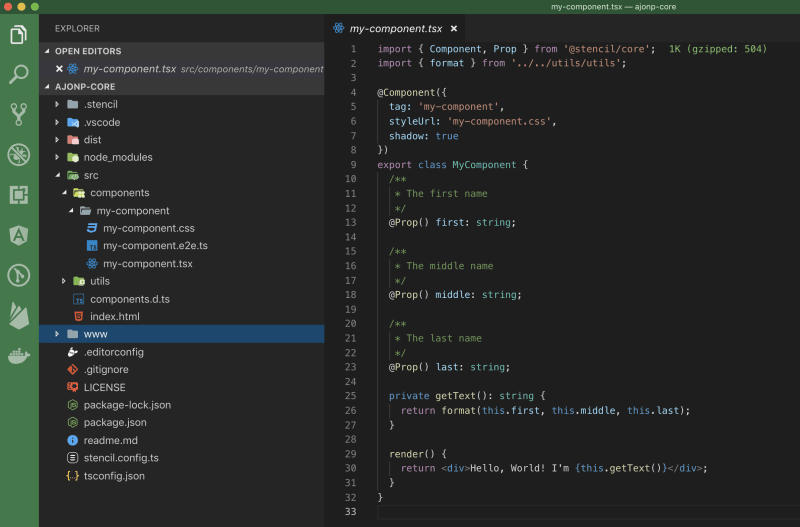
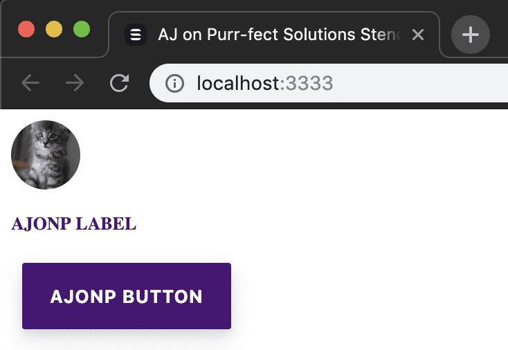
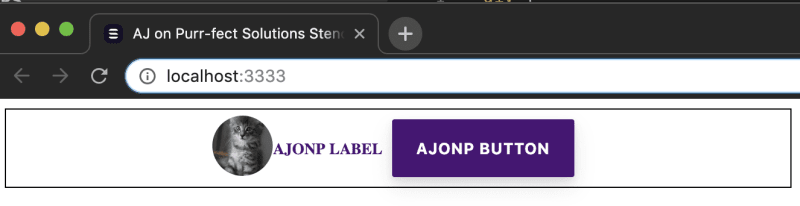
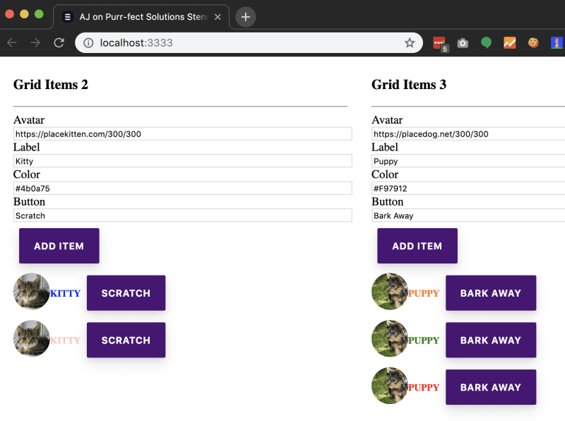
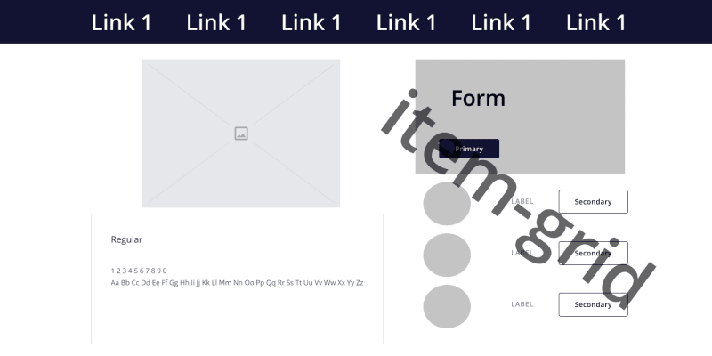
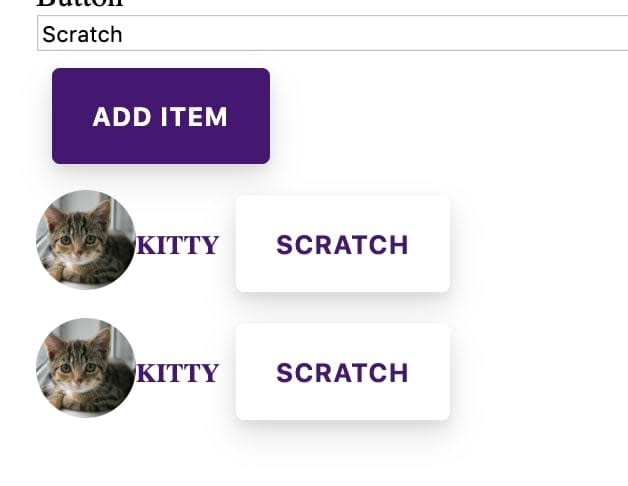

Если вы когда-нибудь работали в компании, у которой есть несколько разрозненных сайтов, созданных с использованием нескольких технологий, продолжайте читать. Мы рассмотрим принципы построения, лежащие в основе хорошего атомарного дизайна, как создавать веб-компоненты с помощью Stencil и, наконец, (возможно, самое важное) как позволить вашей компании создать и принять систему дизайна.

TLDR - Используйте веб-компоненты для создания успешной системы дизайна.

## Переворот в системе дизайна

Недавно мне удалось пообщаться с некоторыми из основных членов Ionic, которые также создали Stencil - инструментарий для создания дизайн-систем и прогрессивных веб-приложений. Мы долго говорили о том, как обычно компании обращаются к Ionic из команды дизайнеров и нуждаются в помощи по созданию компонентов. Как разработчик, я хотел сначала поговорить о веб-компонентах, которые используются в системе дизайна. Было довольно много неожиданностей, поэтому я решил рассказать о том, что такое система дизайна и почему неважно, с какого конца вы начнете, если у вас есть команды дизайнеров и разработчиков, которые работают вместе над созданием системы дизайна.

## Принцип атомарного дизайна

На мой взгляд, ”Атомарный дизайн” Брэда Фроста - это наиболее квалифицированно написанное руководство. Брэд описывает Атомный дизайн, как он связан с элементами в химии. Главное в Атомном дизайне - помнить, что вы строите от самого маленького компонента до полной страницы.

Существует 5 этапов атомного дизайна:

## Атомы Молекулы Организмы Шаблоны Страницы

По моему (ограниченному) опыту, большинство Front-End-разработчиков беспокоятся об атомах, молекулах и организмах. UI/UX-дизайнеры беспокоятся об организмах, шаблонах и страницах. В то время как на самом деле им ОБОИМ необходимо учитывать все 5 этапов.

### Атомы

Атомы - это самые маленькие части хорошего дизайна, такие как кнопки, текстовые элементы и изображения. Вы заметите, что даже в этих базовых атомах ваши разработчики захотят узнать, насколько эффективно атомы отображаются и реагируют. Например, в кнопке анимация ”клика” должна оставаться очень быстрой как на настольных, так и на мобильных компьютерах. Ваши дизайнеры захотят разрешить цвет, шрифт, границы и расположение иконок. Мы уже видим, что обеим сторонам необходимо согласовать каждый из компонентов.

### Молекулы

Молекулы - это группировка атомов в логические отношения. Например, мы можем использовать изображение аватара, текст ярлыка и кнопку, чтобы создать молекулу avatar-item-nav. Теперь у нас есть простой, функциональный, многократно используемый компонент, который мы можем использовать в самых разных местах.

Теперь организмы могут использовать как атомы, так и молекулы для создания сложных компонентов. Вы даже можете стать по-настоящему метаисторическим и заставить организмы использовать организмы! Мне нравится использовать карты (возможно, даже слишком), поэтому давайте воспользуемся нашими компонентами сверху. Допустим, мы создаем систему дизайна книг и хотим, чтобы у нас была карточка автора. Эта карточка автора будет содержать avatar-item-nav, который будет отображать аватар автора, имя автора и кнопку для перехода к биографии автора. Итак, давайте продолжим эту мета-мысль, мы можем взять эту карточку автора и поместить ее внутрь более крупного комопнента book-card, который имеет компонент Book hero-image и Title. Самое замечательное в этих организмах то, что мы можем легко повторять их на основе динамических данных.

### Шаблоны

Это стандартизированный способ реализации всех атомов, молекул и организмов в различных технологиях. Многие люди используют такие инструменты проектирования, как Sketch или моя любимая Figma, для компоновки каждого из этих различных типов шаблонов. Это часто называют скелетом вашей страницы, где каждый из элементов будет размещен на различных типах страниц, таких как Главная страница, Страница продукта и Страница контактов. Главное здесь - получить правильную структуру, а не контент.

### Страницы

Теперь вы можете продолжить использовать эти системы дизайна для создания фактического контента в каждом шаблоне. Это ”место, где резина бьется о дорогу”, вы узнаете, сколько настроек потребуется каждому шаблону, организму, молекуле и атому, чтобы использовать все компоненты всех ваших различных систем.

## Почему вы сказали ”перевернуть сценарий”?

Кажется, что все просто и понятно, разве не все так думают? Вероятно, вы разработчик, а не дизайнер. Мои друзья-дизайнеры сказали бы, что нам нужно установить типографику, цвет и стили. Вот почему я говорю, что вам нужно работать вместе, чтобы создать все 5 этапов дизайна. Пока дизайнер создает, скажем, цвета, разработчик должен сделать CSS достаточно портативным, чтобы каждый компонент мог использовать единый источник для обновления этих цветов. Часто компании начинают с разработки нескольких страниц, а затем говорят разработчикам, чтобы они просто придумали, как их создать. Вот почему я считаю, что вы должны ”перевернуть сценарий”.

Хорошим ресурсом для получения дополнительной информации о системах дизайна является Figma Blog.

## Веб-компоненты с помощью Stencil

Мы много говорили о принципе атомарного проектирования, но вы можете просто использовать его в любой системе и начать создавать. У вас могут быть компоненты Angular, React и Vue Com.компоненты. Но, если вы заметили, они не везде легко работают. Поэтому решением является использование веб-компонентов, потому что современный браузер уже понимает их, и любой Front-End фреймворк может использовать эти компоненты. Вы можете использовать Electron для настольных компьютеров (Slack, VSCode), PWA для Android и iOS, а также для всех браузеров Могу ли я использовать.

Это, естественно, позволяет использовать такие инструменты, как Stencil, для создания веб-компонентов, которые могут быть централизованно расположены и обновлены. Это также означает, что вы можете использовать эти компоненты в любом фреймворке или вообще без него.

## Создание компонентов Stencil

Сначала мы создадим проект трафаретных компонентов и начнем создавать все необходимые компоненты. Если вы знакомы с ReactJS или JSX, вы будете чувствовать себя очень комфортно. По аналогии с `ion-core`, который команда Ionic использовала для создания Stencil, мы создадим `<yourname>-core`, например, `ajonp-core`.

`npm init stencil`

Выберите:

компонент Имя проекта: ajonp-core



Теперь, если вы перейдете в каталог вашего проекта, то увидите простую установку, в которой есть каталог `components` с начальным компонентом `my-component`. Это базовый компонент, который возвращает `<div>` с вашими именем, фамилией и отчеством, которые были переданы с помощью props.

Этот новый компонент можно использовать, просто поместив его в страницу `<html>`. Вы можете увидеть это в файле `index.html`, в этом новом веб-компоненте передаются 2 реквизита

```javascript
first="Stencil" <my-component first="Stencil" last="Don't call me a framework JS"></my-component>
last="'Don't call me a framework' JS"

<my-component first="Stencil" last="'Don't call me a framework' JS"></my-component>
```

Это может показаться магией, но это и есть магия! Если вы внимательно посмотрите на `index.html`, то заметите, что там есть импортируемый `script`, который предоставляет необходимый javascript, используемый для вашего компонента.

Затем вы можете запустить этот проект и увидеть его в браузере.

`npm run start`

Более подробное руководство можно найти в разделе ”Начало работы”.

## Создание атомов

Для кнопки мы создадим простую синюю кнопку, которая принимает слот, позволяющий передавать дочерние компоненты. В нашем случае это будет просто текст.

`src/components/ajonp-button/ajonp-button.tsx`

```js
import { Component } from '@stencil/core';

@Component({
	tag: 'ajonp-button',
	styleUrl: 'ajonp-button.css',
	shadow: true,
})
export class AjonpButton {
	render() {
		return (
			<button>
				<slot />{' '}
			</button>
		);
	}
}
```

`src/components/ajonp-button/ajonp-button.css`

```css
button {
	background: #5851ff;
	color: white;
	margin: 8px;
	border: none;
	font-size: 13px;
	font-weight: 700;
	text-transform: uppercase;
	padding: 16px 20px;
	border-radius: 2px;
	box-shadow:
		0 8px 16px rgba(0, 0, 0, 0, 0.1),
		0 3px 6px rgba(0, 0, 0, 0.08);
	outline: 0;
	letter-spacing: 0.04em;
	transition: all 0.15s ease;
	cursor: pointer;
}
button:hover {
	box-shadow:
		0 3px 6px rgba(0, 0, 0, 0, 0.1),
		0 1px 3px rgba(0, 0, 0, 0.1);
	transform: translateY(1px);
}
```

index.html

Чтобы получить представление о том, насколько детализированной может стать кнопка, посмотрите, что Ionic создал с помощью ion-button!

Это простой текстовый элемент, которому можно передать шестнадцатеричный код, чтобы изменить цвет, однако этот элемент всегда будет в верхнем регистре и предопределенного размера 13. Обратите внимание, что здесь мы вводим элемент

`src/components/ajonp-label/ajonp-label.tsx`

```js
import { Component, Prop } from '@stencil/core';

@Component({
  tag: 'ajonp-label',
  styleUrl: 'ajonp-label.css',
  shadow: true
})
export class AjonpLabel {
  @Prop() color: any;

  render() {
    return (
      <p style={{ color: this.color }}>
        {' '}
        <slot />{' '}

    );
  }
}
```

`src/components/ajonp-label/ajonp-label.css`

`p { font-size: 13px; font-weight: 700; text-transform: uppercase; }`

`index.html`

`<ajonp-label color="#4b0a75">Этикетка AJonP</ajonp-label>`

Это снова очень простой компонент в стиле `atom`, который принимает url изображения, опять же используя props в атрибуте src, и делает его круглым, как аватар.

`src/components/ajonp-avatar/ajonp-avatar.tsx`

```js
import { Component, Prop } from '@stencil/core';

@Component({
  tag: 'ajonp-avatar',
  styleUrl: 'ajonp-avatar.css',
  shadow: true
})
export class AjonpAvatar {
  @Prop() src: any;

  render() {
    return ;
  }
}
```

`src/components/ajonp-avatar/ajonp-avatar.css`

`img { border-radius: 50%; width: 50px; height: 50px; object-fit: cover; overflow: hidden; }`.

index.html

Теперь мы должны увидеть, что все эти веб-компоненты могут быть легко показаны на экране каждый раз, когда мы добавляем их в наш `index.html`. Они ни в коем случае не готовы к производству, но вы получаете общее представление о том, что должно быть в составе Atom.

Вы должны увидеть что-то вроде этого, если запустите

`npm start`



## Создание молекул

Теперь мы можем взятьтри атома, которые мы создали выше, и создайте одну молекулу для отображения трех элементов в строке.

`src/components/ajonp-item/ajonp-item.tsx`

```js
import { Component, Prop } from '@stencil/core';

@Component({
  tag: 'ajonp-item',
  styleUrl: 'ajonp-item.css',
  shadow: true
})
export class AjonpItem {
  @Prop() color: string;
  @Prop() src: string;
  @Prop() labelText: string;
  @Prop() buttonText: string;

  render() {
    return (
      <span>
        {' '}
        <div>
          {' '}
          <ajonp-avatar src={this.src} />
          <ajonp-label color={this.color}>{this.labelText}</ajonp-label>
          <ajonp-button>{this.buttonText}</ajonp-button>
          {' '}
        </div>
        {' '}
      </span>
    );
  }
}
```

`src/components/ajonp-item/ajonp-item.css`

```css
div {
	display: flex;
	align-items: center;
	justify-content: center;
}

span {
	display: flex;
	flex-direction: column;
	align-items: center;
	justify-content: center;
	border: 1px;
	border-style: solid;
}
```



Создание организмов

Теперь, когда у нас есть молекула, мы можем использовать ее внутри организма, чтобы повторить молекулу несколько раз. Мы возьмем очень простую форму, которая позволит нам добавить каждую из молекул `ajonp-item`, но вы заметите, что мы также собираемся использовать атом `ajonp-button` внутри этого организма.

Оглядываясь назад, возможно, мне следовало назвать это списком

Эта сетка начинает усложняться, поскольку она принимает @Props, как и другие наши компоненты, но теперь мы вводим @State, чтобы наш компонент мог управлять внутренними данными этого компонента, в нашем случае всеми элементами, принадлежащими сетке. Последнее свойство класса - @Elementwhich позволяет нам получить доступ к главному HTMLElement, что позволяет нам найти поля ввода формы и для каждого отдельного `ajonp-item-grid`.

`src/components/ajonp-item-grid/ajonp-item-grid.tsx`

```js
import { Component, Element, Prop, State } from '@stencil/core';
import { Item } from '../../models/Item';

@Component({
  tag: 'ajonp-item-grid',
  styleUrl: 'ajonp-item-grid.css'
})
export class AjonpItemGrid {
  // Входящие элементы свойств
  @Prop() defaultColor: string;
  @Prop() defaultSrc: string;
  @Prop() defaultLabelText: string;
  @Prop() defaultButtonText: string;

  // Состояние для отслеживания внутри компонента
  @State() items: Item[] = [];

  // Хост-элемент для доступа к данным формы вместо просмотра всего документа
  @Element() el: HTMLElement;

  addItem() {
    const item = new Item();
    item.src = (this.el.querySelector('#src') as HTMLInputElement).value;
    item.labelText = (this.el.querySelector('#labelText') as HTMLInputElement).value;
    item.color = (this.el.querySelector('#color') as HTMLInputElement).value;
    item.buttonText = (this.el.querySelector('#buttonText') as HTMLInputElement).value;

    // Добавляем вновь созданный элемент в массив без мутации
    this.items = [...this.items, item];
  }

  scratchItem(key: number) {
    // Удаляем вновь созданный элемент в массив без мутации
    this.items = [...this.items.slice(0, key), ...this.items.slice(key + 1)];
    // Возвращаем массив из элементов до и после ключа.
  }

  render() {
    return (
      <div>
        {' '}
        <h3>Элементы сетки {this.items.length}</h3> <hr />
        Аватар <input type="text" id="src" value={this.defaultSrc} /> <br />
        Ярлык <input type="text" id="labelText" value={this.defaultLabelText} /> <br />
        Цвет{' '}
        <input type="text" id="color" value={this.defaultColor} /> <br />
        Кнопка <input type="text" id="buttonText" value={this.defaultButtonText} /> <br />
        <ajonp-button onClick={this.addItem.bind(this)}>Добавить элемент</ajonp-button>
        {this.items.map((item: Item, key: number) => {
          return (
            <ajonp-item
              src={item.src}
              color={item.color}
              label-text={item.labelText}
              button-text={item.buttonText}
              onClick={this.scratchItem.bind(this, key)}
            />
          );
        })}
        {' '}
      </div>
    );
  }
}
```

`src/components/ajonp-item-grid/ajonp-item-grid.css`

`input { width: 100%; } ajonp-item { display: flex; }`.

Теперь, если вы внимательно посмотрите, мы используем эти два организма в пределах нашей страницы, но мы также могли бы использовать их 100’000 раз на ЛЮБОЙ из наших страниц!

`index.html`

```html
<div style="display: flex; justify-content: space-around">
	<ajonp-item-grid
		default-src="https://placekitten.com/300/300"
		default-label-text="Kitty"
		default-color="#4b0a75"
		default-button-text="Scratch"
	></ajonp-item-grid>
	<ajonp-item-grid
		default-src="https://placedog.net/300/300"
		default-label-text="Щенок"
		default-color="#F97912"
		default-button-text="Лаять прочь"
	></ajonp-item-grid>
</div>
```



## Шаблоны

Я не буду вдаваться в подробности кода, необходимого для создания шаблона, но Ionic предложил надежное решение и для этого в своей функциональности Layout. Что здесь замечательно, так это то, что вы снова можете работать между вашей командой разработчиков и дизайнеров, чтобы быстро создать Hi-Fi Wireframe, который подойдет для ваших будущих компонентов. Я снова должен сказать, что люблю Figma, как и все, что создано с Web Tech всегда будет занимать особое место в моем сердце. В связи с этим простое решение этой распространенной задачи создания шаблонов можно найти в Product Design Kit, ознакомьтесь с Intro to Product Design Kit для Figma.

Мы можем очень быстро создать шаблон для нашей страницы, чтобы дизайнеры и разработчики могли обсудить разбивку всех компонентов и убедиться, что у вас есть шаблон для успешной работы.

Пожалуйста, не убивайте меня, я не дизайнер (да, мне стоит поработать с дизайнером). Вот пример нашего шаблона.



## Страницы

Итак, что шаблоны позволяют нам увидеть, так это то, что мы можем сразу же настроить наши компоненты. Мы видим, что наша `ajonp-button` должна иметь первичный и вторичный тип, так что мы должны убедиться, что обновили свойство, чтобы позволить это, а также радиус угла у всех кнопок должен быть одинаковым, так что мы должны обновить css. Цвета и содержание остаются в стороне, пока не придет время посмотреть примеры страниц. Теперь мы можем начать видеть реальную страницу, как пользователь будет взаимодействовать с ней на ежедневной основе, но поскольку мы построили всю нашу систему на компонентах с нуля, мы можем настроить eact Atom, Molecule и Organism, чтобы гарантировать, что мы идеально вписываемся в нашу систему.

Таким образом, можно настроить такие простые вещи, как первичность и вторичность.

`button.primary { background: #4b0a75; цвет: белый; } button.secondary { фон: белый; цвет: #4b0a75; }`



## Создание и внедрение системы проектирования предприятия

Я видел, как многие великие компании тратили миллионы долларов на поддержание разрозненных систем только для того, чтобы пытаться поспевать за темпами изменений в брендинге своих маркетинговых отделов. В качестве примера разрозненной компании можно привести сайты, созданные с использованием Sitefinity, Adobe AEM, Angular и React. На каждом из этих стеков, допустим, построено 5 разных сайтов. Чтобы обновить только компонент кнопки в этих системах, в лучшем случае придется изменить его в 4 местах, но более вероятно, что его придется обновить в 20 местах, а затем собрать, протестировать и развернуть каждую из этих систем.

В компонентной системе для этого требуется одно обновление компонента!!!

## Добавить центральное место

Для того чтобы внедрение произошло, вам нужно разместить ваши компоненты в централизованном месте, например в NPM. Вот отличное руководство по публикации в NPM. Поскольку вы так усердно работали над созданием этой системы, вы, скорее всего, захотите сохранить ее в личном реестре npm вашей компании.

## Как добиться успеха

Чтобы добиться настоящего успеха, вам нужно получить поддержку от обоих отделов и работать как единое целое, но в итоге вы сэкономите массу времени и денег!!!
