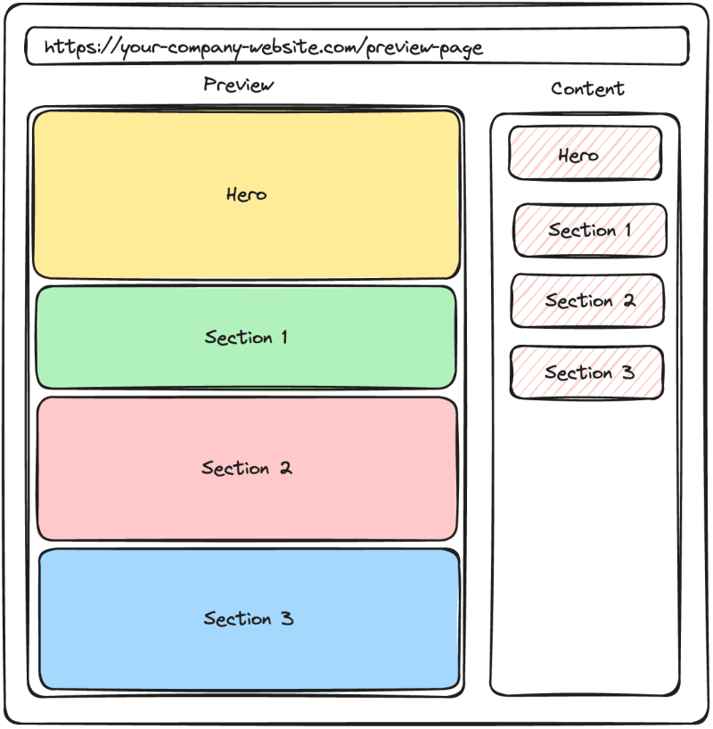
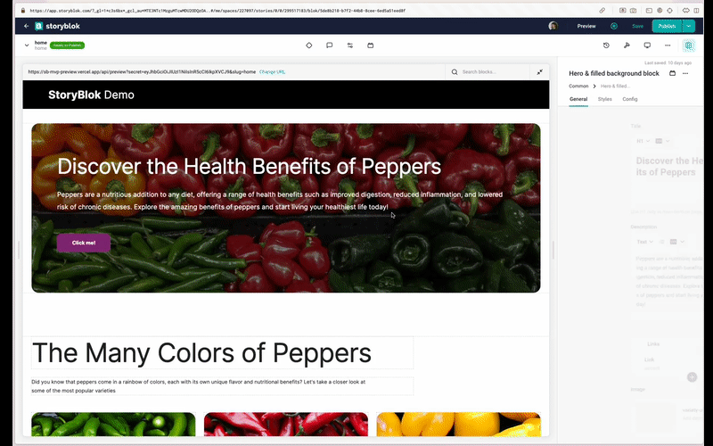
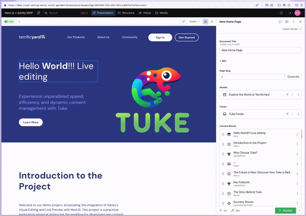
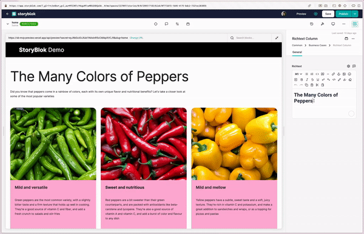
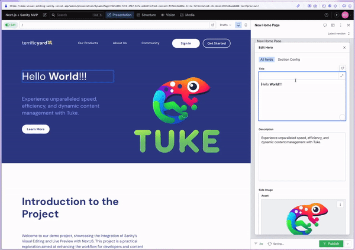
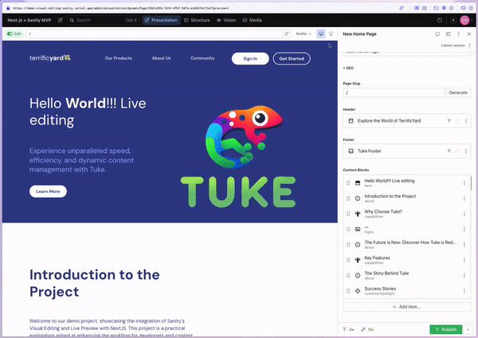
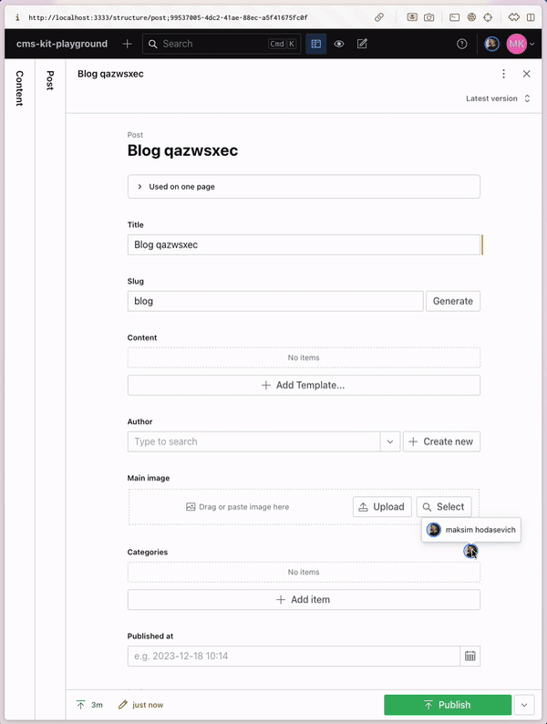
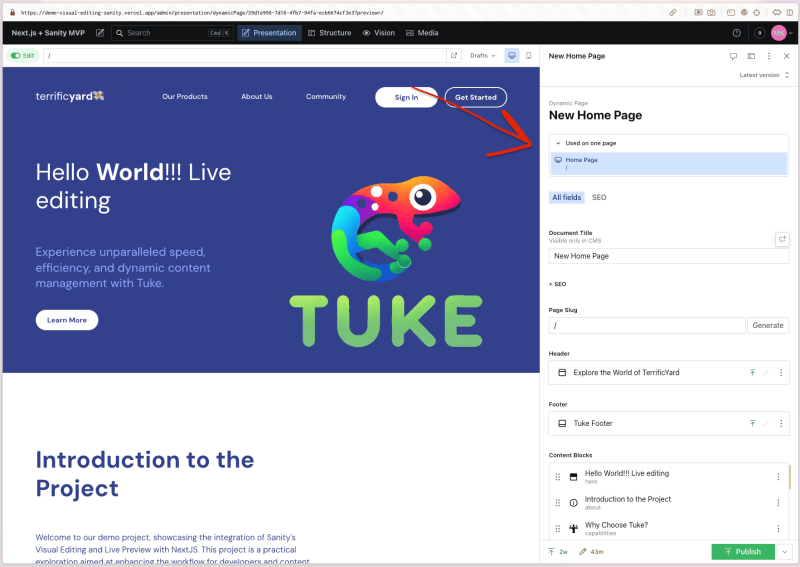

Как эксперты по безголовым CMS (hCMS) и производительности в FocusReactive, мы работаем со многими продуктами из этого сегмента и внимательно следим за их развитием. Но чаще всего мы выбираем те CMS, которые имеют интеграцию с таким фреймворком, как Next.js. Если hCMS позволяет разделить контент и работать с ним независимо, то Next.js помогает добиться максимальной производительности, используя встроенные механизмы и возможности фреймворка.

Звучит здорово, правда?

Если говорить конкретно, то здесь можно выделить двух игроков: Sanity и Storyblok.

Еще одна причина выбрать Sanity или Storyblok заключается в том, что они предлагают функции визуального редактирования. Давайте окунемся в эту тему и рассмотрим некоторые из основных возможностей, которые они предлагают.

## Что такое визуальное редактирование?

Визуальное редактирование - это удобный метод создания и изменения цифрового контента с помощью графических интерфейсов. Он позволяет пользователям, независимо от их технических знаний, напрямую взаимодействовать с контентом и манипулировать им. В отличие от традиционного текстового редактирования, визуальное редактирование обеспечивает предварительный просмотр в реальном времени того, как контент будет отображаться на странице, что повышает эффективность и сотрудничество между командами инженеров и разработчиков контента.

## Пользовательский интерфейс и навигация

И Storyblok, и Sanity имеют довольно схожий пользовательский интерфейс в отношении визуального редактирования: вы найдете URL страницы, предварительный просмотр страницы и список блоков, используемых на странице. Это важно, потому что это один из шагов к стандартизации, пусть и неофициальной.

Визуальные редакторы обеих платформ позволяют щелкнуть на любом компоненте и открыть его в колонке контента в правой части страницы. Вот как это выглядит:

Storyblok

Sanity

Эта функция экономит время и ускоряет процесс редактирования, особенно при работе со сложными компонентами, состоящими из множества вложенных компонентов.

Обе платформы открывают поля верхнего уровня, а также вложенные дочерние компоненты. Глубина не имеет значения.

Более того, в случае со Storyblok вы увидите иерархию вложенности, так называемые хлебные крошки. Они кликабельны, что дает дополнительное удобство при редактировании/переходе между вложенными компонентами. В Sanity этого нет.

Однако есть несколько различий между двумя платформами в области применения этой функции.

Допустим, у вас есть ссылка, и вы хотите перейти на другую страницу, щелкнув по ней. Это не сработает, потому что вместо перехода на другую страницу вы откроете щелкнутый компонент в колонке содержимого.

Sanity предлагает тумблер ”Редактировать”, который отключает эту функцию и позволяет вам взаимодействовать со страницей.

Эта функция особенно полезна, когда вы хотите предварительно просмотреть и протестировать конечный результат, включая переходы по ссылкам.

К сожалению, в Storyblok такой возможности нет. Но, по крайней мере, вы можете кое-что сделать. В частности, вы можете предотвратить события iframe, такие как нажатие на ссылку. Для этого можно использовать свойство preventClicks экземпляра StoryblokBridge (см. официальную документацию). Но это скорее техническое изменение, которое должно быть сделано в коде, а не в UI. Поэтому команда разработчиков контента не сможет использовать его самостоятельно.

В некоторых случаях это может расстраивать, особенно когда вы разрабатываете новую функциональность, связанную с поведением ссылок.

Предварительный просмотр в режиме реального времени и мгновенная обратная связь

И Storyblok, и Sanity обеспечивают мгновенный предварительный просмотр при изменении контента. Это означает, что любые изменения, внесенные в компоненты, отражаются в режиме реального времени без каких-либо задержек. Эта функция позволяет создателям контента увидеть, как именно их изменения повлияют на конечный вид страницы, что способствует быстрой итерации и корректировке.

Важность этой функции элегантно описана в блоге Sanity: ”Что вы видите, то и редактируете”. Обе hCMS хорошо играют в этой важной области.

Давайте посмотрим, как это выглядит:

Storyblok

Sanity

Они быстры и удобны в использовании.

Но как насчет сохранения изменений?

Sanity сохраняет все изменения со статусом черновика, так что если вы перезагрузите страницу, изменения будут там. Это может быть удобно, когда вы работаете над контентом и не хотите потерять изменения, но может раздражать при разработке/отладке.

Storyblok, в свою очередь, показывает все примененные изменения, но не сохраняет их, пока вы не нажмете кнопку ”Сохранить”.

Стоит упомянуть, что Sanity дает возможность редактировать любой отдельный компонент, например, нижний и верхний колонтитулы, и видеть мгновенную обратную связь. Поведение такое же, как и у остальных полей.

В случае со Storyblok механизм немного другой. Давайте рассмотрим добавление многократно используемого компонента заголовка которые вы будете распределять между страницами. Вы создаете ”историю” (набор полей) с информацией о заголовке и добавляете поле истории на страницу. Затем вы должны выбрать одну из существующих историй заголовка в качестве значения. И последняя часть - добавление реализации заголовка в код, чтобы он работал на всех страницах (например, использовался в макете, который разделяется между страницами).

Это нелегко и не совсем просто. Такой подход ограничивает возможности предварительного просмотра и редактирования в реальном времени для общих компонентов, а это не то, чего вы хотите.

## Функциональность перетаскивания и копирования

Функции перетаскивания - обязательное условие для любого визуального редактора, и Storyblok и Sanity предлагают эту возможность из коробки. Она позволяет пользователям легко изменять состав компонента и экспериментировать с различными макетами и дизайнами. Этот интуитивно понятный и удобный способ редактирования повышает удобство работы и ускоряет процесс создания контента.

Storyblok

Sanity

Однако эффективность создания контента еще больше повышается благодаря возможности копирования.

В Storyblok есть удобный механизм копирования и вставки компонентов через буфер обмена. Он позволяет копировать-вставлять компоненты между проектами/страницами/вложенными объектами. Это означает, что вы можете скопировать компонент и вставить его на другую страницу и даже в другой проект. С другой стороны, Sanity выбирает более целенаправленный подход, предлагая функциональность дублирования. Это означает, что вы можете создать копию компонента, которая будет добавлена прямо рядом с оригинальным компонентом.

Давайте посмотрим, в чем разница:

Storyblok

Sanity

На мой взгляд, в Storyblok есть более удобный способ сделать это. Потому что вы можете выбрать, какие компоненты копировать (да, вы можете выбрать несколько компонентов и скопировать их так же, как и один) и куда их вставить.

Sanity же ограничивается копированием только в пределах массива и по одному компоненту за раз, что может вызвать некоторые неудобства в определенных случаях.

## Предварительный просмотр для разных видовых экранов

Еще одна важная особенность инструментов визуального редактирования - возможность предварительного просмотра контента для разных видовых экранов. На данный момент Sanity предлагает два варианта: для рабочего стола и для мобильных устройств. Хотя это обеспечивает некоторую гибкость, она ограничена по сравнению со Storyblok. Storyblok позволяет пользователям просматривать контент в мобильных, планшетных и настольных видовых экранах. Кроме того, Storyblok позволяет пользователям просматривать контент любой ширины, аналогично расширению окна браузера. Такой уровень настройки гарантирует, что создатели контента смогут точно просматривать его на различных устройствах и при разных размерах экрана.

Storyblok

Sanity

## Сотрудничество и общение

Сотрудничество - ключевой момент в любом процессе создания контента, а Sanity делает еще один шаг вперед. В Sanity пользователи могут работать вместе с коллегами, не опасаясь перезаписи, блокировки друг друга или неожиданных правок. Поля независимы, поэтому несколько пользователей могут редактировать разные части одной и той же страницы без конфликтов. Более того, Sanity показывает, кто редактирует документ, в режиме реального времени, а также работает с живым предварительным просмотром. (Вау!)

Обычная, но обязательная функция, интегрированная в Sanity, - это история документа. Она отслеживает все изменения, и вы всегда можете восстановить определенную версию любого контента.

Storyblok также предлагает некоторые из этих возможностей. Он поддерживает ту же функцию истории с возможностью восстановления определенных версий страниц. Однако несколько пользователей не могут редактировать одну и ту же страницу одновременно, поскольку возникнут конфликты. Это существенное ограничение для команды разработчиков контента.

Еще одна замечательная особенность обеих платформ - вы можете оставлять комментарии к любым полям компонентов, отмечать членов команды, задавать вопросы и оставлять отзывы прямо в редакторе. Отмеченные члены команды получают уведомления, что избавляет от необходимости переключаться между платформами обмена сообщениями, такими как Slack. Это очень удобно, потому что иногда не хочется переключаться между контекстами и отвлекаться.

## Состав компонентов

И Storyblok, и Sanity позволяют контент-командам создавать множество страниц из существующих компонентов. Такая гибкость позволяет эффективно создавать контент и способствует согласованности на сайте или в приложении.

Однако важно отметить, что чем больше у вас страниц, тем больше сложностей ложится на плечи контент-команды. Изменение компонентов для одной страницы может потенциально повлиять на другие страницы.

Sanity решила эту проблему следующим образомподавать в суд, предоставляя четкий обзор того, какие страницы используют контент и как изменения будут каскадироваться. Эта функция позволяет нам проверить результаты на страницах, прежде чем обнародовать любые изменения.

К сожалению, Storyblok не предлагает такой возможности, что может быть недостатком при работе с большим проектом. Это то, чего мне очень не хватает в Storyblok.

## Реализация и настройка

Реализация и настройка Реализация визуального редактирования в Sanity предполагает использование нового веб-стандарта под названием Content source map и пакета @vercel/stega для кодирования и декодирования содержимого страниц. Другие hCMS также используют этот подход для реализации визуального редактирования.

Аналогично, Storyblok имеет собственную реализацию, требующую ручного добавления специальных свойств к каждому редактируемому блоку с помощью специальной вспомогательной функции.

Обе платформы используют iframe в своей реализации, что делает шаги по настройке довольно похожими. Вот разбивка шагов для каждой платформы:

### Для здравомыслия

Добавьте presentationTool в проект. Добавьте API-маршрут для управления черновиками/опубликованными документами. Подключите ваше фронтенд-приложение к Sanity Studio.

Для более подробного руководства и анализа вы можете обратиться к нашей статье: Глубокое погружение в инструмент визуального редактирования и презентации Sanity: Взгляд разработчика.

### Для Storyblok

Добавьте API-маршрут для управления черновиками/опубликованными страницами. Добавьте URL-адрес предварительного просмотра в Storyblok. Настройте токены.

Для получения дополнительных рекомендаций следуйте официальной документации.

В целом, общий процесс включает в себя настройку маршрута для обработки входящих запросов и конфигурирование инструментов, предлагаемых Sanity или Storyblok.

Интересно отметить, что оба продукта придерживаются схожего подхода. Это не только подтверждает идею, но и устанавливает шаблон, что полезно для разработчиков и пользователей сообщества. Паттерны - это всегда положительный аспект!

## Заключение

Для безголовых CMS инструменты визуального редактирования играют важнейшую роль в упрощении создания контента, разработке новых функций и тестировании результатов.

И Storyblok, и Sanity предлагают мощные и интуитивно понятные визуальные редакторы, которые расширяют возможности контент- и инженерных команд. В то время как Storyblok был пионером в предоставлении визуального редактирования из коробки, Sanity вышел на сцену со своим собственным набором впечатляющих функций.

Хотя оба инструмента визуального редактирования очень похожи, вы не можете решить, какую CMS выбрать, основываясь только на этом наборе функций. Прежде чем сделать окончательный выбор, следует принять во внимание множество аспектов: технологический стек, размер и опыт команды, бюджет, уровень коммуникации между командами, необходимость кастомизации, качество документации, потенциальные риски и многое другое.

Ознакомьтесь с соответствующими статьями, которые могут помочь вам принять окончательное решение:

Но, как всегда, выбор зависит от вашего конкретного случая использования. Вы должны глубоко понимать свою систему и бизнес, чтобы принять правильное решение.

Если у вас есть вопросы, свяжитесь с нами, экспертами по безголовым CMS, и мы поможем вам сделать этот выбор проще.
