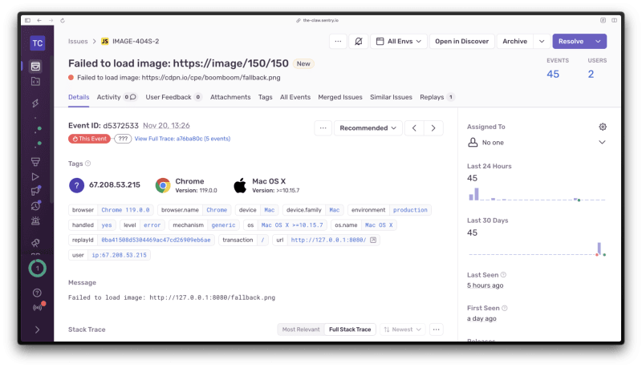

Ваши изображения повсеместно отбрасываются на 404. Вы получили гневное письмо от клиента. Их сайт ”сломан”, изображения не загружаются, кумулятивная смена макета бунтует, и все в беспорядке. Толпы людей насмехаются над вашим сломанным кодом в Twitter. Забавный GIF, загруженный по URL-адресу Giphy, больше не существует. А кто-то случайно удалил изображение из CMS.

Хотя вы не можете контролировать сторонние URL-адреса или ошибки пользователей в CMS, вы можете предотвратить все это, обеспечив возврат изображений 404 тремя различными способами. Давайте посмотрим.

## Возврат изображений в HTML

Первый способ - это способ только для HTML: не требуется JavaScript. Элемент HTML `<object>` часто не замечают среди причудливых фреймворков, основанных на компонентах изображений, доступных в экосистеме фронтенда сегодня. Он используется для представления внешнего ресурса, который может быть изображением, видео или веб-страницей. Исторически он использовался для встраивания и запуска плагинов на веб-странице для отображения Flash-роликов, запуска элементов управления ActiveX, Java-апплетов и других видов олдскульных веб-примочек. Сегодня это идеальный вариант для работы со сторонними URL-адресами изображений, которые вы не можете контролировать. Кроме того, он имеет полную поддержку браузера.

Чтобы использовать элемент HTML `<object>` для предоставления резервного изображения, назначьте атрибут data элемента `<object>` желаемому URL ресурса и предоставьте элемент HTML `` в качестве дочернего элемента `<object>`, указывающий на URL подходящего резервного изображения. По соображениям доступности укажите в `<object>` атрибут `aria-label` для описания желаемого изображения (вместо атрибута `alt`). Кроме того, убедитесь, что вы указали ширину и высоту изображения в обоих тегах элемента, чтобы избежать кумулятивного смещения макета при загрузке ресурсов и создании страницы.

```html
<object
	type="image/png"
	data="https://somedomain.com/image.png"
	width="150"
	height="150"
	aria-label="Это изображение должно существовать, но, увы, его нет"
>
	
</object>
```

## Откат изображения с помощью JavaScript

Другой способ обеспечить возврат изображения - подключиться к событию HTMLElement onerror. Оно срабатывает в элементе, когда ресурс не загружается или не может быть использован. Вы можете указать новый в случае ошибки, используя атрибут `onerror` непосредственно на элементе HTML ``.

``

Если вы не можете редактировать HTML напрямую (например, если вы используете компонент изображения на основе фреймворка), вы можете использовать обычный JavaScript (или ваш вариант) для прослушивания события `onerror` для всех отрисованных элементов HTML ``, например, так.

```js
const images = document.querySelectorAll('img');
images.forEach((image) => {
	image.addEventListener('error', (event) => {
		image.src = '/path/to/fallback.png';
	});
});
```

## Предоставление URL-адресов обратного хода изображения с сервера

Если вы запрашиваете изображения с бэкенда, управляемого вами или вашей командой, проверьте код состояния HTTP ресурса изображения, прежде чем пытаться вернуть URL через API. Если URL-адреса изображений возвращают 404, вы можете отправить URL-адрес резервного изображения в ответе, сократив необходимость в дополнительной логике и обходных путях на клиенте.

Этот метод зависит от языка программирования и фреймворка, но у него есть и недостатки. Если запрос должен возвращать сотни URL-адресов изображений (например, на страницах поиска электронной коммерции), и вам нужно проверять код ответа HTTP для каждого ресурса изображения перед возвратом ответа, этот метод может негативно повлиять на время ответа API. Лазар подробно рассказывает об этом в своем последнем посте: В чем разница между задержкой API и временем отклика API?

Узнайте, когда изображения сломаны

Хотя вы можете обойти неработающие изображения в своих фронтенд-приложениях, чтобы обеспечить лучший визуальный опыт конечного пользователя, полезно также знать, какие изображения не загружаются, чтобы вы могли поменять неработающие URL на работающие.

Sentry не предоставляет такой функциональности из коробки, но если это становится все более актуальным для ваших внешних веб-приложений, вы можете добавить этот небольшой фрагмент JavaScript в свой фронтенд, чтобы создать проблему в Sentry, если изображение не загружается. Он прослушивает все события ошибок, которые могут произойти в HTML-документе, и если ошибка произошла в элементе, он фиксирует сообщение в Sentry с исходным URL элемента, который не удалось загрузить.

```js
document.body.addEventListener(
	'error',
	(event) => {
		if (!event.target) return;
		if (event.target.tagName === 'IMG') {
			Sentry.captureException(`Failed to load image: ${event.target.src}`, 'warning');
		}
	},
	true,
);
```

При использовании этого фрагмента кода на ваших страницах вы увидите проблему, созданную в Sentry когда изображения будут отображаться 404. Кроме того, это можно сделать и для других ресурсов, например CSS-файлов. О том, как перехватывать 404-ю ошибку ресурса, читайте в документации Sentry.



## Получайте уведомления о поломке изображений

Если вы или назначенный член команды хотите получать уведомления о сбоях при загрузке изображений в ваших внешних приложениях, вы можете создать пользовательское оповещение в Sentry на основе сообщения ”Не удалось загрузить изображение”, показанного выше.

Перейдите в раздел ”Оповещения” и нажмите "Создать оповещение". Предварительно будет выбран тип "Ошибки > Проблемы". Нажмите на кнопку Задать условия. Добавьте фильтр, если "Значение {атрибута} события {соответствует} {значение}". Оставьте значения выпадающих полей "сообщение" и "содержать" без изменений, а в поле "значение" установите сообщение, которое вы отправляете в Sentry, когда изображение не загружается: "Не удалось загрузить изображение". Далее выберите параметры уведомления и задайте имя для этого оповещения. 1.Нажмите кнопку сохранить, и все готово.

Посмотрите интерактивный пример на сайте Arcade.

## Защитное кодирование FTW

Давайте будем реалистами. Сломанные изображения обычно не представляют особой проблемы, и это решение может оказаться для вас излишним. Но если подумать о том, что может пойти не так в ваших приложениях, и разработать защитный код с учетом этих возможных вариантов, вы сможете сэкономить немало времени и энергии. А это значит, что у вас появится больше времени и пространства для инноваций, передышки и поиска идеального GIF-файла, который бы отражал вашу реакцию на последнюю странную новость в области технологий.
