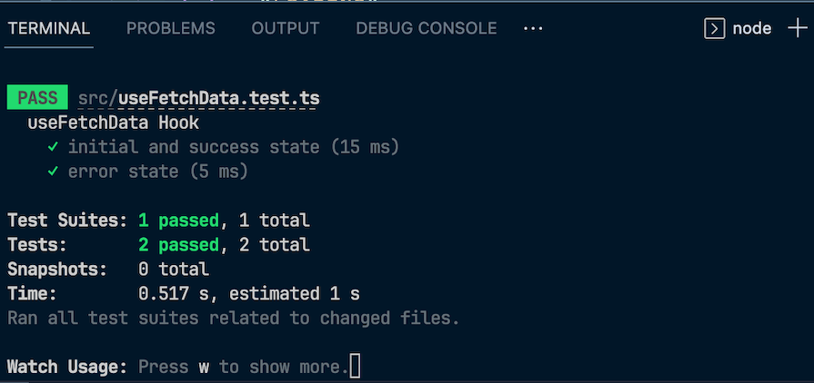

Примечание редактора: Эта статья была обновлена 18 декабря 2023 года Айзеком Окоро, чтобы добавить более подробный обзор и сравнение Jest, Enzyme и React Testing Library, обсудить общие проблемы, возникающие при тестировании React Hooks, и их решения, а также предоставить обновленную информацию, связанную с последней версией React v18.


Стабильный релиз React Hooks в React v16.8.0 получил положительные отзывы от сообщества. Вместе с этим стабильным релизом появилась необходимость эффективно тестировать React Hooks.

Важность тестирования во фронтенде невозможно переоценить. Каждая команда и компания использует разработку, управляемую тестами, чтобы вселить уверенность в свое программное обеспечение. В этой статье представлено практическое руководство по тестированию React Hooks с помощью таких инструментов, как React Testing Library, Jest и Enzyme.

## Что такое React Hooks?

React Hooks, по сути, обеспечивают способ создания компонентов с функциями, такими как состояние, без необходимости использования компонентов класса.

Стандартные и пользовательские React Hooks решают многие проблемы, с которыми разработчики React сталкивались на протяжении многих лет. Эти проблемы неизбежно заставляли нас использовать некоторые сложные паттерны в качестве обходных путей, такие как реквизиты рендеринга и компоненты более высокого порядка, что могло привести к созданию сложных кодовых баз.

Например, до появления Hooks в React не было поддержки многократно используемой логики состояния между компонентами `класса`. Это иногда приводило к огромным компонентам, дублированию логики в конструкторе и необходимости использовать методы жизненного цикла.

Hooks призваны решить все эти проблемы, позволяя вам писать многократно используемые компоненты с доступом к состоянию, методам жизненного цикла и ссылкам.

## Как создать React-приложение с использованием React Hooks

Прежде чем мы перейдем к рассмотрению того, как писать тесты для React Hooks, давайте посмотрим, как построить React-приложение с использованием Hooks. Мы создадим приложение, которое будет показывать гонки Формулы-1 2018 года и победителей каждого года.  
Вы можете увидеть и взаимодействовать со всем приложением через CodeSandbox:

В приведенном выше приложении мы используем хуки `useState` и `useEffect`. Если вы перейдете в файл `index.js`, в функции `App` вы увидите экземпляр, в котором используется `useState`:

```javascript
// Устанавливаем список гонок в пустой массив
let [races, setRaces] = useState([]);
// Устанавливаем победителя для определенного года
let [winner, setWinner] = useState();
```

useState возвращает пару значений, то есть текущее значение состояния и функцию, позволяющую его обновить. Его можно инициализировать любым типом значения (строка, массив и т. д.), в отличие от state в классах, где это должен быть объект.

Между тем, хук `useEffect` добавляет возможность выполнять побочные эффекты из компонента функции. По сути, он позволяет вам выполнять операции, которые обычно выполняются в методах жизненного цикла `componentDidMount`, `componentDidUpdate` и `componentWillUnmount`:

```js
// При первом рендере компонента получаем данные из API.
useEffect(() => {
	fetch(`https://ergast.com/api/f1/2018/results/1.json`)
		.then((response) => response.json())
		.then((data) => {
			setRaces(data.MRData.RaceTable.Races);
		});

	fetch(`https://ergast.com/api/f1/2018/driverStandings.json`)
		.then((response) => response.json())
		.then((data) => {
			let raceWinner =
				data.MRData.StandingsTable.StandingsLists[0].DriverStandings[0].Driver.familyName +
				' ' +
				data.MRData.StandingsTable.StandingsLists[0].DriverStandings[0].Driver.givenName;
			setWinner(raceWinner);
		});
}, []);
```

В приложении мы используем хук `useEffect` для выполнения вызовов API и получения данных о гонках F1, а затем используем функции `setRaces` и `setWinner` для установки соответствующих значений в состояние.

Это лишь пример того, как хуки можно использовать в комбинации для создания приложения. Мы используем хук `useEffect` для получения данных из какого-либо источника и `useState` для установки полученных данных в состояние.

## Что такое Jest?

Jest - это фреймворк для тестирования JavaScript с акцентом на простоту, который позволяет легко писать тесты для ваших JavaScript-приложений. Он также подходит для тестирования приложений на TypeScript, React, React Native и Vue.

Jest поставляется с готовой конфигурацией для JavaScript-файлов и элегантным API, который используется для создания изолированных тестов, сравнения моментальных снимков, подражания тестам, покрытия тестами и многого другого.

Зачем использовать Jest с Enzyme или библиотекой тестирования React?

React Testing Library и Enzyme - это утилиты для тестирования, которые предоставляют методы для доступа к элементам DOM. Однако они не работают с утверждениями, которые проверяют, истинно ли определенное условие, и выбрасывают ошибку, если оно не истинно.

Чтобы работать с утверждениями, вам нужен прогонщик тестов и фреймворк. Именно здесь на помощь приходит Jest. Jest действует как прогонщик тестов, который определяет тесты, выполняет их и решает, прошли они или нет. Он также предоставляет функции для утверждений, реализации кода и тестовых наборов.

Jest считается де-факто фреймворком тестирования для React-приложений, что делает его популярным выбором в экосистеме React. Простота использования, широкие возможности и активное сообщество способствуют его популярности.широкое распространение для тестирования.

## Что такое энзим?

Enzyme - это утилита для тестирования на JavaScript для React, которая упрощает утверждение, манипулирование и обход вывода компонентов React. Она также предоставляет набор удобных методов для работы с компонентами React, позволяя разработчикам более эффективно писать тесты для своих React-приложений.

Некоторые примечательные особенности Enzyme включают:

Неглубокий рендеринг: Рендеринг только текущего компонента без рендеринга его дочерних компонентов. Это может быть полезно при тестировании компонента как единицы и для того, чтобы ваши тесты не утверждали косвенно поведение дочерних компонентов Полный рендеринг DOM: Отрисовывает полный DOM и позволяет взаимодействовать с дочерними компонентами, что делает его подходящим для более комплексных интеграционных тестов Mocking functions and components: Это полезно, когда вы хотите изолировать тестируемый компонент от его зависимостей

Давайте посмотрим, как мы можем использовать Enzyme для тестирования React Hooks.

## Тестирование React Hooks с помощью Enzyme

Для начала создадим проект с помощью Create React App следующим образом:

`npx create-react-app my-app cd my-app`
Далее мы установим тестовую библиотеку Enzyme вместе с адаптером React следующим образом:

`npm i --save-dev enzyme enzyme-adapter-react-16`
Теперь создайте файл `setupTests.js` в папке `src`. Добавьте в него следующий фрагмент для настройки адаптера Enzyme:

```js
import Enzyme from 'enzyme';
import Adapter from 'enzyme-adapter-react-16';
Enzyme.configure({ adapter: new Adapter() });
```

Код в файле `setupTests.js` будет выполнен перед выполнением нашего теста.

## Тестирование хука `useState` с помощью Enzyme

Чтобы протестировать хук `useState`, давайте обновим файл `app.js` следующим образом:

```javascript
import React from 'react';

const App = () => {
	const [name, setName] = React.useState('');

	return (
		<form>
			<div className="row">
				<div className="col-md-6">
					<input
						type="text"
						placeholder="Введите ваше имя"
						className="input"
						onChange={(e) => {
							setName(e.target.value);
						}}
					/>
				</div>
			</div>
			<div className="row">
				<div className="col-md-6">
					<button type="submit" className="btn btn-primary">
						Добавить имя
					</button>
				</div>
			</div>
		</form>
	);
};

export default App;
```

Здесь у нас есть базовое поле ввода и элемент кнопки. Обратите внимание, что мы использовали `React.useState()` вместо `useState()`. Это нужно нам для поддержки имитации хука `useState` в нашем тесте Enzyme:

```javascript
import React from 'react';
import { shallow } from 'enzyme';
import App from './App';

const setState = jest.fn();
const useStateSpy = jest.spyOn(React, 'useState');
useStateSpy.mockImplementation((initialState) => [initialState, setState]);

const wrapper = shallow(<App />);
```

Здесь мы успешно сымитировали хук `useState` и можем приступить к тестированию обновления состояния при изменении ввода следующим образом:

```javascript
it('should update state on input change', () => {
	const newInputValue = 'React is Awesome';
	wrapper.find('.input').simulate('change', {
		target: { value: newInputValue },
	});
	expect(setState).toHaveBeenCalledWith(newInputValue);
});
```

Enzyme поддерживает React Hooks, хотя в `.shallow()` есть некоторые недостатки, связанные с проблемами, возникшими в React’s shallow renderer. При неглубоком рендере React не вызываются `useEffect()` и `useLayoutEffect()`.

## Тестирование хуков React с помощью библиотеки React Testing Library

Библиотека React Testing Library - это легкое решение для тестирования компонентов React. Она расширяет `react-dom` и `react-dom/test-utils` для предоставления легких вспомогательных функций. Она поощряет вас писать тесты, которые очень похожи на то, как используются ваши компоненты React.

Основная цель React Testing Library - повысить уверенность разработчиков в своих тестах, тестируя компоненты так, как их использует пользователь. Она уже установлена в CRA, что делает ее легкодоступной - и, следовательно, широко используемой - библиотекой тестов для React.

Давайте посмотрим пример написания тестов для Hooks с помощью библиотеки React Testing Library.

В приведенном выше приложении мы используем три типа хуков - `useState`, `useEffect` и `useRef`. Мы будем писать тесты для всех них.

Для реализации хука `useRef` мы, по сути, создаем экземпляр `ref` с помощью `useRef` и устанавливаем его на поле ввода. Это означает, что теперь мы можем получить доступ к значению ввода через ссылку. Между тем, тест `useEffect` Hook, по сути, устанавливает значение состояния `name` в `localStorage`.

Давайте продолжим писать тесты для всех описанных выше реализаций. Мы будем писать тесты для проверки этого:

Начальное состояние `count` равно `0` Кнопки `increment` и `decrement` работают Отправка имени через поле ввода изменяет значение состояния `name` Состояние `name` сохраняется в `localStorage`.

Перейдите в папку `__tests__`, чтобы увидеть файл `hooktest.js`, содержащий набор тестов и строку кода `import` ниже:

`// hooktest.js import { render, fireEvent, getByTestId} from "react-testing-library";`

В этой строке кода:

`render` поможет рендерить наш компонент. Он рендерит в контейнер, который добавляется к `document.body` `getByTestId` получает элемент DOM по `data-TestId` `fireEvent` используется для ”запуска” событий DOM. Он прикрепляет обработчик событий к документу и обрабатывает некоторые события DOM через делегирование событий - например, нажатие кнопки

Далее добавьте приведенный ниже набор тестов в файл `hooktest.js`:

```javascript
// hooktest.js

it('App loads with initial state of 0', () => {
	const { container } = render(<App />);
	const countValue = getByTestId(container, 'countvalue');
	expect(countValue.textContent).toBe('0');
});
```

Тест проверяет, что начальное состояние count установлено в `0`, сначала получая элемент с помощью помощника `getByTestId`. Затем он проверяет, равно ли содержимое `0`, используя функции `expect()` и `toBe()`.

Далее мы напишем тест, чтобы проверить, работают ли кнопки увеличения и уменьшения:

```javascript
// hooktest.js

it('Кнопки инкремента и декремента работают', () => {
	const { container } = render(<App />);
	const countValue = getByTestId(container, 'countvalue');
	const increment = getByTestId(container, 'incrementButton');
	const decrement = getByTestId(container, 'decrementButton');

	expect(countValue.textContent).toBe('0');

	fireEvent.click(increment);
	expect(countValue.textContent).toBe('1');

	fireEvent.click(decrement);
	expect(countValue.textContent).toBe('0');
});
```

В приведенном выше тесте мы проверяем, что состояние устанавливается в `1`, если нажата кнопка `onButton`, и что состояние устанавливается в `0`, если нажата кнопка `offButton`.

На следующем этапе мы напишем тест для проверки того, действительно ли ввод имени через поле ввода изменяет значение состояния `name`, а также для проверки того, что оно успешно сохраняется в `localStorage`:

```javascript
// hooktest.js

it('Ввод имени через поле ввода изменяет значение состояния имени', () => {
	const { container, rerender } = render(<App />);
	const nameValue = getByTestId(container, 'namevalue');
	const inputName = getByTestId(container, 'inputName');
	const submitButton = getByTestId(container, 'submitRefButton');
	const newName = 'Ben';

	fireEvent.change(inputName, { target: { value: newName } });
	fireEvent.click(submitButton);

	expect(nameValue.textContent).toEqual(newName);

	rerender(<App />);
	expect(window.localStorage.getItem('name')).toBe(newName);
});
```

В тестовом утверждении выше мы использовали метод `fireEvent.change` для ввода значения в поле `input`, после чего вызвали событие для нажатия на кнопку `submitButton`.

Затем тест проверяет, равно ли значение ref после нажатия кнопки `newName`. Наконец, используя метод `rerender`, мы имитируем перезагрузку приложения и проверяем, сохранилось ли заданное ранее имя в `localStorage`.

## Тестирование функций async Hook

Чтобы реализовать тесты для асинхронных хуков, мы можем использовать функцию `waitForNextUpdate` из библиотеки тестирования хуков React.

Асинхронные методы возвращают обещания, поэтому не забывайте вызывать их с помощью `await` или `.then`. Библиотека тестирования React Hooks предоставляет метод `waitFor` для тестирования асинхронных хуков.

Асинхронный хук, который мы будем тестировать, принимает в качестве параметра URL API, делает асинхронный запрос с помощью Axios и возвращает объект ответа.

Создайте файл `useFetchData.js` в папке `src` и добавьте в него следующее:

```javascript
import axios from 'axios';

const endpoint = 'https://jsonplaceholder.typicode.com/posts/1';

export default function Endpoint() {
	const [data, setData] = React.useState({
		state: 'LOADING',
		error: '',
		data: [],
	});

	const fetchData = async () => {
		try {
			const result = await axios.get(endpoint);
			setData({
				state: 'SUCCESS',
				error: '',
				data: result.data, // Получаем доступ к данным напрямую
			});
		} catch (err) {
			setData({
				data: [],
				state: 'ERROR',
				error: err,
			});
		}
	};

	React.useEffect(() => {
		fetchData();
	}, []);

	return data;
}
```

Теперь давайте протестируем наш асинхронный хук. Создайте файл `useFetchData.test.js` в папке `src` и добавьте в него следующее:

```javascript
import { renderHook } from '@testing-library/react';
import useFetchData from './useFetchData';
import axios from 'axios';
import { act } from 'react-dom/test-utils';

jest.mock('axios');

const useApiMockData = [
	{ id: 1, name: 'Leanne Graham' },
	{ id: 2, name: 'Ervin Howell' },
];
```

Здесь мы используем метод `jest.mock` для подражания Axios для тестирования асинхронных действий. Кроме того, мы смоделировали некоторые типичные данные ответа для нашего теста.

Далее мы напишем тест для успешных и неудачных запросов к API:

```javascript
describe('useFetchData Hook', () => {
	it('начальное и успешное состояние', async () => {
		axios.get.mockResolvedValue(useApiMockData);
		const { result } = renderHook(() => useFetchData());
		act(() => {
			result.current.state = 'SUCCESS';
			result.current.error = '';
			result.current.data = [];
		});
		expect(result.current).toMatchObject({
			data: [],
			error: '',
			state: 'SUCCESS',
		});
	});

	it('error state', async () => {
		const errorMessage = 'Network Error';
		axios.get.mockImplementationOnce(() => Promise.reject(new Error(errorMessage)));
		const { result } = renderHook(() => useFetchData());
		act(() => {
			result.current.state = 'ERROR';
			result.current.error = 'Fetch failed';
			result.current.data = [];
		});
		expect(result.current).toMatchObject({
			data: [],
			error: 'Fetch failed',
			state: 'ERROR',
		});
	});
});
```

В блоке кода above, мы имитируем наш вызов Axios и обновления состояния. Обратите внимание, как метод `act()` оборачивает код, который вызывает любые обновления состояния в результате асинхронного запроса. Теперь, когда мы запускаем наш тест, мы видим, что все проходит, как показано на изображении ниже:



Общие подводные камни и решения при тестировании React Hooks

Тестирование React Hooks может быть довольно сложным. В этом разделе мы рассмотрим некоторые распространенные подводные камни, с которыми вы можете столкнуться, и решения для их устранения.

## Тестирование хуков с внешними зависимостями

В вашем React-приложении есть определенные сценарии, когда ваш React Hook может зависеть от определенных операций, пакетов или API. Это может быть сложно изолировать и протестировать. Если эти зависимости являются внешними API, которые могут измениться в любой момент, моделирование поведения становится еще более сложным.

Решением этой проблемы является имитация зависимостей. Издевательство заключается в замене реальных компонентов или функций их имитационными версиями при выполнении тестов.

Ниже приведен пример имитации API-запроса:

```javascript
import axios from 'axios';
jest.mock('axios');

const mockedData = [
	{ id: 1, name: 'Джимми', isVerified: true },
	{ id: 2, name: 'Томми', isVerified: false },
];

describe('Mocking an API', () => {
	test('должен получить данные из API', async () => {
		axios.get.mockResolvedValue({ data: mockedData });
	});
});
```

В приведенном выше блоке кода мы импортировали зависимость, которую будет использовать наше приложение - в данном случае `axios`. Затем мы имитировали зависимость с помощью Jest и сымитировали ожидаемый результат

## Тестирование хуков, вызывающих побочные эффекты

Побочные эффекты - это любые действия, которые происходят вне области действия выполняемой функции. Примером побочного эффекта может служить получение данных или манипуляции с DOM браузера. Тестирование побочных эффектов может быть сложным, поскольку они в основном асинхронны по своей природе, что может привести к непредсказуемым результатам тестирования.

Решением этой проблемы является использование функции `waitFor` из библиотеки тестирования React с `async/await` для ожидания завершения асинхронных операций перед выполнением утверждений:

```javascript
import { waitFor } from '@testing-library/react';

test('should trigger side effect', async () => {
	// Триггер побочного эффекта
	const resultPromise = someAsyncFunction();

	// Ждем разрешения обещания
	await waitFor(() => {
		expect(resultPromise).resolves.toBe(/* ожидаемое значение */);
	});
});
```

Блок кода выше показывает, как использовать функцию `waitFor` с `async/await` для ожидания асинхронного кода.

## Тестирование пользовательских хуков

Тестирование пользовательских хуков в React также может быть сложным, потому что пользовательские хуки отличаются от компонентов. При попытке протестировать их с помощью функции `render()` из библиотеки React Testing Library вы получите ошибку, которая связана с тем, что React Hooks нельзя использовать вне компонентов React.

Решением этой проблемы является использование функции `renderHook()` вместо функции `render()`. Функция `renderHook()` предоставляет среду для рендеринга хуков вне компонентов, как показано в блоке кода ниже:

```javascript
import { renderHook } from '@testing-library/react';
import useCustomHook from './useCustomHook';

test('должно что-то сделать', () => {
	const { result } = renderHook(() => useCustomHook());
	// Утверждения, основанные на возвращаемом хуком значении
	expect(result.current.someValue).toBe(/* ожидаемое значение */);
});
```

В приведенном выше коде мы импортировали функцию `renderHook()` и пользовательский хук. После этого мы успешно и без ошибок выполнили наши тесты.

## Сравнение библиотек тестирования Enzyme, Jest и React

Давайте сравним Enzyme, Jest и React Testing Library с помощью таких показателей, как производительность тестирования, возможности мокинга, масштабируемость и многое другое:

### Метрики Enzyme Jest React Testing Library

Производительность Выполняется хорошо, но обширный набор функций может повлиять на производительность. Некоторые факторы, такие как размер проекта, также могут ограничивать производительность Высокая производительность Известен своей легковесной конструкцией, которая способствует лучшей производительности при рендеринге и запросах

Удобство использования Предоставляет богатые возможности для тестирования и манипулирования компонентами Общецелевой фреймворк для тестирования, предлагающий полный набор функций Упор делается на простоту, тестирование, ориентированное на пользователя, и эффективные запросы к компонентам

Тестирование моментальных снимков Поддерживается с помощью пакета enzyme-to-json Поддерживается Может работать с тестированием моментальных снимков, но он не был для этого предназначен

Мощные возможности и утилиты для имитации Мощные возможности и утилиты для имитации Поставляется со встроенными возможностями для имитации Ограниченное количество встроенных возможностей для имитации

Обновления и сопровождение Активно поддерживается Активно поддерживается Активно поддерживается

Масштабируемость Становится менее масштабируемым для больших приложений Масштабируется хорошо для приложений любого размера Масштабируется хорошо для приложений любого размера

Эта таблица должна дать вам лучшее представление о том, когда и как использовать каждый инструмент. Помните, что, как мы уже говорили, Jest - это отличный инструмент для использования вместе с Enzyme или React Testing Library. Например, вы можете использовать Jest для обработки ассетовричины использования библиотеки React Testing Library для управления взаимодействием с компонентами React.

## Заключение

В этой статье мы рассмотрели, как использовать React Hooks, и обсудили, как писать тесты для React Hooks и React-компонентов с помощью Jest, Enzyme и React Testing Library. Мы также сравнили эти три варианта тестирования React-компонентов, чтобы лучше понять, как каждый инструмент может вписаться в нашу стратегию тестирования.

Кроме того, мы рассказали о некоторых проблемах тестирования React Hooks и решениях, которые можно применить для их устранения. Вы можете ознакомиться с демо-проектом, который мы использовали для изучения тестирования React Hooks, на CodeSandbox.

Хотите узнать больше? Ознакомьтесь с этой статьей о том, как избежать распространенных ошибок при работе с React Hooks. Если у вас есть вопросы или комментарии, вы можете поделиться ими ниже.
