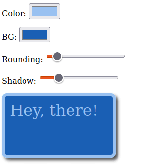

В предыдущих уроках “2000 line challenge” я показал, как использовать Modulo.js для создания градиентного пикера. Этот урок является продолжением этой задачи, очень актуальной для front-end разработчиков: Давайте создадим небольшой инструмент для разработки, который позволит нам лучше визуализировать CSS и итерационно улучшать стили CSS и HTML!

Попробуйте прямо сейчас, менее чем за 30 секунд: 🚀🚀🚀 Хотите пропустить вперед? Прокрутите страницу в самый низ и просто скопируйте ~31 строку HTML-кода в любой локальный HTML-файл, а затем откройте его в браузере, чтобы увидеть результат на месте. Modulo не имеет зависимостей и даже запускается встроенным в локальные HTML-файлы, так что это действительно так просто!

## Конечный продукт

Давайте создадим небольшой ”конструктор коробок". Картинка стоит тысячи слов, поэтому посмотрите ниже, о чем я говорю:



Вы можете задаться вопросом, зачем нам нужен такой конструктор боксов. Ну, он может быть полезен в дизайнерских командах: Собрав небольшой инструмент ”предварительного просмотра CSS”, который делает определенные предположения, веб-разработчики и дизайнеры в вашей команде могут проявить творческий подход в рамках критериев, установленных разработчиком этих инструментов. Самое приятное, что, поскольку Modulo настолько прост, все веб-дизайнеры (а не только фронтенд-инженеры) могут чувствовать себя вправе изменять и расширять возможности инструмента.

Modulo.js отлично подходит для этого, так как это крошечный 2000-строчный файл для создания веб-компонентов без необходимости использования JavaScript, Node.js или node_modules (хотя с ними он тоже работает!). Если вы новичок в Modulo.js, то читайте следующий раздел. В противном случае переходите к ”хорошему" ниже.

Подождите, что это за фреймворк на 2000 строк, Modulo.js?

Возможности Modulo.js гораздо глубже, чем просто создание инструментов внешнего стайлинга, как, например, в этом учебнике. В предыдущих уроках я рассказывал о таких функциях, как атрибут -store= и о том, как Modulo.js может использовать JSON и API для быстрой сборки небольших веб-компонентов без какого-либо собственного JavaScript. Как небольшой фреймворк может делать все это? Я называю это задачей фреймворка на 2000 строк, и Modulo.js - это решение этой непростой задачи.

Как мы можем создать фронтенд-инструменты, которые были бы намного, намного проще, чтобы это было легче для строителей статических сайтов, пользователей Rails, PHP, Python и Wordpress или студентов, изучающих кодинг? В общем, как нам создать фреймворки, которые будут привлекательны для современных JS-разработчиков и при этом не будут таинственными лабиринтами зависимостей node_module? Цель Modulo - сделать это всего за 2000 строк кода, функционируя как своего рода “Vue-lite / Svelte-lite / React-lite” фреймворк.

Modulo ориентирован на HTML и браузер, что означает, что он интегрируется всего в несколько строк кода в любой HTML-файл. Он сразу же позволяет писать производительные веб-компоненты с множеством современных функций. Проверьте это: ModuloJS.org

## Начало работы с выбором цвета

Как и в предыдущем уроке, давайте начнем с базового выбора цвета. Прочитайте предыдущий учебник для более глубокого обсуждения этого кода или просто прочитайте краткое изложение ниже:

```js
<Template>

    <label>Цвет: <input [state.bind] name="fgcolor" type="color" /></label>


    <label>БГ: <input [state.bind] name="bgcolor" type="color" /></label>

  <div style="height: 100px; width: 200px; font-size: 2rem; color: {{ state.fgcolor }}; background: {{ state.bgcolor }};">
    Привет!
  </div>
</Template>
<State fgcolor="#AABAAA" bgcolor="#1A5FB4"></State>
```

Здесь у нас есть два ввода типа color, каждый в метке, в p-теге. Это приведет к тому, что в браузере будут отображаться два цветовыбирателя. Он подключен (привязан) к State CPart. Мы используем атрибут name=“fgcolor”, чтобы указать State CPart, какая переменная состояния должна быть ”назначена" (привязана) к этому входу. При повторном рендеринге он использует атрибут `style=` в `div` для предварительного просмотра выбранных цветов переднего плана (`fgcolor`) и фона (`bgcolor`).

Все понятно? Если нет, ознакомьтесь с предыдущим руководством для более глубокого обсуждения, и/или с руководством Modulo по Ramping Up, состоящим из 5 частей. В противном случае продолжайте читать.

Добавление новой переменной для ”округления" и слайдера

На данный момент мы добавили аспект выбора цвета в исходный пример. Теперь нам нужно иметь возможность регулировать ”Скругление:" и "Тень:", поэтому нам понадобятся две новые переменные State:

`<State fgcolor="#99C1F1" bgcolor="#1A5FB4" rounding:=10 shadow:=5 ></State>`.

Затем мы добавим соответствующие ползунки в шаблон:

```js

  <label>Округление: <input [state.bind] name="rounding" type="range" min="1" max="100" step="1" /></label>


  <label>Shadow: <input [state.bind] name="shadow" type="range" min="1" max="20" step="0.1" /></label>

```

Обратите внимание, что это `type="range"`. Это то, что показывает слайдер. Используя `min=`, `max=` и `step=`, мы можем настроить поведение ползунка (каким значениям он будет соответствовать в переменной state, то есть). ВВ этом примере ползунок `округления` может двигаться от `1`, `2`, `3`, … до `100`. Ползунок `тень`, однако, может быть от `1.0`, `1.1`, `1.2`, … до `19.9`, `20.0`.

Теперь давайте обновим CSS div, чтобы он включал свойства округления и тени. В отличие от `fgcolor=` (которое соответствует CSS-свойству `color:`) и `bgcolor=` (которое соответствует `background:`), новые свойства, которые мы добавляем, не имеют соответствия 1:1. Вместо этого они будут управлять несколькими свойствами CSS: `padding:` и `border-radius:` для `скругления`, а также смещение и распространение `box-shadow:` для `shadow`. Код шаблона выглядит следующим образом:

```js
<div
	style="{{# ... snip ... #}} border: 6px solid {{state.fgcolor}};
            border-radius: {{state.rounding}}px;
            padding: {{state.rounding}}px;
            box-shadow: {{state.shadow}}px {{state.shadow}}px {{state.shadow}}px #000000aa;"
>
	Привет!
</div>
```

Обратите внимание, что мы также добавили свойство `border:`, которое получает свой цвет из `fgcolor`.

## Окончательный результат

Надеюсь, вам понравился этот урок! После того как мы собрали все эти части вместе, у нас получился селектор коробки, как показано ниже:

```js
<!DOCTYPE html>
<template Modulo>
  <Component name="BoxDesigner">
    <Template>
      <label>Цвет: <input [state.bind] name="fgcolor" type="color" /></label>
      <label>BG: <input [state.bind] name="bgcolor" type="color" /></label>
      <label>Округление: <input [state.bind] name="rounding" type="range" min="1" max="100" step="1" /></label>
      <label>Shadow: <input [state.bind] name="shadow" type="range" min="1" max="20" step="0.1" /></label>
      <div style="height: 100px; width: 200px; font-size: 2rem; color: {{ state.fgcolor }}; background: {{ state.bgcolor }}; border: 6px solid {{ state.fgcolor }}; border-radius: {{ state.rounding }}px; padding: {{ state.rounding }}px; box-shadow: {{ state.shadow }}px {{ state.shadow }}px {{ state.shadow }}px #000000aa;">Привет!</div>
    </Template>
    <State fgcolor="#99C1F1" bgcolor="#1A5FB4" rounding:=10 shadow:=5></State>
  </Component>
</template>
<script src="https://unpkg.com/mdu.js"></script>
<x-BoxDesigner></x-BoxDesigner>
```

Попробуйте прямо сейчас (30 секунд): Скопируйте и вставьте приведенный выше код в пустой файл, сохраните с расширением `.html`, затем откройте прямо в браузере. Никаких node.js, установок, тестовых серверов или NPM не требуется!
