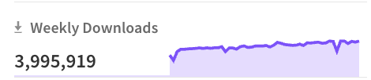
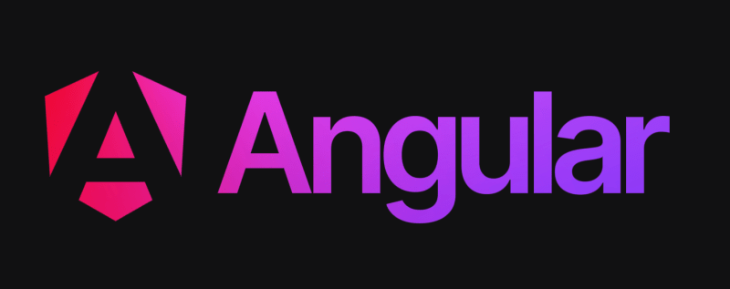
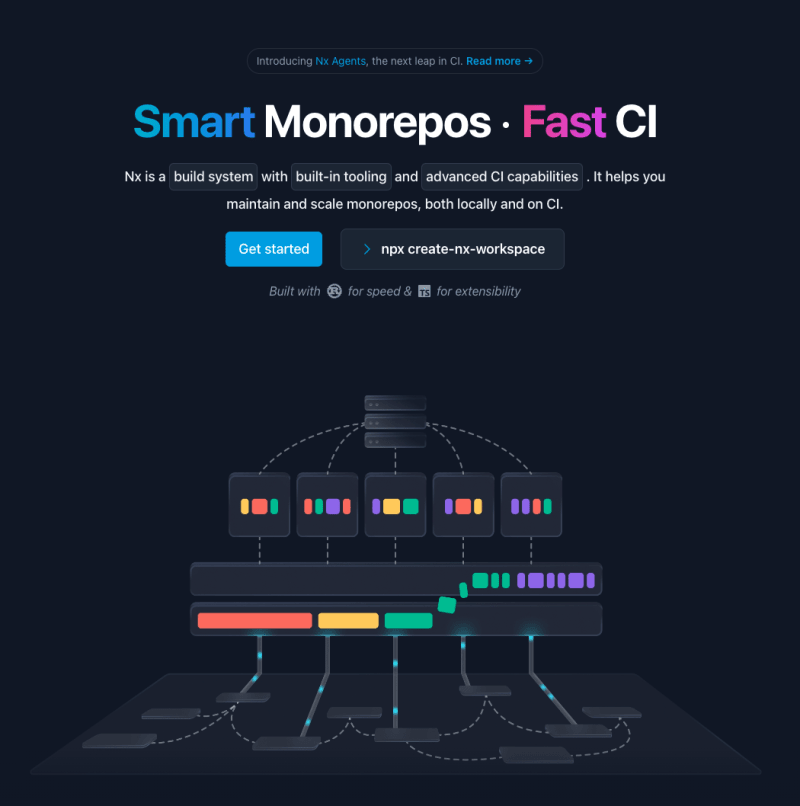
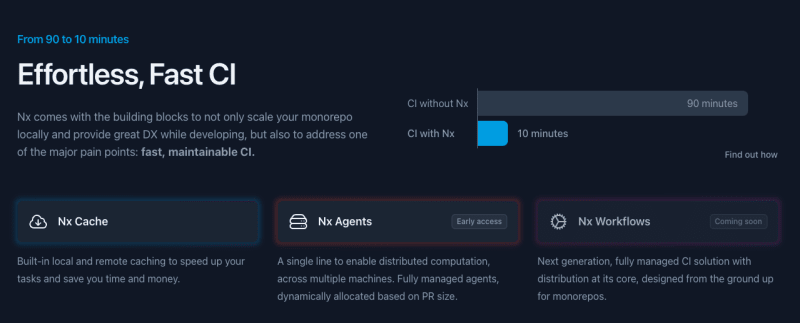
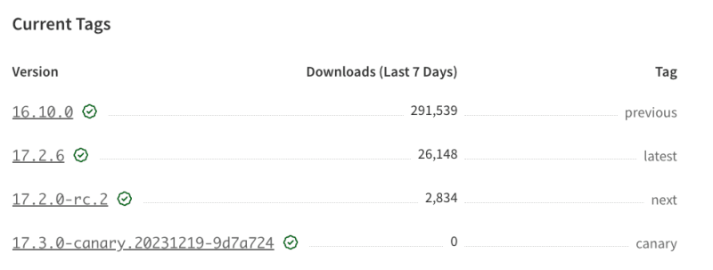

Прошло совсем немного времени с тех пор, как мы запустили Nx 17! В этой статье мы расскажем о некоторых нововведениях и улучшениях, которые появились в Nx 17.2:

## Nx приблизился к 4 миллионам еженедельных загрузок NPM!!!

2023 год был отличным годом для Nx! Мы работали со многими командами, создающими фантастические инструменты с открытым исходным кодом. И вы можете видеть результаты: мы сделали Vite первоклассным гражданином во многих наших плагинах Nx, добавили поддержку Rspack, оптимизировали работу с Node, добавив поддерживаемый командой Nx плагин Fastify, поддержку тестирования взаимодействия Storybook, приняли в семью Playwright и многое другое, продолжая стремиться к повышению производительности разработчиков до предела!

И наши загрузки на NPM подтверждают это. Скоро мы перешагнем отметку в 4 миллиона загрузок в неделю.



Если вам стало интересно, следите за нашим блогом или X/Twitter, так как на следующей неделе мы собираемся выпустить обзор 2023 года.

## Project Configuration v3 приземлился

Принятие проекта имеет решающее значение, а простота является движущей силой для принятия проекта. В прошлом году мы сильно оптимизировали то, как вы можете использовать Nx в существующем проекте. Просто добавьте пакет `nx` (или запустите `nx init`) и все. Nx понимает ваше рабочее пространство и эффективно выполняет ваши скрипты `package.json`.

Использование Nx на этом уровне, безусловно, полезно, поскольку вы получаете интеллектуальное распараллеливание, конвейеры задач и кэширование. Но это лишь вершина айсберга того, на что способен Nx. Плагины Nx дают гораздо больше, особенно в плане DX и производительности разработчика, снимая с него часть бремени по настройке инструментария monorepo. Но многим разработчикам, только что познакомившимся с Nx, оказалось сложнее начать работу с ними, а постепенный переход на плагины Nx оказался не таким простым, как нам хотелось бы.

В 2024 году ситуация кардинально изменится. И мы заложили первый краеугольный камень для этого. Nx 17.2 включает в себя то, что мы назвали “Nx project config v3”. Но он все еще находится под флагом функции, так как мы оптимизируем последние биты. Цель?

Практически полное отсутствие конфигурации (хорошие настройки по умолчанию, настройка по мере необходимости), позволяющее легко встраивать плагины Nx в существующие рабочие пространства (обеспечивает немедленное повышение производительности, но не мешает)

Это открывает целый ряд возможностей, которыми мы уже с нетерпением ждем. Вы услышите больше об этом в новом году ;)

## Rust для скорости, Typescript для расширяемости

В Nx мы с самого начала активно использовали Typescript, и мы были очень довольны этим решением.

Однако если вы обращали внимание на анонсы предыдущих релизов, то, вероятно, заметили, что мы переносим все больше и больше вычислительно-интенсивных и критичных к производительности частей ядра Nx с Typescript на Rust.

Эта тенденция продолжается и в Nx 17.2: Nx по умолчанию использует Rust для хеширования задач. Это изменение не требует никаких настроек, и Nx продолжит вести себя так же, только быстрее!

## Обновления федерации модулей

Федерация модулей была особенно актуальной темой в последнее время, и в 17.2 будут внесены некоторые значительные улучшения в и без того лучшую в своем классе поддержку Федерации модулей в Nx!

Прежде всего, мы значительно сократили количество процессора и памяти, используемых для создания локальной ”паутины” Федерации модулей. Эти улучшения должны стать отличной новостью для больших рабочих пространств, использующих подход Module Federation, где обслуживание всей федерации локально требовало больших затрат процессора и памяти.

Этих улучшений мы добились за счет пакетной сборки всех приложений, которые не отслеживаются на предмет изменений (перечисленных с помощью опции `--devRemotes`), на один сервер, а не на отдельный сервер для каждого приложения. Мы также распараллелили сборку этих статических приложений при запуске сервиса! Теперь вы можете использовать опцию `--parallel={number}`, чтобы указать, сколько сборок вы хотите выполнить в каждый момент времени.

В дополнение к улучшению производительности мы добавили концепцию динамической федерации в поддержку федерации модулей React. Динамическая федерация позволяет хост-приложению динамически загружать удаленные модули через файл манифеста.

Теперь вы можете сгенерировать рабочее пространство федерации модулей react, чтобы использовать динамическую федерацию с помощью флага `--dynamic`:

`nx generate @nx/react:host acme --remotes=nx --dynamic`.

Или вы можете использовать саму утилиту, импортировав ее из `@nx/react/mf`:

`import { loadRemoteModule } from '@nx/react/mf';`.

Наконец, у нас уже есть пример репо, иллюстрирующий, как создать плагин для Module Federation, используя Nx с Vite! Мы следим за этим и, возможно, предоставим готовое решение для этого в будущем релизе!

## Обновления релизов Nx

Nx 17 был запущен с новой функцией `nx release` в Nx CLI. С тех пор мы оптимизировали работу с ней, учитывали различные крайние случаи и сценарии выпуска. (Над обширной документацией сейчас работают ;)

Чтобы предоставить вам полную fВ 17.2 мы добавили программный API, который позволит вам легко писать пользовательские сценарии выпуска:

```javascript
import { releaseChangelog, releasePublish, releaseVersion } from 'nx/release';

(async () => {
	const { workspaceVersion, projectsVersionData } = await releaseVersion({
		specifier: 'minor',
	});
	await releaseChangelog({
		versionData: projectsVersionData,
		version: workspaceVersion,
	});
	await releasePublish();
	process.exit(0);
})();
```

Приведенный выше сценарий демонстрирует, как вы можете использовать этот API для создания собственного сценария для обновления версии рабочей области, создания журнала изменений и публикации пакета!

Мы также добавили первоклассную поддержку независимо выпускаемых проектов, то есть теперь вы можете нацелить конкретный проект на выпуск с помощью команды `--projects`. Например, вы можете создать новую версию только для одного проекта в вашем рабочем пространстве с помощью команды:

`nx release version patch --project=my-project`.

Поддержка Angular 17 (И NgRx 17)



Angular находится в середине огромного ренессанса: новый логотип, новый сайт документации и введение некоторых удивительных функций, таких как сигналы.

Nx здесь, чтобы поддержать этот переход! Nx всегда отлично подходил для Angular, а теперь поддерживает Angular 17, а также NgRx 17.

Чтобы автоматически перенести существующие рабочие пространства на Angular v17, выполните команды:

`> nx migrate latest > nx migrate --run-migrations`.

Вы также можете использовать флаг `--interactive`, если хотите перенести свое рабочее пространство на последнюю версию Nx, оставаясь при этом на текущей версии Angular:

`> nx migrate latest --interactive ✔ Вы хотите обновиться до TypeScript v5.2? (Y/n) - true ✔ Вы хотите обновить версию Angular до v17? (Y/n) - false > NX Команда migrate выполнена успешно.  - package.json был обновлен. - Сгенерирован файл migrations.json.  > NX Следующие шаги:  - Выполните команду 'nx migrate --run-migrations'`.

## Smart Monorepos - Быстрый CI

Мы только что сделали небольшую подтяжку главной страницы Nx, включая новый слоган, подслоган и иллюстрацию, чтобы лучше отразить миссию Nx.



Когда вы входите в пространство монорепо, наличие хорошего опыта локальной разработки и инструментария для поддержки - это одно, а масштабирование - совсем другое. А масштабирование сопряжено с множеством проблем, начиная от масштабирования команд, работающих над монорепо, и заканчивая поддержанием высокой пропускной способности CI.

Последнее - частая головная боль, и мы видели, как компании с ней борются. С Nx мы движемся в направлении того, чтобы стать вашим e2e-решением для монорепов, где мы не только покрываем локальный опыт разработчиков, но и предоставляем надежные и масштабируемые решения на CI.



Мы очень рады, что запустили “Nx Agents” в ранний доступ. Если вы еще не видели видео Виктора о том, как он сократил время e2e-тестирования с 90 минут до 10, то обязательно посмотрите его.

“Nx Agents” - это следующая итерация DTE, обеспечивающая более гибкий, экономически эффективный и более производительный подход к распространению на CI. Сюда входят такие возможности, как динамическое выделение машин в зависимости от размера PR, обнаружение и повторное выполнение нестабильных задач. Кроме того, его можно настроить с помощью одной строки:

`- name: Start CI run run: 'npx nx-cloud start-ci-run --distributes-on="8 linux-medium-js"' ...`.

Вы можете запустить Nx Agents на любом CI-провайдере. Если вам интересно, подпишитесь на ранний доступ!

## Новые релизы Canary

Мы добавили новый тег релизов npm: canary!



Этот canary-релиз создается с помощью задания cron, которое будет регулярно публиковать текущее содержимое мастер-ветки Nx.

Вы можете попробовать канареечную версию для нового рабочего пространства с помощью команды:

`> npx create-nx-workspace@canary`.

Это может быть полезно для предварительного просмотра новых, еще не выпущенных функций!

## Ливстрим предстоящего релиза

В январе мы собираемся провести прямую трансляцию с командой Nx, чтобы рассказать об этих обновлениях! Не забудьте нажать на ссылку, чтобы получить уведомление, когда мы выйдем в прямой эфир! И не стесняйтесь приходить со своими вопросами в чат!

## Автоматическое обновление Nx

Обновить Nx и его плагины очень просто, так как мы поставляем автоматическую команду миграции.

`npx nx migrate latest`

После обновления зависимостей запустите все необходимые миграции.

`npx nx migrate --run-migrations`

## Подведение итогов

На этом все, друзья! Мы только начинаем новую итерацию разработки Nx, так что не забудьте подписаться на наш YouTube-канал, чтобы получать обновления, когда появятся новые функции! До следующего раза, продолжайте упорно работать!
