Автор: Питер Экене Eze✏️

Strapi - это безголовая система управления контентом с открытым исходным кодом, которая позволяет разработчикам и компаниям эффективно управлять контентом. Она была построена как фреймворк-агностик, что позволяет использовать ваши любимые инструменты разработки. Контент-менеджеры и редакторы также могут использовать Strapi для организации и распространения контента на различных устройствах и платформах. В этом посте мы подробно расскажем о Strapi, чтобы обосновать, когда и почему вы должны использовать Strapi для своего бизнеса. Мы также обсудим некоторые практические функции Strapi, которые вы можете использовать для решения своих задач в области CMS.

Прежде всего, давайте начнем с предыстории Strapi, чтобы понять, как появился этот продукт, какую проблему он должен был решить и как он развивался.

## Эволюция Strapi

Компания Strapi появилась в мае 2016 года. Его основатели, Пьер Бурги, Орельен Жорже и Джим Лори, ранее были разработчиками-фрилансерами, создававшими сайты для клиентов на традиционных CMS.

Однако по мере роста сложности проектов они обнаружили, что традиционные CMS не подходят для таких случаев, как мобильные приложения или проекты, построенные на современных фронтенд-фреймворках. Им нужно было что-то на основе API.

Потребность в настраиваемой CMS на базе API, построенной на JavaScript - языке программирования, который до сих пор используется в большинстве браузеров, - привела к появлению того, что мы теперь знаем как Strapi.

Трио создало раннюю версию программного обеспечения для создания проектов своих клиентов. Однако быстро стало ясно, что созданное ими программное обеспечение может помочь многим другим разработчикам решить аналогичные проблемы. Будучи давними пользователями открытого программного обеспечения, они решили открыть исходный код инструмента для всех желающих.

Сегодня то, что начиналось как небольшой, настраиваемый, основанный на API инструмент CMS, превратилось в ключевой компонент архитектуры композитного фронтенда.

Strapi предлагает разработчикам гораздо более мощные API и гранулированный контроль над контентом. Он стал одной из ведущих безголовых CMS с открытым исходным кодом, привлек $31 млн в серии B финансирования и в настоящее время используется такими компаниями, как Walmart, NASA, IBM, eBay и многими другими.

## Как работает Strapi

По своей сути Strapi работает как бэкэнд, который содержит и управляет контентом, храня его данные в базе данных. Разработчики могут выбрать одну из различных баз данных, таких как PostgreSQL, MySQL и другие, в соответствии с требованиями своего проекта.

Подход Strapi, ориентированный на API, позволяет вам получать доступ к контенту и управлять им программно. Тем не менее, он также предоставляет богатый текстовый редактор для контент-менеджеров и редакторов, чтобы вручную редактировать и обновлять контент. Он поддерживает GraphQL и Rest API со встроенным управлением пользователями.

Чтобы начать работу с Strapi, на вашем компьютере должна быть установлена активная или поддерживаемая LTS-версия Node. После выполнения этих условий вы можете выполнить приведенную ниже команду в терминале, чтобы быстро настроить приложение Strapi:

`npx create-strapi-app@latest strapicms --quickstart`.

Команда установит для вас Strapi с базой данных SQLite: 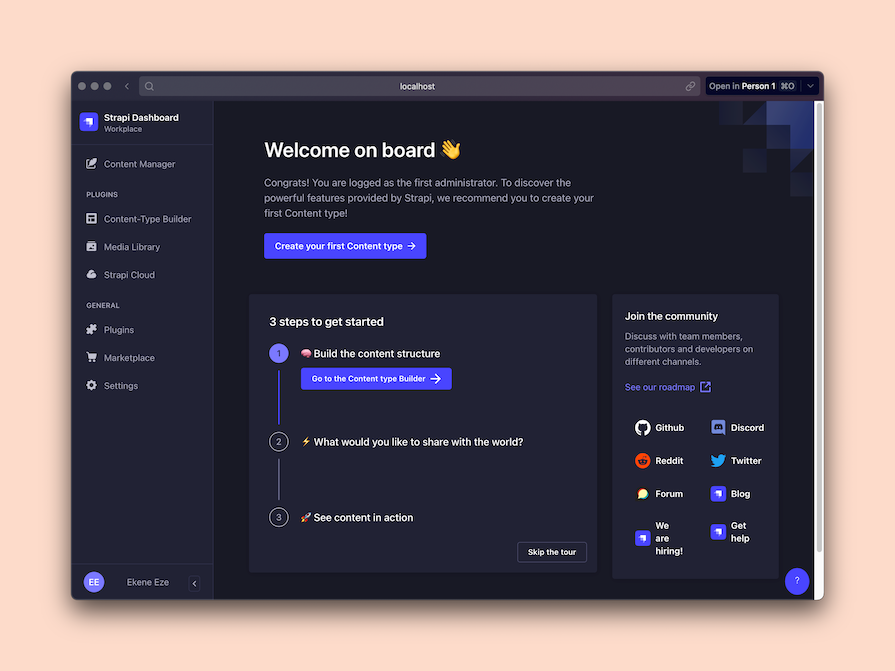 Функция тура на панели администратора поможет вам быстро сориентироваться в панели, чтобы создать свою первую схему контента и начать добавлять записи в контент.

Настроив схему контента, вы можете создать столько записей, сколько захотите, чтобы быстро протестировать API. В моем случае я создал коллекцию `Restaurant` и добавил в ее данные две записи о ресторане: 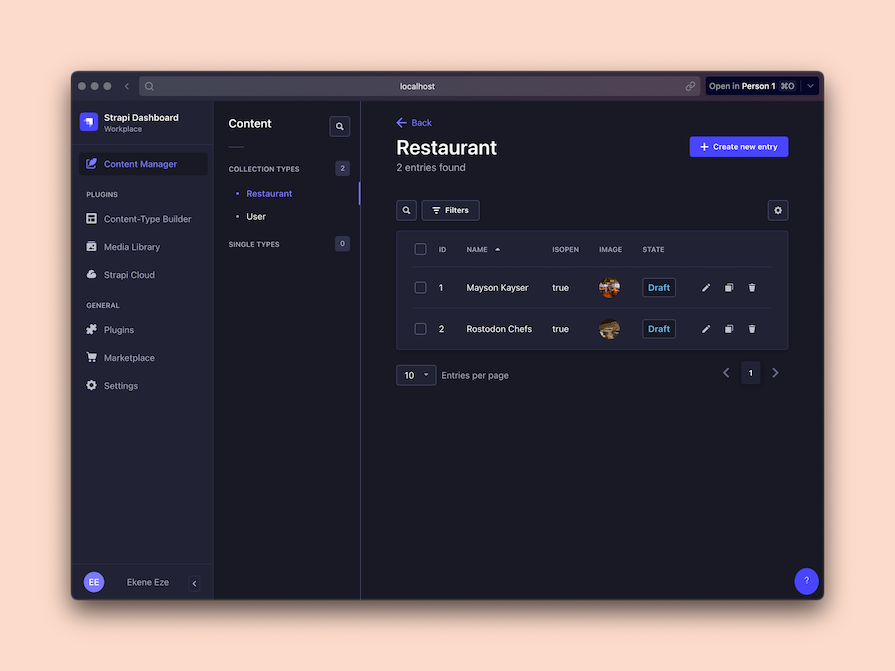 Добавив некоторые данные, вы, вероятно, захотите получить эти данные через API в свой проект. Перед этим вы, возможно, захотите настроить роли и разрешения для обеспечения безопасности, чтобы ваш проект не был доступен для неавторизованных пользователей.

## Настройка ролей и разрешений в Strapi

Чтобы настроить права доступа к содержимому Strapi, нажмите на Настройки в левом нижнем углу приборной панели. Затем прокрутите вниз до плагина ”Пользователи и разрешения” и нажмите на ”Роли”. Выберите роль Public, а затем нажмите на схему Restaurant, чтобы настроить разрешения.

Пока что просто отметьте все галочки, чтобы вы могли экспериментировать без ограничений в процессе разработки. Мы поговорим о ролях и разрешениях более подробно, когда будем обсуждать возможности Strapi: 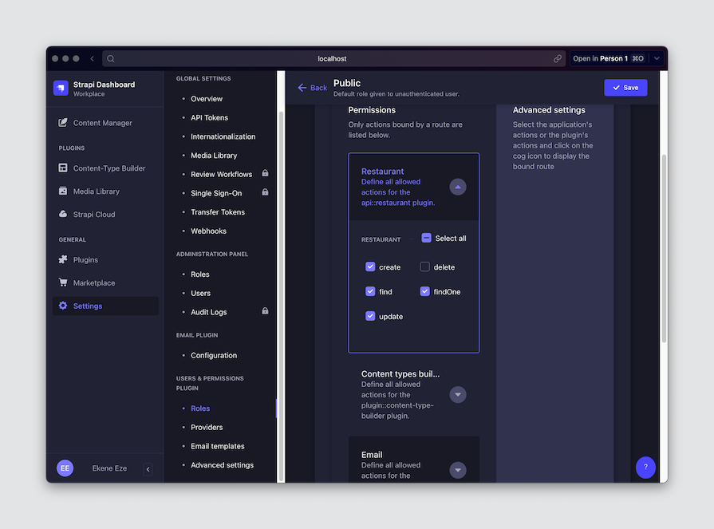

## Публикация контента

На данный момент мы создали схему или тип коллекции `Restaurant`, добавили две записи о ресторанах и настроили права доступа для схемы. Добавленные записи сохраняются как черновики и не будут общедоступны до публикации.

Перейдите на вкладку ”Менеджер контента” на панели управления Strapi, щелкните по записям и опубликуйте их по отдельности, как показано ниже: 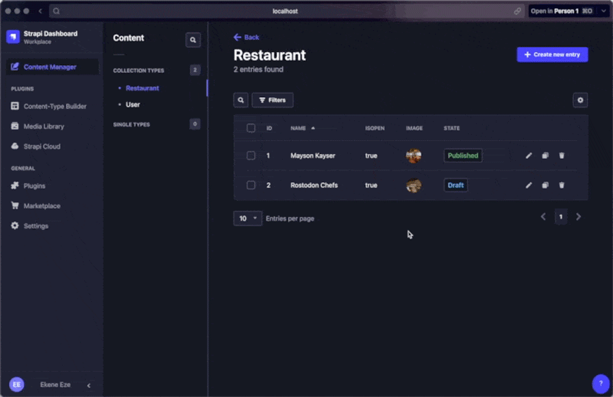

## Использование API

Теперь, когда весь контент опубликован, вы можете получить доступ к своим данным через API. Используя Postman или любой другой клиент API, сделайте запрос к `http://localhost:1337/api/restaurants`, и он должен вернуть ваши данные: 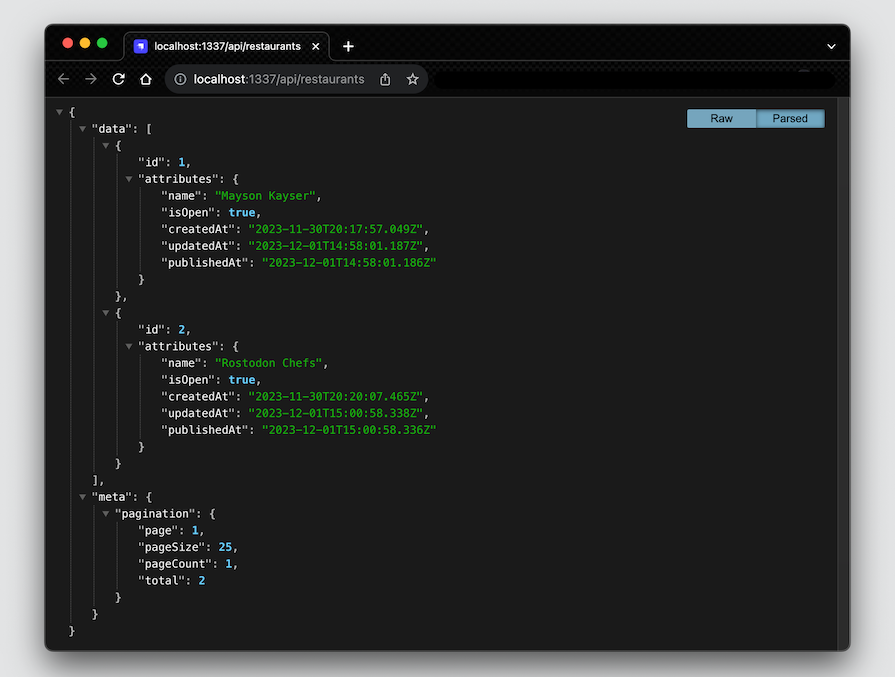 Отсюда вы можете начать извлекать данные в любой фронтенд или даже бэкенд проект, над которым вы работаете, используя Strapi как ваш контент-менеджер.

Теперь, когда мы поняли, как работает Strapi, а также как быстро настроить контент и запросить его через API, давайте погрузимся глубже и рассмотрим некоторые причины, по которым вам стоит использовать Strapi для своих проектов.

## Почему стоит выбрать Strapi?

Я использую Strapi с 2019 года. У меня есть серия постов в блоге Strapi, а также несколько постов в блоге LogRocket. Я создавал проекты с использованием Strapi в производстве, а другие - просто для демонстрации. В ходе всех этих экспериментов я многое узнал о Strapi. В результате у меня есть много личного опыта, подтверждающего, почему я считаю, что вам стоит использовать Strapi.

## Производительность

Производительность - это, пожалуй, самый важный фактор для любого инструмента или технологии для разработчиков, поскольку она напрямую влияет на UX, SEO, конверсию и множество других факторов. За годы использования Strapi в производстве я ни разу не столкнулся с проблемами производительности.

Конечно, это может быть результатом относительно небольшого размера и масштаба моего продукта. Однако на форуме сообщества Strapi инженер по разработке решений утверждал, что при его конфигурации и аппаратной настройке Strapi может обрабатывать от четырех до восьми миллионов запросов в неделю.

Это довольно невероятно, и конфигурация может быть настроена для достижения еще более высоких результатов. Например, если настроить эффективный механизм кэширования базы данных, то несколько уникальных запросов будут обслуживаться из кэша, а не попадать на серверы, что приведет к значительному повышению производительности.

В Strapi также используется множество отличных мер и практик для повышения производительности. Например, вы можете выбрать любую базу данных, сделать запрос с помощью REST или GraphQL и многое другое. Вы также можете использовать другие методы оптимизации производительности фронтенда, бэкенда и сервера в своих проектах Strapi для достижения лучших результатов.

## Простота использования

Одним из главных достоинств Strapi является простота использования. Именно этот фактор убедил меня стать ранним последователем - в то время я попробовал несколько безголовых CMS, и Strapi выделялся среди них тем, что был прост в настройке и использовании.

Как разработчик, я могу создать проект Strapi через терминал, настроить схемы контента и записи через интуитивно понятный редактор контента и перенести этот контент в свое фронтенд-приложение - и все это за несколько минут.

Более сложные функции, которые обычно кажутся сложыми, также оказались очень простыми. Например, настройка веб-крючков, управление разрешениями и доступом пользователей, переключение на разные базы данных и многое другое - все это было довольно просто.

## Управление доступом на основе ролей

Контроль доступа на основе ролей - это одна из тех функций, о которых вы не знаете, насколько они вам нужны. Для инди-разработчиков эта функция может быть не так важна, поскольку в этом случае вы являетесь единственным владельцем своего проекта.

Однако представьте, что вы работаете в составе большой команды, управляя редактированием контента, рецензированием черновиков, публикацией и обновлениями. Очень важно иметь возможность давать нужным людям нужные разрешения, чтобы поддерживать целостность данных и обеспечивать безопасность процесса управления контентом.

Strapi позволяет компаниям и командам управлять правами пользователей и предоставлять необходимый доступ к различным частям CMS. В качестве администратора вы можете определить роли и разрешения и назначить их соответствующим членам вашей команды, чтобы у каждого было все необходимое для эффективной работы.

## Большая экосистема

Будучи инструментом с открытым исходным кодом, Strapi уделил внимание своей экосистеме и позаботился о том, чтобы в ней было достаточно места для расширения, чтобы разработчики не ограничивались только собственными возможностями Strapi. Благодаря огромной экосистеме плагинов и расширений Strapi позволяет разработчикам легко добавлять пользовательские функции в свои проекты.

На рынке Strapi представлено 165 различных плагинов и более 20 различных поставщиков. Для меня эти плагины - одна из самых интересных особенностей Strapi. Они позволяют влиять на базовый продукт.

Вот лишь один пример: coЕсли вы хотите защитить определенные записи от ошибочного удаления, Strapi не предлагает такой возможности по умолчанию, но вы можете легко установить плагин Do Not Delete в свой проект, чтобы включить эту пользовательскую функциональность.

## Гибкость

Strapi создан для того, чтобы быть гибким. Он позволяет разработчикам интегрироваться с различными базами данных в соответствии с потребностями их проекта. Независимо от того, предпочитаете ли вы PostgreSQL, MySQL или другие, Strapi удовлетворит все ваши предпочтения в отношении баз данных.

Как я уже говорил, Strapi также поддерживает API REST и GraphQL для дальнейшего расширения возможностей интеграции. Это дает разработчикам свободу выбора оптимального подхода для конкретных случаев использования, включая мобильные приложения или другие источники данных.

Как фреймворк-независимая CMS, вы можете использовать Strapi с любым фронтендом или бэкенд-фреймворком по вашему выбору. Нет никаких ограничений в том, как вы можете взаимодействовать с контентом Strapi.

Я мог бы продолжить. Есть множество других причин использовать Strapi - богатый контент, отличная документация и структура контента, легкая кривая обучения, тот факт, что вы можете моделировать свой контент так, как вам хочется, и так далее. Однако те, что я назвал, являются для меня наиболее вескими причинами.

Хотя многие другие CMS также очень хороши, а некоторые могут быть даже лучше, когда речь идет об определенных функциях, Strapi может сравниться с любой другой CMS по тем пунктам, которые я перечислил здесь.

## Потенциальные недостатки Strapi

Теперь, когда мы обсудили, что делает Strapi замечательным, это хорошая возможность поговорить о некоторых его минусах. Он не вечнозеленый, чего и следовало ожидать от любого инструмента разработчика, обслуживающего тонны пользователей.

Недостаточное руководство по миграции и ограниченная поддержка

Очень часто, когда бизнес рассматривает новый инструмент, одним из главных соображений является то, насколько легко будет мигрировать с существующего инструмента на новый. К сожалению, при переходе с существующего CMS-инструмента на Strapi существует довольно ограниченное количество ресурсов, которые могут помочь вам разобраться с этим.

Например, представьте, что вы хотите перенести свою CMS с WordPress или Sanity на Strapi. Вы не найдете много официальных ресурсов Strapi о том, как это сделать. Вам придется провести собственное исследование, чтобы разобраться в ситуации и выполнить перенос вручную, преодолевая все трудности, с которыми вы можете столкнуться.

## Ограниченная поддержка TypeScript

Strapi начал поддерживать TypeScript с версии 3.0. Это означает, что если вы используете любую версию до 3.0, то поддержка TypeScript будет отсутствовать.

С другой стороны, зачем вам работать со старой версией нового инструмента, который вы хотите внедрить? Если только вы уже не начали проект с более старой версией Strapi и не хотите избежать проблем с совместимостью с существующим кодом, плагинами или интеграциями, обычно лучше использовать самую последнюю версию.

В частности, если для вас важна поддержка TypeScript, я рекомендую использовать более новые версии Strapi. При этом, хотя новые версии Strapi поддерживают TypeScript, некоторые функции могут быть еще не полностью интегрированы или документированы. Это может создать проблемы для разработчиков, которые в своих проектах в значительной степени полагаются на TypeScript.

## Кривая обучения для безголовой архитектуры

Компании, которые только начинают знакомиться с концепцией безголовой CMS, могут столкнуться с необходимостью освоения и внедрения развязанной архитектуры. Это может потребовать дополнительного обучения и ресурсов как для редакторов контента, так и для разработчиков.

Однако обучение работе со Strapi не должно представлять никаких трудностей для команд, которые уже знакомы с современными фронтенд-инструментами и технологиями. Итак, давайте рассмотрим некоторые из моих любимых функций Strapi, которые, я надеюсь, вы используете в своих проектах.

## Ключевые функции Strapi, которые необходимо знать

Strapi предлагает множество функций, которые делают этот инструмент ключевым игроком в современном пространстве devtool. Некоторые из них мы уже вкратце рассмотрели в этом посте, но ниже мы подробнее остановимся на их возможностях.

### Webhooks

Webhooks - ключевой компонент любого современного рабочего процесса. Они предлагают мощный способ подключения Strapi к внешним приложениям и сервисам.

Использование веб-хуков позволяет Strapi отправлять уведомления в другие системы при наступлении определенных событий, например при создании, обновлении или удалении нового элемента контента. Это позволяет синхронизировать данные в режиме реального времени и создавать рабочие процессы, управляемые событиями, между Strapi и другими приложениями.

Представьте, что у вас есть Strapi CMS, управляющая сайтом, на котором размещены списки ресторанов, и вы хотите перестраивать свое фронтенд-приложение каждый раз, когда на Strapi публикуется новый ресторан. Все, что вам нужно сделать, - это сгенерировать URL-адрес веб-хука у хостинг-провайдера сайта, а затем настроить веб-хук в Strapi.

Чтобы настроить веб-хук в Strapi, просто перейдите в раздел ”Настройки” > ”Глобальные настройки” > ”Веб-хуки". Здесь вы можете дать своему веб-хуку имя, вставить URL-адрес веб-хука от хостинг-провайдера и выбрать события, которые должны вызывать этот веб-хук: 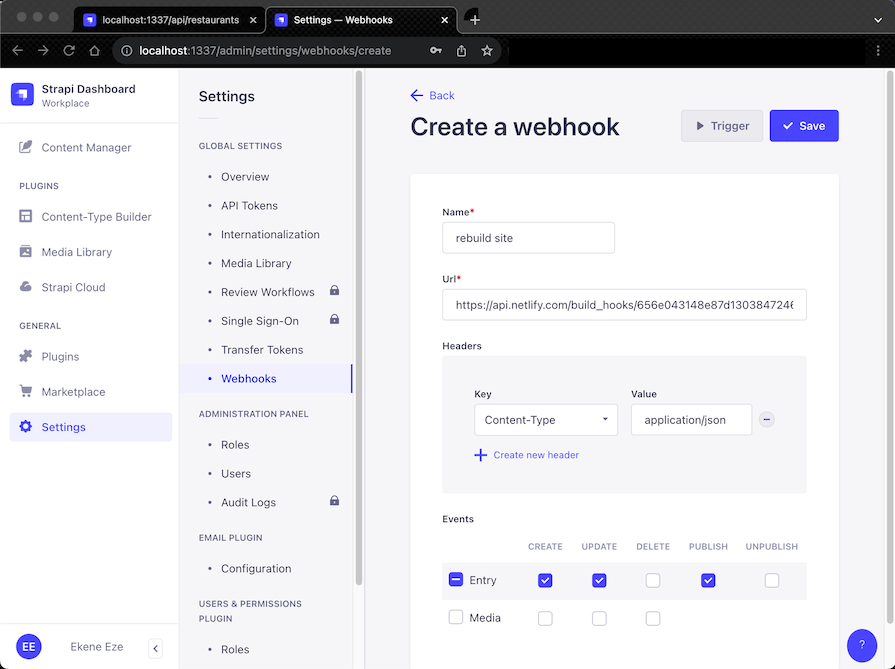

В данном случае я выбираю действия обновления и публикации. Когда будет опубликован новый ресторан или обновлена информация о существующем ресторане, сработает этот веб-крючок, чтобы заставить сайт перестроиться. Эта очень удобная функция позволяет синхронизировать все ваши системы и обеспечивает бесперебойную работу вашей разрозненной архитектуры.

### Автоматически генерируемая документация

После определения моделей контента и записей в Strapi вы можете легко создать документ OpenAPI для визуализации вашего API с помощью Swagger UI, используя плагин Strapi Documentation. Этот плагин можно установить в проекты Strapi, работающие на версии 4 и выше.

Плагин Strapi Documentation требует ручной настройки и позволяет в любой момент отменить автоматически сгенерированные документы. Чтобы начать работу с ним, выполните следующую команду в корне вашего проекта Strapi и следуйте документации по плагину, чтобы добавить его в ваш проект:

`npm install @strapi/plugin-documentation`.

### Аутентификация/авторизация на основе токенов

В Strapi существует две основные стратегии аутентификации, основанные, соответственно, на плагине Users & Permissions или встроенных API-токенах.

Стратегия User & Permissions, используемая по умолчанию, будет достаточной в большинстве случаев. Однако если вам нужно предоставить другим приложениям или людям доступ к конечным точкам Strapi, не обязательно создавая для них учетные записи пользователей, то вам нужно установить API-токены.

Любое приложение с действительным токеном может выполнять REST- и GraphQL-запросы к вашим конечным точкам Strapi в качестве аутентифицированного пользователя. Чтобы сгенерировать новый API-токен, просто зайдите в админ-панель Strapi и перейдите в раздел Настройки > Глобальные настройки > API-токены, как показано ниже: 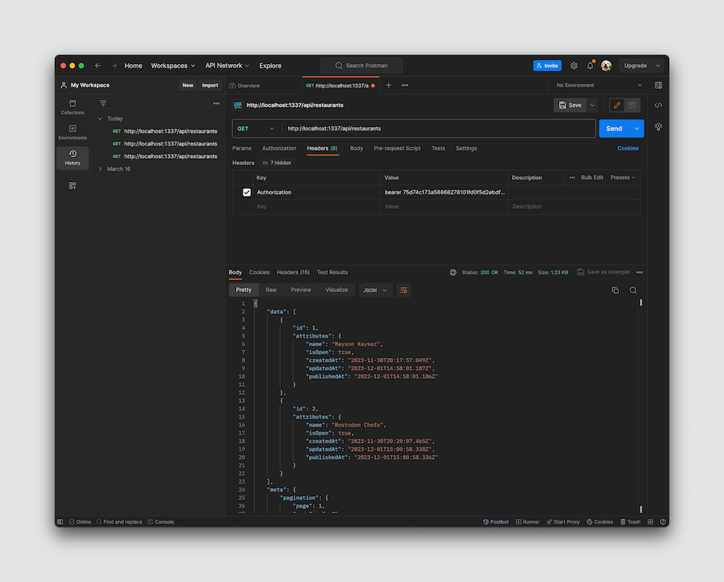

### Выборка данных, не зависящая от клиента

Благодаря аутентификации на основе токенов Strapi поддерживает все виды API-клиентов и фреймворков. Вы можете получать данные Strapi из бэкенда или фронтенда, а также из любого другого клиента, который вы можете поддерживать. В результате вы можете построить свой проект на React, Vue, Angular или PHP, и Strapi будет обслуживать ваши данные одинаково.

### Управление доступом на основе ролей

Система управления доступом на основе ролей (RBAC) в Strapi позволяет контролировать, какие пользователи могут получать доступ и изменять определенный контент и конечные точки API. Это гарантирует, что только авторизованные пользователи смогут выполнять важные операции, повышая безопасность данных и улучшая управление.

Например, вы можете создать новую роль `Редактор`, которая будет иметь права только на создание и обновление контента. Эту роль можно назначить пользователям, которые являются редакторами контента, чтобы ограничить их доступ: 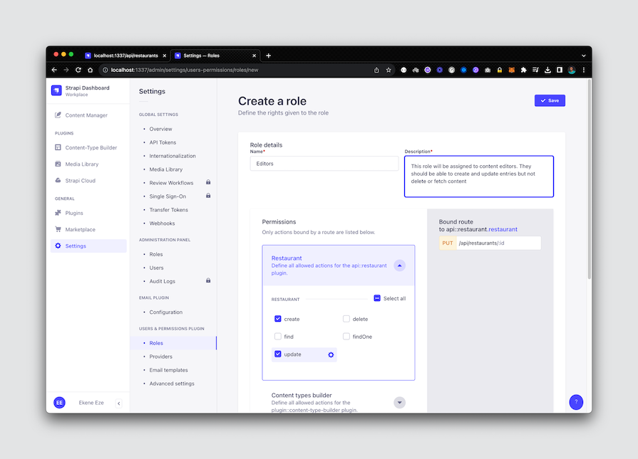

### Медиатека

В Strapi есть медиатека, которая представляет собой централизованное хранилище для управления медиаактивами вашего контента, такими как изображения, видео и документы. Она позволяет загружать, организовывать и управлять этими активами непосредственно из панели администратора Strapi.

Вы можете загружать медиаактивы в медиатеку Strapi, выбирая их с локального компьютера. Strapi будет хранить эти активы в безопасном месте и генерировать URL-адреса для доступа к ним в вашем контенте: 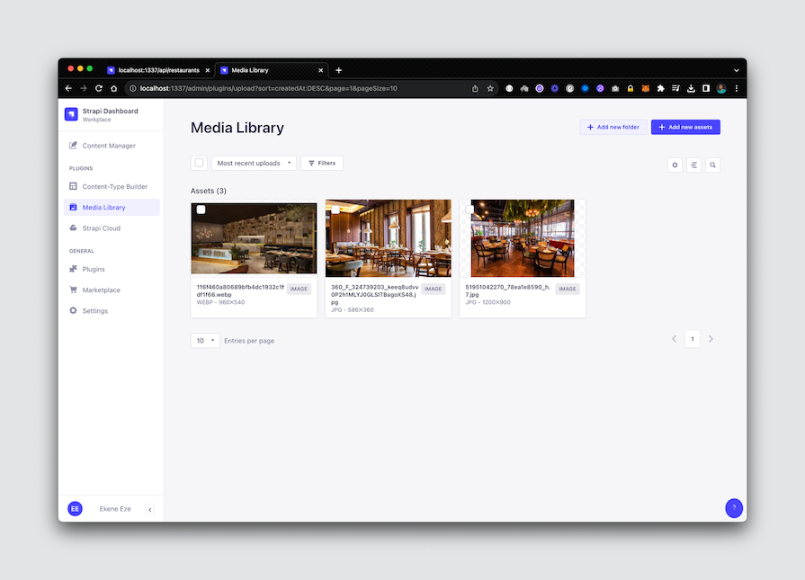

### Локализация контента (i18n)

В Strapi есть плагин интернационализации, который позволяет разработчикам создавать и управлять локализованным контентом на разных языках. Установив плагин в своем проекте, вы сможете:

Создавать локализованные версии контента Получать конкретные версии контента в зависимости от локали пользователя

Чтобы установить этот плагин, просто перейдите на торговую площадку Strapi и установите его. Вы также можете выполнить следующую команду в корне вашего проекта Strapi через терминал:

`npm run strapi install i18n`.

Чтобы добавить новую локаль в ваш проект, вы можете воспользоваться панелью администратора Strapi. Перейдите в раздел Настройки > Глобальные настройки > Интернационализация и нажмите кнопку +Добавить новую локаль, чтобы вызвать всплывающее окно, в котором вы можете добавить и настроить параметры локали: 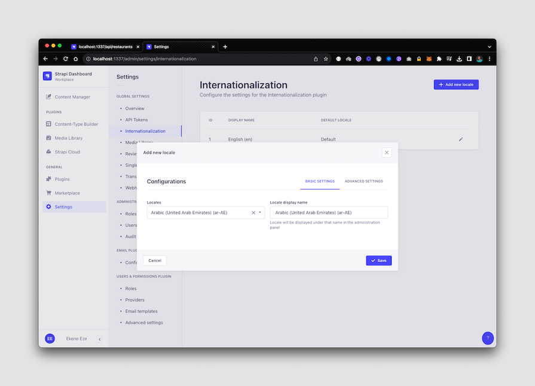 После настройки плагина i18n вы можете создавать новые локализованные записи или обновлять существующие записи для создания их локализованных версий. Вы также можете создавать локализации для разных уровней контента. Например, вы можете создать их для типа коллекции, для отдельного типа или для записей.

ТиЭто не исчерпывающий список функций и сервисов Strapi, а лишь основные из них, которые я хотел осветить в этом посте. Пожалуйста, не стесняйтесь проводить дополнительные исследования, если вас интересуют какие-либо функции, о которых я не рассказал в этом посте. Мы затронем некоторые из них по мере того, как будем рассматривать примеры использования.

## Варианты использования Strapi

Благодаря широкому набору функций Strapi предлагает множество возможностей, которые можно использовать в самых разных случаях. Давайте рассмотрим некоторые популярные из них - скорее всего, есть и другие варианты использования, о которых я еще не подумал, но следующие примеры должны навести на мысль.

### Личные веб-сайты и блоги

Редактор Strapi Rich Text и интуитивно понятный пользовательский интерфейс позволяют пользователям легко создавать и управлять контентом для персональных сайтов и блогов. Вы можете настроить типы контента и схемы по своему усмотрению, чтобы пользователи могли демонстрировать свои работы, достижения или записи в блогах в индивидуальном порядке.

Кроме того, интерфейс администратора позволяет нетехническим пользователям легко создавать и редактировать контент, не прибегая к помощи разработчиков.

### Сайты электронной коммерции

Strapi не зависит от фреймворка, что является ключевым фактором для приложений электронной коммерции, поскольку они часто требуют индивидуального дизайна фронтенда. Плагин Strapi Content Builder предоставляет централизованный центр для управления схемами контента, такими как информация о товарах, категориях, деталях корзины, платежных деталях и так далее.

Контроль доступа на основе ролей, о котором мы говорили ранее, также играет огромную роль в обеспечении того, чтобы только авторизованные пользователи могли изменять критически важные данные электронной коммерции, такие как элементы корзины или платежные реквизиты.

### Маркетинговые сайты и целевые страницы

С помощью Strapi маркетологи могут быстро обновлять и запускать маркетинговый контент, не прибегая к помощи разработчиков. Они также могут планировать выпуск контента, что является удобной функцией, позволяющей проводить маркетинговые кампании по расписанию.

В то же время разработчики могут использовать подход Strapi, основанный на API, и веб-крючки для интеграции с другими маркетинговыми технологиями и сторонними инструментами, такими как Zapier.

### Документация

Документация - вот где Strapi сияет. Strapi позволяет легко управлять структурированным контентом и дает возможность разработчикам и редакторам контента создавать полную и хорошо организованную документацию.

Кроме того, настраиваемые типы контента Strapi позволяют разработчикам создавать структуры документации, достаточно гибкие для любого проекта, независимо от его требований к содержанию.

И, конечно же, Strapi поддерживает версионирование контента, что позволяет разработчикам и редакторам изменять контент с течением времени без потери исторических данных.

### Платформы для онлайн-курсов

Все те функции, которые делают Strapi отличным инструментом для работы с документацией, применимы и к этому варианту использования. Кроме того, гибкость контент-типов Strapi позволяет разработчикам учитывать любую структуру контента. Это позволяет создавать многократно используемые схемы контента для таких вещей, как журналы, видеокурсы, подкасты и т. д.

### Мобильные приложения

Безголовая архитектура CMS Strapi делает ее отличным выбором для предоставления контента мобильным приложениям через API. Strapi позволяет подключаться как через RESTful, так и через GraphQL API. Это позволяет разработчикам легко и эффективно получать контент для любого мобильного приложения.

Важную роль здесь играет и ролевой контроль доступа, обеспечивающий безопасный доступ к контенту для сохранения целостности данных и безопасного подключения к другим сторонним инструментам.

## Развертывание проекта Strapi

Strapi не навязывает вам конкретных провайдеров развертывания, а позволяет развернуть проект у любого облачного провайдера по вашему выбору. Вы можете развернуть проект в AWS, Heroku, Azure, GCP и других.

Существует два способа развертывания приложений Strapi - с помощью Strapi Cloud или через любого другого хостинг-провайдера по вашему выбору. В документации Strapi вы можете найти специальные инструкции по развертыванию для всех популярных провайдеров. Для целей этого поста давайте развернем наш ресторанный проект на Strapi Cloud.

Для следующей демонстрации необходимо выполнить несколько предварительных условий:

Установлен Node ≥v16 Ваш проект работает как минимум на Strapi ≥v4 Запустите свой локальный проект Strapi на GitHub.

Далее перейдите на сайт Strapi Cloud и создайте учетную запись, используя провайдера GitHub или любого другого провайдера по вашему выбору. После регистрации вы получите доступ к панели Dashboard, где сможете создать новый проект Strapi: 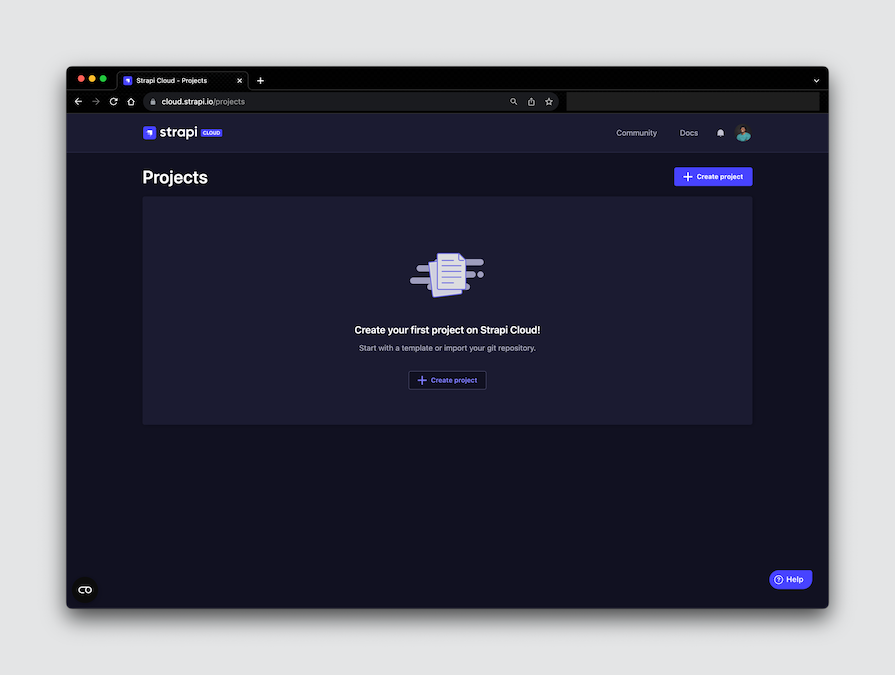 По умолчанию вы подписываетесь на 14-дневную бесплатную пробную версию, которая дает вам доступ ко всем функциям Strapi Cloud. При этом вам не нужно предоставлять платежную информацию - вместо этого вы получаете электронное письмо по окончании пробной версии.

Далее просто подключите свой репозиторий GitHub и выберите проект Strapi, который вы хотите развернуть: 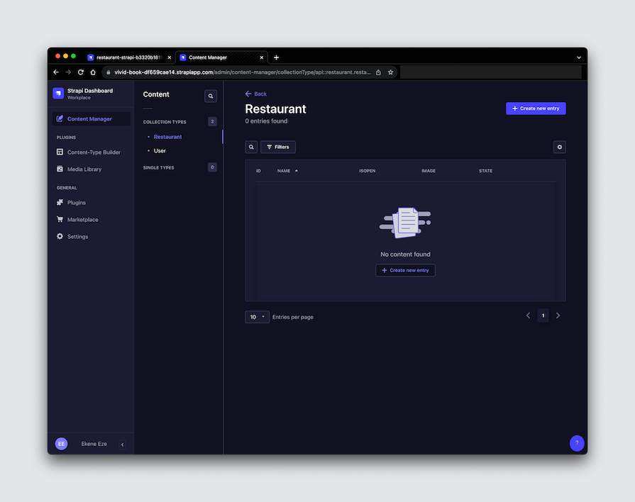 Обратите внимание на то, что у нас нет никаких данных. Помните, в локальном экземпляре мы добавили два ресторана в наш проект Strapi. Однако, когда проект развернут, он не содержит никаких данных.

Чтобы исправить это, нужно либо создать новые записи в продакшене, либо использовать токены Strapi Transfer Tokens для переноса данных из локального экземпляра в продакшен. Давайте сделаем это!

### Создайте токен переноса

В производственном экземпляре перейдите в раздел Настройки > Глобальные настройки > Токены переноса. Там создайте новый Transfer Token и укажите необходимые данные о нем: 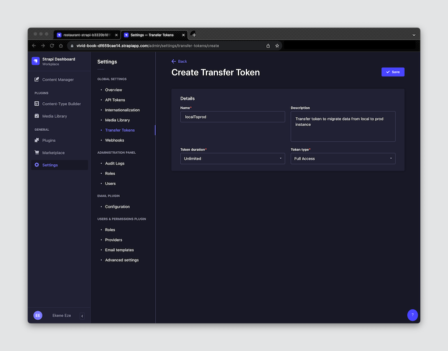 Теперь, когда у нас есть Transfer Token, мы можем использовать Strapi CLI для переноса наших данных из локального экземпляра в производственный, выполнив следующую команду на терминале:

`yarn strapi transfer --to [YOUR_DEPLOYED_APP_URL]`.

Эта команда потребует от вас ввести токен передачи, который мы только что создали выше. Затем она проведет вас через несколько подсказок, чтобы получить разрешение на продолжение передачи данных. Наконец, она передает данные в производственный экземпляр: 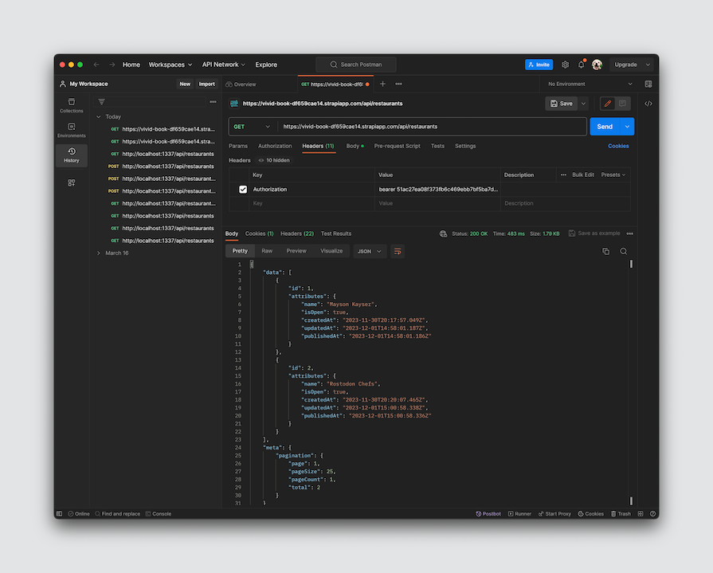 Обязательно сгенерируйте новый API-токен из развернутого экземпляра и используйте его в заголовке Authorization вашего запроса.

## Сравнение Strapi и других вариантов безголовых CMS

Strapi - сильный соперник по сравнению с другими поставщиками безголовых CMS. В рамках этого поста мы рассмотрим, как он выглядит в сравнении с WordPress, Prismic, Sanity и Contentful. Мы будем сравнивать их по определенному набору функций.

Вот краткий ключ к сравнительной таблице ниже:

| Инструмент        | Страпи | Санити | Содержательный | WordPress | Prismic | OSS |
| ----------------- | ------ | ------ | -------------- | --------- | ------- | --- |
| Функция           | ✅     | ❌     | ❌             | ✅        | ✅      |     |
| API               | ✅     | ✅     | ✅             | ✅        | ✅      |     |
| Webhooks          | ✅     | ✅     | ✅             | ✅        | ✅      |     |
| Торговая площадка | ✅     | ✅     | ✅             | ✅        | ❌      |     |
| Стартеры          | ✅     | ✅     | ✅             | ✅        | ✅      |     |
| RBAC              | ✅     | 💰     | ✅             | ❌        | ❌      |     |
| i18n              | ✅     | ✅     | ✅             | ✅        | ✅      |     |
| Версионирование   | 🔌     | ✅     | ✅             | ✅        | ✅      |     |
| Планирование      | 🔌     | ✅     | ✅             | ✅        | ✅      |     |
| Поиск             | ✅     | ✅     | ✅             | ✅        | ✅      |     |

Приведенная выше таблица дает краткое представление о том, как Strapi сравнивается с другими безголовыми CMS на основе содержащихся в них функций. Однако это не исчерпывающий инструмент, на котором вы можете основывать свои решения.

При выборе поставщика безголовой CMS важно учитывать конкретные потребности и требования вашего бизнеса. Вот некоторые другие важные факторы, которые вы можете принять во внимание:

Функции: Подумайте, какие функции важны для вас, и какой поставщик CMS предлагает лучшую версию или опыт использования функции, чем остальные Ценообразование: Сравните цены различных поставщиков безголовых CMS, чтобы найти ту, которая соответствует вашему бюджету Простота использования: Выбирайте поставщика безголовых CMS, который предлагает удобный интерфейс и исчерпывающую документацию. Например, обратите внимание на тех, кто предлагает отличный стартовый пакет, который поможет вам быстро начать работу Поддержка: Рассмотрите уровень поддержки, предлагаемый различными поставщиками безголовых CMS. Это особенно важно, если вы рассматриваете бесплатные планы, поскольку вы, скорее всего, начнете с них, прежде чем примете решение об обновлении.

## Заключение

Целью этой статьи было предоставить все необходимые данные и информацию, чтобы помочь вам принять обоснованное решение.о том, чтобы взять Strapi на вооружение для вашего следующего проекта. Чтобы достичь этой цели, мы проанализировали всю историю Strapi, начиная с момента ее основания, и изучили широкий спектр ее сильных и слабых сторон.

Мы также рассказали о том, как начать работу с Strapi, подробно изучили его разнообразные возможности, а также рассмотрели способы развертывания приложений Strapi в производстве и переноса данных между локальными и производственными экземплярами. Наконец, мы рассмотрели подробное сравнение Strapi с другими популярными провайдерами безголовых CMS.

Если у вас остались вопросы об использовании Strapi и его многочисленных замечательных возможностях, не стесняйтесь оставлять комментарии ниже.
