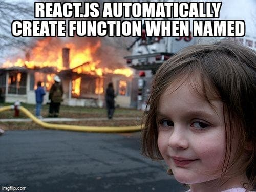
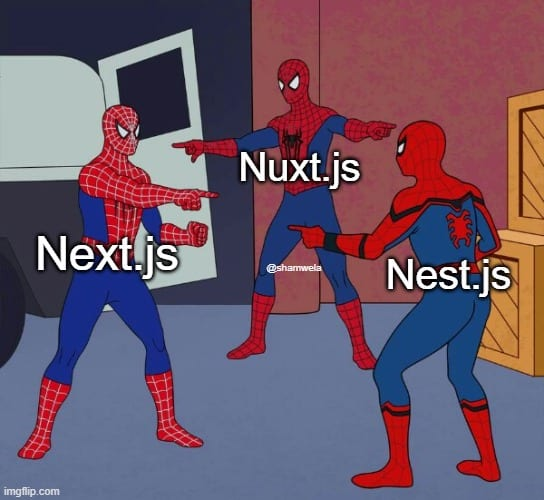

В постоянно развивающемся мире веб-разработки термины ”фреймворк” и "библиотека" часто используются, но зачастую понимаются неправильно. Понимание разницы между ними жизненно важно для принятия взвешенных решений при разработке проектов. Эта статья призвана разъяснить эти понятия, используя React и Next.js в качестве наглядных примеров.

## Зачем стремиться к пониманию?

Понимание того, что использовать - библиотеку или фреймворк, - влияет на структуру, поддержку и масштабирование проекта с течением времени. Оно влияет на уровень контроля разработчиков над своим кодом и на кривую обучения для новых членов команды.

## Библиотеки: Взгляд на React

## Что такое библиотека?

Думайте о библиотеке React как о своем наборе инструментов. Это коллекция фрагментов кода и компонентов, которые вы можете использовать для создания пользовательского интерфейса. Она не рассказывает вам, как создать все приложение, а лишь предоставляет необходимые инструменты.

## Роль React

React отлично подходит для создания динамичных, высокопроизводительных пользовательских интерфейсов. Это как универсальный инструмент, который можно приспособить для решения различных задач.

Плюсы и минусы

Плюсы: Большая гибкость, сильное сообщество и множество ресурсов.  
Минусы: Это лишь часть головоломки. Вам понадобятся другие инструменты для управления состоянием, маршрутизации и т. д.

## Фреймворки: Изучение Next.js

## Что такое фреймворк?

Фреймворк, подобный Next.js, является более всеобъемлющим. Он не только дает вам инструменты, но и рассказывает, как их использовать. Это все равно что иметь путеводитель вместе с набором инструментов.

## Суперспособности Next.js

Построенный на React, Next.js добавляет такие функции, как рендеринг на стороне сервера и генерация статических сайтов, которые очень полезны для SEO и производительности.

## Плюсы и минусы

Плюсы: Предлагает структурированный подход, встроенные функции для оптимизации производительности и отлично подходит для SEO.  
Минусы: Менее гибкий подход, чем использование отдельной библиотеки. Вы должны придерживаться правил фреймворка.

Хочу привести одну интересную мысль с небольшим изменением с моей стороны:

Заметка о том, что такое ”мнение”
Часто можно услышать, как фреймворки и библиотеки называют “opinionated” или “un-opinionated”. Эти термины субъективны. Они пытаются определить уровень свободы разработчика при структурировании кода.

Фреймворки в большей степени относятся к мнениям, чем нет, поскольку инверсия контроля по определению требует уступки свободы проектирования приложения.

И опять же, степень, в которой что-то вызывает мнение, субъективна. Например, лично я считаю Angular фреймворком с большим количеством мнений, а NextJS - с меньшим.

## Смешение React и Next.js

Сочетание React и Next.js позволяет использовать гибкость React и структурированную мощь Next.js. Это как свобода экспериментировать со своим стилем и в то же время иметь набор идеально подобранных нарядов.

## Заключение

Выбор библиотеки React, фреймворка Next.js или их комбинации зависит от потребностей вашего проекта и личного стиля кодирования. Библиотека предлагает гибкость и свободу, что идеально подходит для экспериментов и создания чего-то уникального. С другой стороны, фреймворк - это как дорожная карта, которая поможет вам с легкостью создавать эффективные и высокопроизводительные веб-приложения.

Так что продолжайте исследовать и помните, что лучший инструмент - это тот, который соответствует потребностям вашего проекта и вашему стилю разработчика. Оставайтесь в курсе событий и продолжайте учиться - мир технологий - это ваша устрица! 🌐👩‍💻
