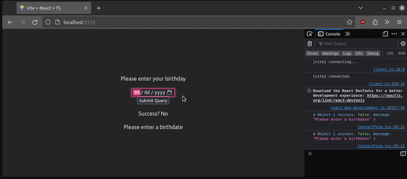

Управление формами в React для некоторых является утомительным процессом. Например, первым шагом будет назначение хука `useState` каждому полю для получения их значений, а затем написание еще нескольких строк кода для обработки валидации и отправки формы. Кроме того, нам придется реализовать функцию проверки успешности отправки формы.


По этим причинам разработчики часто избегают тяжелой работы, используя такие библиотеки, как Formik или React Hook Form. Но подумайте вот о чем: что, если мы хотим, чтобы наше приложение было как можно более компактным и не зависело от внешних зависимостей?

К счастью, команда React предоставила два хука для нативного управления формой: `useFormState` и `useFormStatus`. В этой статье вы узнаете, как использовать оба этих хука для обработки и проверки компонентов формы. Исходный код приведенного в этом посте примера проекта вы можете найти в этом репозитории GitHub. Давайте приступим!

## Настройка проекта

В этом разделе мы сначала загрузим проект и установим все необходимые зависимости. В качестве первого шага используйте Vite для инициализации нового проекта:

`npm create vite@latest`

После этого Vite предложит вам выбрать фреймворк. Здесь выберите `React и TypeScript`:


Теперь, когда вы инициализировали проект, установите необходимые зависимости с помощью команды `run`:

npm install #установить все необходимые зависимости, необходимые для запуска проекта

На момент написания этой статьи React предоставляет эти хуки в канале Canary. Чтобы переключиться на канал Canary, напишите в терминале следующие строки:

`npm install react@canary react-dom@canary`

Теперь, когда `react-canary` установлен, нам нужно указать TypeScript использовать типы, присутствующие в канале Canary. Для этого перейдите в `vite-env.d.ts` и измените содержимое этого файла на следующее:

```javascript
/// <reference types="vite/client" />
/// <reference types="react/canary" />
/// <reference types="react-dom/canary" />
```

Отлично! Мы настроили проект. Чтобы проверить, все ли работает нормально, выполните `npm run dev` в директории проекта:

`npm run dev`

Это запустит сервер React. В браузере должен появиться следующий скриншот:


## Начало работы с хуком `useFormState`

В этой части статьи вы начнете работать с хуком React `useFormState`.

Создание нашей формы

Прежде всего, нам нужно создать простой компонент формы. Для этого создайте файл `ContactForm.tsx`. В нем напишите следующий код:

```javascript
// имя файла: ContactForm.tsx
export const SimpleContactForm: React.FC = () => {
  return (
    <div>
      {/* Создаем нашу форму: */}
      <form>
        {/* Ввод с именем 'userName' будет зафиксирован с помощью useFormState Hook */}
        <input name="userName" />
        <input type="submit" />
      </form>
    </div>
  );
};
// Note: Пожалуйста, не забудьте вывести этот компонент в App.js
```

Вот наш компонент формы:


Создание нашей функции-обработчика

На втором этапе нам нужно написать функцию, которая будет обрабатывать отправку формы. Для этого создайте файл `actions.ts`. В этом файле напишите этот фрагмент кода:

```javascript
// имя файла: actions.js
export const getUserName = async (previousState: string | undefined | null, formData: FormData) => {
  // переменная previousState содержит последнее записанное значение ввода пользователя
  console.log("previous recorded state ", previousState);

  // используем переменную formData для получения значений:
  const userName = formData.get("userName");

  return userName?.toString();
}
```

Давайте разберем этот код по частям:

В этой функции мы используем функцию `get` для получения значения текстового поля `userName`. Полученный результат сохраняется в переменной `userName`. Наконец, функция возвращает пользователю строковое значение поля ввода

Использование нашей функции-обработчика с `useFormState`

Мы почти закончили! Теперь давайте интегрируем нашу функцию `getUserName` в проект:

```javascript
// имя файла: ContactForm.tsx
import { getUserName } from "./actions";
import { useFormState } from "react-dom"; // импортируем хук userFormState

// удаляем ненужный код для краткости...

// передаем нашу функцию-обработчик, getUserName в качестве первого параметра.
const [имя пользователя, formAction] = useFormState(getUserName, null);

return (
  <div>
    <form action={formAction}>
      {/* Дальнейший код.. */}
    </form>
    Зарегистрированный ввод: {имя пользователя}
  </div>
);

/// ...дальнейший код...
```

Вот пояснение к приведенному выше блоку кода:

Первым параметром мы передаем нашу только что созданную функцию `getUserName` в функцию `useFormState`. Второй параметр этого хука - начальное значение состояния В результате `useFormState` вернет две переменные: `userName`, входные значения пользователя, и `formAction`, функцию, которая будет выполнена, когда пользователь отправит форму Далее, в `return`, передайте метод-обработчик `formAction` в свойство `action` формы. В конце отобразите на странице введенные пользователем значения

Это будет результатом работы кода:


Вот и все! Как вы можете видеть, React использует хук `useStateForm` для регистрации ввода пользователя.

Отправка объектов в качестве данных

В предыдущем разделе мы использовали `useStateForm` от React для возврата строковых значений. Теперь мы узнаем, как выводить JSON-объекты.

Давайте сначала построим простой компонент формы, чтобы продемонстрировать этот вариант использования:

```javascript
// имя файла: ContactForm.tsx
export const ContactForm: React.FC = () => {
  return (
    <div>
      <form>
        Пожалуйста, введите здесь свое имя
        <input name="userName" />
        <br />
        А теперь введите свое сообщение
        <textarea name="message" />
        <input type="submit" />
      </form>
    </div>
  );
}
```

В приведенном выше коде мы создали два поля ввода и назначили им `userName` и `message`:


Далее нам нужно написать функцию-обработчик для этой формы:

```javascript
// имя файла: actions.ts
type stateType = {
  userName: string | undefined;
  message: string | undefined;
};

export const recordInput = async (
 previousState: stateType,
 formData: FormData
) => {
  console.log("предыдущее записанное значение ", previousState);

  // получаем значение ввода с меткой 'username'
  const userName = formData.get("userName");

  // следующим получаем значение текстовой области с именем 'message'
  const message = formData.get("message");

  // возвращаем все входные значения в объекте
  return {
    userName: userName?.toString(),
    message: message?.toString()
  };
}
```

В приведенном выше коде мы получаем значения полей ввода `userName` и `message`, а затем выводим эти значения в JSON.

Как и раньше, все, что нам нужно сделать, это указать React использовать нашу функцию-обработчик в нашей форме:

```javascript
// имя файла: ContactForm.tsx
import { useEffect } from 'react';
import { recordInput } from './actions';
import { useFormState } from 'react-dom';

const [data, formAction] = useFormState(recordInput, { userName: null, message: null });

useEffect(() => {
	// вывод текущих значений, введенных в форму
	console.log(data);
}, [data]);

return (
	<div>
		{/* и наконец, используем возвращенную функцию formAction для обработки отправлений */}
		<form action={formAction}>{/* дальнейший код... */}</form>
	</div>
);
```

И вот результат:


Ошибки при отправке

Используя возможности JSON и `useFormState`, мы можем даже показывать ошибки пользователю. Например, когда пользователь создает пароль, мы хотим убедиться, что он соответствует определенным критериям.

Для начала давайте создадим функцию-обработчик:

```javascript
// в actions.js import differenceInYears from "date-fns/differenceInYears";

type validateAndUseInputType = { success: boolean; message: string; };

export const validateAndUseInput = async (previousState: validateAndUseInputType, formData: FormData) => {
  // получаем значение поля ввода даты:
  const birthdate = formData.get("birthdate")?.toString();

  // проверяем, не является ли поле нулевым:
  if (!birthdate) {
    return { success: false, message: "Пожалуйста, введите дату рождения!" };
  }

  // используем библиотеку date-fns для проверки, не достиг ли пользователь 18 лет
  const ageDifference = differenceInYears(new Date(), new Date(birthdate));

  if (ageDifference < 18) {
    return { success: false, message: "Вы не совершеннолетний! Пожалуйста, повторите попытку позже" };
  }

  // если значение false, то выводим сообщение об успехе
  return { success: true, message: "Вы можете продолжить" };
}
```

На первом шаге с помощью метода `get` получаем значение поля `birthdate`. Затем проверяем, пустое ли это поле. Если это условие выполнено, то сообщите пользователю, что произошла ошибка Кроме того, проверьте, не достиг ли пользователь 18 лет. Если `true`, то верните ошибку. В противном случае отправка формы будет успешной

Теперь, когда мы написали нашу функцию-обработчик, осталось только использовать ее:

```javascript
// имя файла: ContactForm.tsx
import { validateAndUseInput } from './actions';

const [data, formAction] = useFormState(validateAndUseInput, {
	success: false,
	message: 'Пожалуйста, введите дату рождения',
});

useEffect(() => {
	console.log(data);
}, [data]);

return (
	<div>
		{/* Вставьте наш обработчик формы в эту форму. */}
		<form action={formAction}>
			Пожалуйста, введите дату вашего рождения
			{/* Создайте ввод даты с именем 'birthdate' */}
			<input name="birthdate" type="date" />
			<br />
			<input type="submit" />
		</form>
		Успех? {data.success ? <span>Да</span> : <span>Нет</span>}
		{data.message}
	</div>
);
```

И вот вывод:



Отслеживание отправлений формы с помощью `useFormStatus`

Для управления формами команда React также разработала второй хук, `useFormStatus`. Как следует из названия, он подходит для ситуаций, когда вы хотите отслеживать ход выполнения формы, т.е. когда мы хотим сообщить пользователю, что его sДопуск был завершен.

Вот простая функция-обработчик для нашего случая:

```javascript
// имя файла: actions.ts
export const readUsername = async (_: any, formData: FormData) => {
  // приостановим выполнение, чтобы показать, как работает хук useFormStatus.
  await new Promise((res) => setTimeout(res, 1000));

  const userName = formData.get("userName")?.toString();

  if (userName == "LogRocket") {
    return {
      success: true,
      message: "Вы можете продолжить",
    };
  }

  return {
    success: false,
    message: "Ваше имя пользователя неверно!",
  };
};
```

В первой строке тела с помощью функции `setTimeout` приостанавливаем выполнение на одну секунду Далее получаем значение области ввода `userName` и сохраняем результат в переменной `userName` Наконец, проверяем, было ли значение `userName` равно `LogRocket`. Если это условие истинно, покажите сообщение об успехе

Далее перейдите в компонент `ContactForm.tsx` и добавьте этот фрагмент кода:

/```javascript
// имя файла: ContactForm.tsx
import { useFormStatus } from "react-dom";
import { readUsername } from "./actions.ts";

const ContactFormChild: React.FC = () => {
// хук useFormStatus будет информировать клиента о статусе отправки формы
const data = useFormStatus();
return (
<>
Пожалуйста, введите ваше имя пользователя
{/_ Ввод, который мы хотим записать: _/}
<input name="userName" /> <br />
{/_ Если отправка не была завершена, отключите кнопку submit _/}
<input type="submit" disabled={data.pending} />
</>
);
};

// этот компонент будет выведен в DOM:
export const ContactFormParent: React.FC = () => {
// используем хук useFormState для обработки отправки
const [data, formAction] = useFormState(readUsername, {
success: false,
message: "Please enter your username",
});

return (

<div>
<form action={formAction}>
{/_ Рендер нашей формы здесь _/}
<ContactFormChild />
</form>
{data.message}
</div>
);
}

```

Сначала создайте компонент `ContactFormChild` и вызовите хук `useFormStatus` Далее реализуйте компонент формы `ContactFormParent` и передайте метод `readUsername` в хук `useFormState` Наконец, отрендерите `ContactFormChild` как дочерний компонент. Это сообщит React, что мы хотим отслеживать состояние формы, присутствующей в `ContactFormParent`.

Вот результат работы кода:


Как видите, теперь наше приложение информирует пользователя о том, успешно ли отправлена форма или нет, с помощью хука `useFormStatus`. И мы закончили!

## Заключение


В этой статье вы познакомились с основами новых хуков React `useFormState` и `useFormStatus`. Кроме того, вы узнали, как регистрировать данные пользователя, возвращать JSON-объекты и отправлять пользователю сообщения об ошибках в зависимости от его ввода. Спасибо за прочтение! Счастливого кодинга.


```
