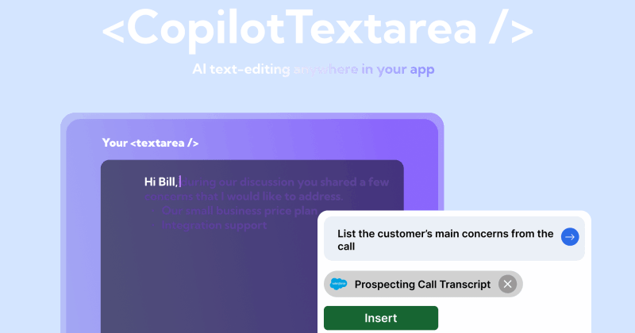
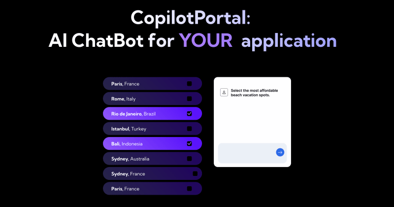
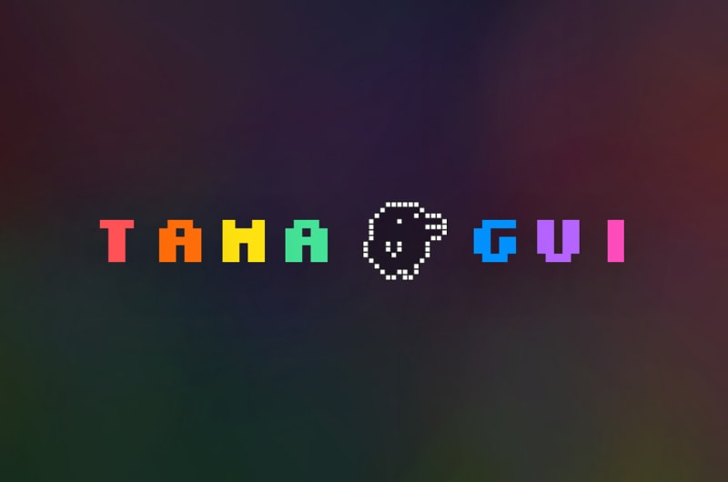
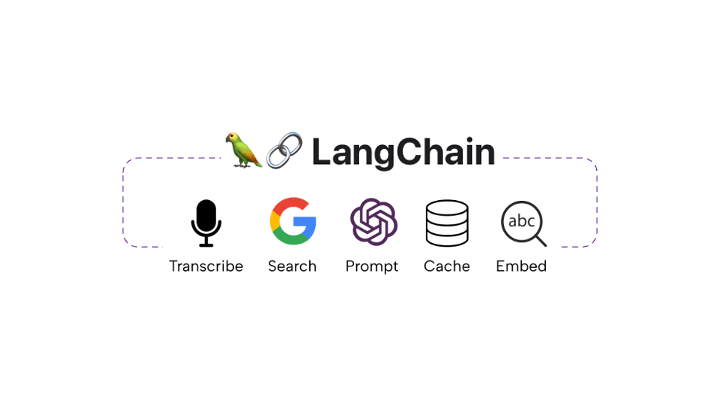

Сегодня сезон открытых источников ☃️.

Кодинг в праздники может быть благословенным опытом, и нет ничего лучше, чем создать потрясающий проект в свободное время.

Я просмотрел бесчисленные репозитории и нашел 24 лучшие библиотеки для вашего рождественского кодинга.

Не забудьте поставить STAR 🌟 и поддержать их.

## 1. CopilotTextarea - написание текста с помощью искусственного интеллекта в приложениях React

Замена для любого react `<textarea>` с возможностями Github CopilotX.

Автозавершение, вставка, редактирование.

Может получать любой контекст в реальном времени или от разработчика заранее.

## 2.React Joyride - создание проходов по продукту

Создавайте экскурсии в своих приложениях

## 3.NextAuthJS - Простая настройка аутентификации

Аутентификация для Web.

## 4.Trigger.dev - надежное выполнение длительных заданий без таймаутов

✨ Trigger.dev - это фреймворк фоновых заданий с открытым исходным кодом для TypeScript. В нем есть такие функции, как интеграция с API, веб-крючки, планирование и задержки.

## 5. Flowbite - лучшая библиотека CSS-компонентов

Одна из лучших и наиболее уважаемых библиотек компонентов пользовательского интерфейса.

Основана на CSS-фреймворке, ориентированном на полезность.

Проста в работе, полна важных поддержек и шаблонов.

## 6.MaterialUI - Основополагающие компоненты React, реализованные с помощью Material Design от Google

MUI Core: Готовые к использованию основополагающие компоненты React, бесплатные навсегда. Он включает в себя Material UI, который реализует Material Design от Google.

## 7. SwiperUI - уважаемая библиотека для реализации мобильного swipe UI

Самый современный мобильный сенсорный слайдер с аппаратным ускорением переходов

## 8.ReactSpring - реализация анимации в React с реалистичной физикой

✌️ Библиотека анимации React на основе физики пружин

## 9. CopilotPortal: Встраивайте чатбота LLM в ваше приложение

Контекстно-ориентированный LLM-чатбот внутри вашего приложения, который отвечает на вопросы и выполняет действия.

Получите работающий чат-бот с помощью нескольких строк кода, а затем настраивайте и внедряйте его так глубоко, как вам нужно.

## 10.llamafile - Сведите все сложности работы с LLM к одному файлу Распространяйте и запускайте LLM с помощью одного файла

## 11. Pezzo.ai - Любимый разработчиками LLM ops & observability

🕹️ Платформа LLMOps с открытым исходным кодом, ориентированная на разработчиков и предназначенная для оптимизации оперативного проектирования, управления версиями, мгновенной доставки, совместной работы, устранения неполадок, наблюдаемости и многого другого.

## 12.Tavily - удобный для разработчиков автономный GPT-агент, который ищет данные и пишет отчеты

Автономный агент на базе GPT, выполняющий комплексное онлайн-исследование по любой заданной теме

## 13. Wazuh - унифицированная платформа безопасности с открытым исходным кодом

Унифицированная платформа безопасности с открытым исходным кодом для конечных точек и облачных рабочих нагрузок.

Обнаружение, предотвращение и реагирование на угрозы.

Защита локальных, контейнерных и облачных сред.

## 14.Zeek - глубокий анализ сетевого трафика

Zeek - это мощный фреймворк для анализа сетевого трафика, который значительно отличается от типичных IDS, которые вы можете знать.

## 15. SuperTokens - провайдер аутентификации с открытым исходным кодом

Альтернатива Auth0 / Firebase Auth / AWS Cognito с открытым исходным кодом.

## 16.Sniffnet - локальный мониторинг вашего интернет-трафика

Приложение для удобного мониторинга вашего интернет-трафика 🕵️‍♂️

## 17. Tamagui - уважаемая библиотека для создания пользовательского интерфейса и оптимизации react native

Tamagui предназначена для быстрой стилизации React-приложений.

Он включает в себя дополнительный набор UI и оптимизирующий компилятор для повышения производительности.

Обеспечивает беспрепятственный обмен кодом между веб- и нативными платформами, оптимизируя стилизованные компоненты для каждой среды.

## 18.EarlGrey - тестирование пользовательского интерфейса iOS от Google

MUI Core: Готовые к использованию основополагающие компоненты React, бесплатные навсегда. В него входит Material UI, который реализует Material Design от Google.

## 19. ReactNativeMaps - высоконастраиваемый компонент карт для приложений React Native Mapview компонент для iOS + Android

## 20.ReactNativePaper - библиотека дизайна для iOS и Android

Material Design для React Native (Android & iOS)

## 21. LangChain - Создание пользовательских цепочек действий с помощью LLM

Известная библиотека, но все же включена в список, так как является одной из моих любимых и с ней интересно строить.

Модульные компоненты, которые помогут вам объединить LLM в действия с интеграцией во многие приложения и API.

Мощный фреймворк для создания LLM-агентов.

## 22.ReactAgent - Экспериментальный проект. Превращает подсказки в работающие react-компоненты

Автономный LLM-агент с открытым исходным кодом React.js

## 23.Awesome for Beginers - список проектов на Github, ориентированных на новичков

Список удивительных проектов, ориентированных на новичков.

## 24.Appwrite - Мощная бэкенд-платформа для веб- и мобильных приложений

Стройте как команда hundreds\_

И… это все, друзья!

Надеюсь, вам понравятся эти библиотеки, и они помогут/вдохновят вас строить что-то новое.Что-нибудь классное во время праздников.

Не забудьте STAR🌟 репо и поддержать эту статью реакцией, если она вам понравилась.

[PS: к этой статье прилагаются песни, которые я создал с помощью Suno.ai. Они уморительные, потрясающие и жуткие. Расскажите мне, какая из них вам нравится больше:

Санта с открытым исходным кодом

Рождественское волшебство кодера Санты]
