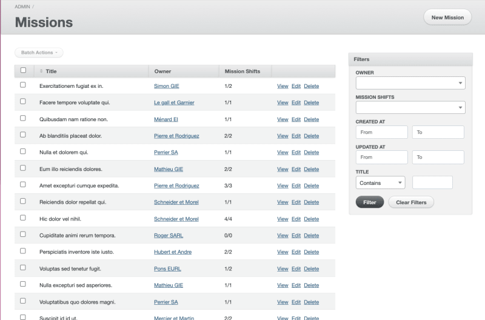
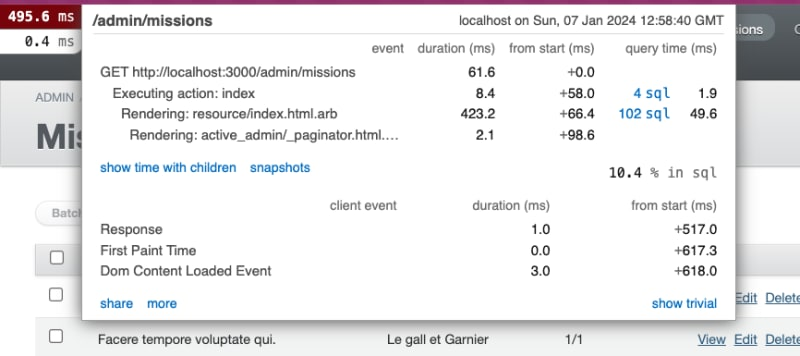
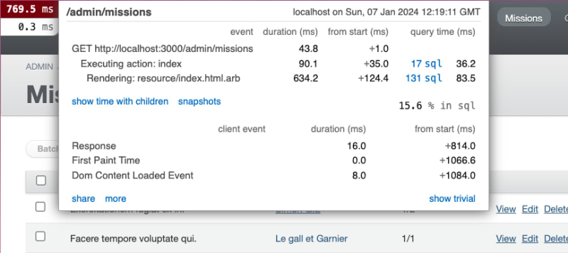
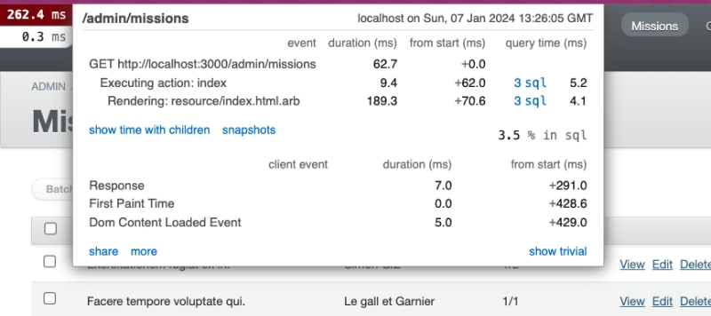

ActiveAdmin - это широко используемый инструмент для создания интерфейсов администратора в приложениях на Ruby on Rails. Он невероятно полезен для быстрой настройки интерфейса администратора, ориентированного исключительно на данные, которые вы хотите отображать. Однако мы часто сталкиваемся со страницами, которые делают множество SQL-запросов и долго загружаются.

Сегодня мы рассмотрим три вещи, которые я всегда делаю, чтобы оптимизировать свои представления ActiveAdmin.

## Представление набора данных

Чтобы проиллюстрировать наши примеры, давайте представим, что вам нужно интегрировать интерфейс администратора для агентства по подбору персонала.

У вас будет 4 таблицы:

Таблица для хранения клиентов, которые платят за поиск временных работников (Owner) Таблица для хранения всех доступных временных работников (User) Таблица для хранения всех миссий (Mission) Таблица для хранения всех смен миссий (MissionShift)

```ruby
create_table "users" do |t|
  t.string "email"
  t.string "first_name"
  t.string "last_name"
end

create_table "owner" do |t|
  t.string "name"
end

create_table "missions" do |t|
  t.string "description"
  t.string "title"
  t.bigint "client_id", null: false
end

create_table "mission_shifts" do |t|
  t.bigint "mission_id", null: false
  t.date "day"
  t.datetime "begin_time"
  t.datetime "end_time"
  t.bigint "user_id"
end
```

Отношения

У пользователя есть множество MissionShift. MissionShift принадлежит миссии. Миссия принадлежит владельцу.

Итак, давайте разберемся в нашем примере!

## Введение в ActiveAdmin

Наша цель - использовать ActiveAdmin для создания интерфейса администратора как можно быстрее. Вам нужна страница, на которой будут отображаться:

Названия миссий Клиент, которому принадлежит миссия Сколько смен укомплектовано пользователем

Прочитав немного документации, вы открываете для себя замечательный DSL ActiveAdmin.

Вы быстро придумали такой код:

```ruby
ActiveAdmin.register Mission do
  index do
    selectable_column
    column :title
    column :owner
    column('Mission Shifts') do |mission|
      mission_shifts = mission.mission_shifts
      "#{mission_shifts.count(:user_id)}/#{mission_shifts.size}"
    end
    actions
  end
end
```

В результате получается следующее:



Вы готовы покорить мир с этой страницей администратора!

Тем не менее, вы должны знать, что эта страница содержит 3 источника N+1 запросов. Чтобы доказать это, мы воспользуемся гемом “rack-mini-profiler”. Этот гем позволяет проследить путь сервера при рендеринге страницы.

Вот скриншот того, что показывает нам rack-mini-profiler:

У нас 148 SQL-вызовов в представлении 😲. Это очень много!

Если посмотреть на серверную часть, то вот информация, которую мы получаем при загрузке страницы:

`Completed 200 OK in 741ms (Views: 455.5ms | ActiveRecord: 266.5ms | Allocations: 1035126)`.

Страница загружается очень долго и выделяет огромное количество памяти!

Цель этой статьи - показать вам, как значительно сократить количество SQL-вызовов и выделение памяти, тем самым оптимизировав время отрисовки страницы и уменьшив утечки памяти!

## Фильтры

### 1️⃣ Всегда используйте пользовательские фильтры

Первый совет, которым я хотел бы поделиться сегодня, хорошо известен. Он не решает проблему N+1, но значительно сокращает объем памяти, выделяемой странице:

Никогда не оставляйте фильтры по умолчанию включенными!

На самом деле ActiveAdmin старается быть полезным и генерирует фильтры для всех атрибутов вашей таблицы.

Если у вас много атрибутов, вам будет трудно ориентироваться. Если у вас есть связи с другими моделями, ActiveAdmin будет предварительно загружать всю коллекцию ActiveRecord. В нашем случае по умолчанию включены модели `Owner` и `MissionShift`.

Всегда указывайте хотя бы один фильтр:

`ActiveAdmin.register Mission do filter :title [...] end`.

Вот рендеринг на стороне сервера при загрузке страницы:

До модификации: `Completed 200 OK in 620ms (Views: 422.9ms | ActiveRecord: 186.0ms | Allocations: 928758)`.

После модификации: `Completed 200 OK in 581ms (Views: 403.4ms | ActiveRecord: 168.0ms | Allocations: 703878)`.

Огромная разница в выделении памяти!

### 2️⃣ Предварительная загрузка собственной коллекции и ее кэширование

Если вам все еще нужен фильтр для Модели, напишите собственный запрос для загрузки данных:

```ruby
ActiveAdmin.register Mission do
  filter :owner, as: :select, collection: lambda { Owner.pluck(:name, :id) }
  # ...
end
```

Вот рендеринг на стороне сервера при загрузке страницы:

`Completed 200 OK in 666ms (Views: 337.9ms | ActiveRecord: 316.7ms | Allocations: 761030)`.

Это все еще лучше, чем с фильтрами по умолчанию.

Если вы хотите пойти еще дальше в оптимизации, вы также можете настроитьлогику кэширования, например, так:

```ruby
ActiveAdmin.register Mission do
  filter :owner, as: :select, collection: lambda {
    Rails.cache.fetch('owners_name_id', expires_in: 1.hour) do
      Owner.pluck(:name, :id)
    end
  }
  # ...
end
```

Это дает нам:

`Completed 200 OK in 816ms (Views: 531.6ms | ActiveRecord: 248.3ms | Allocations: 711373)`.

С точки зрения распределения, мы проделали долгий путь!

## Индекс

На нашей индексной странице у нас две проблемы:

Отображение колонки `Владелец` Отображение количества смен, в которых есть пользователь на миссию

Если кратко описать работу ActiveAdmin, то для каждой строки он делает 3 SQL-запроса:

Один для поиска владельца Один для поиска MissionShifts Один для подсчета MissionShifts, в которых есть пользователь

Как вы можете видеть, все наши N+1 фактически сосредоточены здесь.

Единственный способ решить наши проблемы - это предварительно загрузить как можно больше данных. Для этого у нас есть два пути:

Предварительно загрузить данные в контроллер Загрузить данные один раз и мемоизировать их в представлении

### 3️⃣ Предварительная загрузка данных в контроллер

ActiveAdmin позволяет нам создавать собственные методы контроллера. До сих пор мы работали только с методом `#index`, так что если мы хотим предварительно загрузить данные, то это самое подходящее место!

Давайте изменим наш файл, чтобы предварительно загрузить данные `Owner` непосредственно из контроллера:

```ruby
ActiveAdmin.register Mission do
  # ... other code ...

  index do
    # ... other code ...

    column('Owner') do |mission|
      owners.fetch(mission.owner_id)
    end

    # ... other code ...
  end

  controller do
    # перед загрузкой чего-либо, мы предварительно загружаем Owners
    def index
      @owners = Owner.pluck(:id, :name).to_h
      # вызов метода начального индекса
      super
    end
  end
end
```

Если мы посмотрим на rack-mini-profiler, то получим следующее:



Мы сократили количество обращений к базе данных на ~30. Почему именно на столько? Так как один и тот же владелец был у нас несколько раз на разных миссиях, ActiveAdmin сохранял вызов в кэше и извлекал информацию, а не делал новый запрос.

Эта техника хорошо работает, если у вас нет большого объема данных в таблице `Owner`. Если вы хотите оптимизировать еще немного, вы также можете использовать кэш. А если вы хотите оптимизировать еще больше, вы можете повторно использовать кэш, который мы вместе создали в фильтрах, чтобы дважды использовать одни и те же значения на странице.

### 4️⃣ Предварительная загрузка данных в представление

Предварительная загрузка данных в контроллере - это хорошо, но мы можем загрузить слишком много данных. Таблица Mission имеет больший объем, чем Owner, поэтому мы не можем позволить себе предварительно загрузить всю таблицу. К сожалению, мы не знаем, какие миссии будут загружены на страницу на уровне контроллера.

Но есть одно место, где мы знаем, какие миссии будут отображаться: в представлении!

Другими словами:

```ruby
ActiveAdmin.register Mission do
  index do
    column('Sample Column') do
      missions.count # => 50
    end
  end

  controller do
    def index
      pp missions.count # => NameError - undefined local variable or method `missions' for #<Admin::MissionsController:0x000000000a4128>:
      super
    end
  end
end
```

Наша цель - предварительно загрузить количество MissionShifts у пользователя, а также общее количество MissionShifts за миссию.

Первый шаг - найти запрос для предварительной загрузки этих данных для набора миссий:

```ruby
class Mission < ApplicationRecord
  # выведет миссии с "id", "total_shifts" и "shifts_with_user"
  def self.mission_shifts_with_users
    self.left_joins(:mission_shifts)
      .select(
        :id,
        'COUNT(mission_shifts.id) AS total_shifts',
        'COUNT(DISTINCT CASE WHEN mission_shifts.user_id IS NOT NULL THEN mission_shifts.id END) AS shifts_with_user'
      )
      .group('missions.id')
  end
end
```

Мы хотим использовать этот запрос в нашем представлении, чтобы нам нужно было только искать в нем нашу миссию и извлекать нужную информацию.

```ruby
ActiveAdmin.register Mission do
  index do
    column('Mission Shifts') do |mission|
      @missions_with_mission_shifts ||= missions.mission_shifts_with_users
      mission_shifts = @missions_with_mission_shifts.find { |m| m.id == mission.id }
      "#{миссия_смены.смены_с_пользователями}/#{миссия_смены.общие_смены}"
    end
  end
end
```

Используя мемоизацию, мы делаем запрос только один раз, и он используется для всех наших миссий.

Если мы выполним тур по rack-mini-profiler, то получим:


Мы избавились почти от 100 обращений к базе данных, предварительно загрузив данные для Owners и MissionShifts.

## Результаты

Вот результаты с применением всех советов:

Рендеринг на стороне сервера:

До: `Завершено 200 OK за 741 мс (Views: 455.5 мс | ActiveRecord: 266.5 мс | Allocations: 1035126)`.

После: `Completed 200 OK in 200ms (Views: 187.3ms | ActiveRecord: 5.9ms | Allocations: 517789)`.

Выделение памяти сократилось вдвое.

Время отклика составляет около 200 мс (что вполне приемлемо).

Rack-mini-profiler:





Цифры говорят сами за себя: всего 6 SQL-запросов против 148 ранее. IЭто огромный зазор для производительности ваших приложений.

Важным показателем, на который следует обратить внимание, является `% в sql`, который мы снизили с 15,6 до 3,5%, что является огромной разницей!

## Заключение

В заключение этой статьи мы показали, как превратить изначально тяжелый и неэффективный интерфейс ActiveAdmin в значительно более эффективную и быструю версию. Благодаря четырем простым, но мощным приемам мы значительно сократили количество SQL-запросов, улучшили управление памятью и оптимизировали время загрузки. Эти улучшения - не просто технические достижения; они воплотились в более плавном и профессиональном пользовательском опыте. Для разработчиков Ruby on Rails, использующих ActiveAdmin, эти методы предлагают конкретный способ повысить производительность своих приложений, сохранив при этом простоту и скорость разработки, которые предлагает этот камень.
