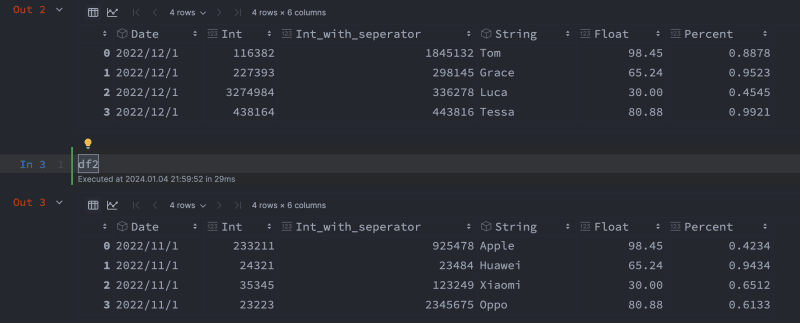

В этой статье мы решим следующие вопросы:

- как использовать xlsxwriter для сохранения Excel?
- как сохранить несколько фреймов данных в рабочих листах с помощью Python?
- как использовать Python для стилизации форматирования Excel?
- как обеспечить точное сохранение определенных типов данных, таких как дататайм, целое число, строка и плавающие данные, при использовании Python и xlsxwriter для сохранения фрейма данных в Excel?

Описание вопроса:

Представьте, что у вас есть следующие 2 кадра данных, и вы хотите сохранить их в одном файле Excel с разными листами и стилизовать форматирование Excel



Решение: Сохраните Excel с помощью программы xlsxwriter

## 1. импортируйте пакет xlsxwriter и создайте файл Excel

Используйте `Workbook` для создания нового файла Excel.

```python
# import package
import xlsxwriter

# create excel file
workbook = xlsxwriter.Workbook("new_excel.xlsx")
```

## 3. создайте два листа

Используйте .`add_worksheet` для создания листа, поскольку у нас есть два фрейма данных, которые нужно сохранить, мы должны создать два листа.

```python
worksheet1 = workbook.add_worksheet('df1_sheet')
worksheet2 = workbook.add_worksheet('df2_sheet')
```

## 4. установите формат заголовка и сохраните его

Сначала мы задаем формат заголовка и используем `.write_row` для сохранения нашего заголовка.

У `.write_row` есть четыре аргумента, они следующие: worksheet.write_row(row, col, data, cell_format).

```python
header_format = workbook.add_format({
    'valign': 'top',
    'fg_color': '#002060',
    'border': 1,
    'font_color': 'white'
})
worksheet1.write_row(0, 0, df1.columns, header_format)
worksheet2.write_row(0, 0, df2.columns, header_format)
```

## 5. создать некоторый формат

`format.set_num_format()`:Этот метод используется для определения числового формата числа в Excel. Он определяет, будет ли число отображаться в виде целого числа, числа с плавающей точкой, даты, валютного значения или в каком-либо другом формате, заданном пользователем.

Числовой формат ячейки можно задать с помощью строки формата или указателя на один из встроенных форматов Excel, для получения дополнительной информации вы можете проверить xlsxwriter-format

например: `14` представляет собой `m/dd/yyy`, поэтому `format.set_num_format(14) = format.set_num_format('m/dd/yyy')`.

```python
# set datetime format "m/d/yy"
format_datetime = workbook.add_format({'border': 1})
format_datetime.set_num_format(14)  # based on above table, 14 means "m/d/yy"
format_datetime.set_font_size(12)  # set font size

# set General format
format_general = workbook.add_format({'border': 1})
format_general.set_num_format(0)  # 0 means general
format_general.set_font_size(12)

# set integer format "0"
format_integer = workbook.add_format({'border': 1})
format_integer.set_num_format(1)
format_integer.set_font_size(12)

# set float format "0.00"
format_float = workbook.add_format({'border': 1})
format_float.set_num_format(2)
format_float.set_font_size(12)

# set integer format with thousands separators "#,##0"
format_integer_separator = workbook.add_format({'border': 1})
format_integer_separator.set_num_format(3)
format_integer_separator.set_font_size(12)

# set percent format "0.00%"
format_percent = workbook.add_format({'border': 1})
format_percent.set_num_format(10)
format_percent.set_font_size(12)
```

## 6. сохраните данные в Excel с параметром cell_format

нулевой индексный ряд уже сохранил наш заголовок, поэтому мы начнем с одного индексного ряда (установим первый аргумент в 1)

```python
# Refactored code block
worksheet1.write_column(1, 0, df1.iloc[:, 0], format_datetime)
worksheet1.write_column(1, 1, df1.iloc[:, 1], format_integer)
worksheet1.write_column(1, 2, df1.iloc[:, 2], format_integer_separator)
worksheet1.write_column(1, 3, df1.iloc[:, 3], format_general)
worksheet1.write_column(1, 4, df1.iloc[:, 4], format_float)
worksheet1.write_column(1, 5, df1.iloc[:, 5], format_percent)
worksheet2.write_column(1, 0, df2.iloc[:, 0], format_datetime)
worksheet2.write_column(1, 1, df2.iloc[:, 1], format_integer)
worksheet2.write_column(1, 2, df2.iloc[:, 2], format_integer_separator)
worksheet2.write_column(1, 3, df2.iloc[:, 3], format_general)
worksheet2.write_column(1, 4, df2.iloc[:, 4], format_float)
worksheet2.write_column(1, 5, df2.iloc[:, 5], format_percent)
```

## 7. установить ширину столбца

Для лучшего отображения данных мы также можем использовать `.set_column`, чтобы установить ширину столбцов.

```python
worksheet1.set_column('A:A', 15)
worksheet1.set_column('B:B', 15)
worksheet1.set_column('C:C', 15)
worksheet1.set_column('D:D', 15)
worksheet1.set_column('E:E', 15)
worksheet1.set_column('F:F', 15)
worksheet2.set_column('A:A', 15)
worksheet2.set_column('B:B', 15)
worksheet2.set_column('C:C', 15)
worksheet2.set_column('D:D', 15)
worksheet2.set_column('E:E', 15)
worksheet2.set_column('F:F', 15)
```

## _7. закончить_

`workbook.close()`

Ниже приведен полный код на Python, использующий пакет xlsxwriter для сохранения двух кадров данных в файл Excel с разными листами и стилизованным форматированием. Код начинается с импорта необходимых пакетов pandas и xlsxwriter. Затем определяются два фрейма данных, df1 и df2. Далее создается новый файл Excel и два листа с помощью функций `xlsxwriter.Workbook` и `add_worksheet` соответственно. После этого код устанавливает формат заголовка, определяет различные форматы ячеек для разных типов данных и записывает данные в файл Excel с указанными форматами ячеек. Наконец, он устанавливает ширину столбцов, закрывает рабочую книгу и тем самым завершает процесс сохранения кадров данных в файл Excel.

```python
import pandas as pd

# generate two dataframes
df1 = pd.DataFrame({
    'Date': ['2022/12/1', '2022/12/1', '2022/12/1', '2022/12/1'],
    'Int': [116382, 227393, 3274984, 438164],
    'Int_with_seperator': [1845132, 298145, 336278, 443816],
    'String': ['Tom', 'Grace', 'Luca', 'Tessa'],
    'Float': [98.45, 65.24, 30, 80.88],
    'Percent': [0.8878, 0.9523, 0.4545, 0.9921]
})

df2 = pd.DataFrame({
    'Date': ['2022/11/1', '2022/11/1', '2022/11/1', '2022/11/1'],
    'Int': [233211, 24321, 35345, 23223],
    'Int_with_seperator': [925478, 23484, 123249, 2345675],
    'String': ['Apple', 'Huawei', 'Xiaomi', 'Oppo'],
    'Float': [98.45, 65.24, 30, 80.88],
    'Percent': [0.4234, 0.9434, 0.6512, 0.6133]
})

print(df1)
print(df2)  # import package
import xlsxwriter

# create excel file
workbook = xlsxwriter.Workbook("new_excel.xlsx")

# create two sheets
worksheet1 = workbook.add_worksheet('df1_sheet')
worksheet2 = workbook.add_worksheet('df2_sheet')

# set header format and save the header
header_format = workbook.add_format({
    'valign': 'top',
    'fg_color': '#002060',
    'border': 1,
    'font_color': 'white'
})
worksheet1.write_row(0, 0, df1.columns, header_format)
worksheet2.write_row(0, 0, df2.columns, header_format)

# set datetime format "m/d/yy"
format_datetime = workbook.add_format({'border': 1})
format_datetime.set_num_format(14)  # based on above table, 14 means "m/d/yy"
format_datetime.set_font_size(12)  # set font size

# set General format
format_general = workbook.add_format({'border': 1})
format_general.set_num_format(0)  # 0 means general
format_general.set_font_size(12)

# set integer format "0"
format_integer = workbook.add_format({'border': 1})
format_integer.set_num_format(1)
format_integer.set_font_size(12)

# set float format "0.00"
format_float = workbook.add_format({'border': 1})
format_float.set_num_format(2)
format_float.set_font_size(12)

# set integer format with thousands separators "#,##0"
format_integer_separator = workbook.add_format({'border': 1}) format_integer_separator.set_num_format(3)
format_integer_separator.set_font_size(12)  # set percent format "0.00%"
format_percent = workbook.add_format({'border':1})
format_percent.set_num_format(10)
format_percent.set_font_size(12)

worksheet1.write_column(1, 0, df1.iloc[:, 0], format_datetime)
worksheet1.write_column(1, 1, df1.iloc[:, 1], format_integer)
worksheet1.write_column(1, 2, df1.iloc[:, 2], format_integer_separator)
worksheet1.write_column(1, 3, df1.iloc[:, 3], format_general)
worksheet1.write_column(1, 4, df1.iloc[:, 4], format_float)
worksheet1.write_column(1, 5, df1.iloc[:, 5], format_percent)

worksheet2.write_column(1, 0, df2.iloc[:, 0], format_datetime)
worksheet2.write_column(1, 1, df2.iloc[:, 1], format_integer)
worksheet2.write_column(1, 2, df2.iloc[:, 2], format_integer_separator)
worksheet2.write_column(1, 3, df2.iloc[:, 3], format_general)
worksheet2.write_column(1, 4, df2.iloc[:, 4], format_float)
worksheet2.write_column(1, 5, df2.iloc[:, 5], format_percent)

worksheet1.set_column('A:A', 15)
worksheet1.set_column('B:B', 15)
worksheet1.set_column('C:C', 15)
worksheet1.set_column('D:D', 15)
worksheet1.set_column('E:E', 15)
worksheet1.set_column('F:F', 15)

worksheet2.set_column('A:A', 15)
worksheet2.set_column('B:B', 15)
worksheet2.set_column('C:C', 15)
worksheet2.set_column('D:D', 15)
worksheet2.set_column('E:E', 15)
worksheet2.set_column('F:F', 15)

workbook.close()
```

Спасибо, что нашли время, чтобы обсудить со мной вопросы, связанные с данными. Я ценю ваше участие. Если вы нашли эту информацию полезной, я приглашаю вас следовать за мной или подключиться ко мне на LinkedIn. Счастливого изучения! 👋
