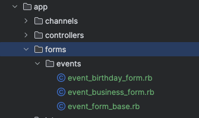
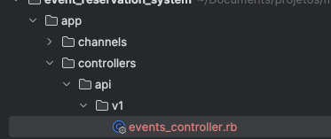
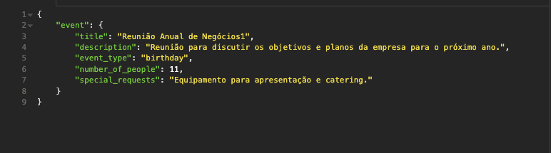
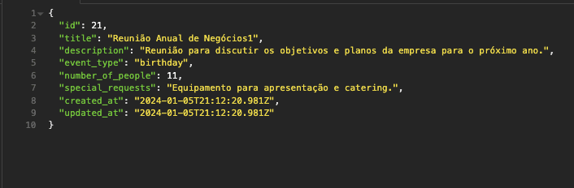
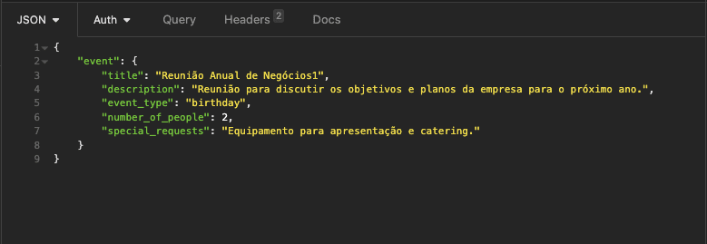
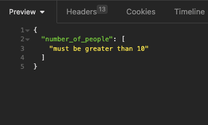

При создании веб-приложений на Ruby on Rails работа со сложностью форм и входящих данных может быстро превратиться в проблему. Часто возникает соблазн включить бизнес-логику непосредственно в модели, что может привести к появлению плотного и сложного в обслуживании кода. Решение? Объекты форм.

Эти простые, но мощные структуры предлагают элегантный способ манипулирования и проверки форм и параметров в соответствии с бизнес-правилами, при этом не допуская этой сложности в модели. В этом посте мы рассмотрим использование объектов форм для создания четкого и эффективного уровня манипулирования данными, гарантирующего, что только правильно проверенные и отформатированные данные попадут в наши модели.

Для этого мы создадим проект по бронированию мероприятий.

## Контекст

Наша система бронирования мероприятий должна обрабатывать два типа событий: дни рождения и деловые мероприятия. Для каждого типа событий существуют свои правила валидации, которые немного отличаются друг от друга:

События, связанные с днем рождения (`birthday`): Количество человек должно быть больше 10.

Корпоративные мероприятия (`business`): Количество человек должно быть больше 5.

Эти правила просты, но они иллюстрируют, что потребности в валидации могут значительно отличаться в зависимости от контекста мероприятия.

## Создание проекта

Шаг 1: Создайте новый проект Rails

`# ruby 3.2.2 # rails 7 rails new event_reservation_system --api`

Шаг 2: Перейдите в каталог проекта

`cd event_reservation_system rails db:create`

Шаг 3: Создайте модель событий

```bash
rails generate model Event \
  title:string \
  description:text \
  event_type:string \
  number_of_people:integer \
  special_requests:text
```

Шаг 4: Запуск миграций

`rails db:migrate`

Шаг 5: Создайте контроллер событий
Теперь создайте контроллер событий. Этот контроллер будет использоваться для обработки HTTP-запросов на создание, чтение, обновление и удаление событий:

`rails generate controller api/v1/events`.

Шаг 6: Определите маршруты

`Rails.application.routes.draw do namespace :api do namespace :v1 do resources :events end end`.

В основе нашего проекта `event_reservation_system` лежит элегантный и эффективный подход к обработке условных валидаций в Ruby on Rails с использованием Form Objects. В частности, мы продемонстрируем, как различные типы событий могут иметь различные правила валидации, и как объекты форм делают этот процесс более управляемым и чистым.

## Использование объектов форм

Мы могли бы реализовать эти проверки непосредственно в моделях, но это быстро сделало бы модели сложными и трудными для поддержки, особенно по мере усложнения бизнес-правил. Вместо этого давайте воспользуемся объектами форм.

С помощью объектов форм мы можем инкапсулировать логику проверки, специфичную для каждого типа события, в отдельный объект. Это не только сохранит нашу модель `Event` чистой и сфокусированной, но и позволит нам более эффективно управлять сложностью.

Демонстрация кода



```ruby
# frozen_string_literal: true

module Events
  class EventFormBase
    include ActiveModel::Model
    attr_accessor :title, :description, :event_type, :number_of_people, :special_requests
    validates :title, :event_type, :number_of_people, presence: true

    def attributes
      {
        title:,
        description:,
        event_type:,
        number_of_people:,
        special_requests:
      }
    end
  end
end
```

```ruby
# frozen_string_literal: true
module Events
  class EventBusinessForm < Events::EventFormBase
    validates :number_of_people, numericality: { greater_than: 5 }
  end
end
```

```ruby
# frozen_string_literal: true
module Events
  class EventBirthdayForm < Events::EventFormBase
    validates :number_of_people, numericality: { greater_than: 10 }
  end
end
```

В этом примере мы разработали базовый объект формы и на его основе создали два специализированных объекта формы: один для событий ”день рождения” и один для событий ”бизнес”.

Наша модель настроена, как показано ниже, и важно помнить, что в саму модель все еще можно включить валидации. Однако они, как правило, больше сосредоточены на аспектах, связанных с целостностью данных в базе данных, а не на конкретных бизнес-правилах. (В этом примере я не добавлял никаких валидаций)

Класс Event < ApplicationRecord enum event_type: { business: ‘business’, birthday: ‘birthday’ } end `.

И контроллер:



Помните, что этот контроллер должен быть более ”узким”, основное внимание здесь уделяется объекту формы

```ruby
# frozen_string_literal: true

module Api
  module V1
    class EventsController < ApplicationController
      class InvalidEventTypeError < StandardError; end

      INVALID_EVENT_TYPE_MSG = 'Invalid event type'

      def create
        form = build_event_form(event_params)
        return render json: form.errors, status: :unprocessable_entity unless form.valid?

        create_event(form.attributes)
      rescue InvalidEventTypeError => e
        render json: { error: e.message }, status: :bad_request
      end

      private

      def create_event(attributes)
        event = Event.new(attributes)
        if event.save
          render json: event, status: :created
        else
          render json: event.errors, status: :unprocessable_entity
        end
      end

      def build_event_form(params)
        case params[:event_type]
        when Event.event_types[:birthday]
          Events::EventBirthdayForm.new(event_params)
        when Event.event_types[:business]
          Events::EventBusinessForm.new(event_params)
        else
          raise InvalidEventTypeError, INVALID_EVENT_TYPE_MSG
        end
      end

      def event_params
        params.require(:event).permit(:title, :description, :event_type, :number_of_people, :special_requests)
      end
    end
  end
end
```

В этом примере в нашем контроллере метод `build_event_form` играет решающую роль. Вы можете заметить, что в зависимости от значения `params[:event_type]` он направляет к другому объекту формы. Такой подход позволяет с легкостью масштабировать нашу систему для работы с различными типами событий и новыми правилами валидации.

Важное замечание: текущая структура этого метода, использующая `case`, довольно проста. Однако в более сложном сценарии или для большей масштабируемости мы могли бы рассмотреть возможность реализации такого паттерна проектирования, как Factory. Подробнее об этом будет рассказано в одном из следующих постов.

В методе create нашего контроллера есть логика, которая сначала создает объект формы с помощью build_event_form и проверяет его валидность. Если форма действительна, мы переходим к созданию события. Интересно отметить, что некоторые люди предпочитают инкапсулировать создание события непосредственно в самом объекте формы. Это вполне жизнеспособный подход, который может предложить большую инкапсуляцию бизнес-логики. Ниже приведен пример того, как это можно сделать.

Пример в контроллере

```ruby
def create
  form = build_event_form(event_params)
  unless form.valid?
    return render json: form.errors, status: :unprocessable_entity
  end
  event = form.create
  render json: event, status: :created
rescue InvalidEventTypeError => e
  render json: { error: e.message }, status: :bad_request
end
```

Использование в EventFormBase

```ruby
# frozen_string_literal: true
module Events
  class EventFormBase
    include ActiveModel::Model

    attr_accessor :title, :description, :event_type, :number_of_people, :special_requests

    validates :title, :event_type, :number_of_people, presence: true

    def attributes
      { title: title, description: description, event_type: event_type, number_of_people: number_of_people, special_requests: special_requests }
    end

    def create
      Event.create!(attributes)
    end
  end
end
```

При таком подходе за создание события отвечает метод create в EventFormBase, что делает контроллер более компактным и делегирует ответственность за создание события объекту формы.

Чтобы было проще понять, я включил несколько примеров из Postman/Insomnia. В этих примерах вы найдете демонстрацию сообщений о проверке, а также примеры успеха для каждого типа запроса. Это поможет вам лучше представить себе, как обрабатывается каждый сценарий и какие ответы он дает.

## День рождения

Url: http://localhost:3000/api/v1/events/

Удачный случай




Случай с проверкой




Надеюсь, вы нашли это погружение в Объекты форм в Ruby on Rails полезным. Если вы хотите увидеть больше подробностей о проекте event_reservation_system, включая полную реализацию и другие интересные возможности, загляните в репозиторий на моем GitHub: https://github.com/rodrigonbarreto/event_reservation_system.

У нас еще много интересного в этой теме, так что следите за новыми постами о Rails и других технологиях и паттернах разработки. Увидимся в следующий раз!
