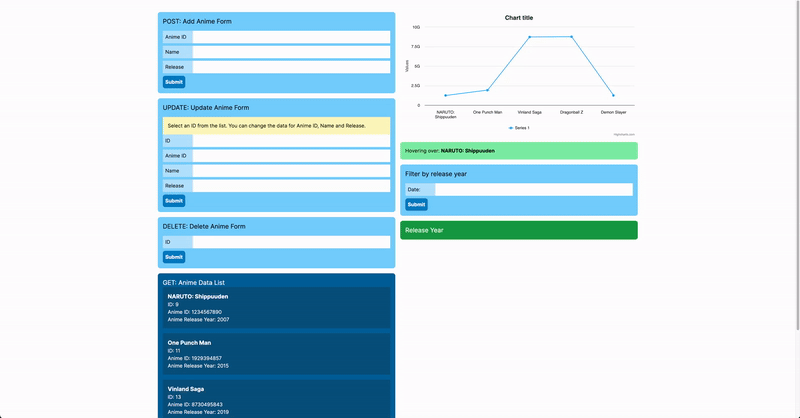
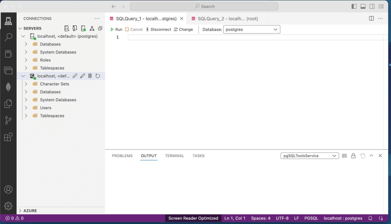
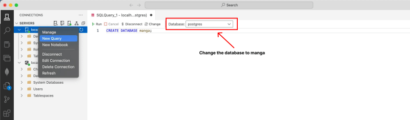
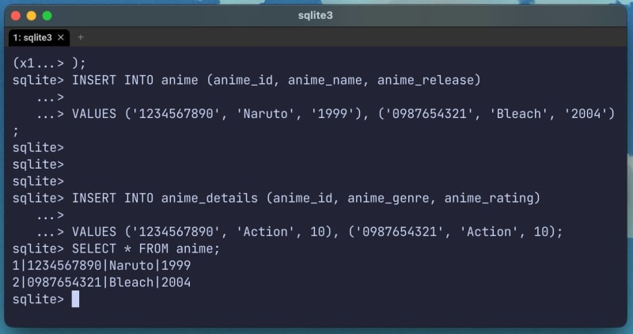
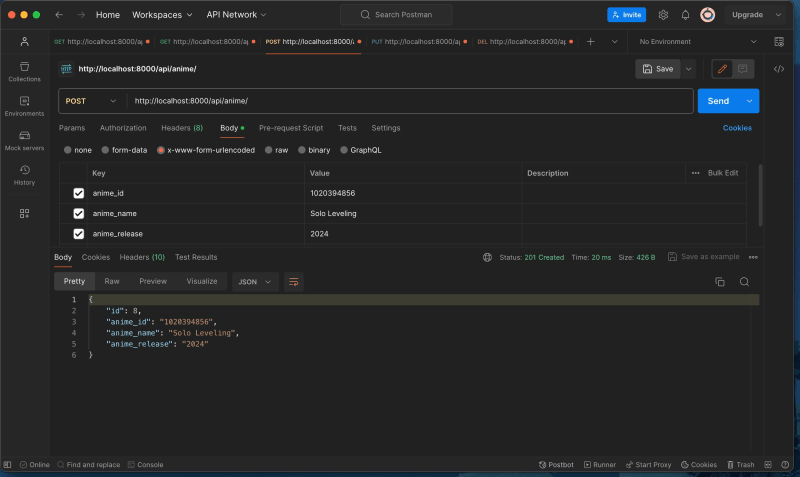
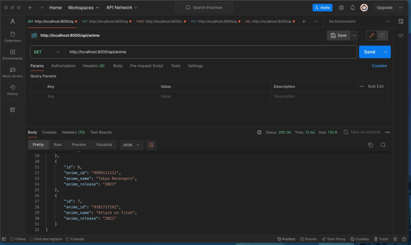
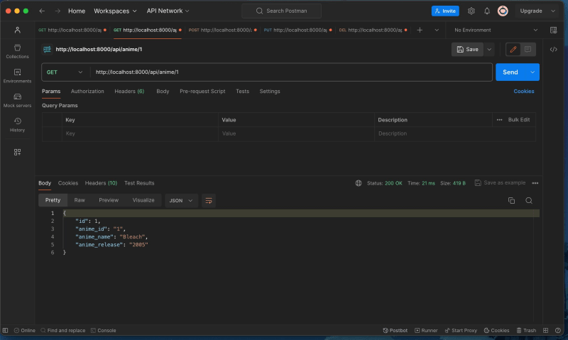
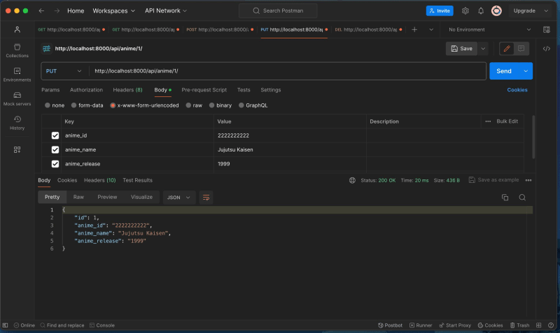
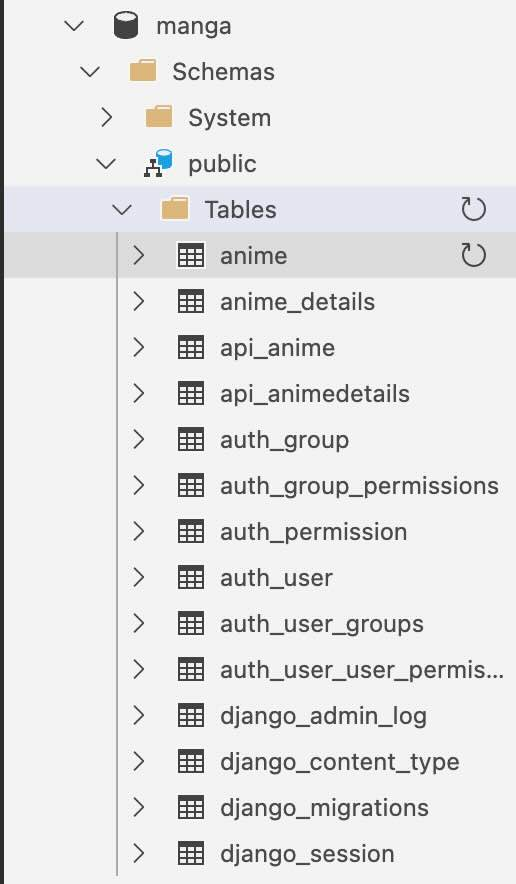
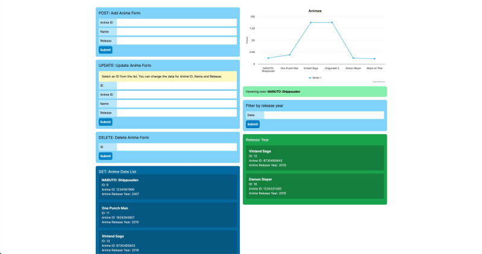

Сегодня мы получим краткое представление о том, что такое работа над проектами в качестве разработчика в составе команды внутри компании. Мы будем создавать приложение для дашборда, которое имеет два бэкенда. Один будет создан с помощью Node.js, а другой - с помощью Django. Фронтенд будет создан с помощью Next.js и Tailwind. Дашборд используется для добавления аниме в базу данных. Вы можете выполнять полные CRUD-действия, фильтровать по году выпуска, а данные будут отображаться в виде графика.

[

Этот проект будет разделен на 3 части:

1. Рабочий процесс проекта Jira
2. Создание бэкенда
3. Создание фронтенда

Вы можете найти полную кодовую базу на GitHub здесь [Anime Dashboard App](https://github.com/andrewbaisden/anime-dashboard-app).

Покончив со вступлением, перейдем к рабочему процессу проекта Jira.

## [](#jira-project-workflow)Рабочий процесс проекта Jira

Владелец продукта и команда разработчиков часто получают помощь от Скрам-мастера при создании проекта. Этот этап может быть разным для каждой компании, и это лишь один из примеров того, как это может быть сделано.

1. Создание проекта в Jira
2. Создайте эпики, истории, ошибки и задачи в разделе бэклога, а затем решите, какие из них добавить в следующий спринт.
3. Используйте confluence для документации и управления проектом
4. Начните спринт

У разработчика может быть установлено несколько инструментов, в том числе:

- репозиторий GitHub для проекта
- Slack или альтернатива
- Jira или альтернативный вариант
- IDE или редактор кода и среда разработки, настроенная для работы
- Инструмент тестирования API для бэкенда (Postman, Insomnia, REST Client, Swagger и т.д…)

Теперь давайте посмотрим на пример того, как может выглядеть рабочий процесс разработчика в проекте в следующем разделе.

## [](#developer-workflow)Рабочий процесс разработчика

Этот пример может относиться к любому разработчику, работающему в команде. Им потребуется:

1. Взять тикет Jira из текущего спринта или бэклога, затем назначить его себе и работать над ним, изменив его статус с to do на in progress
2. Создать новую ветку разработки для тикета с названием, соответствующим тикету, чтобы его можно было легко найти, например feature-123, bug-123, task-123 и т. д..
3. Работайте над историей и, когда закончите, внесите изменения в репозиторий, чтобы они прошли через рабочий процесс CI/CD, создав запрос на внесение изменений (PR) и изменив статус на ”на рассмотрении”.
4. Добавьте PR в историю Jira в виде веб-ссылки или аналогичного документа.
5. Поделитесь историей, над которой вы работали, в командном чате, например в Slack, с соответствующим сообщением, чтобы другой разработчик мог ознакомиться с вашими изменениями.

Например, “PR для [https://project/browse/feature-123](https://project/browse/feature-123) готов к просмотру”.

Другой разработчик проверит PR, одобрит его и объединит, если все тесты пройдут и не будет ошибок.

Теперь повторите процесс, вернувшись к шагу 1 и взяв другой тикет для работы.

После этого краткого объяснения давайте перейдем к необходимым условиям для этого проекта.

## [](#prerequisites)Prerequisites

- Установлен PostgreSQL
- Установлен MySQL
- Установлен SQLite
- Установлена система управления базами данных (Azure Data Studio или альтернатива)
- Установлены Node и npm
- Установлен Python с [virtualenv](https://pypi.org/project/virtualenv/) или альтернативный вариант

Теперь, когда все необходимые условия выполнены, давайте начнем!

## [](#building-the-backend)Создание бэкенда

Предположим, что разработчик бэкенда получил тикет из Jira на настройку архитектуры бэкенда. Первым этапом будет настройка баз данных SQL.

### [](#setup-a-sql-database)Настройка базы данных SQL

Нашему приложению понадобится только одна база данных, однако я включил шаги по созданию базы данных для PostgreSQL, MySQL и SQLite, так что вы можете использовать любую из них по своему усмотрению.

#### [](#postgresql-and-mysql-database-setup)Настройка баз данных PostgreSQL и MySQL

Подключитесь к базам данных PostgreSQL и MySQL с помощью Azure Data Studio или выбранного вами инструмента управления базами данных. Вот как выглядит моя настройка в Azure Data Studio, если вы используете Visual Studio Code, вы легко привыкнете к дизайну, потому что они оба сделаны Microsoft.



Вот так можно создать базу данных с помощью Azure Data Studio. Пожалуйста, убедитесь, что вы изменили базу данных с Postgres или MySQL после выполнения SQL-запроса ниже. Мы хотим создать наши таблицы в базе данных манги, а не по умолчанию.

Теперь создайте базу данных SQL, выполнив приведенный ниже запрос в выбранном вами приложении для работы с базами данных:

`CREATE DATABASE manga;`.



Затем выберите базу данных, которую вы только что создали, и создайте таблицу с первичным ключом. SQL для первичных ключей различается для PostgreSQL и MySQL, однако SQL для всех остальных свойств остается одинаковым.

Эти SQL-запросы, по сути, создают две таблицы под названием `anime` и `anime_details` в нашей базе данных манги. Столбцы и типы данных не требуют пояснений, как вы можете видеть ниже. В обеих таблицах есть столбец `anime_id`, который мы будем использовать позже для объединения обеих таблиц с помощью предложения SQL join.

Скопируйте, вставьте и запустите SQL-запросы в соответствующие базы данных:

##### [](#postgresql-table-setup)Настройка таблиц PostgreSQL

```sql
CREATE TABLE anime (
    id SERIAL PRIMARY KEY,
    anime_id VARCHAR(10),
    anime_name VARCHAR(100),
    anime_release VARCHAR(10)
);

CREATE TABLE anime_details (
    id SERIAL PRIMARY KEY,
    anime_id VARCHAR(10),
    anime_genre VARCHAR(50),
    anime_rating INT
);
```

###### [](#mysql-table-setup)Настройка таблиц MySQL

```sql
CREATE TABLE anime (
    id INT AUTO_INCREMENT PRIMARY KEY,
    anime_id VARCHAR(10),
    anime_name VARCHAR(100),
    anime_release VARCHAR(10)
);

CREATE TABLE anime_details (
    id INT AUTO_INCREMENT PRIMARY KEY,
    anime_id VARCHAR(10),
    anime_genre VARCHAR(50),
    anime_rating INT
);
```

В следующем разделе мы повторим тот же процесс, но на этот раз для базы данных SQLite. Прежде чем мы начнем, создайте на вашем компьютере папку для проекта приборной панели под названием **anime-dashboard-app**.

##### [](#sqlite-database-setup)Настройка базы данных SQLite

Azure Data Studio в настоящее время не поддерживает базы данных SQLite. Поэтому вы можете либо использовать командную строку для управления базой данных, либо найти приложение с графическим интерфейсом, которое поддерживает SQLite. Вот как выглядит база данных SQLite при использовании командной строки:

[

С помощью приложения терминала войдите в папку **anime-dashboard-app**, а затем с помощью командной строки создайте базу данных SQLite, используя приведенный ниже код:

``sqlite3 manga.db`.

Теперь нам нужно создать несколько таблиц для нашей базы данных SQLite. Они будут такими же, как и те, которые мы создали для баз данных PostgreSQL и MySQL, однако SQL-запросы будут другими. Скопируйте и вставьте этот код в терминал, чтобы запустить запрос:

```sql
CREATE TABLE anime (
    id INTEGER PRIMARY KEY AUTOINCREMENT,
    anime_id VARCHAR(10),
    anime_name VARCHAR(100),
    anime_release VARCHAR(10)
);

CREATE TABLE anime_details (
    id INTEGER PRIMARY KEY AUTOINCREMENT,
    anime_id VARCHAR(10),
    anime_genre VARCHAR(50),
    anime_rating INT
);
```

После того как мы создали базу данных и таблицы, следующим этапом будет добавление данных в базу, что мы и сделаем в следующем разделе.

##### [](#creating-sql-statements-for-our-sql-databases)Создание SQL-запросов для наших SQL-баз данных

Настало время создать SQL-запросы, которые мы будем использовать для обеспечения полной функциональности CRUD (Create, Read, Update, Delete) в наших базах данных. Эти SQL-запросы будут работать со всеми нашими SQL-базами данных.

Начнем с SQL-запроса для создания данных.

###### [](#create)CREATE

Приведенный ниже SQL-запрос вставляет данные в обе таблицы. Все, что вам нужно сделать, это запустить запрос в базах данных, которые мы создали, как и раньше:

```sql
INSERT INTO anime (anime_id, anime_name, anime_release)
VALUES ('1234567890', 'Naruto', '1999'),
       ('0987654321', 'Bleach', '2004');

INSERT INTO anime_details (anime_id, anime_genre, anime_rating)
VALUES ('1234567890', 'Action', 10),
       ('0987654321', 'Action', 10);
```

Теперь, когда у нас есть данные в наших базах данных, давайте проверим, можем ли мы получить к ним доступ с помощью следующих запросов оператора чтения.

###### [](#read)READ

Если вы выполните эти SQL-запросы в наших базах данных, вы должны увидеть данные, которые мы добавили в таблицы:

`SELECT * FROM anime;`.

`SELECT * FROM anime_details;`

А вот как мы будем считывать данные, используя условие типа ID:

`SELECT * FROM anime WHERE id = '1';`.

`SELECT * FROM anime_details WHERE id = '1';`

С помощью приведенного ниже кода мы можем выполнить внутреннее соединение и объединить обе таблицы по ключу anime_id. Этот SQL-запрос выбирает уникальные ключи для таблицы, чтобы не было дублирования:

```sql
SELECT
    anime.anime_id,
    anime_name,
    anime_genre,
    anime_release,
    anime_rating
FROM
    anime
INNER JOIN
    anime_details
ON
    anime.anime_id = anime_details.anime_id;
```

Если бы мы хотели получить все, включая дубликаты, мы могли бы использовать подстановочный знак:

`SELECT * FROM anime INNER JOIN anime_details ON anime.anime_id = anime_details.anime_id;`.

Далее мы рассмотрим наши обновленные SQL-запросы.

###### [](#update)UPDATE

Для обновления данных в таблицах мы можем использовать эти SQL-запросы в нашей базе данных:

```sql
UPDATE anime
   SET anime_name = 'Dragonball Z',
       anime_release = '1989'
 WHERE anime_id = '1234567890';

UPDATE anime_details
   SET anime_genre = 'Adventure',
       anime_rating = 9
 WHERE anime_id = '1234567890';
```

Теперь мы узнаем, как выполнять обновления с помощью внутренних объединений.

###### [](#performing-an-inner-join)Выполнение INNER JOIN

Внутренние соединения позволяют объединить две таблицы, ссылаясь на записи, которые имеют совпадающие значения в этих таблицах.

Вот как выполняется INNER JOIN в PostgreSQL:

```sql
UPDATE anime
SET anime_name = 'Attack on Titan'
FROM anime_details
WHERE anime.anime_id = anime_details.anime_id
AND anime.anime_id = '0987654321';

UPDATE anime_details
SET anime_genre = 'Fantasy'
WHERE anime_id = '0987654321';
```

А вот так мы бы сделалисделать INNER JOIN в MySQL:

```sql
UPDATE anime
INNER JOIN anime_details ON anime.anime_id = anime_details.anime_id
SET anime.anime_name = 'Attack on Titan', anime_details.anime_genre = 'Fantasy'
WHERE anime.anime_id = '0987654321';
```

SQLite не поддерживает использование INNER JOIN непосредственно в синтаксисе UPDATE, поэтому для достижения желаемого результата вместо этого используется подзапрос:

```sql
UPDATE anime
   SET anime_name = 'Attack on Titan'
 WHERE anime_id = '0987654321';

UPDATE anime_details
   SET anime_genre = 'Fantasy'
 WHERE anime_id = '0987654321';
```

Наконец, давайте посмотрим, как можно удалять данные из наших баз данных.

###### [](#delete)DELETE

Для удаления данных из таблицы используйте такой SQL-запрос:

`DELETE FROM anime WHERE anime_id = '1234567890';`.

Мы закончили с разделом базы данных, и теперь переходим к разделу, в котором мы будем создавать наш внутренний API.

#### [](#build-a-backend-api-with-full-crud)Постройте бэкенд API с полным CRUD

Этот раздел мы разделим на две части. Сначала мы создадим бэкенд для Node.js, а затем для Django.

##### [](#nodejs-backend-project-setup)Настройка проекта бэкенда Node.js

Для создания бэкенда и подключения его к нашим SQL-базам данных мы будем использовать Prisma для настройки [реляционных баз данных](https://www.prisma.io/docs/getting-started/setup-prisma/start-from-scratch/relational-databases-node-postgresql).

Вы все еще должны находиться в папке **anime-dashboard-app**, если это не так, убедитесь в этом, а затем настройте проект в Prisma с помощью этих команд:

```bash
mkdir manga-backend-express
cd manga-backend-express
npm init -y
npm i express nodemon dotenv cors prisma
```

Теперь запустите Prisma CLI с помощью этой команды:

`npx prisma`

А теперь давайте настроим наш проект Prisma с помощью этой команды:

`npx prisma init`.

Теперь откройте проект в вашем редакторе кода, если вы используете VS Code и настроили его на открытие из терминала, вы можете использовать эту команду:

`code .`

Отлично, далее мы подключимся к нашей базе данных SQL с помощью Prisma.

###### [](#connecting-to-the-sql-databases-with-prisma)Подключение к базам данных SQL с помощью Prisma

Используйте следующие настройки для подключения к различным базам данных. Можно подключиться только к одной из этих баз данных, и если вы выполнили все шаги, то у вас должны быть настроены 3 базы данных с данными. Поэтому выберите одну из баз данных для подключения в приведенных ниже настройках:

###### [](#postgresql-setup)Настройка PostgreSQL

Файл находится по адресу `prisma/schema.prisma`.

`datasource db { provider = "postgresql" url = env("DATABASE_URL") }`.

Файл `.env` должен находиться в корневой папке, и в нем будут храниться наши переменные окружения. Это строка соединения, которую мы будем использовать для подключения к базе данных. Вполне возможно, что ваша конфигурация может отличаться, поэтому найдите правильный путь:

`DATABASE_URL="postgresql://postgres:@localhost:5432/manga?schema=public"`.

###### [](#mysql-setup)Настройка MySQL

Файл находится по адресу `prisma/schema.prisma`.

`datasource db { provider = "mysql" url = env("DATABASE_URL") }`.

Файл `.env` должен находиться в корневой папке, и в нем будут храниться переменные окружения. Это строка соединения, которую мы будем использовать для подключения к базе данных. Вполне возможно, что ваша конфигурация может отличаться, поэтому найдите правильный путь:

`DATABASE_URL="mysql://root:@localhost:3306/manga"`.

###### [](#sqlite-setup)Настройка SQLite

Файл находится по адресу `prisma/schema.prisma`.

`datasource db { provider = "sqlite" url = env("DATABASE_URL") }`.

Файл `.env` должен находиться в корневой папке, и в нем будут храниться переменные окружения. Это строка соединения, которую мы будем использовать для подключения к базе данных. Вполне возможно, что ваша конфигурация может отличаться, поэтому найдите правильный путь:

Создайте папку внутри каталога **manga-backend** под названием `database`, а затем переместите созданную нами ранее базу данных SQLite под названием `manga.db` и поместите ее в папку `database`.

`DATABASE_URL="file:../database/manga.db"`.

Мы делаем хорошие успехи, поэтому перейдем к следующему разделу, в котором мы создадим схему нашей базы данных.

###### [](#creating-the-database-schema)Создание схемы базы данных

Мы уже создали нашу базу данных, поэтому мы можем использовать приведенные ниже команды для автоматического создания наших моделей и схемы. Выполните эти команды внутри нашего проекта **manga-backend**, чтобы создать схему для нашей базы данных на основе таблиц, которые мы создали для наших баз данных.

`npx prisma db pull`

`npx prisma generate`

В качестве альтернативы мы можем использовать [Prisma Migrate](https://www.prisma.io/docs/getting-started/setup-prisma/start-from-scratch/relational-databases/using-prisma-migrate-node-postgresql), что означает, что нам придется создавать модели и схемы баз данных вручную.

###### [](#creating-the-express-server-with-crud-endpoints)Создание Express-сервера с конечными точками CRUD

Сначала обновите файл `.env`, добавив в него переменные порта и окружения разработки:

`PORT="8000" ENVIRONMENT="development"`.

Теперь создайте файл `index.js` в корневой папке для **manga-backend-express** и добавьте в него следующий кодсоздадим наш Express-сервер, который подключается к нашей базе данных. Он содержит все наши конечные точки CRUD и даже одну для таблиц INNER JOIN, которая использует необработанные SQL-запросы:

```javascript
const express = require('express');
const { PrismaClient } = require('@prisma/client');
require('dotenv').config();
const cors = require('cors');
const prisma = new PrismaClient();
const app = express();

app.use(cors());
app.use(express.urlencoded({ extended: false }));
app.use(express.json());

// GET ALL
app.get('/api/anime', async (req, res) => {
	const allAnime = await prisma.anime.findMany();
	console.log(allAnime);
	res.json(allAnime);
});

// GET ONE
app.get('/api/anime/:id', async (req, res) => {
	const { id } = req.params;
	const anime = await prisma.anime.findUnique({
		where: { id: Number(id) },
	});
	res.json(anime);
	console.log(anime);
});

// POST
app.post('/api/anime', async (req, res) => {
	const { anime_id, anime_name, anime_release } = req.body;
	const result = await prisma.anime.create({
		data: { anime_id, anime_name, anime_release },
	});
	res.json({ msg: 'Anime added' });
});

// UPDATE
app.put('/api/anime/:id', async (req, res) => {
	const { id } = req.params;
	const { anime_id, anime_name, anime_release } = req.body;
	const post = await prisma.anime.update({
		where: { id: Number(id) },
		data: { anime_id, anime_name, anime_release },
	});
	res.json({ msg: `Anime ${id} updated` });
});

// DELETE
app.delete('/api/anime/:id', async (req, res) => {
	const { id } = req.params;
	const post = await prisma.anime.delete({
		where: { id: Number(id) },
	});
	res.json({ msg: `Anime ${id} deleted` });
});

// GET: Внутреннее соединение (с использованием синтаксиса необработанного SQL-запроса)
app.get('/api/joinedtables', async (req, res) => {
	const users = await prisma.$queryRaw`
    SELECT * FROM anime INNER JOIN anime_details ON anime.anime_id = anime_details.anime_id;
  `;
	res.json(users);
	console.log(users);
});

const port = process.env.PORT || 8000;
if (process.env.ENVIRONMENT === 'development') {
	app.listen(port, () => console.log(`Server running on port ${port}, http://localhost:${port}`));
}
```

Наконец, добавьте эти скрипты запуска в файл `package.json`, чтобы мы могли запустить наш сервер. У нас есть один, который использует node, и другой для нашего сервера разработки, который использует nodemon, чтобы наш сервер мог автоматически обновляться без необходимости останавливать и запускать сервер каждый раз, когда мы вносим изменения.

`Скрипты`: { “start”: “node index.js”, “dev”: “nodemon index.js” },`.

Запустите бэкенд с помощью любой из этих команд и используйте инструмент тестирования API, например Postman, для проверки конечных точек:

`npm run start npm run dev`.

Посмотрите на примеры ниже, чтобы увидеть данные и конечные точки.

###### [](#post-data-endpoint)POST-конечная точка данных

Конечная точка: [http://localhost:8000/api/anime/](http://localhost:8000/api/anime/)



###### [](#get-all-data-endpoint)GET все данные конечной точки

Конечная точка: [http://localhost:8000/api/anime](http://localhost:8000/api/anime)



###### [](#get-by-id-data-endpoint)GET по ID данных конечной точки

Конечная точка: [http://localhost:8000/api/anime/1](http://localhost:8000/api/anime/1)



###### [](#put-data-endpoint)PUT конечная точка данных

Конечная точка: [http://localhost:8000/api/anime/1](http://localhost:8000/api/anime/1)



###### [](#delete-data-endpoint)Удаление конечной точки данных

Конечная точка: [http://localhost:8000/api/anime/1](http://localhost:8000/api/anime/1)


Наш бэкенд Express должен быть подключен к одной из наших баз данных SQL. В следующем разделе мы создадим бэкенд для Django.

##### [](#django-backend-project-setup)Настройка проекта бэкенда Django

Прежде чем начать, мы должны остановить работу нашего Express-сервера, потому что оба сервера будут использовать порт 8000, а на этом порту может работать только один сервер, а не оба. Поэтому убедитесь, что вы находитесь в корневой папке **anime-dashboard-app**, а затем создайте виртуальную среду Python с помощью этих команд в терминале:

> Возможно, вам потребуется использовать другую команду Python для запуска этих предстоящих сценариев кода Python, все зависит от того, как настроена ваша среда разработки. Так что, возможно, вам придется использовать `python` или `python3` для запуска команд. То же самое относится и к использованию `pip` или `pip3` для установки пакетов.

```bash
$ virtualenv manga-backend-django
$ source manga-backend-django/bin/activate
$ pip3 install django
$ pip3 install djangorestframework
$ pip install django-cors-headers
```

С помощью этих команд мы создаем виртуальную среду Python и устанавливаем пакеты для Django и Django Rest Framework. Без виртуальной среды они были бы установлены глобально на наших компьютерах.

Выполните эту команду из корня папки **anime-dashboard-app**, чтобы активировать Pythв среде virtualenv:

`source manga-backend-django/bin/activate`

Когда вы захотите деактивировать окружение, вы можете использовать эту команду. Сейчас нам это не нужно.

`deactivate`

###### [](#connecting-to-the-sql-databases-with-django)Подключение к базам данных SQL с помощью Django

Подключение к различным базам данных требует от нас установки драйверов. Установите следующие драйверы для баз данных, к которым вы собираетесь подключиться. Нам нужно сделать это только для PostgreSQL и MySQL, потому что Django уже должен работать с базами данных SQLite.

### PostgreSQL Databases pip3 install psycopg2 psycopg2-binary ## MySQL Databases pip3 install mysqlclient`.

Теперь нам нужно создать приложение Django, поэтому выполните следующие команды в той же папке:

`cd manga-backend-django django-admin startproject manga cd manga`.

Теперь откройте проект **manga-backend-django** в редакторе кода, если вы этого еще не сделали, потому что мы будем добавлять код в файлы нашей кодовой базы Django.

Далее нам нужно подключиться к нашей базе данных, поэтому используйте примеры подключения к базе данных, приведенные ниже, в качестве ссылки для каждой базы данных и настройте их для своей. Откройте файл `manga/manga/settings.py` в вашем проекте и найдите раздел databases. Объект подключения должен быть очень похож на тот, который мы использовали для нашего приложения Express с Prisma.

###### [](#postgresql)PostgreSQL

`DATABASES = { 'default': { 'ENGINE': 'django.db.backends.postgresql', 'NAME': 'manga', 'USER': 'postgres', 'PASSWORD': '', 'HOST': 'localhost', 'PORT': '5432', } }`

###### [](#mysql)MySQL

`DATABASES = { 'default': { 'ENGINE': 'django.db.backends.mysql', 'NAME': 'manga', 'USER': 'root', 'PASSWORD': '', 'HOST': 'localhost', 'PORT': '3306', } }`

###### [](#sqlite)SQLite

При настройке для баз данных SQLite мы должны убедиться, что наша база данных SQLite находится в правильной папке. Базовая директория - это корневая папка проекта, например, `manga-backend-django/database`. Вы можете просто скопировать папку базы данных из проекта **manga-backend-express** и поместить ее в корневую папку этого проекта.

`DATABASES = { 'default': { 'ENGINE': 'django.db.backends.sqlite3', 'NAME': BASE_DIR / 'database/db.manga', } }`

Отлично, теперь давайте поработаем над следующим шагом, который будет заключаться в выполнении миграции и создании суперпользователя для базы данных.

###### [](#doing-a-python-migration-and-creating-a-super-user-for-our-database)Выполняем миграцию на Python и создаем суперпользователя для нашей базы данных

Убедитесь, что вы находитесь в папке `manga` с файлом `manage.py` и выполните следующие команды. Мы будем использовать миграцию Python для создания всех таблиц для нашей базы данных:

`python3 manage.py migrate`.

Теперь давайте создадим суперпользователя для базы данных, чтобы мы могли получить к ней доступ. Запустите эту команду и выполните все шаги. От вас требуется как минимум имя пользователя и пароль:

`python3 manage.py createsuperuser`.

Завершив настройку, давайте создадим Django-сервер с конечными точками CRUD.

###### [](#creating-the-django-server-with-crud-endpoints)Создание сервера Django с конечными точками CRUD

Сначала нам нужно создать приложение под названием API, поэтому запустите этот код из той же папки с файлом `manage.py`, чтобы создать его:

`django-admin startapp api`.

Теперь настройте Django Rest Framework в `settings.py`, добавив эти пакеты в массив `INSTALLED_APPS = []`:

`‘api.apps.ApiConfig’, ‘rest_framework’, ‘corsheaders’,``.

Чтобы избежать ошибок CORS на фронт-энде, нам нужно будет добавить еще несколько конфигураций в наш файл `settings.py. Сначала добавьте эти модули к существующему массиву MIDDLEWARE в файле:

` django.middleware.common.CommonMiddleware`, ` corsheaders.middleware.CorsMiddleware`,``

Затем добавьте эти конфигурации CORS куда-нибудь в файл:

```javascript
CORS_ALLOWED_ORIGINS = [
    "http://localhost:3000",
    # Добавьте сюда URL вашего фронтенда
]
CORS_ALLOW_METHODS = [
    'DELETE', 'GET', 'OPTIONS', 'PATCH', 'POST', 'PUT'
]
CORS_ALLOW_HEADERS = [
    'accept', 'accept-encoding', 'authorization', 'content-type',
    'dnt', 'origin', 'user-agent', 'x-csrftoken', 'x-requested-with'
]
```

Теперь нам нужно создать наши модели баз данных, поэтому добавьте этот код в файл `api/models.py`:

```py
from django.db import models

class Anime(models.Model):
    id = models.AutoField(primary_key=True)
    anime_id = models.CharField(max_length=10, null=True)
    anime_name = models.CharField(max_length=100, null=True)
    anime_release = models.CharField(max_length=10, null=True)

    def __str__(self):
        return self.anime_name


class AnimeDetails(models.Model):
    id = models.AutoField(primary_key=True)
    anime_id = models.CharField(max_length=10, null=True)
    anime_genre = models.CharField(max_length=50, null=True)
    anime_rating = models.IntegerField(null=True)

    def __str__(self):
        return self.anime_id
```

После определения моделей выполните следующие команды для создания необходимых таблиц базы данных:

`python manage.py makemigrations python manage.py migrate`.

Это создаст таблицы “api_anime” и “api_animedetails” в вашей базе данных а также несколько других. Существующие таблицы для “anime” и “anime_details” уже есть, поэтому для моделей будут созданы новые. Вы можете посмотреть, как это выглядит в Azure Data Studio, здесь:

[

Следующий шаг - создание сериализаторов и представлений API. Сериализаторы преобразуют сложные данные, такие как наборы запросов и экземпляры моделей, в родные для Python типы данных, которые могут быть легко отображены в виде JSON, XML или других типов контента. Создайте файл `api/serializers.py` и добавьте в него этот код:

```python
from rest_framework import serializers
from .models import Anime, AnimeDetails

class AnimeSerializer(serializers.ModelSerializer):
    class Meta:
        model = Anime
        fields = '__all__'

class AnimeDetailsSerializer(serializers.ModelSerializer):
    class Meta:
        model = AnimeDetails
        fields = '__all__'
```

А теперь добавьте этот код в файл `api/views.py`, в котором будут возвращаться данные нашей базы данных:

```python
from django.shortcuts import render
from rest_framework import viewsets
from .models import Anime, AnimeDetails
from .serializers import AnimeSerializer, AnimeDetailsSerializer
from rest_framework.views import APIView
from rest_framework.response import Response
from django.db import connection


class AnimeViewSet(viewsets.ModelViewSet):
    queryset = Anime.objects.all()
    serializer_class = AnimeSerializer


class AnimeDetailsViewSet(viewsets.ModelViewSet):
    queryset = AnimeDetails.objects.all()
    serializer_class = AnimeDetailsSerializer


class JoinedTablesView(APIView):
    def get(self, request):
        try:
            with connection.cursor() as cursor:
                cursor.execute("""
                    SELECT *
                    FROM api_anime
                    INNER JOIN api_animedetails
                    ON api_anime.anime_id = api_animedetails.anime_id;
                """)
                columns = [col[0] for col in cursor.description]
                data = [dict(zip(columns, row)) for row in cursor.fetchall()]
                return Response(data)
        except OperationalError as e:
            # Зафиксируйте исключение или обработайте его соответствующим образом
            return Response({"error": f "Database error: {e}"}, status=500)
```

Итак, далее мы создадим файл `api/urls.py` с этим кодом, в котором мы будем выполнять маршрутизацию для наших конечных точек URL:

```python
from django.urls import path, include
from rest_framework.routers import DefaultRouter
from .views import AnimeViewSet, AnimeDetailsViewSet, JoinedTablesView

router = DefaultRouter()
router.register(r"anime", AnimeViewSet)
router.register(r"anime-details", AnimeDetailsViewSet)

urlpatterns = [
    path("", include(router.urls)),
    path("joinedtables/", JoinedTablesView.as_view(), name="joined-tables"),
]
```

Наконец, замените код в файле `manga/urls.py` на этот код, который содержит наши корневые конечные точки:

```python
from django.contrib import admin
from django.urls import path, include

urlpatterns = [
    path("admin/", admin.site.urls),
    path("api/", include("api.urls")),  # Включить URL-адреса приложения 'api'
]
```

После определения представлений и URL-адресов мы должны выполнить следующие команды для создания необходимых таблиц базы данных. Если вы получаете какие-либо ошибки в консоли, они, скорее всего, связаны с отступами в Python, поэтому попробуйте отформатировать файлы, вызывающие проблемы:

`python3 manage.py makemigrations python3 manage.py migrate`.

На этом мы закончим с этим разделом, поэтому запустите сервер разработки Django, используя приведенный ниже код:

`python3 manage.py runserver`.

Django API должен быть доступен по адресам [http://127.0.0.1:8000/api/anime/](http://127.0.0.1:8000/api/anime/), [http://127.0.0.1:8000/api/anime-details/](http://127.0.0.1:8000/api/anime-details/) и [http://127.0.0.1:8000/api/joinedtables/](http://127.0.0.1:8000/api/joinedtables/) для выполнения CRUD операций над вашими моделями `Anime` и `AnimeDetails`. Как вы можете видеть, Django имеет встроенный фреймворк для тестирования API, называемый Django Rest Framework, поэтому вам не нужно использовать внешний инструмент тестирования API, такой как Postman.

Мы также можем получить доступ к таблицам базы данных в нашей системе управления базами данных (Azure Data Studio) и выполнить над ними CRUD. Просто помните, что в нашем Django-приложении таблицы базы данных будут называться `api_anime` и `api_animedetails`.

**Примечание: Если при использовании API-тестирования с бэкендом Django вы видите следующие ошибки, значит, вам нужно добавить слэш в конце конечной точки URL.**.

> RuntimeError: Вы вызвали этот URL через POST, но URL не заканчивается на слеш и у вас установлен параметр APPEND_SLASH. Django не может перенаправить на URL со слешем, сохраняя данные POST. Измените форму, чтобы она указывала на localhost:8000/api/anime/ (обратите внимание на слэш в конце), или установите APPEND_SLASH=False в настройках Django.
>
> RuntimeError: Вы вызвали этот URL через PUT, но URL не заканчивается на слеш и у вас установлен параметр APPEND_SLASH. Django не может перенаправить на URL со слешем, сохраняя данные PUT. Измените форму, чтобы она указывала на localhost:8000/api/anime/1/ (обратите внимание на слеш в конце), или установите APPEND_SLASH=False в настройках Django.

Если вы столкнулись с новыми ошибками, то, скорее всего, они вызваны неправильным отступом в Python. Мы завершили этот раздел, теперь давайтеТеперь перейдем к последнему разделу, в котором мы создадим фронтенд.

### [](#building-the-frontend)Создание фронтенда

Итак, на этот раз предположим, что разработчик фронтенда получил тикет из Jira на создание пользовательского интерфейса фронтенда. Первым этапом будет создание проекта с использованием фреймворка, в данном случае это будет Next.js.

В этом примере мы интегрируем библиотеку графиков на фронтенде, которая соединяется с бэкендом, имеющим полную функциональность CRUD.

Вот краткое описание того, что мы будем делать:

1. Создайте проект React с помощью Next.js
2. Установите Jest и библиотеку тестирования React с возможностью установки обычных тестов и покрытия тестирования
3. Соберите компоненты и используйте рабочий процесс TDD

Теперь, когда у нас есть обзор задач, давайте приступим.

#### [](#create-a-react-project-using-nextjs)Создание React-проекта с использованием Next.js

Первое, что нам нужно сделать, это с помощью командной строки вернуться в корневую папку нашего проекта, которая называется **anime-dashboard-app**. Теперь создайте проект Next.js и убедитесь, что вы выбрали **Yes** для Tailwind CSS, потому что он нам понадобится позже. Вы можете использовать настройки, которые я использовал здесь:

`npx create-next-app manga-client`.

✔ Хотите ли вы использовать TypeScript? … Нет / **Да**
✔ Хотите ли вы использовать ESLint? … **Нет** / Да
✔ Хотите ли вы использовать Tailwind CSS? … Нет / **Да**
✔ Хотите ли вы использовать каталог `src/`? … Нет / **Да**
✔ Хотите ли вы использовать App Router? (рекомендуется) … Нет / **Да**
✔ Хотите ли вы настроить стандартный псевдоним импорта (@/\*)? … **Нет** / Да

Давайте быстро обсудим тему разделения забот. В информатике разделение задач - это идея дизайна, которая разделяет компьютерную программу на различные части. Каждая часть занимается отдельным вопросом, набором данных, которые влияют на кодирование компьютерной программы. Учитывая это, мы позаботимся о том, чтобы наши папки были четко определены и чтобы в отдельной папке хранились все наши тесты.

Теперь мы создадим структуру папок проекта для наших компонентов, пользовательских хуков и тестовых файлов. У каждого компонента должен быть тест. Убедитесь, что вы запустили этот скрипт из корня папки **manga-client** в терминале:

```bash
mkdir __tests__
touch __tests__/FormDelete.test.js
touch __tests__/FormPostUpdate.test.js
touch jest.config.mjs
cd src/app
mkdir components
cd components
mkdir hooks
mkdir FormDelete
mkdir FormPostUpdate
cd FormDelete
touch FormDelete.js
cd ..
cd FormPostUpdate
touch FormPostUpdate.js
cd ..
cd ..
touch hooks/useFetch.js
touch hooks/useFetchSWR.js
touch hooks/usePost.js
touch hooks/useUpdate.js
touch hooks/useDelete.js
cd ../..
```

Далее мы установим зависимости для нашего проекта, поэтому установите необходимые пакеты с помощью этих команд:

`npm i --save-dev jest @types/jest @testing-library/jest-dom @testing-library/react @testing-library/user-event jest-environment-jsdom react-test-renderer swr`.

Итак, если ваш проект не открыт в редакторе кода, сделайте это сейчас. Следующим шагом будет добавление этих скриптов запуска Jest в файл `package.json`, который мы будем использовать для тестирования наших компонентов:

`"test": "jest --watchAll", "coverage": "jest --collect-coverage --collectCoverageFrom='./src/app/components/**' --coveragePathIgnorePatterns="\\.snap$""`.

Теперь, когда наши тестовые сценарии настроены, нам нужно добавить этот код в файл `jest.config.mjs`, который мы создали, чтобы у нас была рабочая конфигурация Jest, готовая к тому, что мы захотим запустить некоторые тесты:

```javascript
import nextJest from 'next/jest.js';

const createJestConfig = nextJest({
	// Укажите путь к вашему приложению Next.js для загрузки next.config.js и .env файлов в тестовом окружении
	dir: './',
});

// Добавьте любой пользовательский конфиг, который будет передан Jest
/** @type {import('jest').Config} */
const config = {
	// Добавляем дополнительные параметры настройки перед запуском каждого теста
	// setupFilesAfterEnv: ['<rootDir>/jest.setup.js'],
	testEnvironment: 'jest-environment-jsdom',
	coverageThreshold: {
		global: {
			branches: 80,
			functions: 80,
			lines: 80,
			statements: -10,
		},
	},
};

// createJestConfig экспортируется таким образом для того, чтобы next/jest мог загрузить конфиг Next.js, который является асинхронным
export default createJestConfig(config);
```

Эти сценарии запуска тестов должны работать. Если вы запустите их сейчас, тесты будут провалены, потому что мы еще не добавили никакого кода в наши тестовые файлы.

`npm run test npm run coverage`

Итак, наш фронтенд-проект создан, осталось только собрать компоненты и тесты, и тогда наше аниме-приложение для дашборда будет готово!

##### [](#build-components)Сборка компонентов

Начнем с наших компонентов, добавив в файлы компонентов следующий код.

Первым будет наш компонент удаления формы, который находится в папке components. Он расположен по адресу `FormDelete/FormDelete.js`. Этот компонент не требует пояснений, он будет использоваться для удаления аниме из нашей базы данных.

```javascript
import { useState } from 'react';
import { useDelete } from '@/app/hooks/useDelete';

export default function FormDelete() {
	const [id, setId] = useState('');
	const { deleteRequest } = useDelete();

	const handleDeleteForm = async (e) => {
		e.preventDefault();
		if (id === '') {
			console.log('Form needs an id to be submitted');
		} else {
			try {
				deleteRequest(`http://127.0.0.1:8000/api/anime/${id}/`);
				console.log(`Anime ${id} deleted`);
				setId('');
			} catch (error) {
				console.log(error);
			}
		}
	};

	return (
		<>
			<form onSubmit={(e) => handleDeleteForm(e)}>
				<div className="mb-2 flex flex-wrap items-center bg-sky-200">
					<label className="w-24 p-2">ID</label>
					<input
						type="text"
						value={id}
						onChange={(e) => setId(e.target.value)}
						className="grow p-2"
						required
					/>
				</div>
				<div>
					<button
						type="submit"
						className="cursor-pointer rounded-lg bg-sky-600 p-2 font-bold text-white"
					>
						Submit
					</button>
				</div>
			</form>
		</>
	);
}
```

Далее идет форма для добавления и обновления аниме в базе данных, файл находится по адресу `FormPostUpdate/FormPostUpdate.js`. Добавьте код в этот файл:

```javascript
import React, { useState } from 'react';
import { usePost } from '../../hooks/usePost';
import { useUpdate } from '.././hooks/useUpdate';

export default function FormPostUpdate({ crudType }) {
	const [id, setId] = useState('');
	const [animeId, setAnimeId] = useState('');
	const [animeName, setAnimeName] = useState('');
	const [animeRelease, setAnimeRelease] = useState('');
	const { postRequest } = usePost();
	const { updateRequest } = useUpdate();

	const handlePostUpdateForm = async (e, type) => {
		e.preventDefault();
		if (animeId === '' || animeName === '' || animeRelease === '') {
			console.log('Form needs data to be submitted');
		} else {
			try {
				const anime = {
					anime_id: animeId,
					anime_name: animeName,
					anime_release: animeRelease,
				};
				if (type === 'posted') {
					postRequest('http://127.0.0.1:8000/api/anime/', anime);
					console.log(`Anime ${type}`);
					setId('');
					setAnimeId('');
					setAnimeName('');
					setAnimeRelease('');
				} else if (type === 'updated' && id !== '') {
					updateRequest(`http://127.0.0.1:8000/api/anime/${id}/`, anime);
					console.log(`Anime ${type}`);
					setId('');
					setAnimeId('');
					setAnimeName('');
					setAnimeRelease('');
				}
			} catch (error) {
				console.log(error);
			}
		}
	};

	return (
		<>
			<form onSubmit={(e) => handlePostUpdateForm(e, crudType)}>
				{crudType === 'updated' ? (
					<div className="mb-2 flex flex-wrap items-center bg-sky-200">
						<label className="w-24 p-2">ID</label>
						<input
							type="text"
							value={id}
							onChange={(e) => setId(e.target.value)}
							className="grow p-2"
							required
						/>
					</div>
				) : (
					<></>
				)}
				<div className="mb-2 flex flex-wrap items-center bg-sky-200">
					<label className="w-24 p-2">Anime ID</label>
					<input
						type="text"
						value={animeId}
						onChange={(e) => setAnimeId(e.target.value)}
						className="grow p-2"
						required
					/>
				</div>
				<div className="mb-2 flex flex-wrap items-center bg-sky-200">
					<label className="w-24 p-2">Name</label>
					<input
						type="text"
						value={animeName}
						onChange={(e) => setAnimeName(e.target.value)}
						className="grow p-2"
						required
					/>
				</div>
				<div className="mb-2 flex flex-wrap items-center bg-sky-200">
					<label className="w-24 p-2">Релиз</label>
					<input
						type="text"
						value={animeRelease}
						onChange={(e) => setAnimeRelease(e.target.value)}
						className="grow p-2"
						required
					/>
				</div>
				<div>
					<button
						type="submit"
						className="cursor-pointer rounded-lg bg-sky-600 p-2 font-bold text-white"
					>
						{' '}
						Submit{' '}
					</button>
				</div>
			</form>
		</>
	);
}
```

Далее давайте займемся файлом `Page.js`, который является главным файлом для всего нашего приложения. Именно здесь будут располагаться все наши компоненты, поэтому замените весь код на этот:

```javascript
import FormPostUpdate from './components/FormPostUpdate/FormPostUpdate';
import FormDelete from './app/components/FormDelete/FormDelete';
import { useFetch } from './hooks/useFetch';
import { useFetchSWR } from './hooks/useFetchSWR';

export default function Home() {
  // Откомментируйте код ниже и закомментируйте код "useFetch", если вы хотите использовать SWR для получения данных --> https://swr.vercel.app/docs/with-nextjs
  // const { data, error, isLoading } = useFetchSWR(
  // 'http://127.0.0.1:8000/api/anime/'
  // );

  // Используется Fetch API для получения данных
  const { data, error, isLoading } = useFetch('http://127.0.0.1:8000/api/anime/');

  if (error) return <div>An error has occurred.</div>;
  if (isLoading) return <div>Loading...</div>;

  console.log(data);

  return (
    <>
      <div className="container mx-auto mt-10">
        <div className="bg-sky-300 rounded-lg p-4 mb-4">
          <h1 className="text-xl mb-4">POST: Добавить форму Аниме</h1>
          <FormPostUpdate crudType="posted" />
        </div>
        <div className="bg-sky-300 rounded-lg p-4 mb-4">
          <h1 className="text-xl mb-4">UPDATE: Обновить форму Аниме</h1>
          <p className="bg-yellow-100 p-4"> Выберите ID из списка. Вы можете изменить данные для ID, названия и релиза аниме.  <FormPostUpdate crudType="updated" />
        </div>
        <div className="bg-sky-300 rounded-lg p-4 mb-4">
          <h1 className="text-xl mb-4">DELETE: Delete Anime Form</h1>
          <FormDelete />
        </div>
        <div className="bg-sky-700 rounded-lg p-4 mb-4 text-white">
          <h1 className="text-xl">GET: Список данных аниме</h1>
          {data.map((anime) => (
            <div key={anime.id}>
              <ul className="bg-sky-800 mb-4 p-4">
                <li>
                  <h1 className="text-lg font-bold">{anime.anime_name}</h1>
                </li>
                <li>ID: {anime.id}</li>
                <li>Anime ID: {anime.anime_id}</li>
                <li>Anime Release Year: {anime.anime_release}</li>
              </ul>
            </div>
          ))}
        </div>
      </div>
    </>
  );
}
```

Наши основные компоненты готовы, в следующем разделе мы создадим несколько тестовых файлов.

##### [](#setting-up-our-test-files)Настройка наших тестовых файлов

Для двух компонентов формы, которые мы создали, будет два тестовых файла. Эти тестовые файлы не имеют полного покрытия тестами, они проверяют только то, что компонент отрисовался без сбоев. Вы можете добавить больше тестов, если захотите. Наш тестовый файл находится в корневой папке проекта и называется `__tests__`.

Начните с добавления этого теста в файл удаления формы, расположенный в `FormDelete.test.js`.

```javascript
import { render } from '@testing-library/react';
import FormDelete from '../src/app/components/FormDelete/FormDelete';

describe('component renders', () => {
	test('component does not crash', () => {
		render(<FormDelete />);
	});
});
```

И, наконец, добавьте этот код в файл пост-обновления формы, расположенный в `FormPostUpdate.test.js`.

```javascript
import { render } from '@testing-library/react';
import FormPostUpdate from '../src/app/components/FormPostUpdate/FormPostUpdate';

describe('Form component', () => {
	test('рендерит без сбоев', () => {
		render(<FormPostUpdate />);
	});
});
```

Теперь давайте создадим наши многоразовые крючки в следующем разделе для всех CRUD-запросов бэкенда, которые мы создали ранее.

##### [](#creating-our-custom-hooks)Создание наших пользовательских крючков

Первый пользовательский хук, который мы создадим, будет предназначен для получения данных из нашего бэкенда.

###### [](#get-requests)GET-запросы

В этой секции доступны два пользовательских хука, но нам нужно использовать только один из них. Эта версия использует Fetch API, и файл находится в `hooks/useFetch.js`, так что добавьте этот код в файл. Он также имеет настройку опроса, что означает, что он может автоматически периодически получать данные из нашего API, так что нам не придется вручную обновлять страницу после выполнения CRUD-действия.

Это простая функция, которая вызывает функцию fetch data каждые 2 секунды и может быть настроена на увеличение или уменьшение времени. Это простая в реализации функция, которая не требует использования сторонних библиотек, таких как WebSockets. Конечно, использование WebSockets было бы гораздо лучшей реализацией, но для этого простого демонстрационного приложения вполне достаточно.

```javascript
import { useState, useEffect } from 'react';

export function useFetch(url) {
	const [data, setData] = useState([]);
	const [error, setError] = useState(null);
	const [isLoading, setIsLoading] = useState(null);

	useEffect(() => {
		const fetchData = async () => {
			try {
				const json = await fetch(url).then((r) => r.json());
				setIsLoading(false);
				setData(json);
			} catch (error) {
				setError(error);
				setIsLoading(false);
			}
		};

		fetchData();

		const pollInterval = setInterval(() => {
			fetchData();
		}, 2000);

		return () => {
			clearInterval(pollInterval);
		};
	}, [url]);

	return { data, error, isLoading };
}
```

Эта альтернативная версия использует [SWR](https://swr.vercel.app/) и файл находится в `hooks/useFetchSWR`, поэтому добавьте код в него. Вы можете выбрать, какую версию использовать, посмотрев на комментарии в основном файле `page.js`.

```javascript
import useSWR from 'swr';

const fetcher = (url) => fetch(url).then((res) => res.json());

export function useFetchSWR(url) {
	const { data, error, isLoading } = useSWR(url, fetcher);
	return { data, error, isLoading };
}
```

Итак, переходим к работе над хуком пост-запроса.

###### [](#post-requests)POST-запросы

Файл находится в `hooks/usePost.js`, и этот хук используется для добавления аниме в нашу базу данных, поэтому добавьте этот код в файл:

```javascript
import { useState } from 'react';

export function usePost() {
	const [isLoading, setIsLoading] = useState(false);
	const [error, setError] = useState(null);
	const [response, setResponse] = useState(null);

	const postRequest = async (url, formData) => {
		setIsLoading(true);
		setError(null);
		setResponse(null);

		try {
			const response = await fetch(url, {
				method: 'POST',
				headers: {
					'Content-Type': 'application/json',
				},
				body: JSON.stringify(formData),
			});

			const responseData = await response.json();

			if (response.ok) {
				setResponse(responseData);
			} else {
				setError(responseData);
			}
		} catch (error) {
			setError(error);
		} finally {
			setIsLoading(false);
		}
	};

	return { isLoading, error, response, postRequest };
}
```

Итак, перейдем к хуку обновления.

###### [](#update-requests)UPDATE Requests

Мы можем найти файл в `hooks/useUpdate.js` Этот хук предназначен для обновления наших данных в базе данных, поэтому добавьте этот код в файл:

```javascript
import { useState } from 'react';

export function useUpdate() {
  const [isLoading, setIsLoading] = useState(false);
  const [error, setError] = useState(null);
  const [respoundefined;

  const filterDate = data.filter((a) => a.anime_release === animeDate);
  console.log(filterDate);
  setFilterAnimeDate(filterDate);
  setAnimeDate('');

  return (
    <>
      <div>
        <HighchartsReact highcharts={Highcharts} options={chartOptions} />
        <p className="bg-green-300 p-4 mb-4 mt-4 rounded-lg">
          Hovering over: <span className="font-bold">{hoverData}</span>
        </p>
      </div>
      <form onSubmit={handleFilterAnime}>
        <div className="bg-sky-300 rounded-lg p-4 mb-4">
          <div>
            <h1 className="text-xl mb-4">Filter by release year</h1>
            <div className="bg-sky-200 flex flex-wrap items-center mb-2">
              <label className="p-2 w-24">Date:</label>
              <input
                type="text"
                value={animeDate}
                onChange={(e) => setAnimeDate(e.target.value)}
                className="grow p-2"
                required
              />
            </div>
            <div>
              <button
                type="submit"
                className="bg-sky-600 p-2 text-white cursor-pointer font-bold rounded-lg"
              >
                Submit
              </button>
            </div>
          </div>
        </div>
      </form>
      <div className="bg-green-600 p-4 rounded-lg">
        <h1 className="text-xl text-white">Release Year</h1>
        {filterAnimeDate === 0 ? (
          <></>
        ) : (
          <>
            {filterAnimeDate.map((anime) => (
              <div key={anime.id} className="mt-4 text-white">
                <ul className="bg-green-700 mb-4 p-4">
                  <li>
                    <h1 className="text-lg font-bold">{anime.anime_name}</h1>
                  </li>
                  <li>ID: {anime.id}</li>
                  <li>Anime ID: {anime.anime_id}</li>
                  <li>Anime Release Year: {anime.anime_release}</li>
                </ul>
              </div>
            ))}
          </>
        )}
      </div>
    </>
  );
}
```

Ок, почти готово, теперь создайте тестовый файл `Chart.test.js` внутри папки `__tests__` и добавьте этот код для тестового файла графика:

```javascript
import { render } from '@testing-library/react';
import Chart from '../src/app/components/Chart/Chart';

describe('it renders', () => {
	test('Chart component loads', () => {
		render(<Chart />);
	});
});
```

Наконец, обновите файл `Page.js` с этим кодом, чтобы наш компонент графика теперь мог отображаться на странице, и все готово!

```js
import React from 'react';
import FormPostUpdate from './components/FormPostUpdate/FormPostUpdate';
import FormDelete from '../app/components/FormDelete/FormDelete';
import { useFetch } from './hooks/useFetch';
import { useFetchSWR } from './hooks/useFetchSWR';
import Chart from './components/Chart/Chart';

export default function Home() {
	const { data, error, isLoading } = useFetch('http://127.0.0.1:8000/api/anime/');

	if (error) return <div>An error has occurred.</div>;
	if (isLoading) return <div>Loading...</div>;

	console.log(data);

	return (
		<>
			<div className="container mx-auto mt-10 grid gap-4 sm:grid-cols-1 md:grid-cols-2 lg:grid-cols-2">
				<div>
					<div className="mb-4 rounded-lg bg-sky-300 p-4">
						<h1 className="mb-4 text-xl">POST: Add Anime Form</h1>
						<FormPostUpdate crudType="posted" />
					</div>
					<div className="mb-4 rounded-lg bg-sky-300 p-4">
						<h1 className="mb-4 text-xl">UPDATE: Update Anime Form</h1>
						<p className="bg-yellow-100 p-4">
							Select an ID from the list. You can change the data for Anime ID, Name and Release.
							<FormPostUpdate crudType="updated" />
						</p>
					</div>
					<div className="mb-4 rounded-lg bg-sky-300 p-4">
						<h1 className="mb-4 text-xl">DELETE: Delete Anime Form</h1>
						<FormDelete />
					</div>
					<div className="mb-4 rounded-lg bg-sky-700 p-4 text-white">
						<h1 className="text-xl">GET: Anime Data List</h1>
						{data.map((anime) => (
							<div key={anime.id}>
								<ul className="mb-4 bg-sky-800 p-4">
									<li>
										<h1 className="font-bold text-lg">{anime.anime_name}</h1>
									</li>
									<li>ID: {anime.id}</li>
									<li>Anime ID: {anime.anime_id}</li>
									<li>Anime Release Year: {anime.anime_release}</li>
								</ul>
							</div>
						))}
					</div>
				</div>
				<div>
					<Chart />
				</div>
			</div>
		</>
	);
}
```

Хорошо! У нас должен быть рабочий график с полным CRUD-функционалом, с обновлениями в реальном времени и другой формой для фильтрации аниме по датам, а данные отображаются на странице. Возможно, вам придется перезагрузить страницу, чтобы она обновилась с учетом внесенных нами изменений, прежде чем она начнет работать должным образом. Все 3 теста должны быть пройдены, и вот как выглядит окончательный дизайн:



Поздравляем, вы только что создали полнофункциональное приложение для приборной панели и завершили этот проект 🎉.

#### [](#conclusion)Заключение

Итак, сегодня мы рассказали о том, как это - работать разработчиком. У нас было краткое введение в Agile и работу с Jira. Нам удалось создать два бэкенда: один с помощью Node.js и Express, а другой - с помощью Python и Django. Мы использовали наш инструмент тестирования API (в данном случае Postman) для выполнения CRUD-запросов (Create, Read, Update, Delete). Затем мы подключили бэкенды к нашему фронтенду, который мы создали с помощью Next.js. Это позволило нам увидеть, как работает CRUD-функциональность на фронтенде. Наконец, мы реализовали диаграмму, которая отображает данные в нашей базе данных, дополняя наше приложение приборной панелью.

Создание программного обеспечения может потребовать много работы и этапов, и то, что мы видели сегодня, - лишь небольшой снимок рабочего процесса разработчика. Существует множество других областей, которые необходимо учитывать, например, частые собрания команды, обзоры кода при каждом внесении изменений и т. д.. Чтобы еще больше улучшить свои знания в этой области, вы можете попробовать настроить Jira или альтернативный рабочий процесс с полным конвейером CI/CD, поскольку это может быть хорошей практикой для новичков, которым еще только предстоит профессионально работать в команде компании. В заключение хочу сказать, что существует бесконечное множество способов работы разработчиков и команд, и это лишь один из примеров.
