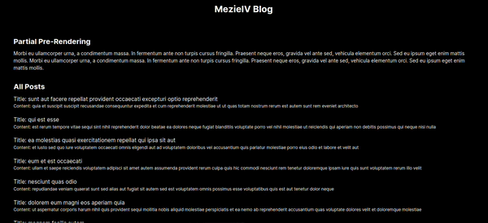

В Next.js 14 появилась новая функция, называемая частичным предварительным рендерингом. Частичное предварительное рендеринг позволяет разработчикам контролировать, какая часть страницы будет предварительно рендериться или рендериться первой. Она использует React Suspense API, поэтому ее будет легко понять и использовать, если вы уже пользовались React.

Частичный предварительный рендеринг использует комбинацию статической обработки, в частности инкрементную статическую регенерацию (ISR) и полную обработку на стороне сервера (SSR). С помощью ISR Next.js обеспечивает предварительный рендеринг страниц, содержащих динамические данные, во время сборки. Впоследствии эти страницы при необходимости инкрементально перерисовываются в фоновом режиме, обеспечивая эффективную и динамичную работу пользователей.

В этой статье мы рассмотрим, как работает функция частичного предварительного рендеринга и как ее можно использовать в приложениях Next.js. Помните, что эта функция все еще находится в экспериментальной стадии и поэтому пока не рекомендуется для использования в производственной среде.

## [](#how-does-partial-prerendering-work)Как работает частичный предварительный рендеринг?

Частичный предрендеринг в Next.js 14 позволяет разработчикам указывать, какие части или разделы страницы должны быть предрендерены, что дает разработчикам больше контроля над процессом оптимизации. Функция частичного предрендеринга использует Concurrent API и Suspense в React для ”приостановки” или ”паузы” рендеринга до тех пор, пока данные не будут готовы и доступны, что приводит к более быстрой и оптимизированной работе.

[React Suspense API](https://blog.logrocket.com/async-rendering-react-suspense-hooks-other-methods/) позволяет компонентам приостанавливать или приостанавливать рендеринг в ожидании данных, обычно во время [асинхронной выборки данных](https://blog.logrocket.com/data-fetching-react-suspense/).

Suspense API предоставляет резервный пользовательский интерфейс, который появляется во время загрузки данных. Этот резервный пользовательский интерфейс загружается вместе с другим статическим содержимым страницы. Это означает, что при загрузке страницы резервный пользовательский интерфейс отображается вместе с другим содержимым, которое не генерируется динамически. Резервный пользовательский интерфейс остается видимым до завершения асинхронной выборки данных. Как только данные готовы, резервный пользовательский интерфейс заменяется данными.

Резервный пользовательский интерфейс обычно представляет собой загрузчик, который мы хотим показать нашим пользователям, чтобы они знали, что содержимое загружается, и могли продолжать просматривать другие части страницы, которые уже загружены или предварительно отображены.

Чтобы использовать частичный предрендеринг, сначала определите разделы или части вашего приложения, где происходят асинхронные операции. Это идеальное место, к которому вы хотите применить Suspense API. Например, компонент, который асинхронно получает данные, можно обернуть компонентом `<Suspense>`, указывающим, что выполнение этой части должно быть приостановлено или отложено до тех пор, пока данные не будут готовы и доступны.

Давайте рассмотрим приведенный ниже код:

```javascript
import React, { Suspense } from 'react';

const App = () => <Suspense fallback={<Loader />}>.... ваш компонент</Suspense>;
```

Компоненты, обернутые внутри компонента `Suspense` или находящиеся внутри него, будут приостановлены. Вам не нужно менять код для использования частичного предварительного рендеринга - достаточно обернуть раздел или страницу компонентом `Suspense`, и Next.js сам поймет, какие части рендерить статично, а какие динамично.

## [](#how-to-use-partial-prerendering)Как использовать частичный предрендеринг

Чтобы использовать функцию частичного предрендеринга в Next.js, установите последнюю версию Canary, используя любую из команд ниже:

`/* с помощью npm */ npm install next@canary /* с помощью yarn */ yarn add next@canary`.

Далее в файле `next.config.js` добавьте следующую конфигурацию:

`experimental: { ppr: true, },`.

Ваш файл `next.config.js` должен выглядеть следующим образом:

`/** @type {import('next').NextConfig} */ const nextConfig = { experimental: { ppr: true, }, } module.exports = nextConfig`

Теперь мы можем использовать Suspense API. Давайте посмотрим на пример кода ниже:

```javascript
async function Posts() {
	const data = await fetch(`https://jsonplaceholder.typicode.com/posts`, {
		cache: 'no-store',
	});
	const posts = await data.json();
	return (
		<>
			<h2>All Posts</h2>
			{posts.slice(0, 7).map((post) => (
				<div key={post.id}>
					<h4>Title: {post.title}</h4>
					Содержание: {post.body}
				</div>
			))}
		</>
	);
}

export default function Home() {
	return (
		<main className="flex min-h-screen flex-col items-center justify-between p-24">
			<div>
				<h1>Частичный предрендер</h1>
				Morbi eu ullamcorper urna, a condimentum massa. In fermentum ante non turpis cursus fringilla.
				Praesent neque eros, gravida vel ante sed, vehicula elementum orci. Sed eu ipsum eget enim mattis
				mollis. Morbi eu ullamcorper urna, a condimentum massa. In fermentum ante non turpis cursus fringilla.
				Praesent neque eros, gravida vel ante sed, vehicula elementum orci. Sed eu ipsum eget enim mattis
				mollis.
			</div>
			<Posts />
		</main>
	);
}
```

В приведенном выше коде мы имеем простую страницу, получающую и отображающую несколько постов. С помощью частичного предварительного рендеринга мы можем отложить содержимое постов до тех пор, пока данные не будут доступны. Во время выборки указанный нами fallback будет отображаться вместе с остальным статическим содержимым:

```javascript
import React, { Suspense } from 'react';

function LoadingPosts() {
	const shimmer = `relative overflow-hidden before:absolute before:inset-0 before:-translate-x-full before:animate-[shimmer_1.5s_infinite] before:bg-gradient-to-r before:from-transparent before:via-white/10 before:to-transparent`;
	return (
		<div className="col-span-4 mt-20 min-h-screen w-full space-y-4 lg:col-span-1">
			<div className={`bg-gray-900 relative h-[167px] rounded-xl ${shimmer}`} />
			<div className="bg-gray-900 h-4 w-full rounded-lg" />
			<div className="bg-gray-900 h-6 w-1/3 rounded-lg" />
			<div className="bg-gray-900 h-4 w-full rounded-lg" />
			<div className="bg-gray-900 h-4 w-4/6 rounded-lg" />
		</div>
	);
}

async function Posts() {
	const data = await fetch(`https://jsonplaceholder.typicode.com/posts`, {
		cache: 'no-store',
	});
	const posts = await data.json();
	return (
		<>
			<h2>All Posts</h2>
			{posts.slice(0, 7).map((post) => (
				<div key={post.id}>
					<h4>Title: {post.title}</h4>
					Содержание: {post.body}
				</div>
			))}
		</>
	);
}

export default function Home() {
	return (
		<main className="flex min-h-screen flex-col items-center justify-between p-24">
			<div>
				<h1>Частичный предрендер</h1>
				Morbi eu ullamcorper urna, a condimentum massa. In fermentum ante non turpis cursus fringilla.
				Praesent neque eros, gravida vel ante sed, vehicula elementum orci. Sed eu ipsum eget enim mattis
				mollis. Morbi eu ullamcorper urna, a condimentum massa. In fermentum ante non turpis cursus fringilla.
				Praesent neque eros, gravida vel ante sed, vehicula elementum orci. Sed eu ipsum eget enim mattis
				mollis.
			</div>
			<Suspense fallback={<LoadingPosts />}>
				<Posts />
			</Suspense>
		</main>
	);
}
```

Мы обернули компонент `Posts` с помощью Suspense API, который мы импортировали из React, и добавили вспомогательный пользовательский интерфейс компонента `LoadingPosts`.

Компонент `LoadingPosts` представляет собой скелет загрузки постов. Он включает в себя эффект мерцания (обычно используемый в качестве анимации загрузки) и стилизован так, чтобы дать пользователям визуальную обратную связь о том, что контент загружается. Если вы перезагрузите страницу, вы увидите загружающийся скелет в течение минуты, прежде чем содержимое постов будет отображено:

## [](#use-case-for-partial-prerendering)Случай использования частичного предварительного рендеринга

Как мы уже говорили, страницы с динамической загрузкой данных являются лучшим вариантом использования частичного предрендеринга, поскольку данные подхватываются асинхронно. Давайте рассмотрим хороший пример, в котором мы можем использовать функцию частичного предрендеринга.

### [](#partial-prerendering-of-a-blog-page)Частичный предварительный рендеринг страницы блога

На каждом блог-сайте у нас есть список блогов, которые мы получаем с нашего сервера. С помощью PPR мы можем отображать загрузчик по мере получения записей из блога и впоследствии заменять их, когда данные будут готовы.

Обернув асинхронную выборку данных в `Suspense`, вы приостанавливаете рендеринг компонента до тех пор, пока данные не будут доступны. Такой подход позволяет оптимизировать эффективность начальной загрузки страницы за счет предварительного рендеринга статического контента, включая fallback, а динамические данные подхватываются и рендерятся только при необходимости.

Давайте рассмотрим пример ниже:

```javascript
/* pages.js */
import Home from './components/Home';

const Page = () => (
	<main className="flex min-h-screen flex-col justify-between p-12">
		<header className="mb-12 text-center">
			<h1 className="mb-6 font-bold text-3xl">Блог Мезиева</h1>
		</header>
		<Home />
		<footer className="mt-24 text-center"> ©MezieIV 2023 </footer>
	</main>
);

export default Page;
```

В этом уроке мы используем маршрутизатор `App`. В приведенном выше коде у нас есть верхний, нижний и нижний колонтитулы в нашем макете страницы. Мы импортируем компонент `Home`, который будет содержать нашу запись в блоге.

В компонент `Home` скопируйте и вставьте приведенный ниже код:

```javascript
/* /components/Home.js */
import React, { Suspense } from 'react';

function LoadingPosts() {
	const shimmer = `relative overflow-hidden before:absolute before:inset-0 before:-translate-x-full before:animate-[shimmer_1.5s_infinite] before:bg-gradient-to-r before:from-transparent before:via-white/10 before:to-transparent`;
	return (
		<div className="col-span-4 mt-20 min-h-screen w-full space-y-4 lg:col-span-1">
			<div className={`bg-gray-900 relative h-[167px] rounded-xl ${shimmer}`} />
			<div className="bg-gray-900 h-4 w-full rounded-lg" />
			<div className="bg-gray-900 h-6 w-1/3 rounded-lg" />
			<div className="bg-gray-900 h-4 w-full rounded-lg" />
			<div className="bg-gray-900 h-4 w-4/6 rounded-lg" />
		</div>
	);
}

async function Posts() {
	const data = await fetch(`https://jsonplaceholder.typicode.com/posts`, {
		cache: 'no-store',
	});
	const posts = await data.json();
	return (
		<>
			<h2 className="mb-3 mt-8 font-bold text-2xl">Все посты</h2>
			{posts.slice(0, 7).map((post) => (
				<div key={post.id} className="mb-5">
					<h4 className="text-lg">Заголовок: {post.title}</h4>
					<p className="text-sm">Содержание: {post.body}</p>
				</div>
			))}
		</>
	);
}

export default function Home() {
	return (
		<>
			<div>
				<h2 className="mb-3 font-bold text-2xl"> Partial Pre-Rendering </h2>
				Morbi eu ullamcorper urna, a condimentum massa. In fermentum ante non turpis cursus fringilla.
				Praesent neque eros, gravida vel ante sed, vehicula elementum orci. Sed eu ipsum eget enim mattis
				mollis. Morbi eu ullamcorper urna, a condimentum massa. In fermentum ante non turpis cursus fringilla.
				Praesent neque eros, gravida vel ante sed, vehicula elementum orci. Sed eu ipsum eget enim mattis
				mollis.
			</div>
			<Suspense fallback={<LoadingPosts />}>
				<Posts />
			</Suspense>
		</>
	);
}
```

Заголовок и абзацы страницы предварительно отрендерены, так же как и пользовательский интерфейс fallback. Когда мы загружаем нашу страницу, мы видим, что загрузчик отображается до тех пор, пока не завершится выборка и не будут готовы записи блога: [ Давайте рассмотрим наш пример на шаг дальше. В приведенном выше примере у нас есть только одна секция, использующая Suspense API PPR.

После того как пользователь нажимает на блог, он переходит на страницу блога, чтобы продолжить чтение записи. На странице блога мы хотим, чтобы пользователю была доступна сама статья, а также список похожих блогов или недавних записей в блоге. Это хороший пользовательский опыт в реальном мире, чтобы пользователю не нужно было возвращаться назад, чтобы найти другую запись для чтения.

Поскольку и основной блог, и посты в других блогах извлекаются динамически, мы можем использовать API Suspense для обоих разделов.

Внутри компонента `Home` вы можете скопировать и заменить его на код, приведенный ниже:

```javascript
/* /components/Home.js */
import { Suspense } from 'react';

function LoadingPosts() {
	const shimmer = `
    relative overflow-hidden before:absolute before:inset-0 before:-translate-x-full before:animate-[shimmer_1.5s_infinite] before:bg-gradient-to-r before:from-transparent before:via-white/10 before:to-transparent
  `;
	return (
		<div className="col-span-4 mt-20 w-full space-y-4 lg:col-span-1">
			<div className={`bg-gray-900 relative h-[167px] rounded-xl ${shimmer}`} />
			<div className="bg-gray-900 h-4 w-full rounded-lg" />
			<div className="bg-gray-900 h-6 w-1/3 rounded-lg" />
			<div className="bg-gray-900 h-4 w-full rounded-lg" />
			<div className="bg-gray-900 h-4 w-4/6 rounded-lg" />
		</div>
	);
}

async function fetchPosts() {
	return new Promise((resolve) => {
		setTimeout(async () => {
			const data = await fetch(`https://jsonplaceholder.typicode.com/posts`, {
				cache: 'no-store',
			});
			const posts = await data.json();
			resolve(posts);
		}, 2000);
	});
}

async function BlogPost() {
	const posts = await fetchPosts();
	const post = posts[0];
	return (
		<div className="w-full">
			<h4 className="mb-2 text-lg">Заголовок - {post.title}</h4>
			<p className="text-sm leading-6">
				{post.body} {post.body} {post.body} {post.body} {post.body} {post.body} {post.body}{' '}
				{post.body} {post.body} {post.body}
			</p>
		</div>
	);
}

async function Aside() {
	const posts = await fetchPosts();
	return (
		<aside className="w-full">
			<div>
				{posts.slice(0, 5).map((post) => (
					<ol key={post.id} style={{ listStyle: 'inside' }}>
						<li className="w-full text-lg">
							<a href="#">{post.title}</a>
						</li>
					</ol>
				))}
			</div>
		</aside>
	);
}

export default function Home() {
	return (
		<div className="flex justify-between pl-12 pr-12">
			<div className="w-[70%]">
				<h2 className="mb-.6 text-2xl">Основной блог</h2>
				<Suspense fallback={<LoadingPosts />}>
					<BlogPost />
				</Suspense>
			</div>
			<div className="w-[25%] pl-10">
				<h2 className="mb-12 text-2xl">Последние записи блога</h2>
				<Suspense fallback={<LoadingPosts />}>
					<Aside />
				</Suspense>
			</div>
		</div>
	);
}
```

Как видите, мы обернули компоненты `BlogPost` и `Aside` двумя отдельными Suspense API. Мы используем один и тот же скелет загрузчика для обоих, но вы можете создать свой, основываясь на том, как устроен ваш пользовательский интерфейс, чтобы он выглядел гораздо более совместимым и эстетичным.

Другим примером использования PPR является приборная панель администратора. Приборные панели имеют различные разделы, состоящие из графиков, столбчатых и круговых диаграмм, списков информации и так далее. В таких случаях вы можете использовать возможность частичного предварительного рендеринга для секций, получаемых асинхронно. Аналогичным образом, разделы, которыекоторые не извлекаются асинхронно, будут пререндерены статически во время сборки.

## [](#benefits-of-partial-prerendering)Преимущества частичного пререндеринга

Из того, что мы узнали в этом уроке, мы можем сделать вывод, что частичный предрендеринг имеет следующие преимущества:

- **Быстрее начальная загрузка страницы**: Поскольку статическое содержимое отображается сразу же после загрузки страницы, пользователям не нужно ждать, пока загрузится все содержимое, включая динамическое. Это приводит к ускорению загрузки страницы - пользователи могут продолжать работать со статическими частями страницы, пока динамическое содержимое загружается в фоновом режиме
- **Улучшение пользовательского опыта**: Динамическое содержимое загружается плавно, когда оно готово. В это время пользователям показывается загрузчик, означающий, что данные находятся в процессе загрузки. Это повышает интерактивность сайта для пользователей
- **Снижение нагрузки на сервер**: PPR снижает нагрузку на сервер. Это происходит потому, что сервер отображает только динамические разделы страницы, поскольку PPR предварительно отображает статическое содержимое во время сборки и затем из кэша.
- **Использование ресурсов**: PPR сочетает в себе возможности статического (ISR) и динамического рендеринга (SSR). Таким образом, вы можете выбрать, какие части страницы будут статическими и предварительно отрендеренными, а какие - динамическими

## [](#заключение)Заключение

В этой статье мы рассмотрели частичный предрендеринг и то, как он работает в приложении Next.js.

Частичный предрендеринг полезен в сценариях, когда части вашего сайта отображаются динамически или когда данные получаются асинхронно. Используя PPR, вы выбираете, какие части страницы должны быть предварительно отрендерены, а какие - загружены по требованию. Это позволяет ускорить первоначальную загрузку страницы, поскольку пользователи сразу видят статичный или предварительно отрендеренный контент, а динамический контент загружается по мере необходимости или готовности.

Несмотря на то, что эта технология находится на начальной и экспериментальной стадии, и ее не рекомендуется использовать в производстве, вы всегда можете попробовать ее, чтобы получить представление о том, как будет выглядеть стабильная версия.
