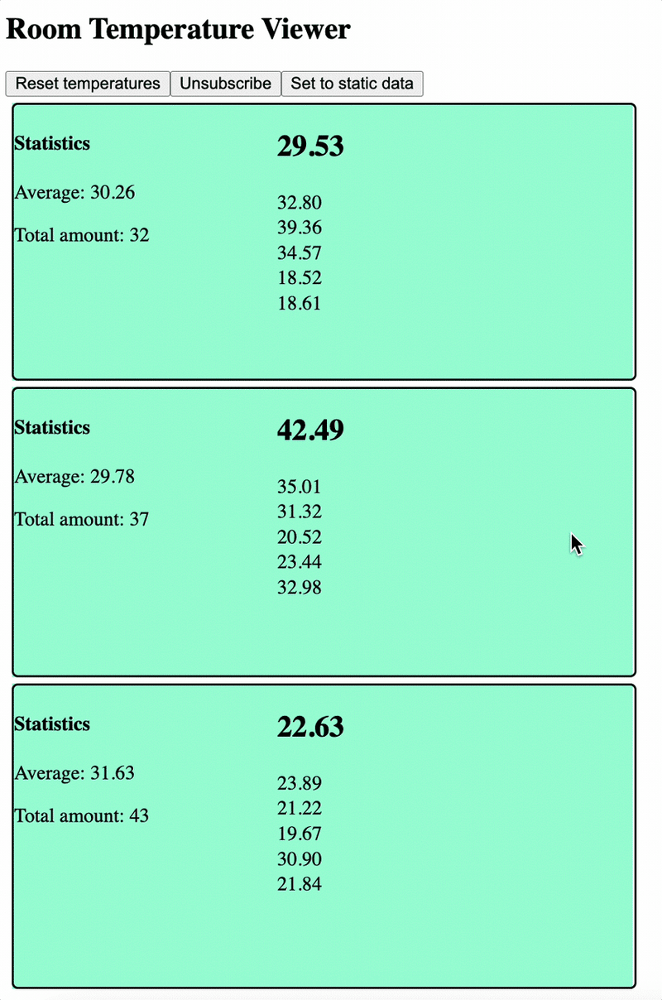
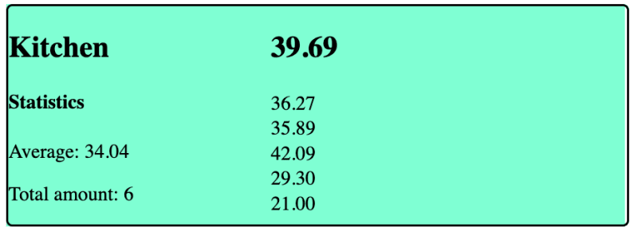

Новая функция signals, представленная в Angular 16, - это потрясающее обновление в работе с асинхронными операциями. Однако наблюдаемые объекты уже существуют в Angular - так почему же нас должны волновать сигналы?

Очень важно сразу понять, почему что-то имеет значение, чтобы не упустить возможные преимущества. Давайте сделаем это сейчас, изучив, почему сигналы и наблюдаемые существуют в Angular, а также как и когда их использовать.

## Понимание роли сигналов и наблюдаемых в Angular

Первый вопрос, на который мы должны ответить, - какие проблемы призваны решить сигналы и наблюдаемые? Ответ прост: асинхронные операции.

Иногда, когда мы запрашиваем данные или выполняем операцию, результат может измениться с течением времени. Когда это происходит, мы можем называть источник этих событий эмиттером. Когда эмиттер обновляет значение, подписчики могут получить новое значение.

Чтобы нам было проще разобраться, давайте рассмотрим практический пример. Представьте, что наше приложение получает данные в реальном времени через WebSocket. В этом простом примере оно просто получает увеличивающееся число каждую секунду.

Со временем WebSocket может выдавать следующие данные:

Нет данных (подключение к WebSocket) Данные получены (1) Данные получены (2) Данные получены (3) Ошибка (из-за отключения сети или аналогичная)

Во всех вышеперечисленных случаях нам необходимо сообщить пользователю, что происходит с соединением, какие данные были получены и не возникло ли каких-либо ошибок. Эта информация позволяет пользователю решить, стоит ли повторять попытку или нет.

Долгое время единственным способом добиться этого в Angular было использование observable или чего-то, реализующего observable. Обычно мы могли добиться этого с помощью “async pipe”, когда наблюдаемую можно было вызвать так, и связанная переменная в шаблоне обновлялась с течением времени :code[{{observableVariable | async}}]{syntax=js} Теперь, с появлением сигналов, использование асинхронных данных изменилось. Мы должны понимать разницу между сигналами и наблюдаемыми, чтобы сделать лучший выбор, что использовать в нашем приложении.

## Как работают обсерватории Angular

Документация Angular описывает наблюдаемые как технику, которую разработчики могут использовать для таких вещей, как:

Обработка событий Асинхронное программирование Обработка нескольких значений, выдаваемых с течением времени

Наблюдаемые не создаются в самом Angular; скорее, они поставляются в Angular из RxJS. Наблюдаемая может излучать более одного раза в течение времени, так что же делать, если вы хотите объединить несколько излучателей? Что делать, если вы хотите объединить результаты из нескольких источников?

Все это возможно в RxJS, но не всегда легко. Даже команда Angular признает, что “RxJS имеет крутую кривую обучения и иногда обескураживающее поведение”.

Обработка сигналов происходит через оператор `pipe` в RxJS. Идея заключается в том, что вы можете передавать излучаемые значения через трубу и настраивать цепочку операторов для обработки значений по мере необходимости.

Это очень мощный инструмент, но, учитывая огромное количество доступных операторов, можно легко ошибиться с выбором оператора. Еще один распространенный подводный камень - неоправданное объединение в цепочку слишком большого количества операторов, что может сделать код трудночитаемым.

Проще говоря, наблюдаемые могут быть очень мощными, но с ними также легко ошибиться. Кроме того, если их не очищать должным образом, они могут привести к другим проблемам, например утечкам памяти. Они используются как в пользовательском интерфейсе приложения, так и в сервисах для обработки и управления асинхронными операциями.

Наблюдаемые объекты выдают значения с течением времени, но они также могут выдавать ошибки или сообщать о своем завершении.

Короче говоря, наблюдаемые таблицы очень мощные, и по своей сути в них нет ничего плохого. Однако, учитывая, сколько существует операторов и насколько сложными могут быть операции, их легко перепутать или использовать неправильно.

## Где используются угловые сигналы

Давайте подумаем о простом значении в нашем коде. Представьте, что у нас есть переменная, и мы хотим установить значение переменной в `0`. Это так же просто, как и следующее: :code[let theValue = 0;]{syntax=js}

Мы можем ссылаться на эту переменную сколько угодно и как угодно. Но в контексте реактивных приложений есть небольшая сложность. Это значение не является реактивным - мы не знаем, когда оно было установлено или обновлено.

Сигналы, появившиеся в Angular 16, призваны решить эту проблему. Они представляют собой обертку вокруг значения, которая может уведомлять заинтересованных потребителей об изменении значения.

По сравнению с observables, сигналы гораздо проще в создании и использовании, поэтому их имеет смысл использовать для широкого спектра асинхронных операций в Angular. Однако они не обладают такой же мощью и гибкостью, как наблюдаемые. Учитывая, что RxJS может иметь ”иногда обескураживающее поведение”, это не обязательно плохо.

Сигналы в основном используются в пользовательском интерфейсе и могут полностью менять свое значение с помощью `set` или обновлять его на основе предыдущего значения с помощью `update`.

Создать сигнал очень просто: :code[intSignal = signal(0)]{syntax=js}

Чтобы изменить значение, вы можете переписать сигнал следующим образом: :code[intSignal.set(2)]{syntax=js}

В противном случае, если вам нужно обновить сигнал на основе существующего значения, вы можете сделать это следующим образом: :code[intSignal.update((value) => value + 1)]{syntax=js}

Поскольку сигналы реактивны, представление нашего приложения будет обновляться при их обновлении, и другие сигналы, зависящие от этого сигнала, также будут обновляться. Именно здесь в игру вступают вычисляемые сигналы.

Вместо того чтобы использовать трубы для управления данными, сигналы используют вычисляемые сигналы для определения сигналов, которые обновляются на основе поведения других сигналов:

```javascript
intSignal = signal(0);
computedSignal = computed(() => intSignal() * 2);
```

Затем, допустим, мы захотим ссылаться на `intSignal` и `computedSignal` из нашего шаблона. Всякий раз, когда мы обновляем `intSignal`, мы видим, что `computedSignal` также изменяет свое значение.

Возможно, предсказуемо, что мы не можем задать значение вычисляемого сигнала напрямую, поскольку он будет иметь только то значение, которое ему придают зависимые сигналы.

Long story short — signals exist as a newer and more efficient way of making a UI responsive and reactive. Connecting multiple signals via `computed` is much easier than using an observable to do the same.

Короче говоря, сигналы существуют как новый и более эффективный способ сделать пользовательский интерфейс отзывчивым и реактивным. Подключение нескольких сигналов через `computed` намного проще, чем использование observable для того же самого.

Следует ли нам использовать сигналы или наблюдаемые параметры - или и то, и другое?

Когда появляется что-то новое, возникает соблазн отказаться от старого и перейти на новое. Бывает и обратная ситуация, когда мы не хотим менять то, что делаем, потому что привыкли к тому, как все работало раньше.

Итак, что же нам делать в этом случае? Ну, ответ заключается в том, чтобы продолжать использовать наблюдаемые в наших сервисах в Angular, но также рассмотреть возможность использования сигналов в логике компонентов и шаблонах.

Чтобы продемонстрировать сильные стороны как наблюдаемых, так и сигналов, давайте сделаем простое приложение, которое сообщает о температуре в комнатах дома. Обычно эти данные обновляются не очень часто, но для данного примера мы будем ускорять их обновление в течение дня.

В итоге наше приложение будет выглядеть так:  Чтобы сделать наше демо-приложение, мы объединим наблюдаемые, сигналы и старое доброе обнаружение изменений. Вы можете ознакомиться с исходным кодом этого приложения на GitHub.

## Обслуживание при комнатной температуре

Первое, что нам нужно для нашего демонстрационного приложения, - это служба определения температуры в помещении. Обычно это что-то, что мы получаем от стороннего сервиса, например API. Но в нашем случае мы можем просто создать поддельную службу определения температуры.

Этот сервис будет отвечать за создание `BehaviorSubject`, который будет выдавать одну новую температуру для комнаты с течением времени. Как и настоящая служба определения температуры, она не занимается отслеживанием исторических температур или обработкой данных.

Поскольку речь идет о сервисном слое, а не о пользовательском интерфейсе, имеет смысл использовать здесь наблюдаемую переменную:

```javascript
export class RoomTemperatureService {
  public roomTemperatures$: BehaviorSubject<RoomTemperature> = new BehaviorSubject<RoomTemperature>({ name: '', temperature: 0 });

  constructor() {
    this.emitRandomRoomTemperature(); // Begin emitting
  }

  private emitRandomRoomTemperature(): void {
    setInterval(() => {
      // Emit a new temperature for a random room
      const roomNames = ['Living Room', 'Bedroom', 'Kitchen'];
      const randomRoomIndex = Math.floor(Math.random() * roomNames.length);
      const chosenRoom = roomNames[randomRoomIndex];
      const newTemperature = Math.random() * 25 + 18;
      this.roomTemperatures$.next({ name: chosenRoom, temperature: newTemperature });
    }, 1000); // Update random room temperature every second
  }
}
```

В приведенном выше коде мы видим, как создать `BehaviorSubject`, который является типом наблюдаемого объекта. Затем мы можем вызвать `next`, чтобы выдать новое значение для `BehaviorSubject`.

Потребители этого сервиса получают нужную им информацию - в нашем случае название комнаты и обнаруженную температуру. Однако что, если мы захотим агрегировать полученные данные, чтобы показать список температур за прошлые периоды?

Давайте посмотрим, как это можно сделать в отдельном компоненте `TemperatureNode`.

## Компонент `TemperatureNode`.

Сначала создадим узел `TemperatureNode`, который будет отображать текущую температуру в каждой комнате, историческую температуру и среднее значение. Этот компонент будет использовать стандартные компоненты `@Input` и хук `ngOnChanges`, чтобы знать, когда обновлять компонент:

```javascript
export class TemperatureNodeComponent implements OnChanges {
  @Input() temperatures: Array<number> | undefined;
  @Input() roomName: string | undefined;
  averageTemperature = 0;
  totalTemperatureCount = 0;

  ngOnChanges(changes: SimpleChanges): void {
    if (this.temperatures){
      this.averageTemperature = this.temperatures.reduce((sum, current) => sum + current, 0) / this.temperatures.length;
      this.totalTemperatureCount = this.temperatures.length;
    }
  }
}
```

Мы также можем написать наш HTML для этого компонента:

```javascript
<div style="display: flex; width: 100%; align-content: stretch; flex-direction: row; gap: 12px; border: 2px solid black; border-radius: 5px">
    <div style="width: 200px;">
        <h2>{{this.roomName}}</h2>
        <div>
            <h4>Statistics</h4>
            Average: {{averageTemperature | number:'1.2-2'}}
            Total amount: {{totalTemperatureCount}}
        </div>
    </div>
    <div style="display: flex; flex-direction: column; gap: 2px;">
        @for (temp of temperatures; track temp; let idx = $index){
        <span>
            @if (idx == 0){
            <h2>{{temp | number:"1.2-2"}}</h2>
            }
            @else if (idx < 6){
            {{temp | number:"1.2-2"}}
            }
        </span>
        }
    </div>
</div>
```

В готовом примере этот компонент будет выглядеть так:  Теперь нам нужен компонент, который будет выводить один из этих компонентов для каждой комнаты, в которой есть результат температуры.

## Компонент `TemperatureView`

Компонент `TemperatureView` должен:

Подписывайтесь на каждый новый объект, испускаемый сервисом температуры Отвечайте за агрегирование результатов таким образом, чтобы это имело смысл Дайте пользователю возможность запускать и останавливать поток сообщений, полностью сбрасывать результаты и устанавливать температуру на совершенно новое значение

Поскольку наша работа влияет на пользовательский интерфейс, было бы разумно выбрать сигнал для этого.

Но подождите минутку - наш сервис предоставляет температуры по одной за раз через наблюдаемую, а мы хотим использовать сигнал в нашем пользовательском интерфейсе. Как нам подключить нашу наблюдаемую к сигналу и выполнить базовую обработку данных?

Проще говоря, мы можем подписаться на нашу наблюдаемую, как обычно, а затем передать данные в наш сигнал через метод `update`. Поскольку здесь мы подписываемся на наблюдаемую, мы по-прежнему отвечаем за подписку и отписку от нее:

```javascript
startSubscription() {
  this.temperatureSubscription = this.tempService.roomTemperatures$.subscribe(newTemp => {
    this.historicalTemperatures.update(x => {
      if (newTemp.temperature) {
        let temperatures = x.find(x => x.room == newTemp.name);
        if (temperatures) {
          temperatures.temperatures = [newTemp.temperature, ...temperatures.temperatures];
        } else {
          x = [...x, {room: newTemp.name, temperatures: [newTemp.temperature]}];
        }
      }
      return x;
    });
  });
}
```

Как мы видели ранее, мы также можем обновить сигнал совершенно новым значением, которое не основано на существующем значении, с помощью `set`. Если бы мы хотели установить для данных о температуре новое значение и не учитывать то, что уже было в сигнале, мы могли бы сделать следующее:

```javascript
setStatic() {
  // First, end the subscription to the service
  this.endSubscription();
  // Set the signal data to a new value
  this.historicalTemperatures.set([
    { room: 'Loft', temperatures: [10, 11, 12, 11, 10.5] },
    { room: 'Guest room', temperatures: [13.5, 14.5, 12.5, 12.8] },
    { room: 'Living room', temperatures: [15, 16, 15, 14.3, 12] }
  ]);
}
```

## Когда использовать сигналы vs. observables

### Когда использовать сигналы против наблюдаемых параметров

Теперь, когда мы рассмотрели, как сигналы и наблюдаемые могут быть использованы в проекте, давайте вспомним, когда лучше использовать то или другое.

### Когда использовать наблюдаемые параметры

В нашем примере мы видим, что использование наблюдаемого объекта требует от нас ручной подписки на него, обработки вывода и отмены подписки, когда мы закончим.

Подписка на наблюдаемый объект - это как прослушивание новых событий, которые фильтруются до нашего потребителя. Это могут быть новые события, но также может быть ошибка или сообщение о том, что наблюдаемая завершила работу.

Мы также управляем потоком событий, передавая их по `трубам`. Эти трубы действительно могут стать чрезвычайно сложными, но они могут быть очень элегантными в управлении асинхронным потоком данных во времени.

По этой причине вы обычно видите наблюдаемые в сервисах в вашем Angular-приложении.

Сигналы, с другой стороны, используются в слое пользовательского интерфейса вашего приложения. Вы можете обновить сигнал с помощью метода `set` или внести изменения в существующее значение с помощью `update`.

Поскольку вы каждый раз устанавливаете или обновляете сигнал, встроенного состояния ошибки, как в случае с наблюдаемыми, не существует. Однако вы можете определить собственное состояние ошибки и обновить сигнал соответствующим образом.

Кроме того, вы можете использовать вычисляемые сигналы для создания новых сигналов на основе существующих. Изменения будут распространяться через эти вычисляемые сигналы при обновлении зависимых сигналов.

Если в вашем коде шаблон обновляется реактивно, имеет смысл использовать сигнал, а не наблюдаемую переменную.

## Действительно ли нам нужно использовать сигналы?

Сигналы - полезная новая функция Angular, но так ли необходимо ее использовать? Вкратце - нет.

Если вы не используете сигналы, то вы просто живете жизнью разработчика Angular до появления Angular 16. Без сигналов было написано множество отличных приложений и создано множество реактивных веб-страниц.

Однако мы должны признать простоту и мощь сигналов в создании реактивных шаблонов, а также то, что вычисляемые сигналы могут быть легко составлены из других сигналов. Использование сигналов для управления подобными требованиями вместо создания собственного дерева подписок с собственными наблюдаемыми гораздо проще.

Независимо от того, что вы выберете, производительность будет примерно одинаковой, так что в конечном итоге все зависит от ваших предпочтений и уровня комфорта.

## Заключение

Сигналы - это новое интересное дополнение к Angular, и они выступают в качестве дополнения, а не замены наблюдаемых. Понимая, где следует использовать каждый из них, мы сможем писать высококачественные реактивные приложения, которые будут более производительными и простыми в разработке.

Не стесняйтесь взять пример приложения, которое использовалось в этом уроке, чтобы посмотреть исходный код или форкнуть проект для своих нужд. Если у вас возникли вопросы, оставляйте комментарии ниже.

Счастливого реактивного кодирования!
