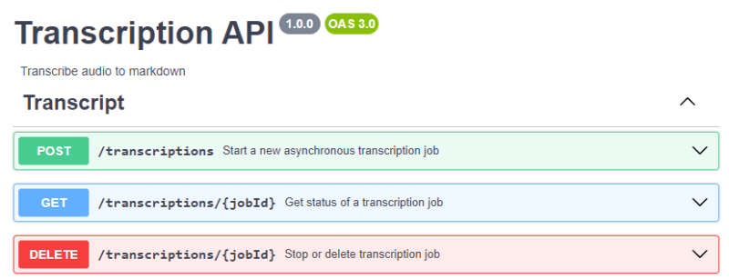
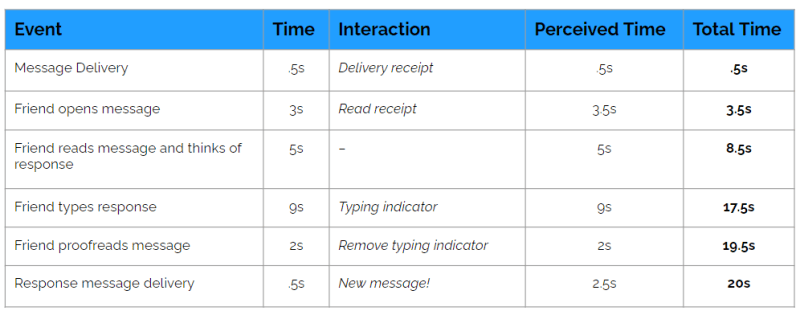

В 2023 году я потратил много времени на изучение уведомлений в реальном времени. Я узнал о концепциях, [различных протоколах](https://dev.to/aws-heroes/websockets-grpc-mqtt-and-sse-which-real-time-notification-method-is-for-you-52n7) и о том, как их реализовать, чтобы беспрепятственно доставлять обновления в пользовательский интерфейс. Я не буду утверждать, что я эксперт, но я определенно чувствую себя комфортно с различными способами передачи сообщения от сервера к конечному пользователю.

Посыл, который я последовательно продвигаю уже несколько месяцев, заключается в том, чтобы _остановить создание синхронного программного обеспечения_. Вместо того чтобы создавать системы на основе запросов/ответов API-вызовов, разделите ваши компоненты и отправляйте обновления в соответствующие части вашей системы. Сам по себе этот совет подходит для современной разработки программного обеспечения, особенно для бессерверных экосистем. Но недавно я начал спрашивать себя ”почему?” Почему это хороший совет?

С точки зрения конечного пользователя, это хороший совет, потому что вы не хотите заставлять людей ждать завершения работы - особенно если она занимает больше нескольких секунд. В 2024 году ожидание, как правило, приводит к плохому пользовательскому опыту. Плохой пользовательский опыт приводит к недовольным пользователям. Недовольные пользователи приводят к тому, что никто не использует ваше программное обеспечение 😬.

Если вы сосредоточились на асинхронной работе с внешним интерфейсом, ваша реализация внутреннего интерфейса обычно состоит из набора конечных точек, которые запускают фоновые процессы и возвращают идентификатор для целей отслеживания. Фоновый процесс периодически отправляет обновления состояния в пользовательский интерфейс через постоянное соединение, например WebSocket или Server-Sent Events (SSE). На случай, если клиент отключится, у вас также будет конечная точка для ваших процессов, которая получит текущий статус, чтобы вы всегда могли получить нужные данные. Простым примером может служить API транскрипции, представленный ниже.

С точки зрения простых цифр, переход от синхронного вызова запроса/ответа к асинхронному заданию увеличивает количество конечных точек, которые вам нужно создавать и поддерживать, с 1 до 3 (как минимум). Плюс в том, что ваши пользователи не будут сидеть и ждать завершения длительного задания. Но достаточная ли это причина для перехода? Кажется, что для того, чтобы пользователи не сидели и не смотрели на спиннер, требуется гораздо больше кода, времени, усилий и сложностей.

## Время ожидания имеет значение

Согласно исследованию [Neilsen Norman Group](https://www.nngroup.com/articles/response-times-3-important-limits/), существует три важных ограничения, которые необходимо учитывать при оптимизации производительности приложений.

- **0,1 секунды** - время, в течение которого человек чувствует, что система реагирует мгновенно.
- **1 секунда** - максимальное время, за которое пользователь заметит задержку, но при этом останется сосредоточенным на своей мысли.
- **10 секунд** - пользователь теряет кратковременную память, и его мысли начинают блуждать в сторону от задачи.

По мере того как время ожидания приближается к пределу, ваши пользователи все больше теряют концентрацию. Задачи длительностью более 10 секунд, как правило, нарушают поток пользователей, что часто приводит к отказу от сайта вместо того, чтобы начать выполнение задачи с нуля.

Тем не менее, заставить пользователей просто _не_ смотреть на спиннер, пока выполняется ваше асинхронное задание, вряд ли лучше. Если вы вернете их на приборную панель или переведете пользователей на экран, который ждет обновления, они все равно будут ждать. Они могут не знать, что что-то происходит. Они даже могут подумать, что что-то пошло не так, если вы не держите их в курсе событий.

Конечно, раньше было вполне нормально перемещать кого-то по дому, пока вы занимались чем-то в фоновом режиме. Но теперь это уже не так. Давайте рассмотрим пример из реальной жизни.

## Эволюция обмена сообщениями

Обмен сообщениями - идеальный пример асинхронного взаимодействия. Вы отправляете сообщение адресату, продолжаете заниматься своими делами и в конце концов получаете ответ. Вам не нужно бросать все дела и ждать ответа, вы вольны делать все, что захотите.

В Соединенных Штатах доставка почты [началась в 1775 году] (https://www.history.com/news/post-office-mail-delivery) и осуществлялась в основном на лошадях. Если вы хотели отправить другу сообщение, вам приходилось ждать от нескольких недель до нескольких месяцев, пока его доставят. И это был только один способ!

Любой асинхронный процесс можно ”улучшить”, уменьшив общее время, которое он занимает от начала до конца. Именно это и произошло с доставкой почты. В течение следующих нескольких столетий время доставки сокращалось за счет изменения способа транспортировки. Лошади превратились в дилижансы. Дилижансы превратились в железные дороги. Железные дороги превратились в автомобили. Автомобили превратились в авиапочту. Прошло немного времени, и теперь сообщения мгновенно доставляются через Интернет.

Как только мы достигли скорости интернета, мы достигли пика по времени доставки. Вы можете доставить текстовое сообщение или DM любому человеку в мире за миллисекунды. Но это все еще недостаточно хорошо.

Мы привыкли к мгновенной доставке сообщений. Но нам всегда хочется большего. Если я отправляю текстовое сообщение, я хочу знать, как долго мне ждать, пока тот, с кем я переписываюсь, ответит мне. Если я знаю, что человек на другом конце активен, я прекращу свои действия и сосредоточусь на разговоре. Если я знаю, что он не ответит мне в течение нескольких часов, я уберу телефон и займусь чем-нибудь другим.

Как же мы продолжали совершенствоваться? Теперь у нас есть совершенно новый набор индикаторов, которые показывают, как работает наш асинхронный процесс. Во многих приложениях _индикаторы присутствия_ говорят мне, активно ли человек, с которым я обмениваюсь сообщениями, держит приложение открытым. Когда я отправляю сообщение, я получаю не только _квитанцию о доставке_, но и _квитанцию о прочтении_. Это означает, что я знаю, попало ли мое сообщение на устройство другого человека и видел ли он его или нет. Кроме того, я вижу индикатор набора текста, который говорит о том, что собеседник активно отвечает на сообщение.

Я не скажу вам ничего такого, чего бы вы уже не знали. Это уже давно существует, и мы привыкли к этому. Но что вы, возможно, не успели собрать воедино между ежедневными текстовыми сообщениями и программным обеспечением, которое вы создаете, так это то, что **вам нужен уровень интерактивности**.

## Интерактивность - это ключ.

Современный обмен сообщениями по своей сути все еще является асинхронной коммуникацией. Основная функция - доставка сообщения от отправителя к получателю. Но мы достигли максимальной скорости доставки, а люди все еще нетерпеливы.

Это происходит потому, что асинхронные процессы по сути являются _[черными ящиками](https://en.wikipedia.org/wiki/Black_box) для потребителей_. Как разработчик, вы должны сделать все возможное, чтобы превратить их в ”серые ящики”. Это значит, что вы должны предоставлять как можно больше информации как можно чаще. Помните, если вы не сможете удержать пользователя менее 10 секунд, вы его потеряете.

> Каждый раз, когда вы взаимодействуете с пользователем, ваш таймер сбрасывается.

Представим, что на получение ответа от человека, с которым вы активно переписываетесь, уходит 20 секунд. 20 секунд - это в два раза больше времени, чем обычно отводит наша кратковременная память на ожидание. Что же делать?

Когда вы нажимаете кнопку отправки, запускается таймер внимания. Вам предстоит обеспечить достаточную интерактивность, чтобы удержать пользователя на протяжении всего времени. Давайте рассмотрим взаимодействия, которые происходят между нажатием кнопки _отправить_ и получением ответного сообщения 👇.

В сумме получается 20 секунд, но ни один из отдельных шагов не занимает больше 9 секунд, так что мы в полном порядке, если отправляем интерактивные обновления в нужное время. Обновления показывают, что что-то происходит, и вы можете продолжать привлекать внимание пользователя.

### Что, если это не вариант?

Идеальный сценарий - это множество событий, свидетельствующих о достигнутом прогрессе. К сожалению, не все сценарии использования идеальны. Некоторые рабочие процессы просто занимают много времени без каких-либо измеримых показателей прогресса. Для других обновление статуса может занять несколько минут, что не позволит вам удержать пользователей.

Возможно, вам стоит подумать о том, чтобы сделать индикатор выполнения по времени. Если ваш рабочий процесс занимает в среднем 4 минуты, установите таймер в пользовательском интерфейсе на 4 минуты и 15 секунд и увеличивайте прогресс каждые несколько секунд. Позвольте мне задать вам вопрос: нравится ли вам смотреть на индикаторы выполнения?

Если вам нужно, чтобы пользователи ждали 30 с лишним секунд, но у вас нет возможности обеспечить значимую интерактивность, отвлеките их другими способами, чтобы сохранить их кратковременную память.

Фантастический пример такого подхода - [Matchbooks] (https://matchbooks.ai/). Matchbooks - это приложение, которое позволяет детям использовать генеративный ИИ для безопасного создания собственных историй. Дети описывают главного героя своей истории и рассказывают подробности сюжета. После того как они добавят все данные, приложение создаст великолепно иллюстрированные книги и истории, в точности соответствующие описанию. Этот процесс занимает несколько минут, а для тех, кто не знает, продолжительность внимания детей гораздо короче.

Вместо того чтобы обновлять статус создания истории, приложение направляет детей на игру-пиктограмму, в которую они могут поиграть. Дети играют в быстрые, 10-секундные игры, в которых им предлагается определить, какое животное нарисовано на экране. Как только они произносят вслух правильное животное, они сразу же переходят к новому. Этот процесс повторяется до тех пор, пока на заднем плане не закончится история.

По окончании рассказа загорается кнопка ”Продолжить”, и дети продолжают путешествие с книгой.

При таком подходе дети полностью отвлечены и вовлечены в процесс, который длится несколько минут и является частью рабочего процесса. Дети остаются довольны, потому что их развлекают, а когда они будут готовы, то смогут продолжить созданную ими историю. Эта же концепция применима и к другим областям, просто следите за тем, чтобы она была актуальна для вашего пользователя.

## Как начать

Интерактивность требует времени. Это гораздо больше, чем настройка WebSockets и публикация нескольких сообщений. Речь идет о контексте. Речь идет о передаче правильной информации, чтобы сбросить внутренние таймеры ваших пользователей. Чтобы понять, что это за правильная информация, я советую вам _поступить как пользователь_. Используйте свое собственное программное обеспечение и спросите себя ”что я должен делать, пока это происходит?” или ”какая дополнительная информация могла бы быть полезной?”. Попробуйте придумать статусы или метаданные, которые можно представить пользователям.

Когда вы поймете, что именно вы хотите показать пользователям, следующим очевидным шагом будет создание этого приложения. И опять же, решение обычно немного сложнее, чем простая настройка WebSockets в вашем приложении. В зависимости от требований безопасности, соответствия нормативным требованиям и специфики интерактивности, [тип механизма уведомления](https://dev.to/aws-heroes/websockets-grpc-mqtt-and-sse-which-real-time-notification-method-is-for-you-52n7) может сильно различаться. Потратьте некоторое время на исследование и определите, какой из них подходит вам лучше всего.

Лично я опираюсь на [Momento Topics](https://www.gomomento.com/services/topics) для создания интерактивности. Они позволяют соединять браузер с браузером, браузер с бэкендом и бэкенд с бэкендом без создания какой-либо инфраструктуры. Я создал [забавные, интерактивные, реактивные приложения для своих презентаций](https://www.gomomento.com/blog/building-an-interactive-live-reaction-app-with-next-js-and-momento) всего за пару часов, а недавно [создал чатбота](https://dev.to/aws-heroes/how-i-built-a-santa-chatbot-to-mess-with-my-brother-21mm), используя всего две функции Lambda и url функции. Это значительно ускоряет время разработки, обеспечивая при этом низкую задержку, шину событий, доступную всем частям распределенного приложения.

Но это не продажа Momento Topics. Речь идет о создании лучшего программного обеспечения. Программного обеспечения, которое не только избавит ваших пользователей от ожидания, но и развлечет их. [Найдите то, что важно](https://dev.to/aws-heroes/build-what-matters-30on) и порадуйте своих пользователей. Детали реализации зависят от вас, как и всегда.

Так что попробуйте! Погрузитесь в процесс и выясните, что вы можете сделать, чтобы ваши взаимодействия были частыми и значимыми. Не просто отправляйте пользователей обратно на целевую страницу. Держите их на крючке и не забывайте мыслить нестандартно - именно так технологическая индустрия внедряла инновации в области обмена сообщениями, когда мы уже не могли работать быстрее.

Счастливого кодирования!
