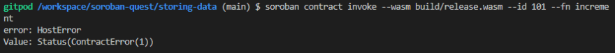

Привет! В своем предыдущем посте я уже показывал, как использовать Soroban AssemblyScript SDK для хранения и получения данных в простом смарт-контракте, а теперь мы добавим обработчик ошибок в этот контракт с помощью Soroban Assembly Script SDK.

Мы рассмотрим, как определить и сгенерировать ошибку для смарт-контракта Soroban с помощью AssemblyScript SDK, что позволит вызывающей стороне контракта понять и обработать ошибку. В этом примере будет показана функция `failWithErrorCode()` из модуля `context`, предоставляемого библиотекой `as-soroban-sdk`.

## Контрактный кодекс

Код контракта будет аналогичен моему предыдущему посту с дополнительным кодом для обработки ошибок. Давайте погрузимся в код:

```js
import { RawVal, toU32, fromU32 } from 'as-soroban-sdk/lib/value';
import * as ledger from 'as-soroban-sdk/lib/ledger';
import * as context from 'as-soroban-sdk/lib/context';
```

В этом разделе добавлены дополнительные модули `context`. Эти модули предоставят нам функциональность для определения и обработки ошибок.

```js
enum ERR_CODES {
  MAX_REACHED = 1
};

export function increment(): RawVal {
  let data = "COUNTER";
  var counter = 0;
  var max = 5;

  if (ledger.hasDataFor(data)) {
    let dataObj = ledger.getDataFor(data);
    counter = toU32(dataObj);
  }

  counter++;

  if (counter > max) {
    context.failWithErrorCode(ERR_CODES.MAX_REACHED);
  }

  ledger.putDataFor(data, fromU32(counter));
  return ledger.getDataFor(data);
}
```

Код определяет перечисление `ERR_CODES` для представления возможных кодов ошибок. Он имеет единственный код ошибки: `MAX_REACHED`, указывающий на то, что счетчик достиг своего максимально допустимого значения, а переменная `max` - это максимально допустимое значение. Функция `increment` работает аналогично предыдущему контракту, проверяет данные счетчика в хранилище, увеличивает их и проверяет, превышает ли новый счетчик максимально допустимый (установленный на 5). Если да, то транзакция завершается неудачей и возвращает код ошибки с помощью функции `context.failWithErrorCode`. В противном случае она обновляет данные `COUNTER` в бухгалтерской книге новым значением счета, преобразованным обратно в `RawVal` с помощью `fromU32`. Возвращается окончательное значение счета из бухгалтерской книги.

Далее создайте файл `contract.json` в директории проекта, этот файл содержит метаданные для контракта.

```json
{
	"name": "Store and Retrieve Data Contract (Error Handling)",
	"version": "0.1.0",
	"description": "example",
	"host_functions_version": 29,
	"functions": [
		{
			"name": "increment",
			"arguments": [],
			"returns": "u32"
		}
	]
}
```

Перед компиляцией контракта нам нужно отредактировать файл `asconfig.json` вашего проекта. Замените его содержимое на следующее:

```json
{
	"extends": "as-soroban-sdk/sdkasconfig",
	"targets": {
		"release": {
			"outFile": "build/release.wasm",
			"textFile": "build/release.wat"
		},
		"debug": {
			"outFile": "build/debug.wasm",
			"textFile": "build/debug.wat"
		}
	}
}
```

Файл `asconfig.json` используется компилятором AssemblyScript (asc) для определения конфигурации вашего проекта.

## Составление договора

Сначала вам нужно скомпилировать его в WebAssembly. Для этого выполните следующую команду :

`npx asc assembly/index.ts --target release`

Теперь в каталоге build/ вы должны увидеть два новых файла: `release.wasm` и `release.wat`.

## Запуск The Contract в песочнице

Давайте запустим контракт, чтобы проверить, работает ли он, мы запустим контракт с помощью `soroban-cli в песочнице, используя следующую команду:

`soroban contract invoke --wasm build/release.wasm --id 1 --fn increment`

Вы должны получить результат:

`1`

Запустите его несколько раз, и на 6-м запуске вы получите такой результат:

`error: HostError Value: Status(ContractError(1))`



## Закрытие

Этот пример демонстрирует, как определить и обработать ошибку в смарт-контракте soroban с помощью Soroban AssemblyScript SDK. Зная точный код ошибки, вызывающая сторона контракта будет знать, что не так с контрактом или вызовом. С этой основой вы сможете перейти к созданию более продвинутых и многофункциональных смарт-контрактов на платформе Soroban. Счастливого соробанинга!
