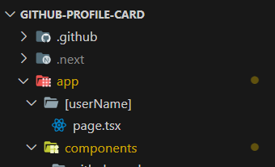

Всем привет! Я очень рад поделиться своим путешествием в обучении, переходом от React → Angular и, наконец, погружением в невероятный мир Next.js. Как вечный странник в поисках знаний, я постоянно стремлюсь расширить свои горизонты и поделиться ценными уроками, которые я получил на этом пути.

Вкратце о том, что мы будем обсуждать в этом блоге. В первую очередь Next.js и его правила (возможно, Typescript как предварительное условие). Маршрутизация в Next.js на самом деле хороша, поэтому мы будем объяснять ее. И наконец, веб-приложение, над которым я работал, используя Next.js и Github API.

## [](#what-is-nextjs-and-why-it-is-hyped-)Что такое Next.js и почему его хают?

Next.js - это популярный и высоко оцененный фреймворк React с открытым исходным кодом, созданный компанией [Vercel](https://vercel.com), который упрощает процесс создания надежных и эффективных веб-приложений. Вот почему он вызвал такой ажиотаж:

1. **React Framework с батарейками в комплекте**: Next.js построен поверх React, обеспечивая структурированный и согласованный подход к созданию React-приложений. В него встроено множество функций, таких как рендеринг на стороне сервера (SSR) и генерация статических сайтов (SSG), что облегчает разработчикам создание производительных и масштабируемых приложений без необходимости настраивать все с нуля.
2. **Эффективный рендеринг на стороне сервера (SSR) и генерация статических сайтов (SSG)**: Одним из ключевых преимуществ Next.js является возможность рендеринга страниц на стороне сервера, что обеспечивает более оптимизированное время первоначальной загрузки и улучшает SEO. Также поддерживается генерация статических сайтов, что позволяет предварительно рендерить страницы во время сборки для еще большего ускорения загрузки.
3. **Интуитивно понятная маршрутизация**: Next.js предоставляет простую и интуитивно понятную систему маршрутизации, позволяющую легко перемещаться между страницами в вашем приложении. Система маршрутизации на основе файлов позволяет разработчикам логично организовать свой код и способствует созданию чистой структуры проекта.
4. **Поддержка TypeScript**: Next.js обладает отличной поддержкой TypeScript из коробки. Это делает его предпочтительным выбором для разработчиков, которые ценят статическую типизацию и хотят выявлять потенциальные ошибки на ранних этапах разработки.
5. **Опыт разработчика**: Фреймворк ставит во главу угла удобство для разработчиков благодаря таким функциям, как быстрое обновление, которое позволяет быстро и эффективно разрабатывать без потери состояния. Он также хорошо интегрируется с популярными инструментами разработки, улучшая общий рабочий процесс.

## [](#lets-begin-with-actual-project)Начнем с реального проекта

Проект, который я делал, - Github DevCard Generator.[Проект Github Dev Card](https://github-devcard.vercel.app/) предоставляет персонализированное и визуально привлекательное решение для уникальной публикации вашего профиля на Github. Устали от стандартных страниц профиля Github? Теперь, с помощью Github Dev Card, вы можете создать свою собственную карточку, сделав обмен информацией на Github более простым и приятным. Этот проект упрощает процесс, позволяя пользователям генерировать персонализированную карточку Github, просто введя свое имя пользователя Github. Кроме того, пользователи могут легко скачать карточку в высоком качестве в виде PNG-изображения или поделиться ею мгновенно или через старый добрый [FreeShare](https://freeShare.vercel.app) (Да, мой собственный предыдущий проект 😁).

## [](#creating-new-nextjs-project)Создание нового проекта Next.js

Создание нового проекта Next.js - несложный процесс. Перед началом работы убедитесь, что на вашей машине установлен Node.js. Вот шаги:

1. **Инициализация нового проекта Next.js:** Откройте терминал и выполните следующие команды:

`npx create-next-app your-project-name`.

1. **Перейдите в каталог проекта**.

`cd your-project-name`

1. **Запустите сервер разработки**.

`npm run dev`

Эта команда запустит сервер разработки, и вы сможете просмотреть свое приложение Next.js, зайдя на [http://localhost:3000](http://localhost:3000) в веб-браузере.

## [](#project-structures)Структуры проектов

Next.js имеет предопределенную структуру проекта. Основные папки включают:

- **ПапкаApp** : Эта папка является главной особенностью Next.js 13. В этой папке вы можете обрабатывать все маршруты страниц и API. Я предпочитаю создавать отдельную папку с именем “api” для маршрутов API. Так я чувствую себя более организованным. В папке “app” есть множество опций, которые вы можете использовать. Более подробную информацию вы найдете в [официальной документации NextJS](https://nextjs.org/docs/app/building-your-application/routing).
- Папка **Actions** : В Next.js папка действий сервера является встроенным решением для серверных мутаций. Когда вызывается действие, Next.js может вернуть обновленный пользовательский интерфейс и новые данные за один обход сервера.
- Папка **Компоненты** : Единственное замечание, которое я хотел бы сделать, - это то, что вы можете включать файлы “style” и “test” в папку компонентов. В данном конкретном случае я предпочитаю хранить их в отдельных папках.
- **Папка ”Типы ”** : Действительно, номенклатура этой папки соответствует ее назначению. В ней я разместил все типы TypeScript, которые используются в проектеи т.д.

## [](#github-devcard-generator)Github DevCard Generator

Прежде чем приступить к созданию генератора GitHub DevCard, давайте начнем с получения токена доступа к GitHub. Этот токен позволит нам выполнять аутентифицированные запросы к API GitHub.

### [](#step-1-obtain-github-access-token)Шаг 1: Получение токена доступа GitHub

1. Посетите [GitHub Token Settings](https://github.com/settings/tokens), чтобы сгенерировать персональный токен доступа.
2. Нажмите на “Generate token” и укажите необходимые диапазоны для вашего проекта. Как минимум, включите диапазоны `read:user` и `repo` для информации о пользователе и репозитории.
3. Безопасно скопируйте сгенерированный токен.

Теперь, когда у нас есть токен доступа, давайте изучим различные конечные точки GitHub API, которые помогут нам собрать необходимые данные для нашей DevCard.

### [](#step-2-explore-github-api-endpoints)Шаг 2: Изучение конечных точек API GitHub

Вот несколько ключевых конечных точек GitHub API, которые могут вам пригодиться:

#### [](#1-get-user-information)1. Получить информацию о пользователе

`GET https://api.github.com/users/{username}`

#### [](#2-get-repositories-for-a-user)2. Получение репозиториев для пользователя

`GET https://api.github.com/users/{username}/repos`

#### [](#3-get-repository-information)3. Получить информацию о репозитории

`GET https://api.github.com/repos/{owner}/{repo}`

#### [](#4-get-repository-languages)4. Получить языки репозитория

`GET https://api.github.com/repos/{owner}/{repo}/languages`

#### [](#5-get-users-starred-repositories)5. Получить репозитории пользователя, отмеченные звездочками

`GET https://api.github.com/users/{username}/starred`

Не забудьте включить в заголовки запроса свой токен доступа к GitHub для аутентификации.

## [](#code-overview)Обзор кода

Для начала нужно получить данные пользователя, используя имя пользователя github, поэтому нужно использовать api и сохранить данные.

### [](#getting-userdata-and-repodata-of-a-user)Получение UserData и RepoData пользователя

В предоставленном блоке useEffect определена функция **fetchData** для асинхронного получения данных из GitHub API для указанного пользователя (dataUser). Функция включает в себя две асинхронные операции: получение данных о пользователе с помощью функции **fetchUserData** и данных о репозиториях пользователя с помощью функции **fetchUserRepos**. После успешного получения данных данные пользователя и репозиториев устанавливаются с помощью функций обновления состояния **_setUserData_** и **_setReposData_** соответственно.

Функции **fetchUserData** и **fetchUserRepos** отвечают за выполнение фактических API-запросов. Они используют функцию fetch для отправки GET-запросов к конечным точкам GitHub API для получения информации о пользователе и его репозиториях. Эти запросы включают заголовок Authorization с маркером Bearer (authToken) для аутентификации вызовов API.

Обработка ошибок осуществляется в блоке **try-catch**, где любые ошибки в процессе получения данных отлавливаются и записываются в консоль с помощью console.error. Вся функция **fetchData** вызывается при монтировании компонента или при изменении зависимостей (dataUser и authToken), обеспечивая извлечение и обновление данных соответствующим образом.

Убедитесь, что у вас есть правильный Authtoken, а также для хорошей практики используйте его в файле **.env**, а затем используйте.

```javascript
useEffect(() => {
	const fetchData = async () => {
		try {
			const userData = await fetchUserData(dataUser);
			setUserData(userData);
			const reposData = await fetchUserRepos(dataUser);
			setReposData(reposData);
		} catch (error) {
			console.error('Error fetching data:', error);
		}
	};

	const fetchUserData = async (username) => {
		const response = await fetch(`https://api.github.com/users/${username}`, {
			headers: {
				Authorization: `Bearer ${authToken}`,
			},
		});
		return response.json();
	};

	const fetchUserRepos = async (username) => {
		const response = await fetch(`https://api.github.com/users/${username}/repos`, {
			headers: {
				Authorization: `Bearer ${authToken}`,
			},
		});
		return response.json();
	};

	fetchData();
}, [dataUser, authToken]);
```

### [](#for-advanced-data-like-total-number-of-stars-earned-and-total-languages)Для расширенных данных, таких как общее количество заработанных звезд и общее количество языков

В приведенном ниже блоке кода используется хук React useEffect для получения данных, связанных с пользователем GitHub и его репозиториями. Функция **fetchData** организует асинхронные запросы к API GitHub для получения _данных о пользователе_ и _информации о репозиториях_, связанных с указанным именем пользователя GitHub (dataUser). Этот код расширяет свою функциональность для сбора дополнительных данных, включая _общее количество звезд, заработанных во всех репозиториях (totalStars)_ и _список уникальных используемых языков программирования (uniqueLanguages)_. Эти дополнительные данные рассчитываются и устанавливаются с помощью функций обновления состояния _setTotalStars_ и _setUniqueLanguages_.

```javascript
useEffect(() => {
	const fetchData = async () => {
		try {
			const userData = await fetchUserData(dataUser);
			setUserData(userData);

			const reposData = await fetchUserRepos(dataUser);
			setReposData(reposData);

			// Для получения общего количества звезд, заработанных пользователем за все его проекты
			const totalStars = reposData.reduce((acc, repo) => acc + repo.stargazers_count, 0);
			setTotalStars(totalStars);

			// Всего языков, над которыми работал пользователь
			const languagesSet = new Set();
			reposData.forEach((repo) => {
				if (repo.language) {
					languagesSet.add(repo.language);
				}
			});
			const uniqueLanguages = Array.from(languagesSet);
			setUniqueLanguages(uniqueLanguages);
		} catch (error) {
			console.error('Error fetching data:', error);
		}
	};

	const fetchUserData = async (username) => {
		// Как указано в предыдущем блоке
	};

	const fetchUserRepos = async (username) => {
		// Как указано в предыдущем блоке
	};

	fetchData();
}, [dataUser, authToken]);
```

### [](#routing-in-nextjs)Маршрутизация в Next.js

App Router работает в новой директории с именем app. Директория app работает параллельно с директорией pages, чтобы обеспечить возможность постепенного внедрения. Это позволяет вам выбрать некоторые маршруты вашего приложения для нового поведения, сохраняя другие маршруты в каталоге pages для прежнего поведения.

**Примечание** : Маршрутизатор приложений имеет приоритет над маршрутизатором страниц. Маршруты между директориями не должны разрешаться в один и тот же URL путь и будут вызывать ошибку во время сборки, чтобы предотвратить конфликт.

- Для определения маршрутов используются папки. Маршрут - это единый путь вложенных папок, следующий по иерархии файловой системы от корневой папки до последней листовой папки, содержащей файл **page.js**.
- Для создания **динамических маршрутов** вы можете использовать папку с именем ”[<имя папки->]” и внутри нее добавить файл **page.jsx**. Для получения динамического значения мы можем использовать следующее :

`export default function User({ params }: { params: { userName: string } }) { console.log(userName, "userName"); }`.

Ниже приведена структура папок для этого :



### [](#using-any-ui-library-ft-charkaui)Использование любой библиотеки пользовательского интерфейса ft. CharkaUI

Использование библиотеки пользовательского интерфейса в вашем проекте веб-разработки дает несколько преимуществ, которые могут значительно улучшить процесс разработки и качество
пользовательского интерфейса.

Для этого проекта я использую **[Chakra UI](https://chakra-ui.com/getting-started/nextjs-app-guide)**.

Chakra UI - это популярная библиотека компонентов React, разработанная для упрощения процесса создания современных и визуально привлекательных пользовательских интерфейсов. Ее основные преимущества заключаются в простоте, возможностях кастомизации и доступности.

1. Установите Chakra UI :

**npm**.

`npm i @chakra-ui/react @chakra-ui/next-js @emotion/react @emotion/styled framer-motion`.

**yarn**

`yarn add @chakra-ui/react @chakra-ui/next-js @emotion/react @emotion/styled framer-motion`

1. Настройка ChakraProvider В Next.js 13 появилась новая структура приложений/каталогов/папок. По умолчанию в ней используются компоненты сервера. Однако Chakra UI работает только в компонентах на стороне клиента. Чтобы использовать Chakra UI в серверных компонентах, вам нужно преобразовать их в клиентские, добавив **’use client’**; в верхней части вашего файла.

```javascript
// app/providers.tsx
import React from 'react';
import { ChakraProvider } from '@chakra-ui/react';

export function Providers({ children }: { children: React.ReactNode }) {
  return (
    <ChakraProvider>
      {children}
    </ChakraProvider>
  );
}
```

1. Настройка макета Внутри app/layout.tsx добавьте следующий код

```javascript
// app/layout.tsx
import { Providers } from './providers';

export default function RootLayout({ children }: { children: React.ReactNode }) {
  return (
    <html lang="en">
      <body>
        <Providers>{children}</Providers>
      </body>
    </html>
  );
}
```

## [](#usage-of-devcard)Использование DevCard

Использование Github Dev Card - это простой процесс:

1. Посетите сайт [Github Dev Card](https://github-devcard.vercel.app).
2. Введите свое имя пользователя Github.
3. Выберите желаемый стиль (Минималистичный, Минималистичный темный режим или Футуристичный).
4. Нажмите на кнопку ”Отправить”.

Ваш персональный Github Dev Card будет сгенерирована мгновенно. Отсюда вы можете загрузить карту в виде изображения PNG или поделиться ею напрямую.

## [](#features)Features

1. **Простая генерация Github Dev Card**
   Главная особенность этого проекта - возможность легко создать пользовательскую карточку Github Dev Card. Пользователям достаточно ввести свое имя пользователя Github, и карта автоматически генерируется со всеми необходимыми данными.
2. **Скачивание PNG высокого качества**.
   Пользователи могут загрузить сгенерированную Github Dev Card в виде высококачественного изображения PNG. Эта функция полезна для тех, кто хочет сохранить или поделиться карточкой локально.
3. **Мгновенный обмен**
   В дополнение к загрузке пользователи могут мгновенно поделиться своей Github Dev Card без необходимости загрузки. В проект встроена функциональность FreeShare, что делает обмен без проблем.
4. **Многочисленные стильные варианты**.
   Github Dev Card предлагает пользователям на выбор несколько стилей для своих карточек, включая минималистический, минималистический темный режим и футуристический. Такая настройка позволяет пользователям выбрать стиль, соответствующий их предпочтениям.
5. **3D Tilt View**.
   Одна из карт предлагает 3D-наклонный вид, причем он работает с гравитацией (в мобильном режиме) и движением мыши (в настольном режиме).

## [](#инсталляция)Установка

Чтобы установить Github Dev Card локально или внести свой вклад в проект, выполните следующие шаги:

1. Клонируйте репозиторий:

`git clone https://github.com/Varshithvhegde/Github-Profile-Card.git`.

1. Установите зависимости:

`cd Github-Profile-Card npm install`.

1. Переменные окружения Создайте файл **.env** в корневой папке и добавьте в него свой [github api token](https://github.com/settings/tokens), как показано ниже.

`NEXT_PUBLIC_GITHUB_TOKEN=ВАШ_GITHUB_TOKEN`

1. Запустите сервер разработки:

`npm run dev`.

Откройте [http://localhost:3000](http://localhost:3000) в браузере, чтобы просмотреть проект.

Вот и все, пожалуйста, наслаждайтесь использованием этой devcard. Если вам понравилось, пожалуйста, опубликуйте это в **Социальных сетях, пометив меня (ссылки на социальные сети ниже)**. Если вы сами создали что-то подобное, пожалуйста, сообщите мне об этом в комментариях. Также я знаю, что, возможно, я не использовал хорошие практики, так как я тоже начинающий в Next.js. Поэтому, пожалуйста, дайте мне знать, если что-то не так или можно было сделать лучше.

**Sayonara 👋, Happy Coding 🚀.**.
