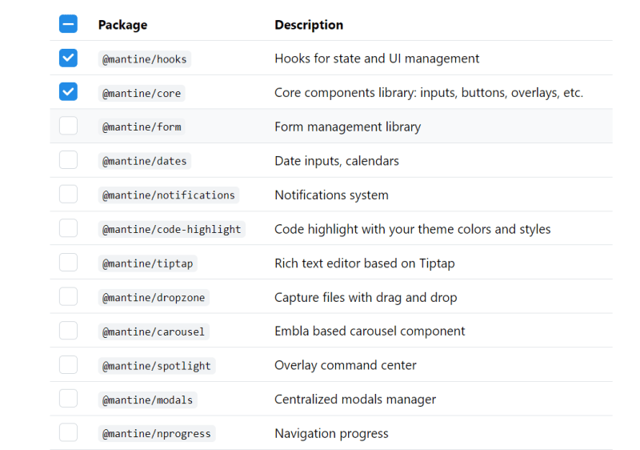
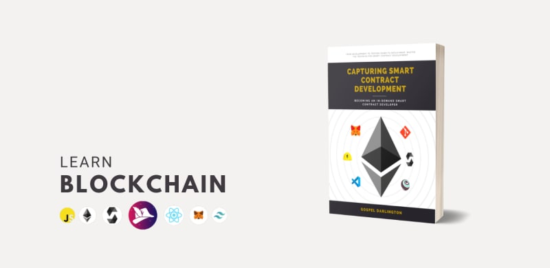
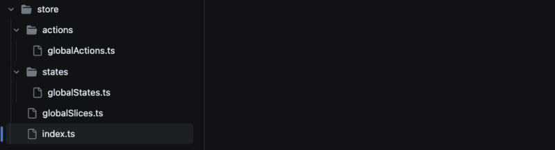
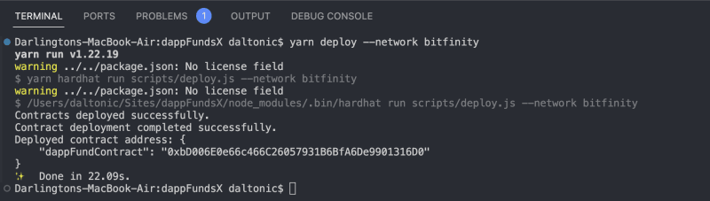

Добро пожаловать в наше полное руководство ”Создание Web3 Events Marketplace с помощью Next.js, TypeScript и Solidity”. В этом руководстве мы создадим децентрализованный рынок событий, использующий возможности технологии блокчейн. Вы получите четкое представление о следующем:

- Построение динамических интерфейсов с помощью Next.js
- Создание смарт-контрактов Ethereum с помощью Solidity
- Включение статической проверки типов с помощью TypeScript
- Развертывание и взаимодействие с вашими смарт-контрактами
- Понимание основ рынка событий на основе блокчейна

То, что вы будете создавать, смотрите в нашем [git repo](https://github.com/Daltonic/dappEventX) для готовой работы и в нашей [live demo](https://dapp-event-x.vercel.app/).

[

[

К концу этого руководства у вас будет функционирующая децентрализованная платформа, на которой пользователи смогут размещать объявления и участвовать в мероприятиях, а все транзакции будут управляться и защищаться смарт-контрактами Ethereum.

В качестве дополнительного стимула за участие в этом руководстве мы дарим копию нашей престижной книги о том, как стать востребованным разработчиком Solidity. Это предложение бесплатно для первых 300 участников. Чтобы узнать, как получить свой экземпляр, посмотрите короткое видео ниже.



## [](#prerequisites)Prerequisites

Вам понадобятся следующие инструменты, установленные для сборки вместе со мной:

- Node.js
- Yarn
- Git Bash
- MetaMask
- Next.js
- Solidity
- Инструментарий Redux
- Tailwind CSS

Чтобы настроить MetaMask для этого урока, посмотрите обучающее видео ниже:

https://www.youtube.com/watch?v=qV1mbFOtkxo

После успешной настройки вы сможете получить бесплатную копию нашей книги. Чтобы получить книгу, [пожалуйста, заполните форму для отправки доказательства работы](https://forms.gle/uGtm3ZcEHb5pqd3YA).

Посмотрите следующие [обучающие видео](https://www.youtube.com/playlist?list=PLUDcVqFK2t-C36KaTMzV3y1wu8Hf-qyAI), чтобы получить до 3 месяцев бесплатных премиум-курсов в Академии Dapp Mentors, включая:

Присоединяйтесь к экосистеме Bitfinity и станьте частью следующего поколения dApps. Примените свои знания Bitfinity для создания dApp для аренды жилья на основе блокчейна в заключительном модуле. [**Разверните свои смарт-контракты в сети Bitfinity и совершите революцию в индустрии аренды жилья**](https://bitfinity.network/)

Итак, давайте приступим к изучению учебника и настройке нашего проекта.

## [](#setup)Setup

Мы начнем с клонирования подготовленного репозитория фронтенда и настройки переменных окружения. Выполните следующие команды:

```bash
git clone https://github.com/Daltonic/dappEventX
cd dappEventX
yarn install
git checkout 01_no_redux
```

Далее создайте файл `.env` в корне проекта и включите в него следующие ключи:

`NEXT_PUBLIC_RPC_URL=http://127.0.0.1:8545 NEXT_PUBLIC_ALCHEMY_ID=<YOUR_ALCHEMY_PROJECT_ID> NEXT_PUBLIC_PROJECT_ID=<WALLET_CONNECT_PROJECT_ID> NEXTAUTH_URL=http://localhost:3000 NEXTAUTH_SECRET=somereallysecretsecret`.

Замените `<YOUR_ALCHEMY_PROJECT_ID>` и `<WALLET_CONNECT_PROJECT_ID>` на ваши соответствующие идентификаторы проектов.

`ВАШ_ALCHEMY_PROJECT_ID`: [Получить ключ здесь](https://dashboard.alchemy.com/)
`WALLET_CONNECT_PROJECT_ID`: [Получить ключ здесь](https://cloud.walletconnect.com/sign-in)

Наконец, запустите `yarn dev`, чтобы запустить проект.


Наш пользовательский интерфейс готов к внедрению смарт-контрактов, однако нам все еще нужно интегрировать Redux, чтобы облегчить обмен данными.

## [](#building-the-redux-store)Создание магазина Redux



На изображении выше представлена структура нашего магазина Redux, она будет простой, поскольку мы не создаем какой-то слишком сложный проект.

Мы настроим Redux на управление глобальным состоянием нашего приложения. Для этого выполните следующие шаги:

1. Создайте папку `store` в корне проекта.
2. Внутри `store` создайте две папки: `actions` и `states`.
3. Внутри `states` создайте файл `globalStates.ts`.

4. Внутри `actions` создайте файл `globalActions.ts`.

5. Создайте файл `globalSlices.ts` в папке `store`.

6. Создайте файл `index.ts` в папке `store`.

7. Обновите файл `pages/_app.tsx` с провайдером Redux.

Мы внедрили инструментарий Redux в наше приложение и планируем вернуться к его использованию при интеграции бэкенда с fronсклонны.

## [](#smart-contract-development)Разработка смарт-контрактов

Далее мы разработаем смарт-контракт для нашей платформы:

1. Создайте папку `contracts` в корне проекта.
2. Внутри `contracts` создайте файл `DappEventX.sol` и добавьте в него код контракта, приведенный ниже.

Приведенный выше смарт-контракт предназначен для управления маркетплейсом событий на блокчейне. Он позволяет пользователям создавать, обновлять и удалять события, покупать билеты на них и обрабатывать выплаты. Вот подробное описание его функций:

1. **Конструктор (**`**constructor(uint256 _pct) ERC721('Event X', 'EVX')**`**):** Эта функция инициализирует контракт, устанавливает процент комиссии за обслуживание и назначает начальные параметры токена.
2. Функция **createEvent:** Эта функция позволяет пользователю создать новое событие. Она требует указать название, описание, URL-адрес изображения, вместимость, стоимость билета, время начала и окончания. Она проверяет все введенные данные и создает новую структуру события, которая хранится в связке событий.
3. Функция **updateEvent:** Эта функция позволяет пользователю обновить существующее событие. Она требует тех же параметров, что и функция createEvent. Перед обновлением данных события она проверяет, что событие существует и что вызывающая сторона является его владельцем.
4. Функция **deleteEvent:** Эта функция позволяет владельцу события удалить его. Она проверяет, что событие существует, что вызывающая сторона является владельцем события или владельцем контракта, и что событие не было оплачено или возвращено. Затем она возвращает все билеты на мероприятие и помечает мероприятие как удаленное.
5. Функция **getEvents:** Эта функция возвращает все существующие события. Она создает массив нужного размера, а затем заполняет его всеми событиями, которые не были удалены.
6. Функция **getMyEvents:** Эта функция возвращает все события, принадлежащие вызывающей стороне. Она создает массив нужного размера, а затем заполняет его всеми событиями, принадлежащими вызывающей стороне, которые не были удалены.
7. Функция **getSingleEvent:** Эта функция возвращает конкретное событие. Она просто возвращает структуру события из отображения событий.
8. Функция **buyTickets:** Эта функция позволяет пользователю купить билеты на событие. Она проверяет, что событие существует, что отправленное значение не меньше общей стоимости билетов и что есть достаточно свободных мест. Затем она создает новые структуры билетов для каждого билета и добавляет их в связку билетов.
9. Функция **getTickets:** Эта функция возвращает все билеты на определенное мероприятие. Она просто возвращает массив структур билетов из отображения билетов.
10. **refundTickets Function:** Эта внутренняя функция возвращает все билеты на определенное мероприятие. Она помечает каждый билет как возвращенный, отправляет стоимость билета обратно владельцу билета и уменьшает баланс контракта.
11. **payout Function:** Эта функция обрабатывает распределение выплат в конце события. Она проверяет, что событие существует, не было выплачено и больше не проводится. Затем она чеканит билеты на событие, подсчитывает выручку и вознаграждение и отправляет выручку за вычетом вознаграждения владельцу события, а вознаграждение - владельцу контракта. Он отмечает событие как оплаченное и уменьшает баланс контракта.
12. Функция **mintTickets:** Эта внутренняя функция чеканит билеты для определенного события. Она отмечает каждый билет и событие как майнинговое и майнит новый токен ERC721 для каждого билета.
13. **payTo Function:** Эта внутренняя функция отправляет средства на указанный адрес. Она использует низкоуровневую функцию вызова для отправки средств и проверяет, что вызов был успешным.
14. Функция **currentTime:** Эта внутренняя функция возвращает текущую метку времени. Она использует глобальную переменную block.timestamp, умножает ее на 1000 и прибавляет 1000.

## [](#contract-deployment-and-seeding)Развертывание контрактов и посев

Теперь давайте развернем наш смарт-контракт и заполним его фиктивными данными:

1. Создайте папку `scripts в корне проекта.
2. Внутри папки `scripts создайте файлы `deploy.js`и`seed.js` и добавьте в них следующие коды.

**Сценарий развертывания**

**Seed**

1. Выполните следующие команды, чтобы развернуть контракт и засеять его данными:

```bash
yarn hardhat node  # Запустить в терминале 1
yarn hardhat run scripts/deploy.js  # Запустить в терминале 2
yarn hardhat run scripts/seed.js  # Выполнить в терминале 2
```

Если вы все сделали правильно, вы должны увидеть вывод, подобный приведенному ниже:



На этом этапе мы можем начать интеграцию нашего смарт-контракта с нашим фронтендом.

https://www.youtube.com/watch?v=JePa-DzZsJA

## [](#frontend-integration)Интеграция фронтенда

Сначала создайте в корне проекта папку `services, а в ней - файл `blockchain.tsx`. Этот файл будет содержать функции для взаимодействия с нашим смарт-контрактом.

Приведенный выше код представляет собой сервис, который взаимодействует с Events Marketplтуз-контракт. Сервис взаимодействует со смарт-контрактом, развернутым на блокчейне Ethereum с помощью библиотеки ethers.js.

**Ниже приводится подробное описание его функций:**.

1. Функция **getEthereumContracts:** Эта функция устанавливает соединение с блокчейном Ethereum и смарт-контрактом. Она использует библиотеку ethers для создания провайдера (для взаимодействия с блокчейном Ethereum) и подписывающего устройства (для подписания транзакций). Затем создается экземпляр контракта, который может быть использован для взаимодействия со смарт-контрактом.
2. Функция **createEvent:** Эта функция создает новое событие, вызывая функцию createEvent контракта.
3. **updateEvent Function:** Эта функция обновляет существующее событие, вызывая функцию updateEvent контракта.
4. **deleteEvent Функция:** Эта функция удаляет событие, вызывая функцию deleteEvent контракта.
5. **payout Function:** Эта функция обрабатывает распределение выплат по окончании события.
6. **buyTicket Function:** Эта функция позволяет пользователю купить билеты на событие.
7. **getEvents и getMyEvents Функции:** Эти функции получают информацию обо всех событиях или событиях, принадлежащих вызывающей стороне. Они вызывают соответствующие функции в контракте и структурируют возвращаемые данные.
8. Функция **getEvent:** Эта функция получает информацию о конкретном событии. Она вызывает соответствующую функцию в контракте и структурирует возвращаемые данные.
9. Функция **getTickets:** Эта функция получает информацию о билетах на определенное мероприятие. Она вызывает соответствующую функцию в контракте и структурирует возвращаемые данные.
10. Функции **structuredEvent и structuredTicket:** Эти функции структурируют данные, возвращаемые из контракта, в более удобный для управления формат. Они преобразуют типы данных из формата контракта в формат JavaScript и сортируют данные.

Далее обновите файл `provider.tsx` внутри `services`, чтобы включить в него сеть `bitfinity`, используя следующие коды.

## [](#page-interacting-with-smart-contract)Страница, взаимодействующая со смарт-контрактом

Далее мы свяжем функции в сервисе блокчейна с соответствующими интерфейсами во фронтенде:

**Название 1: Отображение доступных событий**.
Обновите `pages/index.tsx`, чтобы получить данные из функции `getEvents()`.

Потратьте немного времени и посмотрите, как мы реализовали кнопку ”Загрузить больше”, я уверен, что вы найдете ее полезной.

**Задание 2: Отображение событий пользователя**.
Обновите `pages/events/personal.tsx`, чтобы получить данные из функции `getMyEvents()`.

**Нет 3: Создание нового события**
Обновите файл `pages/events/create.tsx`, чтобы использовать функцию `createEvent()` для отправки формы.

**Нет 4: Отображение одного события**
Обновите файл `pages/events/[id].tsx` для получения данных из функций `getEvent()` и `getTickets()`.

**Задание 5: Редактирование одного события**
Измените файл `pages/events/edit/[id].tsx`, чтобы получать данные из функции `getEvent()` и обновлять их, вызывая `updateEvent()`.

**Задание 6: Отображение билетов на мероприятие**.
Обновите файл `pages/events/tickets/[id].tsx` для получения данных из функции `getTickets()`.

## [](#components-with-smart-contract)Компоненты с умным контрактом

Давайте применим тот же подход, который мы использовали для предыдущих страниц, и обновим следующие компоненты для взаимодействия со смарт-контрактом.

**Номер 1: Покупка билета**.
Обновите файл `components/BuyTicket.tsx`, чтобы использовать функцию `handleSubmit()` для вызова функции `buyTicket()`.

**Задание 2: Удаление и оплата событий**.
Наконец, обновите файл `components/EventAction.tsx`, чтобы использовать функции `deleteEvent()` и `payout()`.

Следует отметить, что этот компонент является выпадающим и содержит соответствующие действия для управления конкретным событием.

Все компоненты и страницы проекта были успешно подключены к смарт-контракту, что свидетельствует о завершении работы над проектом после внедрения этих обновлений.

Если ваш сервер Next.js был отключен, вы можете восстановить его, выполнив команду `yarn dev`.

Для дальнейшего обучения мы рекомендуем подписаться на наш [**YouTube-канал**](https://www.youtube.com/@dappmentors?sub_confirmation=1) и [**посетить наш сайт для получения дополнительных ресурсов**](https://dappmentors.org/).

https://www.youtube.com/watch?v=Ubom39y5jX8

## [](#заключение)Заключение

В этом руководстве мы успешно создали Web3 Events Marketplace с помощью Next.js, TypeScript и Solidity. Мы создали среду разработки, создали магазин Redux и развернули наш смарт-контракт в локальной цепочке.

Мы создали динамические интерфейсы, смарт-контракты Ethereum и управляли общими данными с помощью Redux. Интегрировав смарт-контракт с фронтендом, мы позволили пользователям размещать списки событий и участвовать в них, а транзакции управляются и защищаются смарт-контрактами Ethereum.

Теперь вы обладаете всеми необходимыми навыками для создания собственного Web3 Events Marketplace. Мы также предоставили вам живую демонстрацию и готовую работу в нашем git-репо для ознакомления. Счастливого кодинга!

## [](#about-author)Об авторе

Я разработчик web3 и создательэр [Dapp Mentors](https://dappmentors.org/), компании, которая помогает предприятиям и частным лицам создавать и запускать децентрализованные приложения. У меня более 7 лет опыта работы в индустрии программного обеспечения, и я увлечен использованием технологии блокчейн для создания новых и инновационных приложений. Я веду канал [**YouTube под названием Dapp Mentors**](https://www.youtube.com/@dappmentors?sub_confirmation=1), где делюсь учебниками и советами по web3-разработке, а также регулярно публикую в сети статьи о последних тенденциях в блокчейн-пространстве.
