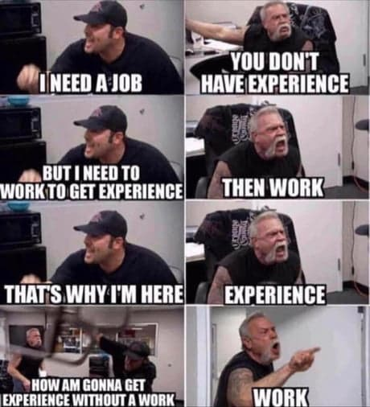
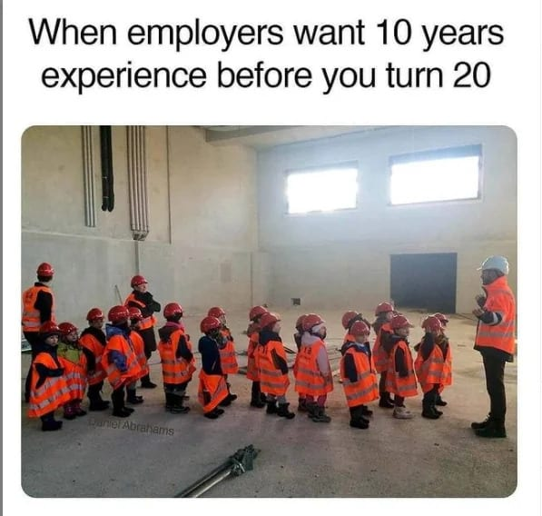
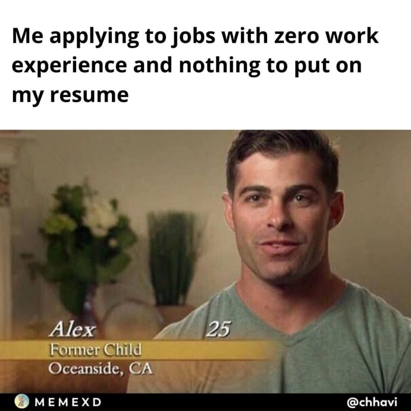
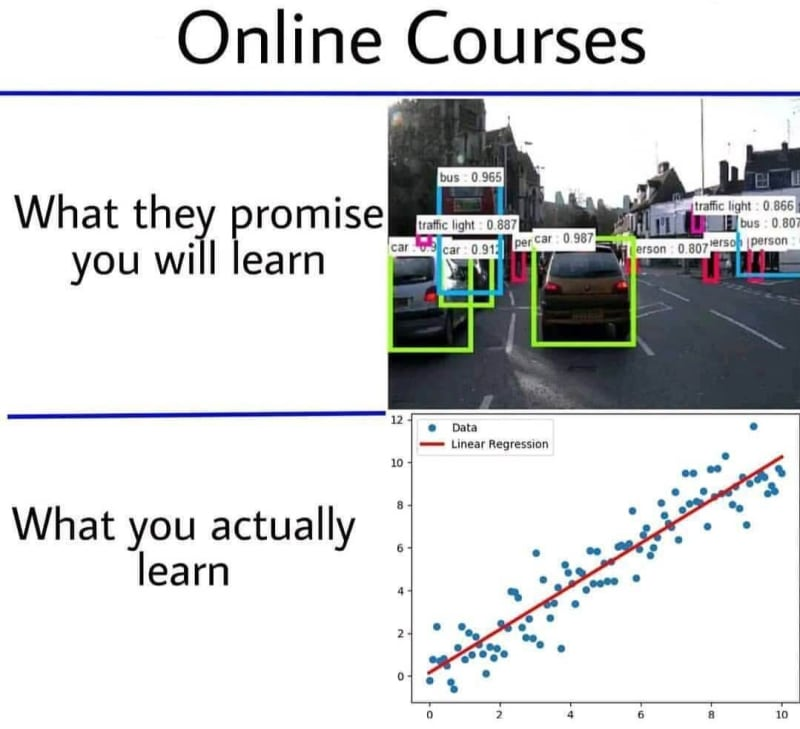
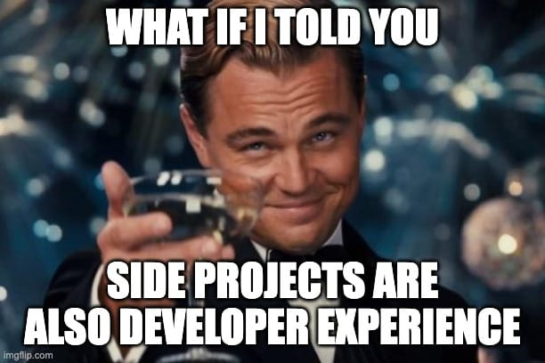
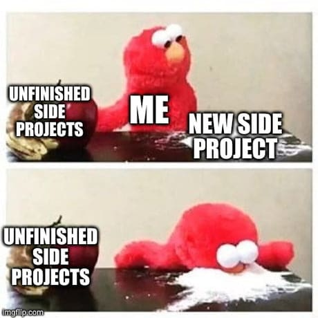

Если вы разработчик [ищете работу](https://dev.to/dragosnedelcu/how-to-find-a-developer-job-in-2023-with-little-or-no-experience-27h7), то наверняка уже слышали это: ”Мы предложили другого кандидата, у которого больше опыта”.

Такие сообщения могут буквально сломать вас.

Кроме того, они ставят вас в безвыходную ситуацию. Если бы ваша проблема заключалась в причудливой структуре данных, вы могли бы ее изучить. Если бы это был паттерн проектирования, вы могли бы его изучить. Но вы не можете просто щелкнуть пальцами и получить больше опыта разработчика.

Попытка устроиться на работу разработчиком без опыта практически невозможна в условиях нынешней экономики. Это происходит из-за порочного круга, называемого ”ловушкой опыта”.

Вы не можете пройти техническое собеседование, потому что у вас нет достаточного опыта. У вас нет опыта, потому что вы не проходите [технические собеседования](https://dev.to/dragosnedelcu/how-to-nail-your-next-technical-interview-in-2024-step-by-step-4jh0). Поэтому вы не можете найти работу. Это проблема курицы и яйца.

И чем больше вы младший, тем сложнее.

В 2024 году [ситуация стала еще хуже] (https://dev.to/dragosnedelcu/why-is-it-so-hard-to-find-a-developer-job-in-2023-and-how-to-fix-it-2d13), а компании стали еще более требовательными. С увольнениями, рецессией и искусственным интеллектом рынок труда стал ”только для пенсионеров”, где опыт - король.

_Порочный круг младших разработчиков. Image Credits: Reddit._

Как вы можете разорвать этот порочный круг?

Стоит ли вам следовать традиционным советам и посещать курсы или заниматься побочными проектами? Стоит ли врать в своем резюме?

Или вам следует подождать 10 лет и попробовать снова?

Большинство из вас не могут ждать 10 лет, поскольку вам, вероятно, нужна работа как можно скорее. А если бы и могли, то, скорее всего, не захотели бы.

Вы также знаете, что, сколько бы курсов или побочных проектов вы ни проходили, большинство компаний, занимающихся разработкой программного обеспечения, не будут воспринимать этот опыт всерьез.

Во-первых, лгать - не самое моральное занятие. Во-вторых, рано или поздно вас поймают, поставив под угрозу вашу репутацию.

[_Разработчики ищут работу в 2024 году. Image credits: Reddit._

В этой статье я расскажу вам, как получить опыт работы разработчиком, если у вас его нет.

Если вы только начинаете работать в качестве разработчика или уже находитесь на уровне Junior, продолжайте читать. Если у вас уже есть опыт, я расскажу вам, как извлечь из него максимум пользы.

Умение продать свой опыт разработчика позволит вам претендовать на должности, которые намного лучше вашего нынешнего уровня.

Например, вы можете быть разработчиком среднего/уровня, который хочет попробовать себя на позиции старшего уровня. В этой статье мы расскажем вам, как извлечь максимальную пользу из имеющегося опыта и [выделиться из толпы](https://dev.to/dragosnedelcu/9-smart-ways-to-stand-out-as-a-developer-in-a-world-full-of-coders-2b81).

Не забывайте, что я говорю о профессиональном опыте. О том, о чем вы можете говорить на реальных технических собеседованиях. А не о случайных побочных проектах, которые никого не интересуют.

Кто я такой, чтобы давать вам советы по этому поводу?

Меня зовут [Dragos](https://www.linkedin.com/in/dragosnedelcu/), я разработчик JavaScript-самоучка, и за последние 3 года я стал наставником более 250 разработчиков, помогая им быстрее продвигаться на руководящие должности. Я помогаю амбициозным разработчикам получить признание и зарплату, которых они заслуживают. Подробнее о том, чем мы занимаемся, читайте [здесь](https://www.theseniordev.com/).

Первый шаг к получению опыта разработчика - понять, почему и какой опыт ищут компании-разработчики в первую очередь.

🚨P.S. Вы хотите быстро стать старшим разработчиком с качественными ресурсами, обратной связью и ответственностью? [Нажмите здесь, чтобы присоединиться к нашему бесплатному сообществу - Академии старших разработчиков](https://bit.ly/48ArXFV)🚨.

Вы можете подумать, что опыт - это количество лет, проведенных на определенной работе. В какой-то степени так оно и есть. Но важнее то, что стоит за этим числом.

Опыт - это доказательство. Доказательство компетентности.

На рынке компании получают деньги за предоставление ценности. Ценность означает решение проблем. Ценность означает создание программного обеспечения, которое решает проблемы бизнеса. Эти проблемы обычно не так просто решить. Поэтому люди готовы платить компании за их решение.

Решать проблемы и создавать вещи - дело рискованное.

Еще более рискованно, если вы делаете это в первый раз. Все может пойти не так. Сроки могут быть нарушены. Бюджет может быть превышен. Риск - это плохо для бизнеса. Потому что риск стоит очень дорого.

Компании стремятся свести риск к минимуму любой ценой.

Один из способов минимизировать риск - нанимать очень квалифицированных сотрудников. Чем больше специалистов, тем лучше. Людей, которые в прошлом уже строили вещи, подобные тем, которые вы хотите построить. Потому что они уже прошли этот путь, они знают короткие пути и подводные камни.

Опытные люди могут предвидеть блокирующие факторы и точки отказа. В разработке программного обеспечения это еще важнее, потому что вещи постоянно ломаются.

[

Подумайте об этом так…

В день свадьбы вы не захотите, чтобы вас стриг младший парикмахер, только что окончивший школу. Вам нужен профессиональный стилист. Даже если вам нужна самая простая стрижка в мире, вы не хотите рисковать. Вы обратитесь к опытному парикмахеру.

При приеме на работу компании поступают так же.

Потому что они не хотят, чтобы вы совершали ошибки с их деньгами.

Они хотят платить за ошибки, которые вы совершили в прошлом, и за то, чему вы на них научились. Отсюда и нынешняя одержимость ”многолетним опытом”.

##### Опыт работы, который ищут компании, - это результат совершения ошибок. И учиться на них.

Это результат знакомства с различными технологическими стеками, сценариями и ситуациями при создании программного обеспечения в реальном мире. Применения теоретических знаний в реальном мире и извлечения уроков из полученных результатов.

Помните об этом как при [составлении резюме](https://dev.to/dragosnedelcu/build-the-perfect-developer-cv-7-dumb-mistakes-to-avoid-in-2024-3p15), так и во время [технических собеседований](https://dev.to/dragosnedelcu/how-to-nail-your-next-technical-interview-in-2024-step-by-step-4jh0).

Даже если у вас нет опыта написания кода или он очень мал, вы захотите представить все, что у вас есть, как профессиональный опыт.

#### Прежде чем мы начнем: Устранение ограничивающих убеждений

Это ментальный блок, который я вижу у многих младших разработчиков. Они думают, что только потому, что у них никогда не было работы разработчика, они не могут считать себя настоящими разработчиками.

Они считают, что им нужен ”официальный старт” в карьере разработчика.

Например, в “Bootcamp” или на первую работу. Хотя на самом деле им это даже не нужно. Потому что в тот момент, когда вы начинаете писать код с целью получить работу, вы уже разработчик. Даже если вам пока никто за это не заплатил, вы - разработчик, и вы пишете код профессионально.

Так что оставьте мысли ”я не настоящий кодер” за дверью, засучите рукава и давайте поможем вам решить эту "проблему многолетнего опыта".

Есть несколько способов получить опыт разработчика, когда у вас его нет. Давайте рассмотрим их по порядку:

## 1\. Сначала сожми лимоны, которые у тебя есть

Первый шаг - выбрать любой опыт разработчика, который у вас уже есть, и расширить его. Неважно, что это всего лишь несколько месяцев, недель или даже дней, вы можете и должны использовать его в качестве профессионального опыта разработчика.

Это может быть неоплачиваемая стажировка, время, когда вы помогали своему дяде с сайтом WordPress, или официальная программа, например Bootcamp. Все они считаются.

[ _Не совсем то, к чему мы стремимся, но опыт прохождения собеседования весьма ценен сам по себе._

Мы начнем с нетехнического опыта - опыта, который вы приобрели до того, как научились кодить. После этого мы перейдем к рассмотрению опыта кодирования, который вы получили на данный момент.

### 1.2 Превращение нетехнологичного опыта в технологичный

Большинство разработчиков-самоучек пропускают этот шаг. Они думают о своем пути разработчика как о срезе. И отбрасывают весь опыт, который у них был до написания первой строчки кода. Но если мы играем в игру, у кого больше опыта, мы должны выжать этот лимон, и выжать сильно.

Здесь вам нужно выбрать свой последний опыт работы и подумать о той части, которая связана с взаимодействием с программным обеспечением.

> ”Когда речь идет о том, чтобы выделиться как разработчик, важна каждая крупица опыта”. - Драгош Неделку

Например, если вы раньше работали в сфере продаж, то, скорее всего, вносили данные в CRM. Если вы работали в сфере логистики, вы использовали ERP. Если вы были аналитиком, вы использовали Excel и макросы. А если вы работали в маркетинге или UX-дизайне, то наверняка знали основы HTML и CSS.

Теперь возьмите этот небольшой опыт, даже если он составлял всего 3% вашей работы в то время, и расскажите о нем. Количественно оцените его, сделайте его осязаемым и упомяните используемые технологии. Точно так же, как вы бы сделали это с опытом кодирования.

Совет **Senior Dev**: в резюме на нетехнические должности следует использовать не более 3 пунктов. Если это на 100% нетехническая должность, и за это время вы не прикоснулись ни к одной технологии, лучше пропустить этот опыт.

### 1.2 Превратите опыт Bootcamp в профессиональный опыт

Самая большая ошибка, которую допускают разработчики при получении опыта в Bootcamp, заключается в том, что они считают его образованием, а не опытом работы. В то время как на самом деле то, что они получают в Bootcamp, ближе всего к профессиональному опыту.

Вам предстоит создавать приложения вместе с командой других разработчиков в очень жесткие сроки. Bootcamp - это самое близкое знакомство с написанием кода на жизнь!

Поэтому, добавляя его в свое резюме, не указывайте его как образование. Используйте название ”Стажер-разработчик программного обеспечения” или аналогичное.

[ _Шутки в сторону, говорить слишком много о своем Bootcamp, да еще и в неправильном ключе, кричит “Junior Developer”._

У выпускников Bootcamp обычно плохая репутация. Обойдите это. Не говорите о Bootcamp. Говорите о том, чего вы достигли за это время.

Во-вторых, оцените то, что вы сделали во время Bootcamp, так же, как вы оценили бы профессиональный опыт работы. Опять же, не говорите о том, чему вы научились, говорите о том, что вы создали.

Сколько приложений вы разработали? Насколько большими были команды, в которых вы работали? Это может показаться глупыми вещами, но все эти мелкие детали складываются в [отличное резюме разработчика] (https://dev.to/dragosnedelcu/build-the-perfect-developer-cv-7-dumb-mistakes-to-avoid-in-2024-3p15).

### 1.3 Если вы полностью самоучка

Если у вас нет Bootcamp, и вы учитесь кодить самостоятельно, действуют те же принципы.

Во-первых, считайте себя самозанятым с момента написания первой строки кода. Во-вторых, посмотрите на пункт № 2 этой статьи.

Там я покажу вам, как превратить самообучение в профессиональный опыт. Это поможет вам обратить на себя внимание рекрутеров и пройти техническое собеседование.

Совет **Старшему разработчику**: Возможно, вы захотите избавиться от упоминания Bootcamp в своем резюме. Опыт работы в Bootcamp добавляет ”урезанность” в ваше резюме. Вместо этого извлеките то, что вы создавали в Bootcamp, и включите это в свой опыт "самостоятельной работы".

## 2\. Second, Fabricate Developer Experience Out Of Thin Air

Теперь, когда вы выжали все, что у вас уже есть, пришло время добавить еще один слой опыта.

Вы сделаете это, используя все курсы и побочные проекты, которые вы делали для улучшения своего курса, и соберете их в большой снежный ком опыта.

Проблема, с которой сталкивается большинство разработчиков, заключается в том, что учебная деятельность снова рассматривается как непрофессиональный опыт. Неправильно. Мы вообще не будем говорить о курсах или побочных проектах.

[ _Не совсем магия, но правильная количественная оценка ваших достижений и опыта обучения._

Мы расскажем об ощутимых результатах, которые были получены в ходе обучения.

### 2.1 Как превратить онлайн-курсы в опыт разработчика

Онлайн-курсы, пожалуй, сложнее всего превратить в ”опыт разработчика”, особенно если вы просто укажете их в своем резюме.

Компании не воспримут всерьез то, что вы узнали на YouTube. Если только вы не представите их должным образом. В ощутимой форме.

Например, если побочный проект связан с React Hooks, скажите: ”Использовал продвинутые крючки React для повышения производительности и улучшения пользовательского опыта в приложении с высоким трафиком на стороне клиента”.

Если это был курс по AWS - ”Разверните 6 различных приложений в облаке AWS, сделав их готовыми к производству, используя различные сервисы, такие как AWS Lambda, S3 и EC2” и т. д.

Не рассказывайте мне, чему вы научились, а покажите результат этого обучения.

[ _Даже если вы не узнали много нового, пройдя определенный курс, вы все равно можете использовать полученные знания в своем резюме._

Еще одно решение - уйти от задач, похожих на учебники, и перейти к более проектно-ориентированным курсам, где есть какой-то результат. Например, готовое приложение React, которое можно развернуть и показать людям.

Убедитесь, что то, чему вы учитесь, решает реальную проблему. И применяйте полученные знания на практике.

### 2.2 Побочные проекты: Как продавать их лучше

Побочные проекты немного лучше онлайн-курсов для получения опыта разработчика. Потому что они включают в себя гораздо больше строительства и экспериментов.

Однако у них все еще есть несколько проблем.

Код, который вы пишете в стороннем проекте, обычно намного проще, чем в производственном приложении. Они сосредоточены на создании вещей с нуля и не столько на реальных производственных проблемах, таких как тестирование, устаревший код, масштабируемость и крайние случаи.

И наконец, работодатели вряд ли воспринимают побочные проекты всерьез.

[_Сайд-проекты - это профессиональный опыт разработчика. Но их нужно правильно преподнести. Image Credits: theSeniorDev._

Это как татуировщик, который делал татуировки только на коже животных и никогда не делал настоящих татуировок на теле. Держу пари, вы не хотите быть первым человеком, на котором рисуют.

То же самое касается компаний и побочных проектов. Они не хотят быть вашими подопытными кроликами. Им нужно видеть доказательства ошибок и ощутимые результаты этих побочных проектов.

Как и в случае с онлайн-курсами, в побочных проектах главное - сделать то, что вы создали, как можно более осязаемым. Самое лучшее в побочных проектах то, что их легче оценить количественно, чем онлайн-курсы.

Если вы создали сервис обработки изображений с помощью Node.js, вы можете упомянуть, сколько изображений он мог обработать. Если это был магазин электронной коммерции на React, можно рассказать о количестве товаров или продавцов, с которыми он мог работать.

#### Как выбрать побочные проекты для работы

Чем скучнее, тем лучше. Подумайте о CRM в сравнении с криптоплатформой. CRM - это не модно, но большинство компаний используют именно ее. Когда вы затронете эту тему на техническом собеседовании, они будут иметь к ней отношение.

Здесь очень важно не отвлекаться на ”блестящие” предметы.

[ \_Вам не нужно больше побочных проектов. Вам нужно эффективно продавать те, которые у вас есть.

Создайте что-то достаточно хорошее для демонстрации. Не тратьте на это больше нескольких недель. Большая часть вашего времени должна быть потрачена на подачу заявок на работу и прохождение собеседований, а не на побочные проекты.

**Совет для старших разработчиков**: Выберите 2 лучших побочных проекта и превратите их в профессиональный опыт. Отполируйте их настолько, насколько сможете. Сделайте их готовыми к производству. Разверните их в облаке и привяжите к соответствующему домену. Добавьте базовую аутентификацию. Наполните базу данных, если она используется. Исправьте все ошибки, которые вы можете найти. Сделайте красивый пользовательский интерфейс.

Будьте внимательны, это может занять у вас один день, а может - три месяца. Есть ли у вас в запасе 3 месяца? Скорее всего, нет. Фокус в том, как вы определяете масштаб ваших побочных проектов. Они должны быть небольшими. Вам не нужно создавать сложные вещи, чтобы выделиться как разработчик. Вам нужны простые вещи, сделанные очень хорошо.

**Примечание**: не волнуйтесь, если ваш код не идеален. Если вас спросят об этом, вы всегда можете сказать, что подписали NDA. Или что проект все еще находится в скрытом режиме, потому что они собирают деньги. Если вы умеете отвечать на технические вопросы, люди не станут копаться в них дальше.

### 2.3. Последний шаг: поместите все в большое ведро опыта.

Итак, вы извлекли всевозможные ощутимые результаты из курсов и побочных проектов. Теперь пришло время объединить их в одну большую должность.

Укажите себя в качестве индивидуального предпринимателя и упомяните, что вы создавали приложения для малого и среднего бизнеса. Придумайте название для своей компании и добавьте туда весь свой опыт.

Магия. Теперь вы создали опыт разработчика из воздуха!

Здесь есть один подводный камень. Во время собеседования некоторые люди будут копаться в этом опыте. Вас спросят, какова была ваша роль. Какие технологии вы использовали и как выглядела команда.

Если у вас нет хорошей истории, за которой вы можете стоять, вы, скорее всего, все испортите. Для этой последней позиции вам нужно записать все эти детали и задать вопросы мысленно и на бумаге, прежде чем делать это вживую перед рекрутером.

**Совет для старших разработчиков**: Неплохо было бы создать хотя бы один из ваших побочных проектов вместе с друзьями или коллегами, чтобы получить опыт работы в команде, о котором вы сможете рассказать на техническом собеседовании.

### 3\. В-третьих, получите профессиональный опыт разработчика очень быстро

Здесь вам нужно найти человека с бизнес-идеей и, в идеале, небольшим количеством денег, которому нужен кодер, чтобы воплотить ее в жизнь. Проще всего обратиться к своим близким друзьям. Если нет, придется искать незнакомцев, которым нужно решить проблемы с кодированием. Не волнуйтесь, их достаточно много, если знать, где искать.

### 3.1 Спроси своих друзей

Если у кого-то из ваших друзей есть небольшой бизнес, ему, вероятно, нужен веб-сайт. Если у них уже есть сайт, возможно, он нуждается в доработке.

Им также может понадобиться настройка CRM, некоторая работа с SEO и поток заказов. Я говорю о преподавателях йоги, парикмахерах, диетологах и всех видах консультантов.

Предложите им бесплатную помощь в обмен на рекомендацию. Количественно оцените все, что вы создаете для них, а также для себя, и добавьте это в ведро ”самозанятых”.

### 3.2 Hang Around The Right Places

Чтобы найти людей, которым нужна помощь с веб-проектами, просто побродите несколько дней по коворкинг-пространству или посетите несколько предпринимательских встреч.

Предприниматели постоянно что-то строят. Рано или поздно вы встретите человека с идеей, которому нужны дополнительные руки, чтобы помочь ее реализовать. При этом им еще не нужно привлекать капитал.

[ _Стартапы - отличное место для быстрого получения опыта разработчика. Только убедитесь, что вы задали правильные ожидания._

Если у них есть проект, которому нужна помощь, это уже хорошо. Помогая им, вы не только получите опыт разработчика, но и заведете несколько отличных знакомств, которые помогут вам найти следующую работу.

**Совет для старших разработчиков**: В наши дни все пытаются строить на основе искусственного интеллекта, поэтому даже если вы разработчик JavaScript, вам не помешает добавить в свой профиль немного навыков LLM. Не нужно проходить 60-часовые курсы, просто ознакомьтесь с тем, как устроены такие инструменты, как ChatGPT, и как интегрировать их в свои проекты.

**Совет старшего разработчика**: Именно так я нашел свой первый проект по веб-разработке, общаясь с предпринимателями. Всегда находился кто-то, кому требовалась помощь кодера.

**Совет старшего разработчика**: Старайтесь получать деньги за найденную работу, даже если это совсем немного. Деньги будут поддерживать вашу мотивацию и покажут, что вы приносите пользу проектам.

### 3.3 Использование онлайновых торговых площадок

Если все остальное не помогает, вы можете создать профиль на фрилансерских площадках, таких как Upwork или Fiverr, и попытать счастья там. Предупреждаю, выделиться будет непросто.

Вы будете конкурировать с миллионами других людей по всему миру. У каждой платформы для фриланса свои правила, и это не входит в рамки данной статьи.

В целом, используйте онлайн-платформы для пополнения своего опыта, но не рассчитывайте на них полностью в построении своей карьеры разработчика. Ваши прошлые места работы, опыт обучения и местная экосистема стартапов - гораздо более подходящее место.

**Совет старшего разработчика**: Этот вариант мне нравится меньше всего, потому что он, вероятно, самый сложный. На этих платформах вы столкнетесь с безумной конкуренцией на международном уровне. Вы также будете взаимодействовать с клиентами в безликом режиме, рискуете не получить денег или просто потерять время. Я бы попробовал это делать параллельно с работой над всеми остальными способами, которые я описал выше.

## Заключение

Возможно, у вас еще нет десятков лет опыта разработчика, но если вы будете следовать всем шагам, которые я описал в этой статье, вы, несомненно, будете выделяться.

### Ключевые выводы:

5. Чтобы выделиться на переполненном рынке труда разработчиков, важен каждый кусочек опыта, как технического, так и нетехнического.
6. То, как вы представляете свой опыт, даже важнее, чем то, сколько у вас опыта. Считайте все, что вы сделали, профессиональным опытом.
7. Превратите побочные проекты и онлайн-курсы в ценный опыт, сосредоточившись на ощутимых результатах и навыках решения проблем.
8. Используйте свою текущую сеть и местную экосистему стартапов, чтобы быстро получить опыт.

Теперь, когда у вас есть опыт работы с разработчиками, самое время написать [ваше резюме разработчика](https://dev.to/dragosnedelcu/build-the-perfect-developer-cv-7-dumb-mistakes-to-avoid-in-2024-3p15) и начать проходить технические собеседования.

[
Желаю удачи!

Увидимся в следующем,

Dragos
