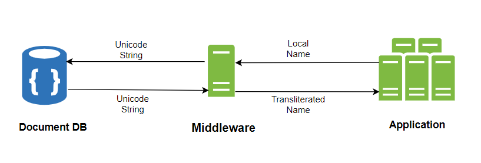
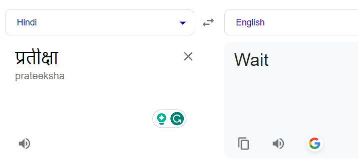
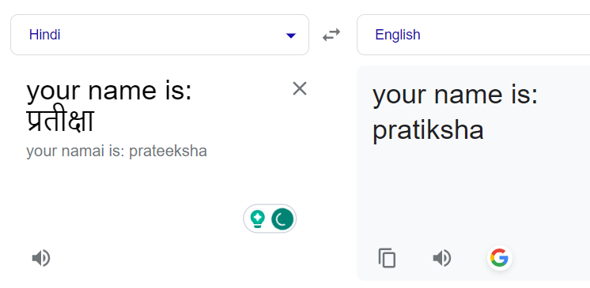

В начале этого года я и моя команда на работе изучали ошибки, возникающие в одном из наших API для регистрации. Мы увидели, что почти 5 % наших запросов не выполняются, все из-за ошибок 400 BAD REQUEST. А первопричиной стала проверка regex.

Этот regex был ограничением, когда наша система позволяла людям использовать только английские символы для ввода имени и фамилии. Проблема заключалась в том, что многие люди предпочитали вводить свои имена на родном языке.

Эти клиенты были заинтересованы в приобретении медицинских полисов на нашей платформе, что делает их важнейшим сегментом нашей пользовательской базы.

В ответ на это мы решили решить проблему этих 5% наших пользователей, предоставив им возможность вводить свои имена на любом языке, который они предпочитают. Но при этом возникло множество проблем, которые нам нужно было решить, и я расскажу, как мы это сделали.

## Проблемы, связанные с обработкой многоязычных имен

1. Стратегия хранения данных

Для хранения и поиска имен пользователей мы полагаемся на MongoDB. Хотя MongoDB позволяет хранить все символы, совместимые с UTF-8, проблема возникает при поиске.

Для английских имен мы используем метод простой свертки. Соответствующие поля соответствующим образом индексируются, чтобы оптимизировать производительность запросов.

Хотя возможность реализовать индекс свертки для других языков также существует в MongoDB, такой подход означает, что вы должны сообщить БД о конкретном языке, на котором вы собираетесь искать. Сложность заключается в том, что наша база пользователей охватывает множество языков, а в одной только Индии насчитывается более 20 различных языков.

Нашей целью было расширить поддержку по крайней мере всех индийских языков. Но это означало, что реализация индексов свертки для каждого поддерживаемого языка приведет к увеличению количества индексов, а также к увеличению размера индекса со временем.

Такой подход также возлагает на разработчиков ответственность за то, чтобы не забывать добавлять индекс для каждого нового языка по мере расширения нашей языковой поддержки, что далеко не всегда является эффективным решением.

2. Ограничение на шлюз API

Все наши API открыты через API-шлюз. Непосредственно перед тем, как шлюз направляет запрос к соответствующему API-сервису, входящая политика проверяет статус аутентификации пользователя. После того как пользователь аутентифицирован, она получает основные данные пользователя, такие как имя, номер мобильного телефона и другие метаданные, и добавляет их в заголовок запроса к API.

Многие API полагаются на эти пользовательские данные, содержащиеся в заголовках, для их дальнейшей обработки.

Но есть ограничение, накладываемое шлюзом, - он допускает для обработки и включения в заголовки только символы ASCII. Поэтому мы должны были убедиться, что даже если имя может быть написано на любом другом языке, ответ, которым мы поделились, должен быть исключительно на английском.

Кроме того, этот процесс должен быть быстрым, поскольку любая задержка в аутентификации может привести к снижению производительности API.

3. Проблемы внешних партнеров, связанные с использованием виртуозных названий

Даже если мы начали принимать имена на нескольких языках, есть наши партнеры, которые должны принимать эти имена от нас. Если они не поддерживают многоязычные имена, пользовательский путь ломается.

Одним из таких примеров был наш платежный партнер. Мы должны были убедиться, что наша команда по платежам всегда получает английское имя, даже если пользователи указывали имена на других языках.

Кроме того, мы хотели избежать назойливых всплывающих окон, предлагающих пользователям вводить свои имена на английском языке, когда это было возможно. Учитывая все эти проблемы, мы должны были создать жизнеспособное решение.

## Как мы решали эти проблемы

Хотя использование сторонней службы транслитерации могло бы быть самым простым решением, мы решили разработать собственное решение, чтобы контролировать расходы и сохранять полный контроль.

Учитывая API-шлюз и требования платежных партнеров, стало ясно, что нам необходимо преобразовывать неанглийские имена в английские эквиваленты. Но представление этого английского имени пользователю было нелогичным - например, вводить имя на хинди, а при входе в систему видеть его преобразованным в английское, казалось противоречивым.

Чтобы справиться с этой проблемой, мы разработали стратегию двойного именования. Оригинальные поля, `"firstName"` и `"lastName"`, сохраняли введенные пользователем имена на их языке. Затем мы ввели два дополнительных поля, `"englishFirstName"` и `"englishLastName"`, которые предназначались для хранения английских аналогов этих имен. Эти английские имена можно было передавать API-шлюзу и нашим платежным партнерам.

Возвращаясь к проблеме эффективного хранения этих названий, мы предполагали, что управление индексами сглаживания по мере роста числа поддерживаемых языков станет неуправляемым. Кроме того, для поиска нужно будет указывать коллизию для каждого запроса, что создаст дополнительный уровень сложности. Поэтому мы решили отказаться от этого подхода.

Второй подход предполагал использование Юникода. Поскольку мы стремились поддерживать множество языков без ограничений, мы поняли, что Юникод может эффективно представлять символы почти всех языков. Поэтому мы решили хранить представления Unicode для имен и фамилий в соответствующих полях MongoDB.

Мы просто добавили еще один слой между нашей БД и приложением. Он преобразует эти строки Unicode в исходные значения на местном языке, получая имена из БД и преобразуя местные имена в соответствующие английские. Затем он сохраняет их в `englishFirstName` и `englishLastName` во время любой вставки или обновления.



Эта стратегия обеспечила гибкость, необходимую нам для удобного управления многоязычными названиями.

## Ключевые аспекты проектирования

1. Оптимизация юникода

Представление Юникода обычно состоит из 6 символов, где ‘a’ представлено как ‘U+0061’, а ‘P’ - как ‘U+0050’, обычно начинающихся с ‘U+00’. Для экономии места в нашей базе данных мы решили опустить префикс ‘U+’ и ведущие нули, оптимизировав хранение данных.

2. Транслитерация и перевод

Изначально нашей целью была транслитерация, которая предполагает перевод имен из одной письменности в другую с сохранением их фонетического звучания.

Например, слово на хинди `"प्रतीक्षा"` должно быть преобразовано в `"Partiksha"`, а не переведено в его английский эквивалент, `"Wait"`.

Но мы понимали, что Google Translate в первую очередь ориентирован на перевод, а не на транслитерацию. Поэтому мы не хотели сразу переходить на платный сервис транслитерации Google, поэтому мы разработали наш сервис транслитерации, используя бесплатную версию Google Translate.

3. Контекстные улучшения

Еще одним и наиболее важным наблюдением, которое мы сделали, было предоставление контекста API Google Translate, который повлиял на его ответы.

Чтобы использовать эту возможность, мы экспериментировали с добавлением префиксов к неанглийским именам для определения контекста. После нескольких пробных попыток мы поняли, что для коротких имен (менее 5 символов) более обширные префиксы не дают желаемых результатов, и Google часто возвращает одно и то же слово на хинди. Для более длинных имен мы использовали более длинные префиксы, определяя оптимальный баланс методом проб и ошибок.

Перевод имен обычно приводил к их буквальному переводу. Например, ”प्रतीक्षा” - "Жди" вместо "Пратикша":



Добавление префикса исправляет ситуацию:



Хорошо, теперь давайте посмотрим, как мы все это реализовали.

## Начальный код

После первой итерации мы разработали приведенный ниже код для транслитерации. Здесь мы используем библиотеку `@iamtraction/google-translate`, которая представляет собой обертку, написанную над бесплатным API Google translate.

```ts
const translate = require('@iamtraction/google-translate');

function getGoogleTranslateText(localName) {
	/* Adding an English sentence before the name so that it doesn't get translated to its literal meaning. For eg परीक्षा to Exam instead of Pariksha. */
	if (localName.length <= 5) {
		return `name: ${localName}`;
	}
	return `your name is: ${localName}`;
}

async function translateNameToEnglish(localName) {
	if (localName.match(/^[a-zA-Z ]+$/i)) {
		// If the name is already in English just return
		return localName;
	}
	try {
		const res = await translate(getGoogleTranslateText(localName), { to: 'en' });
		const translatedName = res.text.split(':')[1].trim();
		return translatedName;
	} catch (err) {
		// In case of error, Return the Unicode string
		return localName;
	}
}
```

## Бета-версия и проблемы производства

Как только мы создали эту функцию, мы выпустили ее в бета-версию, и в течение первых нескольких дней около 250 пользователей зарегистрировались с неанглийскими именами.

Просто просмотрев несколько переведенных текстов, мы обнаружили, что процесс преобразования имени из местного языка в Юникод работает отлично, и пользователи могут правильно отображать свои имена в приложении на том языке, который они предпочитают.

Тем не менее, мы выявили две проблемы, связанные с процессом транслитерации на английский язык:

Некоторые имена были неверно транслитерированы. Это может быть связано с тем, что мы использовали Google Translate, общую службу перевода, а не специализированную службу транслитерации. Некоторые имена остались без изменений и не были транслитерированы. Эти имена были возвращены на том же языке, что и оригинал. Это означало, что добавление контекста с префиксными предложениями перед переводом вызывало проблемы для конкретных имен.

Это побудило нас к дальнейшему расследованию, которое привело нас к другому пакету npm под названием “unidecode”, который преобразует Unicode в оригинальную строку. Хотя первые тесты с unidecode показали точность, они также выявили незначительные орфографические несоответствия. В отличие от этого, Google постоянно предоставлял переводы с правильным написанием. Нам просто нужно было найти способ использовать лучшее из двух миров.

Поэтому мы включили unidecode в наш алгоритм как часть нашего решения.

## Улучшенное решение

Вот что мы придумали:

```ts
const translate = require('@iamtraction/google-translate');
const unidecode = require('unidecode');
const { isAlmostEqualStrings } = require('./levenshtein');

/**
 * Generates text for Google (shorter statement context for short names) based on localName length
 * @param {String} localName
 * @returns {String} returns text to translate
 */
function getGoogleTranslateText(localName) {
	// Adding an English sentence before name so that it doesn't get translated to its literal meaning. For eg परीक्षा to Exam instead of Pariksha.
	if (localName.length <= 5) {
		return `name: ${localName}`;
	}
	return `your name is: ${localName}`;
}

/**
 * Give an ALMOST transliterated name
 * @param {String} localName
 * @param {String} googleTranslatedName
 * @returns {String} returns a converted transliterated name from the local language
 */
function transliterate(localName, googleTranslatedName) {
	const decodedName = unidecode(localName);
	if (
		decodedName &&
		Array.from(decodedName)[0]?.toLowerCase() !==
			Array.from(googleTranslatedName)[0]?.toLowerCase() &&
		!isAlmostEqualStrings(decodedName, googleTranslatedName)
	) {
		return decodedName;
	}
	return googleTranslatedName;
}

/**
 * translates non-english string to English
 * @param {String} localName - Input non English string
 * @returns {String} returns translated string
 */
async function translateNameToEnglish(localName) {
	if (!localName || localName.match(/^[a-zA-Z ]+$/i)) {
		// If name is already in English just return
		return localName;
	}
	try {
		const res = await translate(getGoogleTranslateText(localName), { to: 'en' });
		const translatedName = res.text.split(':')[1].trim();
		return transliterate(localName, translatedName);
	} catch (err) {
		// In case of error, Return original string
		return localName;
	}
}
```

Получив переведенное имя, мы отправляем его в недавно появившуюся функцию `transliterate`. Внутри этой функции на первом этапе мы извлекаем декодированную строку с помощью библиотеки `Unidecode`. Но тут возникает главный вопрос: как определить, какому результату отдать предпочтение - декодированной или переведенной строке?

Для решения этой проблемы мы применили Levenshtein Distance - алгоритм, который вычисляет сходство между двумя строками.

Сначала мы проверяем, совпадает ли первый символ расшифрованного имени с первым символом переведенного имени. Если не совпадает, то наверняка переведенное имя было неверным, поэтому мы возвращаем расшифрованное имя, даже если оно может содержать незначительные орфографические несоответствия, лучше использовать его, чем неверный перевод.

Если они совпадают, то мы используем алгоритм расстояния Левенштейна.

Расстояние Левенштейна - это число, которое показывает, насколько похожи две струны. Чем выше число, тем более несхожи две струны.

Расстояние Левенштейна - это число, которое показывает, насколько похожи две струны. Чем выше число, тем более несхожи две струны.

В реализации у нас есть функция `isAlmostEqualStrings`, которая генерирует значение от 0 до 1 и возвращает true, если значение выше определенного порога. В нашем случае мы установили порог на 0,8

В реализации у нас есть функция `isAlmostEqualStrings`, которая генерирует значение от 0 до 1 и возвращает true, если значение выше определенного порога. В нашем случае мы установили порог на 0,8

Если расстояние Левенштейна показывает совпадение более 80 %, мы возвращаем переведенное имя. В противном случае мы возвращаем декодированное имя. Такой подход обеспечивает приоритет точности, предлагая надежный результат, основанный на установленном пороге сходства.

Если расстояние Левенштейна показывает совпадение более 80 %, мы возвращаем переведенное имя. В противном случае мы возвращаем декодированное имя. Такой подход обеспечивает приоритет точности, предлагая надежный результат, основанный на установленном пороге сходства.

Этот обновленный алгоритм существенно снизил вероятность возникновения вышеупомянутых проблем. Несмотря на то что он не на 100% точен, он очень хорошо справился с нашими 5% случаев.

Этот обновленный алгоритм существенно снизил вероятность возникновения вышеупомянутых проблем. Несмотря на то что он не на 100% точен, он очень хорошо справился с нашими 5% случаев.

## Заключение

Разработанный нами алгоритм был полностью собственным и не потребовал никаких затрат. Хотя инвестиции в платное решение потенциально могли бы дать лучшие результаты, мудрые инженерные решения, принятые итеративно, и несколько умных хаков сыграли важную роль в снижении затрат и эффективном решении конкретной проблемы, с которой мы столкнулись.

Полный код приведенной выше реализации вместе с алгоритмом расстояния Левенштейна можно найти на GitHub (вклад/исправления приветствуются).
