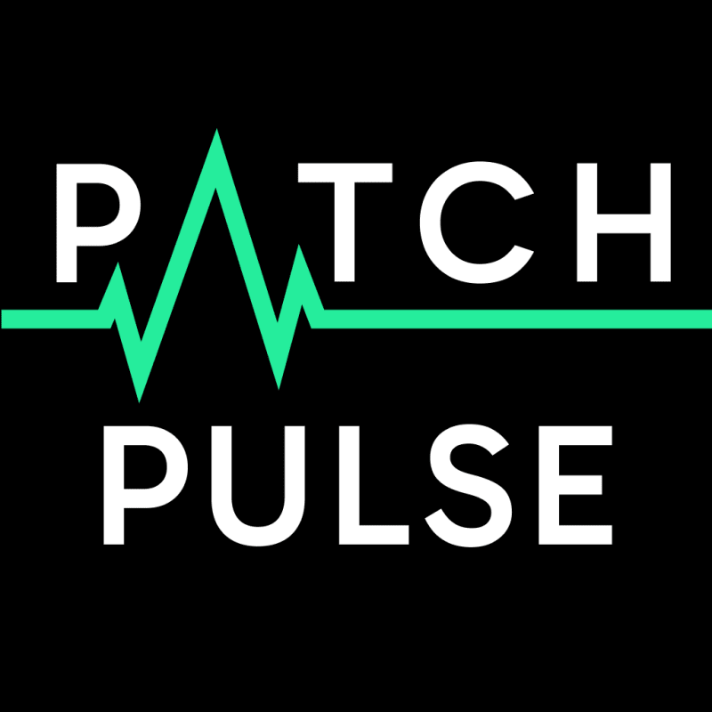
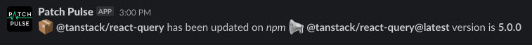

Добро пожаловать в путешествие по Patch Pulse, моему последнему побочному проекту, который захватил моего внутреннего кодера. Эти девлоги - не просто рассказ о моем проекте (ладно, немного хвастовства!), они о том, как поддержать мой дух и, надеюсь, вдохновить других на воплощение своих идей в реальность. Готовы приступить? Поехали!

## Что такое патч-импульс?

По сути, Patch Pulse - это ваш цифровой сторож, система оповещения, которая мгновенно уведомляет вас о появлении новой версии отслеживаемых вами программных пакетов.

Пока что Patch Pulse начинает свою жизнь как Slack-бот, сфокусированный на пакетах `npm`, светящийся в выбранном вами Slack-канале всякий раз, когда появляются свежие новости о релизах для отслеживаемых вами пакетов. Но на горизонте маячит нечто большее - я планирую выйти на другие чат-сервисы и среды кодирования.

Работая старшим инженером в SecuritEase, мне всегда было необходимо следить за обновлениями наших `node_modules`. Поскольку наша команда использует Slack, я подумал: ”Почему бы не сделать для этого бота?”. Так появился Patch Pulse!

## Замысел Patch Pulse:

С момента запуска этого проекта у меня голова идет кругом от потенциальных возможностей.

Представьте, что Patch Pulse не только ограничивается Slack, но и предлагает обновления через него:

Оповещения в Discord Оповещения в Microsoft Teams Уведомления по электронной почте Push-уведомления в мобильных приложениях

И это еще не все - я представляю себе систему, в которой, если вы готовы к этому, вы можете использовать данные Patch Pulse для создания своих собственных инструментов оповещения.

Хотя я чувствую себя как дома в мире JavaScript/TypeScript, мне не терпится исследовать новые воды. Я думал о погружении в такие экосистемы, как `PyPI`, `Go` и `NuGet`, но я за то, чтобы исследовать даже больше, чем они.

## Ближайшее будущее для Patch Pulse:

Я не тороплю Patch Pulse, но у меня есть цели на оставшуюся часть 2023 года:

Вступление в каталог приложений Slack: Вы можете протестировать бота здесь, но я стремлюсь занять официальное место в каталоге приложений Slack. Мне просто нужно, чтобы около 10 рабочих пространств активно использовали его, тогда мы сможем отправить его на рассмотрение!

Переезд в Discord: Я занимаюсь этим, но сначала хочу собрать отзывы о версии для Slack. Так что ждите обновлений!

Развитие сообщества: Я заложил основу для создания сообщества Patch Pulse Discord, но ему нужно больше голосов и энергии. Если вы неравнодушны к развитию онлайн-сообществ, я буду рад вашим идеям или сотрудничеству!

Добавление новых экосистем: Я в курсе того, какие экосистемы вы хотели бы интегрировать дальше. В настоящее время `PyPI` занимает первое место в моем списке.

Продолжение истории: Считайте этот пост первой главой повествования о Patch Pulse. Впереди еще много интересного, в том числе глубокое погружение в особенности, истории развития и, да, некоторые технологические шоу.

## Заключительные комментарии

Этот проект выводит меня за пределы моих обычных границ, ориентированных на фронтенд, и мне нравится каждый новый вызов, который он приносит!

Хотите внедрить Patch Pulse в свое рабочее пространство Slack? Присоединяйтесь к путешествию здесь!

Не стесняйтесь поделиться своими мыслями, отзывами или предложениями, оставив комментарий ниже! Я хочу знать, какая из этих потенциальных функций волнует вас больше всего?

Спасибо, что разделили со мной это приключение; ваша поддержка значит для меня очень много!
