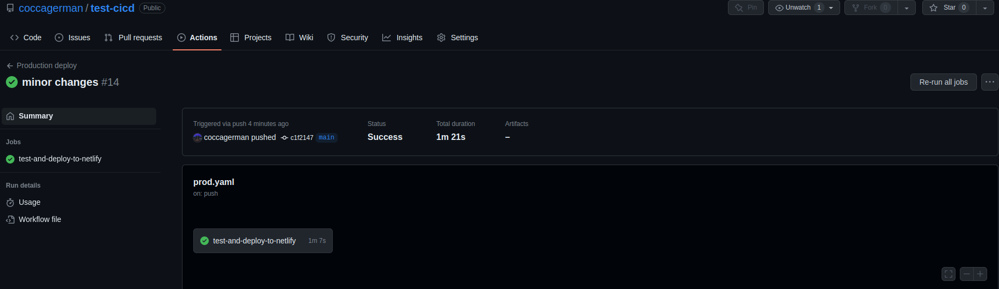

Управление состояниями - важнейшая концепция React, одной из самых популярных в мире JavaScript-библиотек для создания динамических пользовательских интерфейсов.

В связи с тем, что они играют важную роль в работе с данными, важно знать, как управлять состояниями, когда они нужны и где их можно разместить в компонентах приложения.

Эта статья погружает в мир управления состояниями React, предоставляя исчерпывающее руководство, которое поможет вам эффективно управлять состояниями. Эта статья предназначена для начинающих и средних разработчиков React, которые хотят понять, как работают состояния.

## Что такое State?

Состояние можно определить как объект, в котором хранятся данные, изменяющиеся со временем в приложении. Другими словами, состояние - это динамическое хранилище данных, которое обеспечивает механизм управления компонентами, отслеживания изменяющихся данных и запуска повторного рендеринга при их обновлении.

Благодаря модульности в React состояние служит контейнером, в котором заключены соответствующие данные, логика и поведение компонента.

Теперь, когда вы знаете, что такое состояние, вы можете визуализировать приложение еще до его создания и иметь представление о том, какие данные будут храниться в различных состояниях. Это подводит нас к моменту, который я люблю называть: ”Мышление в React”.

Эту придуманную терминологию можно описать как мысленное представление разработчика React о том, как строить приложение ”по-реактовски”. Применяя знания о сохранении чистоты компонентов, передаче реквизитов от родительских компонентов к дочерним, одностороннем потоке данных, поднятии состояний и многих других неотъемлемых аспектах React.

## Когда использовать State

При создании приложения данные играют неотъемлемую роль в том, что отображается или хранится. То же самое относится и к созданию веб-приложений на React, где компоненты отображают данные или оперируют ими - это может быть пользовательский ввод, данные, полученные из API, или любой другой динамический контент. Когда возникает необходимость получить данные, которые должны быть обновлены внутри компонента, мы используем состояние.

Чтобы лучше понять это, давайте рассмотрим пример простого приложения Todo List, которое в основном принимает вводимые элементы, которые в конечном итоге будут добавлены в отображаемый список.

Имена элементов задаются с помощью текстового ввода, а затем динамически добавляются в массив элементов.

Итак, мы определили два аспекта, связанных с данными, которые будут меняться при срабатывании. Любое обновление данных приведет к повторному рендерингу компонента. Этим двум аспектам нужен хук `useState`, чтобы обновить свои данные и выполнить соответствующую логику, связанную с ними.

```javascript
const [name, setName] = useState(' ');
const [items, setItems] = useState([]);
```

Выше показано представление хук-функции `useState`, которая позволяет компонентам иметь переменные состояния. Что касается нашего примера приложения Todo List, мы инициализировали нашу функцию `useState` пустой строкой (” ”) для имен элементов и пустым массивом (`[ ]`) для элементов.

Функции `useState` состоят из деструктурирующего присваивания, которое извлекает значения из массива или свойства из объекта. В данном случае мы извлекаем два значения, возвращаемые функциями `useState`.

`name` и `items` хранят текущее значение переменной состояния. В то время как функции `setName` и `setItems` используются для обновления значений переменных состояния.

Мы можем добавить компоненты `Header`, `Nav`, `ListArea` и `Footer` в JSX компонента `App`. Наш корневой компонент должен выглядеть следующим образом:

```js
import React, { useState } from 'react';

export default function App() {
	const [items, setItems] = useState([]);
	const [name, setName] = useState(' ');

	return (
		<div>
			<Header />
			<Nav />
			<ListArea />
			<Footer />
		</div>
	);
}
```

Отдельные компоненты с их JSX должны выглядеть следующим образом:

```js
function Header() {
	return <h2>Список дел</h2>;
}

function Nav() {
	return (
		<>
			<input type="text" />
			<button>Add</button>
		</>
	);
}

function ListArea() {
	return (
		<>
			<ul>
				<li></li>
			</ul>
		</>
	);
}

function Footer() {
	return (
		<>
			<p>У вас есть товары в корзине
		</>
	);
}
```

Как JSX нашего компонента выглядит в браузере

Это простое представление нашего списка Todo. Далее мы добавим немного логики и заставим состояния ожить. Пока что состояния находятся в компоненте `App`.

## Где использовать State

При использовании состояния важно отметить, что в разработке React существует два типа состояний:

### Глобальное состояние

Это состояния, которые доступны каждому компоненту приложения. Они всегда объявляются и находятся в корневом компоненте приложения до возврата JSX.

Состояние можно считать глобальным, если оно представляет собой часть данных, доступных нескольким компонентам, что способствует взаимодействию между компонентами приложения.

### Локальные состояния

Локальные состояния относятся к внутренним данным, хранящимся в компоненте. Локальные состояния находятся в родительских компонентах приложения. Они нужны и доступны только в компоненте.

Используя локальное состояние, компоненты могут независимо изменять и обрабатывать свои данные, что приводит к разделению приложения на части.

Глядя на наши объявленные состояния в приложении Todo List, мы можем сказать, что `name` - это локальное состояние, а `items` - глобальное состояние.

Причины таковы:

- Двум или более компонентам потребуется доступ к состоянию `items`.
- Состояние `name` необходимо только для ввода названий элементов в список `items`.

Вот структура нашего приложения Todo List с расположением состояний в соответствии с тем, где они нужны, и логикой добавления имен элементов в список:

```js
import React, { useState } from 'react';

export default function App() {
	const [items, setItems] = useState([]);

	function handleAddItems(item) {
		setItems((items) => [...items, item]);
	}

	return (
		<div>
			<Header />
			<Nav handleAddItems={handleAddItems} />
			<ListArea items={items} />
			<Footer items={items} />
		</div>
	);
}

function Header() {
	return <h2>ToDo List</h2>;
}

function Nav({ handleAddItems }) {
	const [name, setName] = useState('');

	const handleAddButtonClick = () => {
		const newItem = { name, id: Date.now() };
		handleAddItems(newItem);
		setName('');
	};

	return (
		<>
			<input type="text" value={name} onChange={(e) => setName(e.target.value)} />
			<button onClick={handleAddButtonClick}>Add</button>
		</>
	);
}

function ListArea({ items }) {
	return (
		<>
			<ul>
				{items.map((item) => (
					<li key={item.id}>{item.name}</li>
				))}
			</ul>
		</>
	);
}

function Footer({ items }) {
	return (
		<>
			{items.length !== 0 ? (
				<p>You have {items.length} items in your cart
			) : (
				<p>You can start adding items to your list
			)}
		</>
	);
}
```

Компоненты `Footer` и `ListArea` теперь имеют доступ к элементам, переданным через props.

Акт размещения состояния в корневом компоненте, чтобы к нему можно было получить глобальный доступ в React-приложении, известен как ”поднятие состояния вверх” - именно это мы и сделали с состоянием `items`.

Список Todo после добавления пунктов в список

Вот изображение всего процесса:


## Заключение

В этой статье мы рассмотрели, как управлять состояниями в React, когда они нужны и где размещать состояния в компонентах наших приложений.

Мы также разобрали, как ”думать на языке React”, чтобы заставить наши компоненты React взаимодействовать друг с другом и выдавать требуемый результат.

React - интересная библиотека пользовательского интерфейса, но иногда она может запутать, если вы не знаете основ. Теперь вы можете использовать знания, полученные в этой статье, для написания своих проектов.
