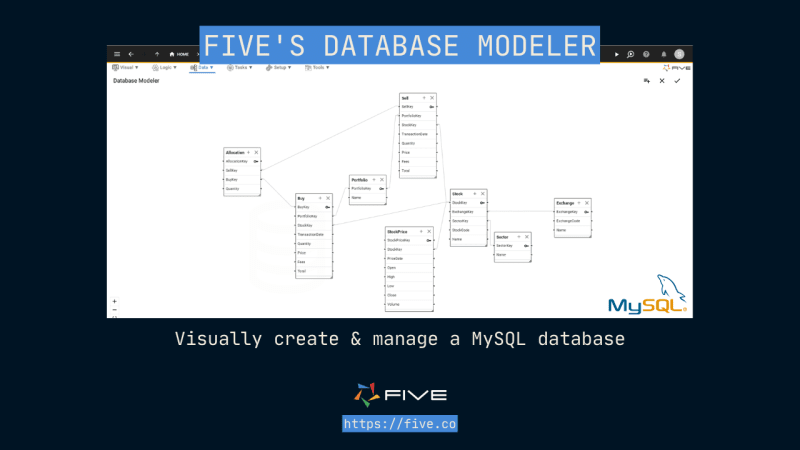
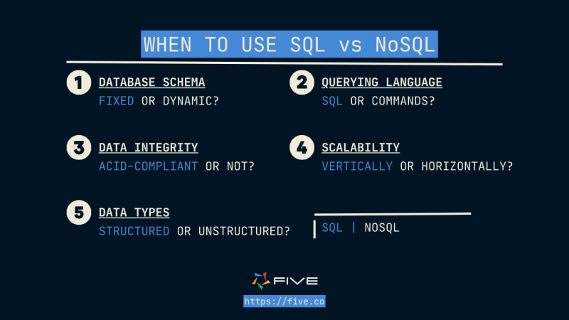
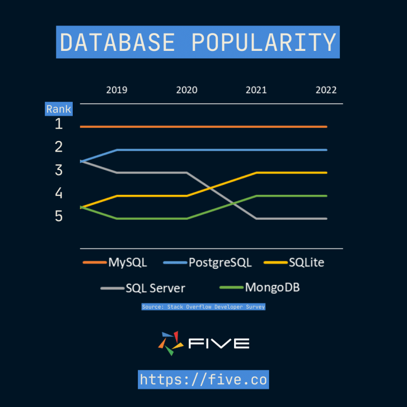

## Когда использовать SQL против NoSQL: Руководство эксперта по базам данных

Учитывая обилие вариантов баз данных, как решить, какой тип базы данных лучше всего подойдет для вашего приложения? Вы собираетесь использовать базу данных SQL (реляционную) или NoSQL (нереляционную)?

Как разработчики, выбор за нами. И успех проекта часто зависит от того, какой выбор вы сделали в самом начале.

Стоит понимать, что идеального выбора в области разработки программного обеспечения не существует. Напротив, все имеет компромиссы, и лучше всего принимать решения, основываясь на требованиях вашего проекта. Во что бы то ни стало не пытайтесь принимать идеальные решения. Вместо этого принимайте обоснованные решения.

Это руководство поможет вам принять взвешенное решение по следующим вопросам:

Что такое базы данных SQL и NoSQL? В чем разница между базами данных SQL и NoSQL? В чем плюсы и минусы баз данных SQL и NoSQL? Когда лучше всего использовать базы данных SQL и NoSQL?

## Что такое базы данных SQL?

Базы данных SQL - это реляционные базы данных, в которых данные хранятся в связанных таблицах со строками и столбцами.

Теоретическая основа реляционных баз данных была впервые придумана Эдгаром Ф. Коддом в 1969 году во время работы в IBM. После того как теоретическая основа была заложена, в 1970-х годах появились первые реляционные базы данных.

Базы данных SQL, история которых насчитывает более пятидесяти лет, существуют уже давно. Технология и понимание ее разработчиками очень развиты. Кроме того, существует активное сообщество разработчиков, которые постоянно работают над тем, чтобы сделать технологию лучше, доступнее и мощнее.

Базы данных SQL разрабатываются с упором на сокращение дублирования данных и обеспечение их целостности. Для этого данные организуются в таблицах, и между этими таблицами могут существовать связи. Отсюда и происходит термин ”реляционный”.

В каждой таблице будут строки и столбцы. Но прежде чем хранить данные, необходимо определить схему (структуру) базы данных. Именно поэтому базы данных SQL хорошо подходят для структурированных данных. Схема обычно включает в себя:

Таблицы: Вы определяете таблицы в своей базе данных, давая им имена.

Столбцы: В каждой таблице есть один или несколько столбцов. У каждого столбца есть имя, тип данных и ограничения или правила, которые применяются к данным.

Отношения: Вы определяете отношения между таблицами, например, отношения ”один к одному”, ”один ко многим" или "многие ко многим".

Ограничения: Определите правила или условия, которым должны удовлетворять данные в базе данных.

Представления: Виртуальные таблицы, обеспечивающие представление данных из одной или нескольких таблиц в индивидуальном виде.

Ключи: Первичные и внешние ключи - основные понятия реляционных баз данных. Они служат в качестве уникальных идентификаторов для каждой записи и обеспечивают целостность в таблице или между таблицами.

Схемы баз данных часто изображаются в виде диаграмм Entity-Relationship (ER), которые наглядно отображают таблицы и их взаимосвязи. Например, именно так в Five разработчики могут создавать и управлять базой данных MySQL.

Примерами популярных реляционных баз данных, работающих по методу SQL, являются:

MySQL, Microsoft SQL Server, PostgreSQL, or SQLite

## Что такое базы данных NoSQL?

NoSQL - это общий термин, означающий ”не SQL” или ”не только SQL”. Базы данных NoSQL - это базы данных, которые не следуют реляционной модели, впервые представленной в базах данных SQL. Вместо этого они предназначены для работы с различными типами данных, которые менее структурированы.

С распространением интернета мы начали испытывать так называемый феномен взрыва данных.

По данным IBM, каждый день создается более 2,5 квинтиллионов байт данных. И не все данные являются структурированными, которые аккуратно помещаются в реляционные базы данных. Вместо этого все большее распространение получают полуструктурированные или полиморфные данные, которые не подчиняются заранее определенной схеме. Традиционные базы данных SQL не очень хорошо подходили для работы с такими большими объемами и типами данных. Таким образом, нам потребовался другой способ работы с данными.

В конце 2000-х годов появились базы данных NoSQL, предназначенные для работы с большими объемами неструктурированных данных и высокой пользовательской нагрузкой. Появление таких баз данных было очень своевременным, поскольку с ростом объемов данных стоимость их хранения резко снизилась.

Базы данных NoSQL хорошо подходят для работы с полуструктурированными или неструктурированными данными. Неструктурированные данные - это информация, которая не организована в соответствии с заданной моделью данных или схемой. Вместо этого базы данных NoSQL могут работать с динамической схемой неструктурированных данных.

Базы данных NoSQL бывают разных типов, в зависимости от модели данных. Основными типами являются:

Базы данных документов: Хранят данные в документо-ориентированном виде, где каждый документ имеет уникальный идентификатор и содержит пары ключ-значение, а данные хранятся в полуструктурированном формате, например JSON или XML. Примерами баз данных NoSQL на основе документов являются MongoDB, Couchbase, Apache Cassandra и CouchDB.

Ключ-значение: Храните данные в виде пар ключ-значение, где каждое значение связано с уникальным ключом. Одним из таких примеров является Redis, который часто используется для кэширования, управления сессиями и обработки данных в режиме реального времени.

Ширококолоночные: Хранение данных в виде таблицы, где каждая строка может иметь различный набор столбцов. Примерами NoSQL-баз данных с широкими колонками являются Apache Cassandra, Apache HBase и ScyllaDB.

График: Хранение данных в виде узлов и ребер, где узлы представляют сущности, а ребра - отношения между этими сущностями. Neo4j - популярная NoSQL-база данных на основе графов, которая часто используется в социальных сетях, рекомендательных системах и для выявления мошенничества.

Среди упомянутых баз данных NoSQL наиболее популярной является MongoDB. Впервые она была выпущена в 2009 году. Для сравнения, MySQL, самая популярная в мире система управления реляционными базами данных с открытым исходным кодом, была впервые выпущена четырнадцатью годами ранее, в 1995 году.

## Когда использовать SQL против NoSQL? Пять важных критериев

Базы данных как SQL, так и NoSQL используются для хранения данных. Они также позволяют извлекать их, когда они нам нужны.

Но в глубине души между ними есть несколько ключевых различий. Так в чем же разница между SQL и NoSQL? Давайте попробуем разобраться, в каких ключевых областях эти базы данных различаются.

1. Схема

Базы данных SQL и NoSQL принципиально различаются по способу хранения данных.

Как мы видели ранее, базы данных SQL хранят данные в таблицах, которые следуют заранее определенной схеме. Это помогает оптимизировать хранение и обеспечить целостность данных, но также делает базы данных SQL более жесткими. Изменение схемы или типа данных может быть сложным и трудоемким процессом.

Базы данных NoSQL, с другой стороны, следуют динамической схеме, которая не требует предопределенной структуры данных. В результате базы данных NoSQL обладают большей гибкостью и легче адаптируются и изменяются.

Тем, кто думает, что это звучит как очевидная победа баз данных NoSQL, не стоит обманываться. Определение способа хранения данных в базе данных - одно из самых важных решений при разработке приложений. Базы данных SQL более жесткие, но это также означает, что вы должны тщательно продумать схему, прежде чем написать первую строчку кода. Это может привести к более чистому коду и меньшему объему работы в дальнейшем.

3. Язык запросов

В основе реляционных баз данных лежит язык структурированных запросов (SQL), который представляет собой стандартизированный язык программирования, используемый для запросов, манипулирования и изменения данных.

После того как вы определили схему базы данных, вы будете использовать SQL для вставки, запроса и манипулирования данными. Поскольку NoSQL-базы данных бывают разных типов, не существует стандартного языка, используемого для запросов. В MongoDB используется язык запросов MongoDB Query Language (MQL), а в Redis, напротив, обычно используются команды, основанные на наборе команд Redis.

4. Целостность данных

Базы данных SQL обеспечивают соблюдение правил целостности данных. Это помогает предотвратить хранение противоречивых данных.

Если вы определите уникальное ограничение для определенного столбца таблицы, база данных будет следить за тем, чтобы не было двух строк с одинаковыми значениями для этого столбца. За обеспечение соблюдения правил целостности данных приходится платить. Базе данных приходится выполнять дополнительную работу, чтобы обеспечить соблюдение этих правил. Эта проблема усиливается при больших объемах данных.

Базы данных NoSQL, с другой стороны, более подвижны по сравнению с базами данных SQL, когда речь идет о целостности данных. В них нет строгих правил целостности данных. Для таких баз данных приоритетны масштабируемость и производительность, а не целостность данных.

5. Масштабируемость

Что происходит, когда объем данных начинает исчисляться десятками терабайт? Вам необходимо масштабирование, чтобы адаптироваться к растущей нагрузке и требованиям. В противном случае ваша система будет работать плохо.

Базы данных SQL в основном масштабируются вертикально, что означает увеличение количества вычислительных ресурсов (процессор, оперативная память и хранилище) на одном сервере базы данных. Масштабировать базы данных SQL по горизонтали очень сложно. Но некоторые умные люди нашли способы горизонтального масштабирования баз данных SQL. Вот отличная статья в блоге Вамси Поннеканти, инженера-программиста из Quora, о том, как они горизонтально масштабировали свою базу данных MySQL.

Базы данных NoSQL в первую очередь предназначены для горизонтального масштабирования, то есть они используют несколько узлов в кластере для обработки возросших рабочих нагрузок. Это одно из преимуществ баз данных NoSQL.

6. Типы данных

Какой тип данных вы планируете хранить? Традиционные базы данных SQL лучше всего работают со структурированными данными, которые обычно встречаются в таких приложениях, как системы управления взаимоотношениями с клиентами (CRM), системы управления запасами или другие транзакционные системы. Данные структурированы и соответствуют определенной схеме.

Базы данных NoSQL лучше всего работают, когда вам требуется динамическая схема для неструктурированных данных. Медиа, текст, аудио, видео или изображения - все это примеры неструктурированных данных.

## Когда использовать SQL против NoSQL: Плюсы и минусы

Поскольку базы данных NoSQL появились недавно, может показаться, что они пришли на смену базам данных SQL. Но на самом деле это не так.

Базы данных SQL продолжают использоваться предприятиями, несмотря на то, что их возраст исчисляется десятилетиями. В данном случае старый - это не обязательно плохо, в отличие от стареющего. Тот факт, что технология существует уже несколько десятилетий, означает, что она стала гораздо более зрелой.

Например, в Five мы используем MySQL (реляционную базу данных) в качестве базовой базы данных для всех приложений, созданных с помощью нашей IDE с низким кодом. Когда вы начинаете разрабатывать новое приложение в Five, вы обычно начинаете с создания таблиц для базы данных MySQL. Мы выбрали MySQL, потому что это самая популярная база данных среди разработчиков, имеет большое сообщество поддержки, а также является дешевой, надежной и высокопроизводительной.

И SQL, и NoSQL базы данных имеют свои сильные и слабые стороны.

## Плюсы и минусы баз данных SQL и NoSQL

Очень важно понимать различия между базами данных SQL и NoSQL, чтобы выбрать правильную базу данных для своих нужд. Как мы видели ранее, эти базы данных предназначены для решения разных задач.

Базы данных SQL стараются обеспечить целостность данных, избегая их дублирования. Базы данных NoSQL, с другой стороны, предназначены для масштабирования в соответствии с большими потребностями.

В следующих подразделах мы рассмотрим ключевые критерии, необходимые для ответа на вопрос, когда использовать SQL против NoSQL.

## Когда использовать SQL против NoSQL: Пример для SQL

Вы должны выбрать базу данных SQL, если:

1. Вашему приложению требуются транзакции.

Транзакция - это неделимая единица работы, которая должна рассматриваться как единая, дискретная операция. Либо все изменения, сделанные транзакцией, должны быть применены, либо ни одно из них не должно быть применено.

Например, в банковских приложениях мы используем транзакцию базы данных для перевода денег. Технически говоря, перевод денег включает в себя более одной операции с базой данных. Деньги должны быть списаны с отправителя и зачислены на счет получателя. Но при использовании транзакций мы думаем о переводе денег так, как будто это всего лишь одна операция.

Базы данных SQL хорошо подходят для обработки транзакций, и они обладают особым свойством, называемым ACID:

Атомарность: Обеспечивает выполнение либо всех операций, либо ничего. Согласованность: Транзакция должна переводить базу данных из одного согласованного состояния в другое согласованное состояние. Изоляция: Две транзакции должны иметь возможность работать независимо и параллельно. Они не должны мешать друг другу. Долговечность: После завершения транзакции ее изменения должны сохраняться.

3. У вас сложные запросы

Базы данных SQL обладают возможностями, позволяющими выполнять сложные запросы, такие как объединение нескольких таблиц, агрегирование данных, фильтрация и сортировка. Вот что говорит Диксит Редди, инженер по обработке данных в компании Slalom, о способности баз данных SQL выполнять сложные запросы:

”Это неоценимо для приложений, которым необходимо проводить глубокий анализ данных или создавать сложные отчеты. Возможность использования сложных запросов делает базы данных SQL хорошо подходящими для бизнес-аналитики и аналитических приложений”.

4. Ваше приложение не будет расти в геометрической прогрессии

SQL действительно отлично подходит для хранения данных, если вы не работаете с чрезмерно большими объемами данных. SQL обеспечит целостность и непротиворечивость ваших данных. Только при больших нагрузках и требованиях он работает плохо.

Если вы не начинаете переходить к терабайтам, SQL должно быть более чем достаточно. На самом деле, большинство самых популярных приложений, которыми мы пользуемся, таких как Twitter, Facebook и Instagram, начинали свою работу с базы данных SQL. Но со временем эти приложения начали расти в геометрической прогрессии. В этот момент они начали искать другие варианты баз данных, которые могли бы обрабатывать действительно большие рабочие нагрузки.

Для большинства проектов по разработке приложений базы данных SQL более чем достаточно. Если вы не храните данные временных рядов или не ожидаете, что в вашем приложении будут храниться данные миллионов пользователей по всему миру, базы данных SQL обеспечат вашему приложению широкие возможности для развития.

## Когда использовать SQL против NoSQL: Пример для NoSQL

Вы должны выбрать базу данных NoSQL, если:

1. Вам нужна гибкость

Если вы ищете гибкость, не придерживаясь фиксированной структуры, то вам следует использовать базу данных NoSQL. Это означает, что вы можете добавлять новые поля или изменять структуру данных без необходимости модифицировать схему или переносить данные. Такие базы данных могут быть полезны для приложений с быстро меняющимися требованиями к данным.

3. У вас очень большой набор данных

Как мы видели ранее, базы данных NoSQL легко масштабируются в горизонтальной плоскости за счет распределения данных по нескольким узлам кластера. Это позволяет базам данных NoSQL обрабатывать очень большие массивы данных и выполнять операции чтения и записи с высокой скоростью, что делает их подходящими для приложений больших данных, аналитики в реальном времени и веб-приложений с высоким трафиком.

4. Вам нужна очень высокая доступность

Несмотря на то что базы данных SQL и NoSQL могут быть настроены на высокую доступность, базы данных NoSQL обычно считаются лучшим выбором для приложений, требующих высокой доступности. Базы данных NoSQL часто оснащены такими функциями, как автоматическое восстановление после сбоев, репликация данных и шардинг, которые помогают обеспечить постоянную доступность данных даже в случае отказа узла или отключения сети.

5. Вы можете смириться с тем, что некоторые данные будут утеряны или будут храниться не в соответствии с требованиями ACID.

Не все данные столь критичны, как остатки на банковских счетах или другие коммерческие операции. Некоторые данные, такие как ”лайки”, ”апвоты" или отзывы, можно хранить в базах данных NoSQL с риском потери данных.

## Заключение:

В этой статье мы попытались ответить на вопрос, когда использовать SQL против NoSQL. Мы представили эти два типа баз данных и проанализировали плюсы и минусы SQL и NoSQL.

Подведем итоги: Базы данных SQL лучше всего работают со структурированными данными, которые необходимо хранить эффективно и в соответствии с требованиями ACID. Базы данных NoSQL служат для других целей. Они созданы для масштабирования и работы с неструктурированными данными. Для большинства случаев использования базы данных SQL будут работать просто отлично, и с них почти всегда стоит начинать. Никого еще не уволили за выбор MySQL.

Но если вы хорошо понимаете различия между SQL и NoSQL, то сможете выбрать правильную базу данных для своих нужд. Стоит отметить, что в реальном мире все не так черно-бело, как показано в этой статье. Базы данных SQL теперь поддерживают хранение данных в формате JSON. С другой стороны, базы данных NoSQL, такие как MongoDB, теперь поддерживают многодокументные транзакции ACID.
