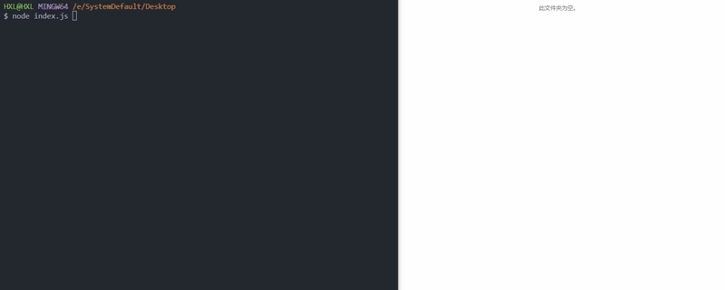

x-crawl - это гибкая многофункциональная библиотека краулера для Node.js. Гибкость использования и множество функций помогут вам быстро, безопасно и стабильно просматривать страницы, интерфейсы и файлы.

Если вам также нравится x-crawl, вы можете дать репозиторию x-crawl звезду, чтобы поддержать его, спасибо за вашу поддержку!

GitHub：https://github.com/coder-hxl/x-crawl

## Характеристики

🔥 Асинхронный Синхронный - просто измените свойство mode, чтобы переключить асинхронный или синхронный режим ползания.

⚙️Multiple - Поддерживает поиск динамических страниц, статических страниц, данных интерфейса, файлов и операций опроса.

Страница управления ⚒️ - переполнение динамических страниц поддерживает автоматические операции, ввод с клавиатуры, операции по событиям и т.д.

🖋️ Гибкий стиль написания - один и тот же API для краулинга может быть адаптирован к нескольким конфигурациям, и каждый метод конфигурации очень уникален.

⏱️ Interval Crawling - Без интервала, с фиксированным интервалом и случайным интервалом для создания или предотвращения высокой одновременности ползания.

🔄 Failed Retry (Повторная попытка не удалась) - избегайте неудач в ползании из-за кратковременных проблем и настраивайте количество повторных попыток.

➡️ Proxy Rotation - автоматическая ротация прокси-серверов с повторными попытками отказа, пользовательским временем ошибки и кодами состояния HTTP.

👀 Отпечатки пальцев устройства - нулевая или пользовательская конфигурация позволяет избежать отпечатков пальцев для идентификации и отслеживания нас из разных мест.

🚀 Очередь приоритетов - в соответствии с приоритетом одной цели для краулинга, она может быть пройдена раньше других целей.

🧾 Журнал ползания - Ведет журнал ползания и использует цветные строчные напоминания в терминале.

🦾 TypeScript - собственные типы, реализация полных типов через дженерики.

## Пример

Возьмем, к примеру, автоматическое приобретение нескольких фотографий впечатлений и домов по всему миру каждый день:

```ts
// Import module ES/CJS
import xCrawl from 'x-crawl';

// Create a crawler instance
const myXCrawl = xCrawl({
	maxRetry: 3,
	intervalTime: { max: 2000, min: 1000 },
});

// Set the crawling task
/* Call the startPolling API to start the polling function, and the callback function will be called every other day */
myXCrawl.startPolling({ d: 1 }, async (count, stopPolling) => {
	// Call the crawlPage API to crawl the page
	const pageResults = await myXCrawl.crawlPage({
		targets: ['https://www.airbnb.cn/s/*/experiences', 'https://www.airbnb.cn/s/plus_homes'],
		viewport: { width: 1920, height: 1080 },
	});

	// Obtain the image URL by traversing the crawled page results
	const imgUrls = [];
	for (const item of pageResults) {
		const { id } = item;
		const { page } = item.data;
		const elSelector = id === 1 ? '.i9cqrtb' : '.c4mnd7m';

		// wait for the page element to appear
		await page.waitForSelector(elSelector);

		// Get the URL of the page image
		const urls = await page.$eval(`${elSelector} picture img`, (imgEls) =>
			imgEls.map((item) => item.src),
		);
		imgUrls.push(...urls.slice(0, 6));

		// close the page
		page.close();
	}

	// Call crawlFile API to crawl pictures
	await myXCrawl.crawlFile({
		targets: imgUrls,
		storeDirs: './upload',
	});
});
```

## результат работы:



Примечание: Пожалуйста, не ползайте наугад, перед ползанием проверьте протокол robots.txt. Название класса сайта может измениться, это просто демонстрация того, как использовать x-crawl.

## Подробнее

Более подробную документацию можно найти на сайте: https://github.com/coder-hxl/x-crawl.
