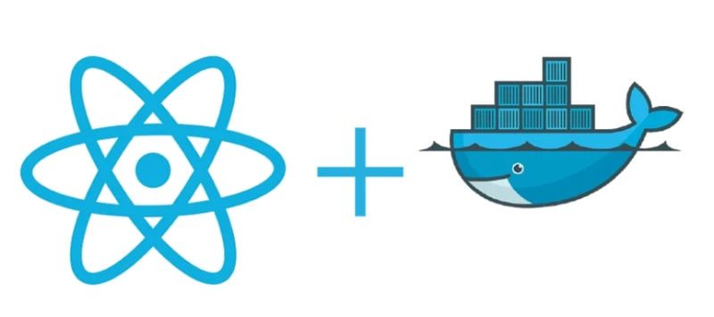
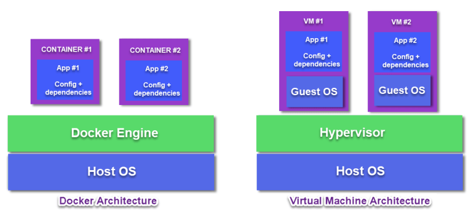
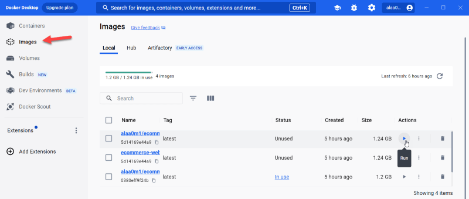
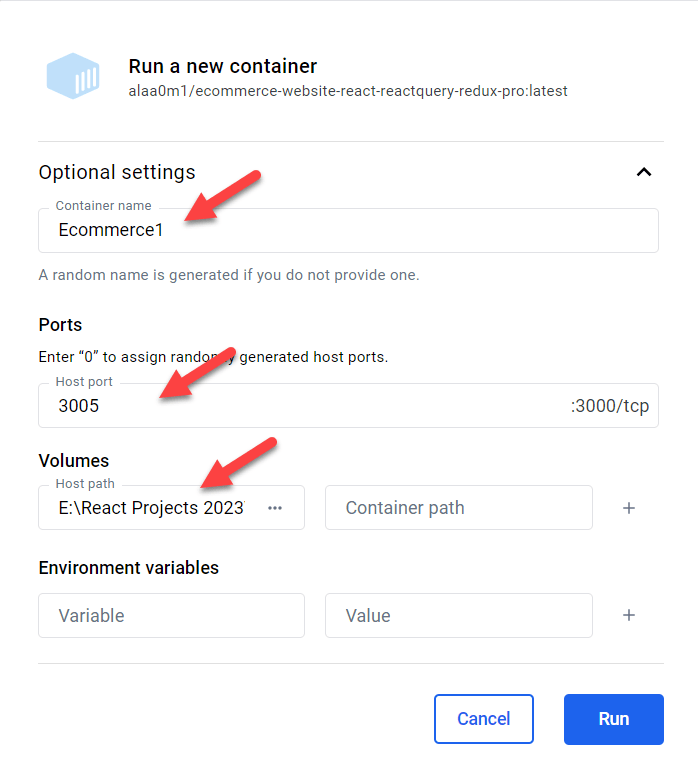
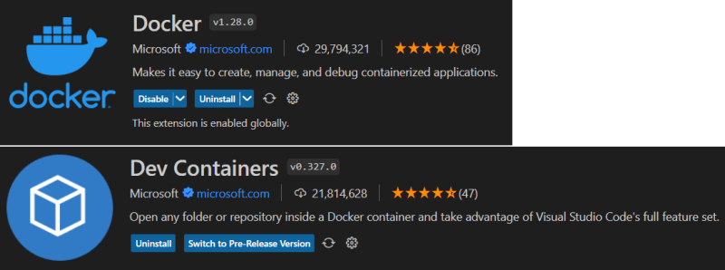
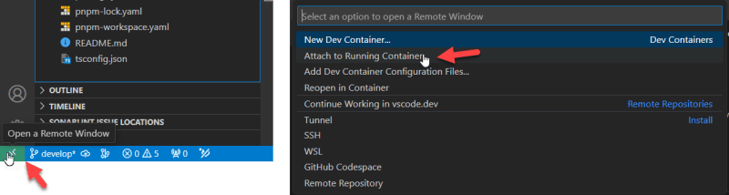
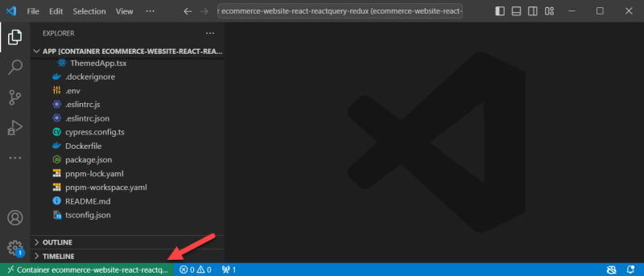

## Почему стоит использовать Docker?



Docker - это открытая платформа, обеспечивающая переносимость, согласованность и масштабируемость для разработки, доставки и запуска приложений в различных средах. Docker позволяет отделить приложения от инфраструктуры, чтобы быстро создавать программное обеспечение.

Контейнер Docker, в отличие от виртуальной машины, не требует отдельной операционной системы. Это дает контейнеру Docker такие преимущества, как малый вес, меньшая занимаемая площадь, большая портативность, высокая безопасность и малое время загрузки.



## Когда использовать Docker?

1- Если ваш бизнес растет и новые разработчики могут присоединяться к вашей команде каждые несколько месяцев. Поэтому вместо того, чтобы тратить драгоценное время на настройку локальной среды разработки. Например, базы данных или сторонних библиотек, что может занять от нескольких часов до нескольких дней. Это зависит от сложности проекта. Docker помогает автоматизировать эту настройку, чтобы новые разработчики могли сразу приступить к работе.

2- Если одно и то же программное обеспечение должно работать в разных средах: например, разработчик работает на двух ПК, на ПК разработчиков и на производственных серверах, на ПК разработчиков и на ПК тестировщиков. С помощью Docker вы можете запускать приложение в отдельных контейнерах, чтобы ваше приложение работало в каждой среде согласованно и предсказуемо.

3- Если вам нужно протестировать новые технологии для вашей программы, например, новую базу данных, другой язык программирования или новые инструменты. В этом случае можно использовать Docker Hub для извлечения необходимого пакета, инструмента или базы данных для тестирования приложения в изолированный контейнер.

4- Если ваше программное обеспечение требует запуска нескольких приложений на сервере? С помощью Docker вы можете хранить компоненты каждого приложения в отдельных контейнерах, даже если они используют одни и те же ресурсы.

## Когда не стоит использовать Docker?

1- Работа над настольным приложением. Потому что Docker более полезен для веб-приложений, работающих на сервере. Кроме того, богатый графический интерфейс также требует дополнительных решений для работы с Docker.

2- Работа над небольшим приложением, не требующим дополнительных инструментов или сервисов.

3- Если ваша команда разработчиков состоит из одного разработчика. В этом случае преимуществ от использования Docker будет меньше, и вы сможете начать использовать Docker, когда ваше программное обеспечение начнет расти.

4- Если большинство разработчиков вашей команды используют MacBook, потому что Docker испытывает множество проблем с производительностью при работе на операционной системе Mac.

## Запустите приложение React на контейнере Docker, чтобы протестировать новую среду:

1- Установите Docker на свой компьютер с официального сайта
https://docs.docker.com/desktop/install/windows-install/

2- Добавьте в каталог проекта файл Dockerfile, который будет использоваться для создания образа Docker (докеризации приложения React).

```yaml
# Stage 1
# Use the desired Node.js runtime as the base image
FROM node:18-alpine AS build
ENV PNPM_HOME="/pnpm"
ENV PATH="$PNPM_HOME:$PATH"
RUN corepack enable

# Set the working directory in the container
WORKDIR /app

# Copy package.json and pnpm-lock.yaml to the working directory
COPY package.json ./
COPY pnpm-lock.yaml ./

# Install project dependencies
RUN pnpm install

# Copy the entire React app code to the container
COPY . .

# Stage 2
# Expose the port of your application to bind with the host port
EXPOSE 3000

# run your app
CMD ["pnpm", "run", "start"]
```

3- Добавьте файл .dockerignore:

`/node_modules /.history /build npm-debug.log .git .gitignore`

4. Создайте образ Docker на основе Dockerfile

docker image build -t

Опция -t задает имя и тег (по умолчанию latest) для образа. представляет собой путь, по которому вы хотите запустить команду (. (точка в конце) представляет собой текущий каталог)

После сборки образа вы можете просмотреть результат в программе Docker Desktop, как показано ниже:



5. Запустите Docker Container на основе сгенерированного образа. Для этого нажмите кнопку run или выполните следующую команду

`docker run --name -p 3005:3000 -d -v ${pwd}`

Например: docker run --name ecommerce-website-react-reactquery-redux -p 3005:3000 -d -v ${pwd} ecommerce-website-react-react-reactquery-redux

Перейдите по адресу http://localhost:3005/ в браузере, чтобы просмотреть приложение.

Другой способ запустить контейнер на основе образа Docker - нажать кнопку run рядом с именем образа в программе Docker desktop:



6. Установите следующие расширения в VS Code

- https://marketplace.visualstudio.com/items?itemName=ms-vscode-remote.remote-containers
- https://marketplace.visualstudio.com/search?term=docker&target=VSCode



7- В левом нижнем углу VS Code вы найдете кнопку ”Открыть удаленный вид”. После нажатия этой кнопки нажмите на "Присоединить запущенный контейнер".



После выбора нужного контейнера появится новое окно VS Code, в котором вы можете внести все необходимые изменения, и они отразятся в браузере.



```

```
